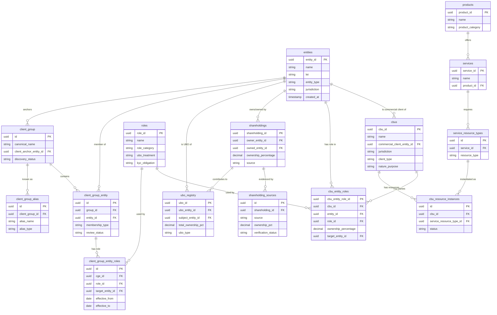

# OB-POC Master Schema: Entity Relationship Reference

> **Generated:** 2026-01-26  
> **Source:** migrations/master-schema.sql  
> **Purpose:** Schema documentation for development and peer review

---

## Schema Statistics

| Metric | Count |
|--------|-------|
| **Total Tables** | 326 |
| **Total Foreign Key Relationships** | 473 |
| **Schemas** | 12 |

### Tables by Schema

| Schema | Table Count | Purpose |
|--------|-------------|---------|
| `ob-poc` | 205 | Core onboarding platform |
| `kyc` | 38 | KYC case management |
| `custody` | 34 | Custody operations |
| `teams` | 12 | Team/access management |
| `agent` | 10 | Agent learning/AI |
| `public` | 10 | Shared utilities |
| `client_portal` | 6 | Client-facing portal |
| `ob_ref` | 5 | Reference data |
| `feedback` | 3 | User feedback |
| `events` | 1 | Event sourcing |
| `sessions` | 1 | Session management |
| `ob_kyc` | 1 | KYC bridge |

---

## Core Entity Tables (Most Referenced)

These are the central entities that other tables depend on:

| Table | Incoming FKs | Role |
|-------|--------------|------|
| `ob-poc.entities` | 113 | **Central entity store** (companies, persons, funds) |
| `ob-poc.cbus` | 66 | **Client Business Units** (onboarding containers) |
| `kyc.cases` | 19 | KYC case management |
| `custody.instrument_classes` | 15 | Financial instrument classification |
| `custody.markets` | 14 | Market/exchange reference |
| `kyc.entity_workstreams` | 12 | KYC workflow tracking |
| `ob-poc.document_catalog` | 12 | Document storage |
| `ob-poc.cbu_resource_instances` | 11 | CBU resource provisioning |
| `ob-poc.attribute_registry` | 11 | Entity attribute definitions |
| `kyc.share_classes` | 10 | Fund share class registry |
| `ob-poc.products` | 8 | Product catalog |
| `ob-poc.services` | 8 | Service catalog |
| `ob-poc.roles` | 6 | **Role taxonomy** |
| `ob-poc.client_group` | 5 | **Client group scoping** |

---

## Entity Relationship Diagram (Core)

---

## Domain Deep Dives

### 1. Entity Domain (25 tables)

The `entities` table is the central store for all legal entities, natural persons, and funds.

**Key Tables:**
- `entities` - Core entity record
- `entity_types` - Type classification
- `entity_validation_rules` - Validation per type/jurisdiction
- `entity_identifiers` - External IDs (LEI, tax ID, etc.)
- `entity_addresses` - Address history
- `entity_relationships` - Formal ownership/control edges

### 2. CBU Domain (23 tables)

Client Business Units are the primary onboarding containers.

**Key Tables:**
- `cbus` - Core CBU record
- `cbu_entity_roles` - Party assignments (who plays what role)
- `cbu_resource_instances` - Service resources provisioned
- `cbu_trading_profiles` - Trading configurations
- `cbu_evidence` - Supporting documentation
- `cbu_matrix_product_overlay` - Product customizations

### 3. Client Group Domain (8 tables)

Client groups provide scoped working sets for entity discovery.

**Key Tables:**
- `client_group` - Group definition
- `client_group_alias` - Name variations for resolution
- `client_group_entity` - Membership junction
- `client_group_entity_roles` - Role assignments within group
- `client_group_anchor` - Anchor entity relationships

### 4. Role Domain (5 tables)

Unified role taxonomy used across CBU and client group.

**Key Tables:**
- `roles` - Master role definitions
- `cbu_entity_roles` - CBU party assignments
- `client_group_entity_roles` - Group role assignments

### 5. Ownership/UBO Domain (7 tables)

Shareholding and UBO tracking.

**Key Tables:**
- `shareholdings` - Ownership edges
- `shareholding_sources` - Multi-source evidence
- `ubo_registry` - Calculated UBO records
- `ubo_chains` - Ownership chain paths

### 6. Product/Service Domain (9 tables)

Product and service catalog.

**Key Tables:**
- `products` - Product definitions
- `services` - Services offered per product
- `service_resource_types` - Resource requirements
- `product_services` - Product-service junction

---

## Key Relationships Summary

| From | To | Relationship | Cardinality |
|------|-----|--------------|-------------|
| `cbus` | `entities` | commercial_client_entity_id | N:1 |
| `cbu_entity_roles` | `cbus` | cbu_id | N:1 |
| `cbu_entity_roles` | `entities` | entity_id | N:1 |
| `cbu_entity_roles` | `roles` | role_id | N:1 |
| `client_group_entity` | `client_group` | group_id | N:1 |
| `client_group_entity` | `entities` | entity_id | N:1 |
| `client_group_entity_roles` | `client_group_entity` | cge_id | N:1 |
| `client_group_entity_roles` | `roles` | role_id | N:1 |
| `shareholdings` | `entities` | owner_entity_id | N:1 |
| `shareholdings` | `entities` | owned_entity_id | N:1 |
| `ubo_registry` | `entities` | ubo_entity_id | N:1 |
| `ubo_registry` | `entities` | subject_entity_id | N:1 |

---

## Schema Evolution Notes

### Recent Migrations (050+)

| Migration | Purpose |
|-----------|---------|
| 052 | `client_group_entity` context columns |
| 053 | Client group entity seed data |
| 054 | Staged runbook REPL |
| 055 | Client group research buffer (in progress) |

### Planned Additions (055)

- `client_group_entity_roles` - Junction to `roles` table
- `client_group_relationship` - Provisional ownership edges
- `client_group_relationship_sources` - Multi-source lineage

---

## Usage Notes

### Intent Pipeline Resolution

The agent resolver uses:
1. `client_group_alias` for scope-setting
2. `client_group_entity` for scoped entity search
3. `client_group_entity_roles` for role-filtered search
4. `roles` for role taxonomy

### CBU vs Client Group

| Aspect | CBU | Client Group |
|--------|-----|--------------|
| Purpose | Formal onboarding container | Discovery working set |
| Parties | `cbu_entity_roles` | `client_group_entity_roles` |
| Role table | `roles` (shared) | `roles` (shared) |
| Ownership | Via `shareholdings` | Via `client_group_relationship` |

