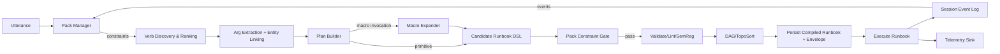
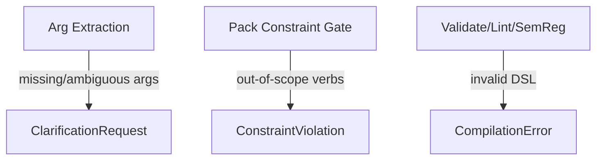

# Packs vs Macros vs DSL Runbook — Single‑Source‑of‑Truth Execution Architecture (v0.5)

**Status:** Architecture specification (normative)  
**Audience:** OB‑POC Semantic OS / Agent REPL runtime owners  
**Date:** 2026‑02‑15  
**Companion:** `PACKS_MACROS_RUNBOOK_TODO.md` — implementation plan for Claude Code (cross‑references sections of this document)  
**Revision:** v0.5 — promotes to specification status. Adds: stable section anchors for TODO cross‑referencing; runbook status definitions (§11.4.1); mid‑execution pack completion rule (§6.3); pipeline rejection path (§5.3). Extracts implementation TODOs into companion document.

---

## §1. Vision

Make the **compiled DSL runbook** the *sole executable truth* of an agent session.

> **Primary invariant (INV‑1):** If an operation is not present in the session's **compiled DSL runbook**, it does not exist.

**Corollary (INV‑1a):** The runbook is an immutable artefact once execution begins. Execution outcomes are captured as **session events** (success/failure/parked), not by mutating the runbook.

**Hard enforcement:** This invariant is made enforceable by the **runbook‑only execution gate** defined in §11.1.

---

## §2. Scope

This paper covers responsibilities and boundaries across:

- Utterance ingestion (agent chat / MCP)
- Pack semantics (conversation framing + narrowing constraints)
- Semantic intent (verb discovery, entity linking, argument extraction)
- Macro expansion (deterministic preprocessor → generates DSL)
- Runbook compilation (validate/lint/semreg/DAG)
- Execution + feedback into session event log

Out of scope:
- UI rendering (except what the UI needs from the pipeline contract)
- Full durable workflow orchestration (except that durable actions must be representable as runbook steps)

---

## §3. Problem Statement

### §3.1 Conflated semantics: Pack vs Macro

Two overlapping concepts that must remain distinct:

- **Pack** = *dialogue policy + scoping*  
  A template/operational frame that constrains verbs/entity kinds and drives clarification loops.

- **Macro** = *deterministic preprocessor / codegen*  
  A bulk composite operation that expands into atomic DSL (linear or DAG‑ordered).

**Key test:** is it a **constraint on what could happen** (pack) or a **specification of what will happen** (macro/runbook)? If unclear, you've conflated them.

### §3.2 Macro expansion must be reintroduced as a compiler step

The REPL cleanup correctly removed legacy parallel pipelines. Macro support is a deliberate next step:

- macros must be handled as **compiler semantics** (expand → validate → compile → execute),
- not as a special runtime outcome or ad‑hoc branch.

### §3.3 Harness drift ("deadly embrace")

Tests/harnesses that invoke internal types create false liveness signals for dead code. The architecture demands **contract‑first harnesses** (§12).

**Root cause:** dependency inversion — tests depend on implementation internals rather than the contracted interface. Tests must consume the public pipeline surface exclusively.

---

## §4. Required Capabilities

### §4.1 Packs (control plane: constrain + clarify)

A pack must be able to:
- establish mode/domain,
- constrain **entity kinds** and **allowed verbs**,
- emit prompts and clarification guidance,
- maintain progress markers as session‑owned state, but never execute.

**Pack output is constraints + prompts, never DSL.**

### §4.2 Macros (compiler sugar: deterministic expansion → DSL)

A macro must:
- accept typed parameters,
- expand deterministically into atomic DSL steps,
- emit expansion audit metadata (digest + resolved values),
- disappear from execution reality (expanded DSL is the artefact).

**Macro output is always runnable DSL.**

### §4.3 Runbook artefacts

All intent paths must converge to one runbook representation that can be:
- validated and linted,
- semantically governed (SemReg),
- ordered (DAG/toposort),
- executed and replayed via an explicit envelope (§9).

---

## §5. Architecture Overview

### §5.1 Control plane vs execution plane

- **Control plane (non‑deterministic):** packs, clarification, narrowing, guidance.  
- **Execution plane (deterministic):** runbook compilation + execution.

Only the execution plane runs. Packs may influence what is compiled, but cannot emit executable steps.

### §5.2 Pipeline (happy path)



### §5.3 Pipeline (rejection paths)

Not all utterances produce executable runbooks. The pipeline has three exit points before execution:



- **ClarificationRequest** — the system needs user input to proceed. Returned by Arg Extraction or Verb Discovery when intent is ambiguous. See §11.3.
- **ConstraintViolation** — the system understood intent and produced a plan, but the PackConstraintGate rejected expanded verbs as out‑of‑scope. See §11.3.
- **CompilationError** — the candidate DSL is structurally invalid or fails SemReg governance. This is a system error, not a user‑facing dialogue turn (though the orchestrator may translate it to a user message).

---

## §6. Pack Semantics

### §6.1 Lifecycle

Packs have explicit states:

- **Dormant** — registered, not influencing the session. No constraints emitted.
- **Active** — constraints applied to verb discovery and argument extraction. Progress markers advance as gates are met.
- **Suspended** — temporarily inactive (e.g., a higher‑priority pack took over, or user/agent explicitly paused). State preserved for reactivation.
- **Completed** — all pack gates satisfied. Constraints removed. Completion event emitted to session event log.

### §6.2 Ownership and mutation

Pack state is **owned by the session** and mutated only by the **Pack Manager** as a projection over session events:
- discovery/arg extraction read pack constraints, never mutate pack state,
- Pack Manager watches events (step executed, entity created, doc received) and advances gates.

### §6.3 Composition, completion widening, and mid‑execution rule

Multiple active packs compose by **intersection of constraints**:
- effective allowed verbs = ∩ of each pack's allowed verb set,
- effective entity kinds = ∩ likewise.

If intersection is empty, surface a conflict via `ConstraintViolation` (not a silent failure).

**On completion:** when a pack transitions to **Completed**, its constraints are **removed immediately** for subsequent runbook compilations, widening the effective constraint set accordingly.

**Mid‑execution rule:** if a pack completes during a runbook's execution (because execution events satisfy the pack's remaining gates), the widening applies to the **next** compilation only, not to the currently executing runbook. This follows from INV‑1a (runbook immutability) — the executing runbook was compiled under the prior constraint set and remains valid as compiled.

---

## §7. Plan Builder Decomposition

Separate responsibilities so errors are explainable and constraints are enforceable:

### §7.1 VerbClassifier
Determine whether the resolved selection is:
- primitive runtime verb,
- macro invocation,
- unknown / out‑of‑scope.

### §7.2 PlanAssembler
Build an ordered step list with dependencies (including implied multi‑step plans from a single utterance).

### §7.3 PackConstraintGate
Validate candidate steps against active pack constraints **after macro expansion** (see §8.2).

Returns:
- `Pass` — plan accepted; proceeds to Validate/Lint/SemReg.
- `Reject { explanation, expanded_verbs, active_constraints, remediation_options }` — plan rejected; orchestrator returns `ConstraintViolation` (§11.3).

---

## §8. Macro Semantics

### §8.1 Macros are compiler semantics (not runtime semantics)

Macros are expanded **before** the runbook is accepted for execution:
- NL intent can select a macro, which is expanded into candidate DSL.
- DSL authoring may include macro invocations; the compiler runs an `ExpandMacros` pass.

In all cases, the **expanded DSL is the artefact**.

### §8.2 Constraint boundary decision (normative)

**Pack constraints are enforced after macro expansion, before runbook acceptance.**

Rationale:
- pre‑expansion filtering couples packs to macro internals,
- post‑expansion validates the actual executable plan (consistent with INV‑1).

A macro can be discoverable and selected, but its expansion can be rejected as out‑of‑scope, with a clear explanation to the agent.

### §8.3 Macro registry (single source of truth)

One canonical macro registry. Prefer the existing `dsl_v2::macros::MacroRegistry` (already paired with expander, schema enforcement, and MCP integration).

Deprecate or thin‑wrap `crate::macros::OperatorMacroRegistry` around the canonical registry.

---

## §9. Replay Envelope (Determinism Boundary)

Deterministic replay requires a defined boundary: what must be held constant.

### §9.1 Envelope contents

Persist with each compiled runbook:

- **Expanded runbook DSL** (post macro expansion) — the primary replay artefact
- **Session snapshot cursor** (or event log cursor) at compilation time
- **Entity resolution bindings** used during compilation
- **External lookup results** used during compilation (pinned, not re‑fetched)
- **Macro expansion audit** (params + resolved autofill values + digest)

### §9.2 Practical consequence

Autofill and context‑dependent values are resolved at expansion time and baked into expanded DSL. Replay does not re‑expand; it replays the compiled artefact with its envelope.

**Invariant (INV‑2):** replaying a compiled runbook with its stored envelope produces identical execution outcomes.

---

## §10. Concurrency and Entity UUID Locking

Bulk execution (multi‑step runbooks, macro‑expanded sequences, DAG batches) must be safe under concurrency.  
This architecture assumes a **runtime entity‑scoped lock** keyed by canonical entity UUID (UUIDv7 in Postgres), enforced by the execution gate.

### §10.1 Locking rules (normative)

- Any runbook step that **mutates state** must acquire an **entity UUID lock** for each subject entity it writes to.
- `execute_runbook(...)` is the **only** place locks may be acquired/released (per §11.1). No helper API, harness, or "fast path" may execute mutations outside this gate.
- Multi‑entity deadlocks must be avoided with a deterministic strategy.

### §10.2 Chosen strategy: pre‑lock set (normative default)

- Before execution, compute the entity **write‑set** for the execution range and acquire all locks upfront.
- Execute the step range under the held lock set.
- Release on completion/park/failure per policy.

**Rationale:** pre‑lock set is simpler, fits naturally with DAG/toposort (the full step set is known at compilation), and avoids partial lock‑acquisition edge cases.

**Optimisation path (non‑default): ordered incremental locking** may be introduced later if proven necessary, but must:
- acquire locks in a stable canonical order (e.g., UUID byte order),
- define a clear policy for partial progress and retry,
- include tests proving absence of deadlocks and write anomalies.

### §10.3 Interaction with packs and macros

- **Packs** do not lock. They may influence entity "focus" but cannot change lock semantics.
- **Macros** must expand to DSL with explicit subject bindings so lock write‑sets are computable. Macro expansion audit records the resolved subject bindings.

---

## §11. Public Contract (Single Pipeline Surface)

### §11.1 Runbook‑only execution gate (canonical statement)

> **INV‑3 (execution gate):** Execution accepts **only** a `CompiledRunbookId` (or `{session_id, runbook_version}`) and an optional cursor/step range. The runtime must reject:
> - executing a verb directly,
> - executing a macro directly,
> - executing an in‑memory DSL string not persisted as a compiled runbook.

This is the canonical definition. All other sections reference it; none restate it.

### §11.2 Orchestrator surfaces

**Compile surface:**

```
process_utterance(session_id, utterance) -> OrchestratorResponse
```

**Execution surface:**

```
execute_runbook(session_id, compiled_runbook_id, cursor?) -> ExecutionResult
```

### §11.3 OrchestratorResponse variants (normative)

The response must distinguish "needs more info" from "understood but disallowed" from "ready":

- **`ClarificationRequest { question, missing_fields, context }`**
  System needs user input to disambiguate. Pipeline exited at Arg Extraction or Verb Discovery.

- **`ConstraintViolation { explanation, expanded_plan?, active_constraints, remediation_options }`**
  System understood and planned successfully, but PackConstraintGate (§7.3) rejected the candidate plan as out‑of‑scope.
  Remediation options may include: widen scope, suspend/deactivate pack, choose alternative verb set.

- **`CompiledRunbook { compiled_runbook_id, runbook_version, envelope_refs, preview }`**
  Ready to execute via §11.1 gate.

### §11.4 Runbook versioning semantics (normative)

Runbook identity must be unambiguous for the execution gate:

- Each session maintains a **monotonic `runbook_version` counter** (u64, starts at 1).
- Each successful compilation yields a new compiled runbook version:
  - `{session_id, runbook_version}` uniquely identifies the artefact, mapped to a `CompiledRunbookId`.
- A session may hold multiple compiled runbooks in history, but:
  - only one runbook version may be **Executing** at a time per session.
- The execution engine must persist status transitions as session events.

#### §11.4.1 Runbook statuses (normative)

| Status | Definition |
|---|---|
| **Compiled** | Successfully compiled and persisted. Ready for execution. Initial status on creation. |
| **Executing** | Currently being executed. At most one per session. |
| **Parked** | Execution deliberately paused — either by the execution engine (step awaiting external callback, resource unavailable) or by the agent/user (explicit pause command). State is preserved; execution can resume from the parked cursor. |
| **Completed** | All steps executed successfully. Terminal. |
| **Failed** | Execution encountered an unrecoverable error. Terminal. Failure details recorded as session events. |

Note: there is no `Draft` status. Compilation either succeeds (producing `Compiled`) or fails (producing `CompilationError` in the `OrchestratorResponse`). A half‑formed runbook is never persisted.

---

## §12. Explicit Trade‑offs

- **Post‑expansion constraint validation** means users can discover/select macros whose expansion is later rejected as out‑of‑scope. We accept this because the alternative (pre‑expansion filtering) couples packs to macro internals and makes macros harder to evolve independently.

- **Pre‑lock set** reduces concurrency and may lock more entities than strictly necessary. We accept this for correctness and simplicity; ordered incremental locking is an explicit future optimisation with proof‑of‑need gate.

- **Runbook immutability** requires good event modelling (park/resume/progress via session events). We accept this because mutating runbooks erodes auditability and replay.

---

## §13. Definition of Done

- Packs and macros have separate, rigorous semantics:
  - packs constrain and guide (control plane),
  - macros compile to DSL (execution plane).
- The only executable truth is the **compiled runbook DSL** (immutable, INV‑1/INV‑1a).
- Execution APIs accept **only** a runbook handle per INV‑3 (§11.1).
- Entity‑scoped UUID locking is enforced inside `execute_runbook(...)` using **pre‑lock set** by default (§10.2).
- Pack constraints are enforced post‑expansion, pre‑acceptance; out‑of‑scope plans return `ConstraintViolation` (§8.2, §7.3).
- Replay envelope is defined and persisted per INV‑2 (§9).
- Runbook versioning is monotonic and unambiguous within a session (§11.4).
- One public pipeline contract exists; tests target it exclusively (§11.1, §11.2).

---

## Appendix A — Invariant Index

| ID | Statement | Defined in |
|---|---|---|
| INV‑1 | If an operation is not in the compiled runbook, it does not exist | §1 |
| INV‑1a | Compiled runbook is immutable once execution begins | §1 |
| INV‑2 | Replay with stored envelope produces identical outcomes | §9.2 |
| INV‑3 | Execution accepts only `CompiledRunbookId` + optional cursor | §11.1 |

---

## Appendix B — Revision History

| Version | Date | Notes |
|---|---|---|
| v0.1 | 2026‑02‑15 | Initial draft: pack/macro separation; runbook as truth; TODOs |
| v0.2 | 2026‑02‑15 | Pack lifecycle/ownership; Plan Builder decomposition; constraint boundary; replay envelope |
| v0.3 | 2026‑02‑15 | Control/execution plane framing; explicit contract surface; macro as compiler semantics |
| v0.3.2 | 2026‑02‑15 | Runbook-only execution gate; entity UUID locking dependency |
| v0.4 | 2026‑02‑15 | Locking promoted; pre-lock default; `ConstraintViolation` variant; versioning; trade-offs |
| v0.5 | 2026‑02‑15 | Specification status. Stable §anchors for TODO xref. Runbook status definitions (§11.4.1). Mid-execution completion rule (§6.3). Rejection paths (§5.3). Invariant index. No `Draft` status. Extracted implementation TODOs to companion `PACKS_MACROS_RUNBOOK_TODO.md`. |
