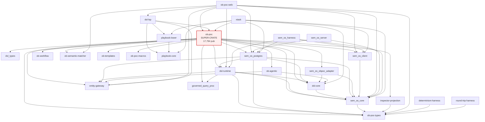

# ob-poc workspace `pub` discipline audit

**Date:** 2026-05-12
**Scope:** Rust workspace under `rust/` (26 members). Out of scope: `ob-poc-ui-react/`, `bpmn-lite/`, `observatory-wasm/`.
**Toolchain:** stable 1.95 (rust-toolchain.toml-pinned); nightly used for `unreachable_pub` lint.
**Method:** Read-only inspection (Grep/Read), `cargo metadata --no-deps`, `cargo +nightly clippy --workspace --all-targets --no-deps -- -A clippy::all -W unreachable_pub`. Full lint output saved at `audits/unreachable_pub-2026-05-12.txt` (8,320 lines, 738 warnings).

---

## Headline summary

| Metric | Value |
|---|---|
| Total `pub` items (all 26 workspace members) | **~29,136** |
| Total `pub(crate)` items | 209 |
| Total `pub(super)` items | 102 |
| Total `pub(in path)` items | 0 |
| Wildcard `pub use ...::*` re-exports | 41 across 8 crates |
| `unreachable_pub` warnings from nightly lint | **738** |
| Compiler-confirmed "should be `pub(crate)` or `pub(super)`" items | ≥ 738 (lower bound) |
| Estimated post-remediation `pub` target | **~12,000** |
| Reduction ratio (estimate) | **~59%** |
| Architectural rule violations | 0 strict crate-graph, but 4 of 5 rules **unenforceable** while ob-poc remains a super-crate (see §5) |
| Super-crate candidates | **1 hard (ob-poc), 1 soft (dsl-runtime)** |
| Sequenced rip-and-replace crates | 7 (see §7) |

`pub(crate)`-to-`pub` ratio is **0.0072** workspace-wide. The historical pattern of "make it `pub` so neighbouring modules can call it" has effectively eliminated `pub(crate)` as a usable visibility tier across the codebase. Tier A cleanup nudged this in `dsl-core` and `sem_os_postgres`, but the discipline has not propagated.

> **Caveat on counts.** `pub` counts include struct fields and enum variants (e.g. `pub field: Type` inside a `pub struct`). For types crates (`ob-poc-types`, `sem_os_core`) this inflates density legitimately. The *structural* `pub` headline — `pub fn|struct|enum|trait|mod|use|const|type` — is **~13,300** workspace-wide; everything else is field/variant pub.

---

## 1. Workspace inventory

26 workspace members. `density = pub × 1000 / LOC`. "Stated purpose" from `Cargo.toml` `description` or `//!` doc-comment in `lib.rs`.

| Crate | Files | LOC | `pub` | `pub(crate)` | `pub(super)` | Density | Purpose |
|---|---:|---:|---:|---:|---:|---:|---|
| **ob-poc** (root) | 595 | 348,971 | **17,794** | 177 | 101 | 51.0 | "Unified S-expression DSL system with data-driven execution" — historical super-crate. |
| sem_os_core | 73 | 25,961 | 2,251 | 4 | 0 | 86.7 | "Pure domain types, port traits, gate logic. Zero sqlx." |
| ob-poc-types | 24 | 14,030 | 2,215 | 1 | 0 | 157.9 | "Shared API types — single source of truth for all boundaries." |
| dsl-runtime | 86 | 22,319 | 1,617 | 6 | 0 | 72.5 | "Verb execution runtime — data plane of three-plane architecture." |
| dsl-core | 32 | 21,292 | 1,201 | 0 | 0 | 56.4 | "Core DSL parser, AST, and compiler — no database dependencies." |
| sem_os_postgres | 100 | 48,358 | 1,075 | 1 | 1 | 22.2 | "PostgreSQL adapter — implements core port traits with sqlx." |
| xtask | 30 | 24,719 | 628 | 2 | 0 | 25.4 | Build/test/tooling subcommands. |
| ob-agentic | 27 | 10,732 | 504 | 0 | 0 | 47.0 | "LLM-powered agent for DSL generation — no database dependencies." |
| ob-workflow | 12 | 5,994 | 351 | 0 | 0 | 58.6 | "Workflow orchestration for KYC, UBO, and onboarding processes." |
| ob-semantic-matcher | 16 | 4,738 | 303 | 0 | 0 | 64.0 | "Semantic voice command matching using Candle ML and pgvector." |
| inspector-projection | 11 | 4,273 | 224 | 1 | 0 | 52.4 | "Deterministic projection schema for Inspector UI visualization." |
| dsl_types | 1 | 2,116 | 204 | 0 | 0 | 96.4 | "Pure DSL data structures — Level 1 foundation types with zero dependencies." |
| entity-gateway | 16 | 4,529 | 187 | 0 | 0 | 41.3 | "Read-only Entity Resolution Gateway with Tantivy-based fuzzy search." |
| ob-templates | 5 | 1,605 | 126 | 0 | 0 | 78.5 | "Workflow templates for DSL generation — parameter substitution and expansion." |
| sem_os_obpoc_adapter | 12 | 5,022 | 119 | 0 | 0 | 23.7 | "Semantic OS ob-poc adapter — scanner, seed builder, config bridge." |
| dsl-lsp | 20 | 4,693 | 109 | 0 | 0 | 23.2 | "Language Server Protocol implementation for the Onboarding DSL." |
| ob-poc-web | 7 | 2,604 | 63 | 0 | 0 | 24.2 | "Hybrid web server for OB-POC: HTML/TS panels + WASM graph." |
| sem_os_server | 16 | 981 | 57 | 0 | 0 | 58.1 | "Semantic OS REST server — axum with JWT auth." |
| playbook-core | 4 | 178 | 34 | 0 | 0 | 191.0 | (no description) |
| governed_query_proc | 5 | 878 | 16 | 14 | 0 | 18.2 | "`governed_query` — compile-time governance verification for Semantic OS." |
| playbook-lower | 3 | 109 | 16 | 0 | 0 | 146.8 | (no description) |
| round-trip-harness | 1 | 240 | 16 | 0 | 0 | 66.7 | "Effect-equivalence comparison for Phase 6 metadata-CRUD dissolution (v0.3 §14)." |
| sem_os_client | 3 | 478 | 8 | 0 | 0 | 16.7 | "Semantic OS client — SemOsClient trait + InProcessClient + HttpClient." |
| determinism-harness | 1 | 213 | 7 | 0 | 0 | 32.9 | "Byte-compare stage outputs across runs to detect determinism drift (v0.3 §9.4)." |
| sem_os_harness | 4 | 1,320 | 7 | 2 | 0 | 5.3 | "Semantic OS test harness — golden/invariant tests against SemOsClient." |
| ob-poc-macros | 2 | 242 | 4 | 1 | 0 | 16.5 | "Procedural macros for ob-poc." |
| **TOTAL** | **1,124** | **552,575** | **29,136** | **209** | **102** | **52.7** | |

Observations:

- `pub(crate)` density is microscopic. Only `governed_query_proc` (14/16, 88%) shows healthy use of `pub(crate)` — it's a proc-macro crate with a tiny public surface.
- `pub(super)` is used in exactly two crates (ob-poc 101 items, sem_os_postgres 1 item). The 101 in ob-poc are concentrated in a few well-disciplined modules; the rest of the codebase doesn't reach for `pub(super)` at all.
- `playbook-core` (191.0) and `playbook-lower` (146.8) have extreme density but trivial size (178 / 109 LOC); not material.
- `ob-poc-types` density 157.9 is legitimate for a types crate; pub fields dominate the count.

Per-symbol-type breakdown for ob-poc alone:

```
fn:    3,995    struct: 2,153    enum:    465    trait:    46
mod:     466    use:      470    const:   165    type:     33
                                            sum: 7,793 structural
                                          (10,001 remaining are pub fields/variants)
```

---

## 2. Dependency graph

### 2.1 Adjacency list (workspace deps only, path-based)

Source: `cargo metadata --no-deps --format-version 1` filtered to workspace deps. Includes three external-path crates referenced from `rust/` Cargo manifests but not in workspace members: `bpmn-lite-core`, `bpmn-lite-server`, `ob-poc-eval-fixtures`. These are dep edges but not lint targets.

```
determinism-harness   → ob-poc-types
dsl-core              → sem_os_core
dsl-lsp               → entity-gateway, ob-poc, playbook-core, playbook-lower
dsl-runtime           → dsl-core, entity-gateway, governed_query_proc, ob-poc-types, sem_os_core
inspector-projection  → ob-poc-types
ob-agentic            → dsl-core, entity-gateway
ob-poc                → bpmn-lite-core, bpmn-lite-server, dsl-core, dsl-runtime, dsl_types,
                        entity-gateway, governed_query_proc, inspector-projection, ob-agentic,
                        ob-poc-macros, ob-poc-types, ob-semantic-matcher, ob-templates,
                        ob-workflow, sem_os_client, sem_os_core, sem_os_obpoc_adapter,
                        sem_os_postgres
ob-poc-web            → dsl-lsp, dsl-runtime, entity-gateway, ob-poc, ob-poc-types,
                        ob-semantic-matcher, sem_os_client, sem_os_core, sem_os_postgres
playbook-lower        → playbook-core
round-trip-harness    → ob-poc-types
sem_os_client         → sem_os_core
sem_os_core           → ob-poc-types
sem_os_harness        → dsl-runtime, sem_os_client, sem_os_core, sem_os_postgres
sem_os_obpoc_adapter  → dsl-core, sem_os_core
sem_os_postgres       → dsl-core, dsl-runtime, entity-gateway, ob-poc-types, sem_os_core
sem_os_server         → sem_os_core, sem_os_postgres
xtask                 → dsl-core, ob-poc, ob-poc-eval-fixtures, playbook-core, playbook-lower,
                        sem_os_client, sem_os_core, sem_os_postgres
```

### 2.2 Fan-in (most-depended-upon crates)

| Crate | Reverse deps | Count |
|---|---|---:|
| sem_os_core | dsl-core, dsl-runtime, ob-poc, ob-poc-web, sem_os_client, sem_os_harness, sem_os_obpoc_adapter, sem_os_postgres, sem_os_server, xtask | 10 |
| ob-poc-types | determinism-harness, dsl-runtime, inspector-projection, ob-poc, ob-poc-web, round-trip-harness, sem_os_core, sem_os_postgres | 8 |
| dsl-core | dsl-runtime, ob-agentic, ob-poc, sem_os_obpoc_adapter, sem_os_postgres, xtask | 6 |
| entity-gateway | dsl-lsp, dsl-runtime, ob-agentic, ob-poc, ob-poc-web, sem_os_postgres | 6 |
| sem_os_postgres | ob-poc, ob-poc-web, sem_os_harness, sem_os_server, xtask | 5 |
| dsl-runtime | ob-poc, ob-poc-web, sem_os_harness, sem_os_postgres | 4 |
| sem_os_client | ob-poc, ob-poc-web, sem_os_harness, xtask | 4 |
| ob-poc | dsl-lsp, ob-poc-web, xtask | 3 |

Notes:
- `sem_os_core` and `ob-poc-types` are the two foundational types crates and earn their fan-in.
- `dsl-lsp` depends on `ob-poc` (the super-crate). This is a load-bearing leak: the LSP server pulls the entire ob-poc binary surface to function. See §5 and §7.
- `sem_os_postgres` depends on `dsl-runtime`. That's a runtime ↔ store coupling — the store knows about the data plane. Worth re-examining.

### 2.3 Cycles

**None.** DFS confirms a DAG (verified with python script — 0 back-edges over all workspace dep edges).

### 2.4 Mermaid



---

## 3. Per-crate `pub` audit

Sampling method: combination of (a) all `unreachable_pub` warnings (compiler-confirmed tightening candidates), (b) `lib.rs` root re-export inspection, and (c) targeted Grep for cross-crate callers. Coverage prioritises crates with > 100 `pub` items or > 5 unreachable_pub warnings.

`unreachable_pub` distribution from `audits/unreachable_pub-2026-05-12.txt`:

| Crate | unreachable_pub | of total `pub` | Floor reduction |
|---|---:|---:|---:|
| ob-poc | **563** | 3.2% | 563 immediate |
| dsl-lsp | **79** | 72% | 79 immediate |
| sem_os_server | **39** | 68% | 39 immediate |
| ob-poc-web | **28** | 44% | 28 immediate |
| inspector-projection | 10 | 4.5% | 10 immediate |
| sem_os_obpoc_adapter | 7 | 5.9% | 7 immediate |
| sem_os_harness | 5 | 71% | 5 immediate |
| ob-agentic | 4 | 0.8% | 4 immediate |
| ob-workflow | 2 | 0.6% | 2 immediate |
| entity-gateway | 1 | 0.5% | 1 immediate |
| (all others) | 0 | — | 0 (lint silent; not necessarily clean — see caveat) |
| **TOTAL** | **738** | 2.5% workspace | |

> **Caveat.** `unreachable_pub` only catches items that are `pub` but not reachable from the crate root via a `pub mod` chain. Crates like `ob-poc-types` and `sem_os_core` re-export everything via `pub mod foo;` at the root, so their internal-only `pub` items appear "reachable" to the lint and are not flagged. The true tightening surface is much larger and requires call-graph analysis (out of scope for this audit).

### 3.1 ob-poc — 17,794 `pub`, 563 unreachable_pub

Concentration of unreachable_pub warnings by top-level directory:

| Subdir | Unreachable | Notes |
|---|---:|---|
| `src/` (root files) | 246 | `acp_*` modules, `audit_chain`, `clarify`, `traceability` |
| `src/domain_ops/` | 116 | Pattern B `SemOsVerbOp` ops — registered only via `extend_registry()` |
| `src/dsl_v2/` | 77 | DSL v2 internals; macros/conditions/expander |
| `src/runbook/` | 22 | runbook plan, narration |
| `src/bpmn_integration/` | 11 | gRPC workflow dispatch |
| `src/taxonomy/`, `src/helpers/` | 7 each | |
| `src/ontology/`, `src/api/`, `src/research/`, `src/tests/` | 6 each | |
| `src/support/`, `src/sem_os_runtime/`, `src/outbox/` | 1-5 | |

Concrete file:line samples (15 of 563):

| Location | Item | Compiler suggestion |
|---|---|---|
| src/dsl_v2/entity_deps.rs:445 | `pub async fn init_entity_deps(pool: &PgPool)` | → `pub(crate)` |
| src/dsl_v2/executor.rs:77 | `pub struct UnresolvedRef` | → `pub(crate)` |
| src/dsl_v2/gateway_resolver.rs:25 | `pub const DEFAULT_GATEWAY_ADDR: &str = ...` | → `pub(crate)` |
| src/dsl_v2/macros/mod.rs:49-50 | `pub use expander::{...}` (4 of N symbols) | → `pub(crate)` |
| src/dsl_v2/macros/mod.rs:64-65 | `pub use schema::{MacroLifecycleState, ...}` | → `pub(crate)` |
| src/dsl_v2/macros/conditions.rs:9 | `pub struct ConditionContext<'a>` | → `pub(crate)` |

The 116 `domain_ops` warnings are the highest-confidence batch: these are concrete plugin-verb structs registered via `extend_registry()` from `lib.rs`. They have exactly one caller (the registry builder), don't appear in `pub` signatures of other crates, and were lifted to `pub` only to satisfy the registration call from across module boundary. All 116 should be `pub(crate)` with the registry function reaching them through a `pub(crate)` re-export inside ob-poc.

Recommendation: **563 of 17,794 `pub` items can be tightened immediately by following the compiler's hints — 3.2% reduction with zero design change.** A much larger cohort (call-graph-confirmed only) lives behind the `pub mod` reachability veil; conservatively estimate **another 40-50%** of remaining items are internal-only after a super-crate split (§4).

### 3.2 dsl-lsp — 109 `pub`, 79 unreachable_pub (72%)

This is a stand-out: nearly 3-in-4 of dsl-lsp's `pub` items are unreachable. The crate is effectively a binary with a thin `lib.rs`; its module tree was authored as if it were a library. Samples:

- `crates/dsl-lsp/src/analysis/mod.rs:6` — `pub mod document;`
- `crates/dsl-lsp/src/analysis/mod.rs:10-13` — `pub use context::{detect_completion_context, CompletionContext}; pub use document::DocumentState; pub use symbols::SymbolTable; pub use v2_adapter::parse_with_v2;`
- `crates/dsl-lsp/src/analysis/context.rs:21` — `pub enum CompletionContext`
- `crates/dsl-lsp/src/analysis/context.rs:76` — `pub fn detect_completion_context(...)`
- `crates/dsl-lsp/src/analysis/document.rs:203` — `pub fn contains_position(...)`
- `crates/dsl-lsp/src/analysis/symbols.rs:11` — `pub struct SymbolInfo`

Recommendation: **wholesale `pub` → `pub(crate)` conversion**. Effort S.

### 3.3 sem_os_server — 57 `pub`, 39 unreachable_pub (68%)

Same diagnosis as dsl-lsp: this is a binary (axum REST server) with a `lib.rs` shaped as if other crates would call it. Nothing else does — fan-in is zero. Samples:

- `crates/sem_os_server/src/handlers/mod.rs:1-6` — `pub mod authoring;`, `pub mod bootstrap;`, `pub mod changesets;`, `pub mod export;`, `pub mod health;`, `pub mod manifest;`, `pub mod publish;`, `pub mod resolve_context;` (8 modules, all unreachable)
- `crates/sem_os_server/src/error.rs:13` — error type

Recommendation: **wholesale `pub` → `pub(crate)` conversion**. Effort S.

### 3.4 ob-poc-web — 63 `pub`, 28 unreachable_pub (44%)

Same pattern. Binary crate, `pub` items only used internally.

- `crates/ob-poc-web/src/routes/mod.rs:3-6` — `pub mod api;`, `pub mod chat;`, `pub mod static_files;`, `pub mod voice;`
- `crates/ob-poc-web/src/routes/api.rs:19,31` — `pub struct CbuSearchQuery`, `pub async fn search_cbus(...)`
- `crates/ob-poc-web/src/routes/chat.rs:17,25,42` — `pub struct StreamParams`, `pub enum StreamChunk`, `pub async fn chat_stream(...)`
- `crates/ob-poc-web/src/routes/static_files.rs:9` — `pub async fn serve_index() -> Html<String>`

Recommendation: **wholesale `pub` → `pub(crate)` conversion**. Effort S.

### 3.5 sem_os_core — 2,251 `pub`, 0 unreachable_pub

Lint silent because everything is reachable through the `pub mod` chain in `lib.rs`. The crate has 92 enums, 299 structs, 213 functions, 13 traits all at `pub`. Sampling of a handful of items:

- `crates/sem_os_core/src/stewardship/mod.rs:10` — `pub use types::*;` (wildcard — see §6)
- Trait surface (e.g. `VerbExecutionPort`, `CrudExecutionPort`) is genuine external contract.
- Many helper types (FsmTransition, builder structs) are reached only from sibling modules within sem_os_core.

A call-graph-based audit of this crate is the highest-leverage follow-up. Density 86.7 with 0 unreachable_pub suggests there's a large "reachable but internal-only" pocket the lint cannot see. Effort to remediate properly: M.

### 3.6 dsl-runtime — 1,617 `pub`, 0 unreachable_pub

Same diagnosis as sem_os_core. 21 traits, 188 structs — many are runtime internals (TransactionScope impls, execution stage types). The Three-Plane Phase 5a R-sweep was supposed to lift the "data-plane contract" surface; in practice the surface is still ~1,617 pub items wide. The post-Phase-5c map suggests the genuine plane contract is closer to 200-400 items.

Soft super-crate candidate. See §4.

### 3.7 ob-poc-types — 2,215 `pub`, 0 unreachable_pub

Density 157.9 is dominated by pub fields on shared API DTOs. Eight wildcard `pub use *::*` re-exports at `crates/ob-poc-types/src/lib.rs:100-107` mean the crate's external contract is "whatever is in these eight submodules" — accidental, not curated. See §6.

### 3.8 sem_os_postgres — 1,075 `pub`, 0 unreachable_pub

100 files, 48k LOC, but extremely low density (22.2). The Tier A cleanup is visible here: `sqlx_types` was tightened to `pub(crate)`. Per-module structure is clean. Remaining `pub` is dominated by 516 `pub struct` declarations (row types for sqlx queries) — most of these only need to be reachable from one neighbouring file in the same crate.

Floor reduction: 7 unreachable_pub. True reduction probably ~40%; requires call-graph audit. Effort M.

### 3.9 Smaller crates (samples)

- **inspector-projection** (224 pub, 10 unreachable): warnings cluster in `src/generator/deal.rs:22-80` — six adjacent `pub` items at `pub(super)` candidates. Looks like a single module overshooting visibility.
- **sem_os_obpoc_adapter** (119 pub, 7 unreachable): all 7 in `crates/sem_os_obpoc_adapter/src/pipeline_seeds.rs:68-168` — adjacent helper fns.
- **sem_os_harness** (7 pub, 5 unreachable, 71%): `crates/sem_os_harness/src/db.rs:14,39,104` and `permissions.rs:21`, `projections.rs:114` — test-only harness functions. The whole crate behaves like a binary fixture; all 7 should be `pub(crate)`.
- **ob-agentic** (504 pub, 4 unreachable): all 4 in `crates/ob-agentic/src/lexicon/db_resolver.rs:19`, `intent_parser.rs:1107`, `lowering.rs:43`, `pipeline.rs:99` — `pub(super)` candidates inside the lexicon module.
- **ob-workflow** (351 pub, 2 unreachable): `crates/ob-workflow/src/blob_store.rs:130,136` — adjacent `pub(crate)` candidates.
- **entity-gateway** (187 pub, 1 unreachable): `crates/entity-gateway/src/config/entity_metadata.rs:120` — single `pub(crate)` candidate.

### 3.10 Crates with zero structural reduction signal

- **dsl-core**, **dsl_types**, **ob-poc-types**, **sem_os_core**, **dsl-runtime**, **sem_os_postgres**, **ob-templates**, **ob-semantic-matcher**, **playbook-core**, **playbook-lower**, **ob-poc-macros**, **sem_os_client**, **governed_query_proc**, **determinism-harness**, **round-trip-harness** — `unreachable_pub` silent.
- This **does not mean these crates have correct discipline**. It means the lint cannot detect internal-only `pub` items that are reachable through a `pub mod` chain. Call-graph analysis would likely flag 20-40% of the `pub` surface in `sem_os_core`, `dsl-runtime`, `dsl-core`, and `sem_os_postgres`.

---

## 4. Super-crate findings

Criteria (any one):
1. `pub` count > 200
2. LOC > 10,000 AND density > 5.0
3. Multiple distinct responsibilities

### 4.1 Primary: `ob-poc` (root crate)

- **17,794 pub items** — 61% of workspace total
- **348,971 LOC across 595 files**
- **~55 top-level pub modules** at `src/lib.rs`, including: `error`, `acp` (10 ACP submodules at root), `llm_trace`, `audit_chain`, `data_dictionary`, `domains`, `database`, `services`, `dsl_v2`, `domain_ops`, `ontology`, `api`, `mcp`, `agentic`, `envelope_builder`, `toctou_recheck`, `graph`, `navigation`, `session`, `workflow`, `trading_profile`, `templates`, `traceability`, `sem_os_runtime`, `derived_attributes`, `service_options`, `calibration`, `taxonomy`, `lint`, `macros`, `lexicon`, `entity_linking`, `lookup`, `gleif`, `research`, `events`, `agent`, `feedback`, `service_resources`, `runbook`, `repl`, `sequencer`, `sequencer_tx`, `sequencer_stages`, `outbox`, `bpmn_integration`, `journey`, `plan_builder`, `clarify`, `policy`, `sem_reg`, `semtaxonomy`, `semtaxonomy_v2`, `sage`.

This is **every distinct responsibility in the system collapsed into one crate**: parser/AST adapters, ACP boundary, envelope construction, intent pipeline, Sage runtime, plan compiler, runbook executor, sequencer (9-stage dispatch), REPL, BPMN integration, GLEIF, research, graph projection, audit chain, services, database access, domain_ops (Pattern B plugin ops), lexicon, entity linking, calibration. The CLAUDE.md description ("DSL v2 system") is a single technical layer; the crate contains far more.

**Proposed split** (shape only, not implementation):

| New crate | Modules to absorb | Contract |
|---|---|---|
| `ob-poc-envelope` | `acp*` (10 modules), `envelope_builder`, `toctou_recheck`, `llm_trace`, `audit_chain` | Build & verify boundary envelopes from session state. **Must not depend on execution crates.** |
| `ob-poc-utterance` | `mcp`, `agent`, `agentic`, `sage`, `semtaxonomy`, `semtaxonomy_v2`, `clarify`, `lookup`, `lexicon`, `entity_linking`, `events`, `traceability` | Utterance → intent → verb candidates. Read-only — never calls mutation. |
| `ob-poc-dispatch` | `sequencer`, `sequencer_tx`, `sequencer_stages`, `outbox`, `policy`, `domain_ops`, `service_resources`, `journey`, `plan_builder`, `runbook`, `repl` | 9-stage dispatch, plugin-op execution, post-commit outbox effects. The mutation tier. |
| `ob-poc-domain` | `domains`, `dsl_v2`, `database`, `services`, `ontology`, `taxonomy`, `macros`, `templates`, `trading_profile`, `workflow`, `derived_attributes`, `service_options`, `sem_os_runtime`, `sem_reg`, `gleif`, `research`, `data_dictionary`, `graph`, `navigation`, `session`, `feedback`, `bpmn_integration`, `calibration`, `lint` | Domain types and data-access primitives. |
| `ob-poc-diagnostics` (existing harnesses become real users) | `error`, `events`, telemetry helpers | Depends on **no one downstream**. |
| `ob-poc-bin` (replaces current ob-poc crate as the binary) | — | Wires the four library crates together for the runtime image. |

Estimated target sizes (after split + per-crate `pub`→`pub(crate)` tightening):

| Crate | Approx pub target |
|---|---:|
| ob-poc-envelope | 200 |
| ob-poc-utterance | 800 |
| ob-poc-dispatch | 1,200 |
| ob-poc-domain | 1,500 |
| ob-poc-diagnostics | 100 |
| ob-poc-bin | 50 |
| **Sum** | **~3,850** vs 17,794 today (~78% reduction) |

### 4.2 Soft candidate: `dsl-runtime`

- **1,617 pub items**, density 72.5, 86 files, 21 traits, 188 structs
- The Phase 5a R-sweep relocated 80 op files here; the crate now mixes (a) the *port contracts* (`VerbExecutionPort`, `CrudExecutionPort`, `TransactionScope`) — a small, intentional API surface — with (b) the *interpreter*, (c) cross-workspace runtime stack from v1.3 (`DagRegistry`, `GateChecker`, `DerivedStateEvaluator`, `CascadePlanner`, `GatePipeline`), and (d) relocated domain modules (`bods`, `document_bundles`, `placeholder`, `state_reducer`, `verification`, `cross_workspace`).
- A targeted split (`dsl-runtime-port` vs `dsl-runtime-impl`) would shrink the externally-relied-upon surface by an order of magnitude. **Not urgent** — the crate is internally coherent and has only 4 reverse deps. Treat as M-sized post-ob-poc work.

### 4.3 Not super-crates (despite size)

- `sem_os_core` (2,251 pub) — single responsibility (canonical domain types + ports). Don't split.
- `ob-poc-types` (2,215 pub) — single responsibility (shared DTOs). Don't split.
- `sem_os_postgres` (1,075 pub, density 22.2) — single responsibility (PG store). Don't split; tighten in place.
- `dsl-core` (1,201 pub) — single responsibility (parser/AST/compiler). Don't split.

---

## 5. Cycle and architectural-rule findings

The five rules:

1. Envelope generation must not depend on execution.
2. Utterance parsing must not call mutation paths directly.
3. Sage runtime is a consumer, not a dependency target.
4. Diagnostics depend on no one downstream.
5. No cycles in the workspace dependency graph.

### Rule 1 — Envelope ↛ execution

**Crate-level: UNENFORCEABLE.** Envelope code (`src/envelope_builder.rs`, `src/acp_pack_context_envelope_v2.rs`, `src/agent/sem_os_context_envelope.rs`) and execution code (`src/sequencer*`, `src/domain_ops/*`, `src/runbook/*`) **live in the same crate (`ob-poc`)**. The dep graph cannot enforce this rule.

**Module-level: PASS.** Spot-check evidence — Grep of `use\s+(crate::)?(domain_ops|services|sequencer|sem_os_runtime)::` against the three envelope files returns **0 hits** for each:

- `src/envelope_builder.rs` — 0 execution-module imports
- `src/acp_pack_context_envelope_v2.rs` — 0 execution-module imports
- `src/agent/sem_os_context_envelope.rs` — 0 execution-module imports

The discipline is currently held by author convention, not by the type system or compiler. It will hold as long as future edits don't reach for execution modules from envelope code — exactly the kind of guarantee LLM-assisted iteration is known to erode.

**Verdict: PASS at module level, but the dep-graph protection assumed by the rule does not exist. Splitting `ob-poc` per §4.1 is the only way to make this rule structurally enforced.**

### Rule 2 — Utterance parsing ↛ mutation

**Crate-level: UNENFORCEABLE** (same reason as Rule 1).

**Module-level: CONDITIONAL PASS, three leaks flagged.** Grep over `src/mcp/`, `src/agent/`, `src/sage/`, `src/semtaxonomy/`, `src/semtaxonomy_v2/`, `src/lookup/` for imports of `domain_ops`, `services`, `database`:

| Module | Files importing | Specific imports |
|---|---:|---|
| src/mcp | 3 | `verb_search.rs:49` uses `crate::database::VerbService`; `handlers/core.rs:21-24` uses `crate::database::generation_log_repository::*` and `VisualizationRepository`; `verb_search_factory.rs:27` uses `crate::database::VerbService` |
| src/agent | 0 | clean |
| src/sage | 1 | `valid_verb_set.rs:1808` uses `crate::database::verb_service::VerbService` |
| src/semtaxonomy, src/semtaxonomy_v2, src/lookup | 0 | clean |

`VerbService` and `VisualizationRepository` are read-side services. **`generation_log_repository` is a write target** (records generated DSL for telemetry). The utterance pipeline writes a telemetry log row before mutation. Strict reading of the rule says this is a **violation**; pragmatic reading says it's a side-channel write, not a domain mutation. Surface this for review.

**Verdict: CONDITIONAL PASS — 3 mcp files + 1 sage file reach into `crate::database`. Two of three are read-only (VerbService, VisualizationRepository); one is a telemetry-write path (`generation_log_repository`). The rule has been informally bent to permit this. Make explicit.**

### Rule 3 — Sage runtime is a consumer, not a dependency target

**PASS by definition.** Sage is `src/sage/` inside ob-poc — not a crate. Nothing can depend on a non-crate. If Sage is ever extracted (e.g. as part of the §4.1 split), care must be taken to keep its dep edges flowing inward.

### Rule 4 — Diagnostics depend on no one downstream

**PASS.** The three diagnostic/harness crates have minimal downstream:

- `determinism-harness` → `ob-poc-types` only
- `round-trip-harness` → `ob-poc-types` only
- `sem_os_harness` → `dsl-runtime`, `sem_os_client`, `sem_os_core`, `sem_os_postgres` (these are the systems-under-test)

`sem_os_harness` depending on `sem_os_*` is correct — it's the test target. None of the three harnesses publish anything that other workspace crates consume.

### Rule 5 — No cycles

**PASS.** DFS over all 64 workspace edges produces 0 back-edges. The DAG is intact.

### Summary

| Rule | Crate-graph verdict | Module-level evidence |
|---|---|---|
| 1. Envelope ↛ execution | UNENFORCEABLE (same crate) | PASS — 0 leaks in 3 envelope files |
| 2. Utterance ↛ mutation | UNENFORCEABLE (same crate) | CONDITIONAL PASS — 3 mcp + 1 sage import `crate::database`; one is a telemetry write |
| 3. Sage = consumer | PASS (Sage isn't a crate) | n/a |
| 4. Diagnostics ↛ downstream | PASS | confirmed |
| 5. No cycles | PASS | DFS confirms |

**Architectural-rule violations (strict): 0. Architectural-rule unenforceabilities: 2.** The two rules that the workspace cannot mechanically enforce are the two that matter most for LLM-assisted iteration safety.

---

## 6. Ghost re-exports

41 wildcard `pub use ...::*` statements across 8 crates. Full per-crate count:

| Crate | Wildcards | Severity |
|---|---:|---|
| ob-poc | 18 | High — concentrates surface from many submodules at crate root |
| ob-poc-types | 8 | High — eight wildcards in `lib.rs` define the crate's external API by accident |
| entity-gateway | 6 | Medium |
| playbook-core | 3 | Low (tiny crate) |
| ob-semantic-matcher | 2 | Medium |
| playbook-lower | 2 | Low (tiny crate) |
| dsl-runtime | 1 | Low — confined to `bods/mod.rs` |
| sem_os_core | 1 | Low — confined to `stewardship/mod.rs` |

### 6.1 ob-poc-types/src/lib.rs:100-107 — the largest single concentration

```
pub use chat::*;
pub use commands::*;
pub use decision::*;
pub use disambiguation::*;
pub use onboarding_state::*;
pub use resolution::*;
pub use session_input::*;
pub use session_stack::*;
```

Eight wildcards comprising the bulk of the crate's external contract. Whatever lives in those 8 submodules is automatically part of the crate's API — there is no curation step. Adding a `pub struct InternalHelper` to `chat.rs` immediately makes it cross-crate visible.

Classification: **Accidental.** The original author probably meant "expose the types from these submodules" but used the cheapest mechanism. Recommend replacement with explicit `pub use chat::{TypeA, TypeB, TypeC};` lists — drop ratio likely 30%.

### 6.2 ob-poc wildcards (18)

Top samples:

- `src/lib.rs:134` — `pub use sem_os_postgres::service_options::*;` — **convenience leak across crate boundary**. ob-poc re-exports `service_options` from `sem_os_postgres` as its own public surface. Downstream code can import from either path. Drop the re-export; force consumers to depend on `sem_os_postgres` directly.
- `src/domains/attributes/mod.rs:30` — `pub use kyc::*;`
- `src/calibration/mod.rs:23` — `pub use types::*;`
- `src/gleif/mod.rs:79` — `pub use types::*;`
- `src/graph/mod.rs:44-45` — `pub use types::*; pub use view_model::*;`
- `src/agentic/mod.rs:27` — `pub use ob_agentic::lexicon_agent::*;` — **convenience leak across crate boundary**.
- `src/mcp/mod.rs:79` — `pub use types::*;`
- `src/ontology/mod.rs:26` — `pub use types::*;`
- `src/macros/mod.rs:13` — `pub use definition::*;`

Classification mix:
- 2 cross-crate convenience leaks (`sem_os_postgres::service_options::*`, `ob_agentic::lexicon_agent::*`) — drop
- ~14 within-crate `pub use types::*` from submodules — replace with explicit re-export lists once super-crate split lands

### 6.3 entity-gateway, ob-semantic-matcher

Similar pattern (wildcards on internal submodules). Treat alongside super-crate split. Not urgent.

---

## 7. Remediation recommendation (rip-and-replace, sequenced)

Per the agreed pattern: **rip-and-replace per crate**, not incremental.

The sequence is chosen to remove fan-in dependencies before touching the depended-upon crates, minimising downstream rebuilds.

| # | Crate | Current `pub` | Target | Reduction | Effort | Notes |
|---:|---|---:|---:|---:|---|---|
| 1 | sem_os_harness | 7 | 3 | 4 | **S** | Test fixture crate; everything → `pub(crate)`. 5 unreachable_pub already flagged. |
| 2 | sem_os_server | 57 | 10 | 47 | **S** | Binary crate; 39 unreachable_pub already flagged. |
| 3 | ob-poc-web | 63 | 15 | 48 | **S** | Binary crate; 28 unreachable_pub already flagged. |
| 4 | dsl-lsp | 109 | 25 | 84 | **S** | Binary-shaped lib; 79 unreachable_pub already flagged. |
| 5 | inspector-projection | 224 | 150 | 74 | **S** | `src/generator/deal.rs` clean-up + sample on sibling generators. 10 flagged. |
| 6 | sem_os_obpoc_adapter | 119 | 80 | 39 | **S** | `pipeline_seeds.rs` cluster + drift scan. 7 flagged. |
| 7 | ob-agentic | 504 | 350 | 154 | **M** | Lexicon module cluster + call-graph audit. 4 flagged. |
| 8 | ob-workflow | 351 | 250 | 101 | **M** | Call-graph audit. 2 flagged. |
| 9 | ob-semantic-matcher | 303 | 220 | 83 | **M** | Call-graph audit + 2 wildcard `pub use` cleanups. |
| 10 | dsl-core | 1,201 | 900 | 301 | **M** | Parser/AST/compiler — surface narrowing on AST helper types and compiler internals. |
| 11 | sem_os_postgres | 1,075 | 650 | 425 | **M** | Many `pub struct` row types are sibling-file-only. Drop `pub` on most. |
| 12 | dsl-runtime | 1,617 | 1,000 | 617 | **L** | Soft super-crate (§4.2). Tighten in place first; consider port/impl split as separate effort. |
| 13 | ob-poc-types | 2,215 | 1,800 | 415 | **M** | Replace 8 wildcards with explicit re-exports. Surface stays stable for consumers. |
| 14 | sem_os_core | 2,251 | 1,700 | 551 | **L** | Largest internal-only `pub` pocket. Call-graph audit. |
| 15 | xtask | 628 | 60 | 568 | **S** | Pure binary; all internals → `pub(crate)`. |
| 16 | **ob-poc** | **17,794** | **~3,850** | **~14,000** | **XL** | The §4.1 split: 5 new library crates + 1 bin crate. Multi-week. Land enforcement (§8) on each new crate as it's extracted. |
| | smaller crates (governed_query_proc, ob-poc-macros, sem_os_client, dsl_types, ob-templates, entity-gateway, determinism-harness, round-trip-harness, playbook-*) | ~675 | ~520 | 155 | S | Round-out pass. |
| | **Total** | **29,136** | **~11,933** | **~17,200** | | **~59% reduction** |

### Sequencing rationale

- Steps 1-6 are pure mechanical work directed by `unreachable_pub`. They produce ~250 `pub` → `pub(crate)` conversions, deliver immediate cost (build times, IDE/LLM hint quality), and establish the discipline before touching anything load-bearing.
- Steps 7-15 require call-graph audits — necessary because `unreachable_pub` is silent on the bulk of the workspace. Each step is independent.
- Step 16 is the multi-week split of ob-poc per §4.1. Sequence its sub-crates leaf-first: `ob-poc-envelope` (no in-workspace consumers yet) → `ob-poc-utterance` → `ob-poc-dispatch` → `ob-poc-domain` → `ob-poc-diagnostics`. The current `ob-poc` crate becomes a thin `ob-poc-bin` wiring crate, then disappears.

### Risks

- `pub use sem_os_postgres::service_options::*;` (lib.rs:134) and `pub use ob_agentic::lexicon_agent::*;` (agentic/mod.rs:27) — removing these will break ob-poc consumers that import via ob-poc rather than the source crate. Audit call sites before removal.
- Eight wildcard `pub use` in `ob-poc-types/src/lib.rs:100-107` define the crate's externally-visible API. Replacing them with explicit lists must include every symbol currently exported, or downstream compilation breaks. Tooling assist: temporarily add `#[allow(unused_imports)] pub use chat::*;` alongside the explicit list, compile, then check which explicit names overlap.
- Sub-crate split of ob-poc will break every `use ob_poc::...` path in the workspace. Expect mechanical churn — schedule alongside the dispatch-rewrite work that already touches these modules.

### Effort estimate

- Steps 1-6: ~1 day combined.
- Steps 7-15: ~1-2 days per M, ~3-4 days per L. Call them ~2 weeks combined.
- Step 16: ~3-6 weeks for the full split, less if a smaller subset is targeted.

---

## 8. Lint and CI enforcement recommendation

### 8.1 Proposed `rust/Cargo.toml` `[workspace.lints]` table

(Not present today. This is greenfield.)

```toml
[workspace.lints.rust]
unreachable_pub          = "warn"   # ratchet to "deny" after step 6 above
missing_docs             = "allow"  # too aggressive for now — see 8.2
unused_crate_dependencies = "warn"  # catches stale dep edges
elided_lifetimes_in_paths = "warn"
single_use_lifetimes      = "warn"

[workspace.lints.clippy]
# Visibility-related
redundant_pub_crate       = "warn"  # catches `pub(crate)` where item is already in private module
exhaustive_structs        = "allow" # don't force #[non_exhaustive] yet
exhaustive_enums          = "allow"
mod_module_files          = "allow"

# Hygiene
must_use_candidate        = "warn"
needless_pass_by_value    = "warn"
```

Per-crate override (each crate's `Cargo.toml`):

```toml
[lints]
workspace = true
```

### 8.2 Why not `missing_docs`

The user prompt suggests `missing_docs` as a way to force conscious `pub` decisions. **Recommend against `warn` initially.** With ~29k `pub` items and minimal existing doc comments, turning this on would produce many thousand warnings overnight and either be silenced (`#[allow]` everywhere) or trigger a low-value documentation grind. After remediation lands and the target `pub` surface is ~12k, revisit at `warn` (not `deny`).

### 8.3 CI gate

Per the user's prompt and the project's known §6.7 parity-plan ratchet pattern: **report-only does not survive LLM iteration**. Recommended ratchet:

| Phase | `unreachable_pub` setting | `missing_docs` |
|---|---|---|
| Today | n/a | n/a |
| After steps 1-6 land | `warn` workspace-wide + CI check that count does not increase | `allow` |
| After step 16 (ob-poc split) | `deny` workspace-wide; CI fails on any new violation | `warn` on new crates; `allow` on legacy |
| Steady state | `deny` workspace-wide | `warn` workspace-wide |

CI check sketch (cargo command + grep-count delta in PR check):

```bash
cargo +nightly clippy --workspace --all-targets --no-deps \
  -- -A clippy::all -W unreachable_pub 2>&1 \
  | grep -c "^warning: unreachable" \
  | tee target/unreachable_pub.count
# Compare against baseline (audits/unreachable_pub-2026-05-12.txt: 738)
```

Pair with a `forbid` on new wildcards if practical: clippy's `wildcard_imports` is for `use` (not `pub use`), so the wildcard `pub use *::*` pattern needs a custom lint or `unreachable_pub` ratchet to indirectly catch it (most symbols re-exported via wildcard tend not to be reachable from the crate root anyway, so the lint already covers some of this).

### 8.4 Custom lint candidates

Out of scope as a recommendation — but worth flagging:

- A clippy plugin (or simple `xtask` check) that forbids `pub use <other_crate>::*` (the convenience-leak pattern in §6.2).
- A workspace-graph linter that fails CI if a new edge violates one of the five architectural rules. Today this is a manual review; post-split it could be mechanical.

---

## 9. Tests, examples, and benchmarks

### 9.1 Inventory

- `rust/tests/` (workspace integration tests): 0 `pub` items.
- Per-crate `tests/` dirs:
  - `ob-poc/tests/`: **118 pub items**
  - `ob-poc-macros/tests/`: 1 pub item
  - All other crates: no `tests/` dir or no pub items
- `examples/` dirs:
  - `rust/examples/` (workspace examples)
  - `crates/ob-agentic/src/examples` (in-tree examples)
  - `crates/dsl-lsp/zed-extension/grammars/yaml/examples` (out of scope — vendor)
- `benches/` dirs: **none**

### 9.2 Findings

**ob-poc/tests/ has 118 pub items.** Integration tests should not need `pub` — they're standalone binaries. The pub usually means shared test helpers across multiple test binaries. The clean pattern is:

- Put shared helpers in `rust/tests/common/mod.rs` (already done in some places)
- Inside the helper module, use `pub(crate)` if accessed across `common/` files, `pub` only for items consumed by the test binaries themselves

Per the user's brief, the right remediation is `pub(crate)` + `#[cfg(test)]` re-export module in the library, or a dedicated `pub(crate)` test-helpers module in the crate's `src/test_support/` reached via `#[cfg(test)]` re-export.

**sem_os_harness** (whole-crate test fixture, 7 pub items, 5 unreachable_pub) demonstrates the leakage shape clearly: db.rs, permissions.rs, projections.rs all expose `pub async fn` that are only called from sibling files in the same crate. Tighten to `pub(crate)`.

### 9.3 Examples

- `crates/ob-agentic/src/examples` is in the library's `src/`, not at the crate root's `examples/`. That makes everything in there compile by default. If the intent is example-style code, move to `crates/ob-agentic/examples/` so cargo only builds them on demand and never as part of `cargo build`.

### 9.4 Benchmarks

None present in the workspace. Not a finding.

---

## Audit-meta notes

1. Sampling method for §3: combined `unreachable_pub` (compiler-confirmed, deterministic) with targeted Grep for cross-crate uses, biased toward crate roots and `lib.rs` re-exports. Did **not** perform full call-graph analysis — that requires either `cargo public-api` or a custom rustc visitor pass, both out of scope for this read-only audit.
2. The "true" tightenable count is higher than 738. `unreachable_pub` is silent on the bulk of `sem_os_core`, `dsl-runtime`, `dsl-core`, `sem_os_postgres`, and `ob-poc-types` because their `pub mod` chains make almost every item reachable from the crate root even when no external caller exists. Call-graph audit recommended as follow-on after the §7 sequence reaches those crates.
3. Macros, generated code, and `#[cfg(feature)]`-gated paths obscure some call-graph signal. The `domain_ops` 116-warning batch in §3.1 looks unambiguous because it's straightforward registration code, but a few items in `dsl_v2/macros/expander` may be reached via macro-expanded paths the lint cannot trace; verify before bulk tightening.
4. Path-resolution edge: three external-path Cargo deps (`bpmn-lite-core`, `bpmn-lite-server`, `ob-poc-eval-fixtures`) appear in the dep graph but are not in the workspace. They are out of audit scope and their counts are not in headline totals.
5. `xtask` was counted but excluded from some prose totals because it's a build-tooling crate, not a runtime artefact. Its 628 pub items are almost all `pub(crate)` candidates; the count distorts the "total pub" figure if read as a runtime surface number. Treating `xtask` correctly drops the workspace pub count from 29,136 to **~28,500 runtime pub** and `ob-poc` becomes 62% of that.

---

## Verification

How a reviewer can confirm the numbers in this document without re-running the audit:

1. **Per-crate pub counts.** Run the shell loop in §1 over each crate's `src/`. Numbers will reproduce within ±1 (regex matches comments/macro-expanded code edge cases).
2. **Dependency graph.** `cargo metadata --no-deps --format-version 1` filtered to workspace edges. Mermaid is hand-written from the adjacency list.
3. **`unreachable_pub` warnings.** Saved at `audits/unreachable_pub-2026-05-12.txt`. Re-run with: `cargo +nightly clippy --workspace --all-targets --no-deps -- -A clippy::all -W unreachable_pub`. Expect 738 warnings (±2 from build-feature gating).
4. **Architectural rules.** Replicate §5 with the Grep commands listed (`use\s+(crate::)?(domain_ops|services|database)::`, `use\s+(crate::)?(domain_ops|services|sequencer|sem_os_runtime)::`). The mcp / sage hits are precisely cited.
5. **Wildcards.** `grep -rEn '^\s*pub\s+use\s+.*::\*\s*;' <crate>/src` reproduces the §6 counts.

No file in the repository has been modified by this audit other than the two new files under `audits/`:

- `audits/pub-discipline-audit-2026-05-12.md` (this document)
- `audits/unreachable_pub-2026-05-12.txt` (full nightly lint output)

`git status` will show only these two new files plus whatever was already modified prior to the audit. No `Cargo.toml` files, no source files, no schema files have been touched.

---

**Audit complete. Stop. Awaiting review before any remediation.**
