# Instrument Matrix & Trading Universe — Design Paper

**Version:** 1.1  
**Date:** 2026-02-11  
**Status:** For Peer Review  
**Audience:** Engineering, Product, Domain Architects  
> **Mermaid diagrams** render in GitHub, VS Code, and any CommonMark renderer with mermaid support.

---

## 1. Purpose

This paper describes the **Instrument Matrix** — the complete model for declaring, configuring, and operating a CBU's trading universe. It covers:

- What instruments, markets, currencies, and counterparties a CBU is permissioned to trade
- How standing settlement instructions (SSIs) route trades to the correct accounts
- How ISDA master agreements and CSAs govern OTC derivatives
- How booking rules match trades to SSIs using ALERT-style priority logic
- How the entire configuration lives as a versioned JSONB document and materializes to operational tables
- The 60+ DSL verb set that drives the full lifecycle

**Key thesis:** The trading universe is not a flat list — it is a **multi-dimensional permission cube** (Instrument × Market × Currency × Counterparty) with settlement routing, collateral management, corporate actions policy, and pricing configuration layered on top. The single source of truth is a versioned JSONB document per CBU that materializes deterministically to 15+ operational tables.

---

## 2. The Permission Cube

Every CBU has a trading universe defined by the intersection of four dimensions:

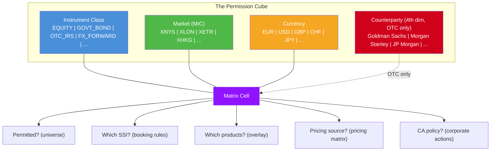

For **listed instruments** (equities, bonds, ETFs), the cube is 3D: **Instrument x Market x Currency**.

For **OTC derivatives**, a 4th dimension appears: **Counterparty** — because each OTC trade requires a bilateral agreement (ISDA) with a specific counterparty, and collateral flows (CSA) are per-counterparty.

---

## 3. Document-First Architecture

### 3.1 Design Philosophy

The trading profile uses a **document-first** pattern:

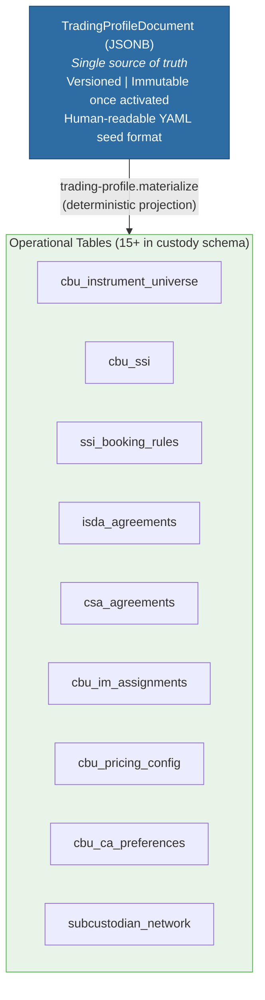

**Why not write directly to operational tables?**
- **Atomicity** — a profile change may touch 10+ tables
- **Versioning** — you can diff v3 vs v4 at the document level
- **Rollback** — revert to v3 = activate v3 + re-materialize
- **Audit** — the document IS the audit record
- **Import/export** — YAML seed files are just the document format

### 3.2 Storage

| Table | Schema | Purpose |
|-------|--------|---------|
| `cbu_trading_profiles` | `ob-poc` | Versioned JSONB documents with status state machine |
| `trading_profile_materializations` | `ob-poc` | Audit log of each materialization run |

```sql
CREATE TABLE "ob-poc".cbu_trading_profiles (
    profile_id    UUID PRIMARY KEY,
    cbu_id        UUID NOT NULL REFERENCES "ob-poc".cbus(cbu_id),
    version       INTEGER NOT NULL,
    status        VARCHAR(20) NOT NULL,   -- DRAFT, VALIDATED, PENDING_REVIEW, ACTIVE, SUPERSEDED, ARCHIVED
    document      JSONB NOT NULL,         -- TradingProfileDocument
    document_hash VARCHAR(64) NOT NULL,   -- SHA-256 of canonical JSON
    created_by    VARCHAR(100),
    activated_at  TIMESTAMPTZ,
    activated_by  VARCHAR(100),
    notes         TEXT,
    created_at    TIMESTAMPTZ DEFAULT NOW(),
    updated_at    TIMESTAMPTZ DEFAULT NOW(),
    UNIQUE (cbu_id, version)
);
```

### 3.3 Document Lifecycle State Machine

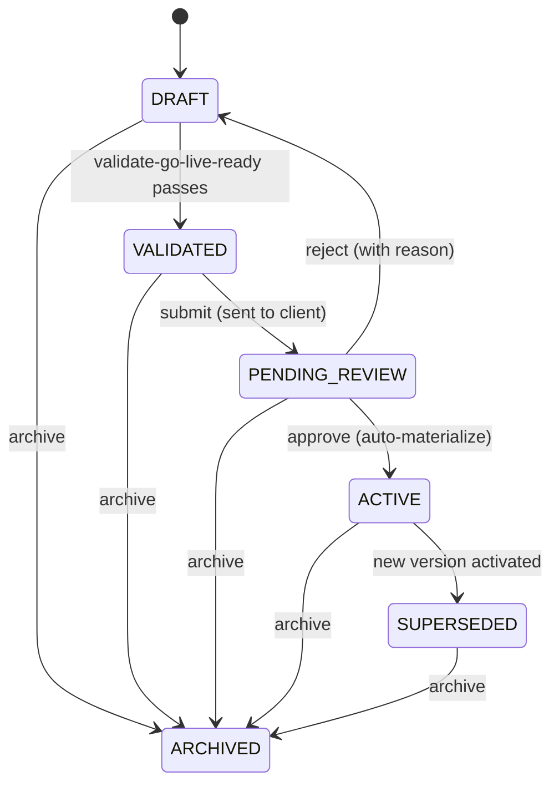

---

## 4. TradingProfileDocument Structure

The JSONB document is a typed Rust struct (`TradingProfileDocument`) with 11 top-level sections:

```mermaid
graph LR
    DOC["TradingProfileDocument"]

    DOC --> U["universe"]
    U --> U1["base_currency"]
    U --> U2["allowed_currencies[]"]
    U --> U3["allowed_markets[]<br/><i>MIC + currencies + settlement types</i>"]
    U --> U4["instrument_classes[]<br/><i>Class code + CFI + ISDA asset class</i>"]

    DOC --> IM["investment_managers[]"]
    IM --> IM1["manager (EntityRef)"]
    IM --> IM2["role<br/><i>IM, SUB_ADVISOR, ...</i>"]
    IM --> IM3["scope<br/><i>All or by markets/classes</i>"]
    IM --> IM4["instruction_method"]

    DOC --> ISDA["isda_agreements[]"]
    ISDA --> IS1["counterparty (EntityRef)"]
    ISDA --> IS2["governing_law<br/><i>NY | ENGLISH</i>"]
    ISDA --> IS3["product_coverage[]"]
    ISDA --> CSA["csa (CsaConfig)"]
    CSA --> CSA1["csa_type<br/><i>VM | VM_IM | IM</i>"]
    CSA --> CSA2["thresholds"]
    CSA --> CSA3["eligible_collateral[]"]
    CSA --> CSA4["collateral_ssi_ref"]

    DOC --> SC["settlement_config"]
    SC --> SC1["matching_platforms[]"]
    SC --> SC2["settlement_identities[]"]
    SC --> SC3["subcustodian_network[]"]
    SC --> SC4["instruction_preferences[]"]

    DOC --> BR["booking_rules[]"]
    BR --> BR1["name, priority"]
    BR --> BR2["match<br/><i>instrument, market, ccy, cpty</i>"]
    BR --> BR3["ssi_ref"]

    DOC --> SI["standing_instructions{}"]
    SI --> SI1["SECURITIES[]"]
    SI --> SI2["CASH[]"]
    SI --> SI3["OTC_COLLATERAL[]"]
    SI --> SI4["FUND_ACCOUNTING[]"]

    DOC --> PM["pricing_matrix[]"]
    PM --> PM1["scope"]
    PM --> PM2["source<br/><i>BBG, REUTERS, MARKIT</i>"]
    PM --> PM3["fallback + staleness"]

    DOC --> VC["valuation_config"]
    VC --> VC1["frequency, cutoff, tz"]
    VC --> VC2["swing_pricing"]

    DOC --> CO["constraints"]
    CO --> CO1["short_selling"]
    CO --> CO2["leverage"]

    DOC --> CA["corporate_actions"]
    CA --> CA1["enabled_event_types[]"]
    CA --> CA2["notification_policy"]
    CA --> CA3["election_policy"]
    CA --> CA4["default_options[]"]
    CA --> CA5["cutoff_rules[]"]
    CA --> CA6["proceeds_ssi_mappings[]"]

    DOC --> MD["metadata"]
    MD --> MD1["source, source_ref"]
    MD --> MD2["created_by"]
    MD --> MD3["regulatory_framework"]

    style DOC fill:#2d6da4,color:#fff
    style U fill:#4a90d9,color:#fff
    style IM fill:#50b848,color:#fff
    style ISDA fill:#d0021b,color:#fff
    style SC fill:#f5a623,color:#fff
    style BR fill:#9013fe,color:#fff
    style SI fill:#7b68ee,color:#fff
    style PM fill:#e67e22,color:#fff
    style VC fill:#1abc9c,color:#fff
    style CO fill:#e74c3c,color:#fff
    style CA fill:#8e44ad,color:#fff
    style MD fill:#95a5a6,color:#fff
```

### 4.1 Entity Reference Pattern

Throughout the document, counterparties and managers are referenced using `EntityRef`:

```rust
pub struct EntityRef {
    pub ref_type: EntityRefType,  // LEI, BIC, NAME, UUID
    pub value: String,
}
```

This allows the document to be portable — references are resolved to UUIDs at materialization time via the entity linking service.

---

## 5. Materialization Pipeline

Materialization is the deterministic projection from JSONB document to operational tables. It is triggered by the `trading-profile.materialize` verb.

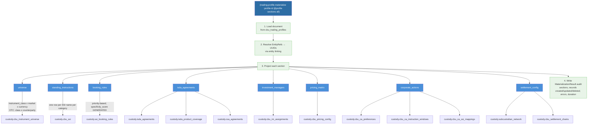

### 5.1 Idempotency

Materialization is idempotent — running it twice with the same document produces the same operational state. The pipeline uses:
- `INSERT ... ON CONFLICT DO UPDATE` for upserts
- Deletion of orphaned rows (removed from document but still in operational table)
- `document_hash` comparison to skip unchanged profiles

### 5.2 Selective Materialization

The `sections` argument allows materializing only specific sections:

```clojure
;; Materialize only SSIs and booking rules (fast, after SSI change)
(trading-profile.materialize :profile-id @profile :sections ["ssis", "booking_rules"])

;; Dry run to preview changes
(trading-profile.materialize :profile-id @profile :dry-run true)
```

---

## 6. Settlement Routing — The Three-Layer Model

Settlement routing follows a three-layer architecture:

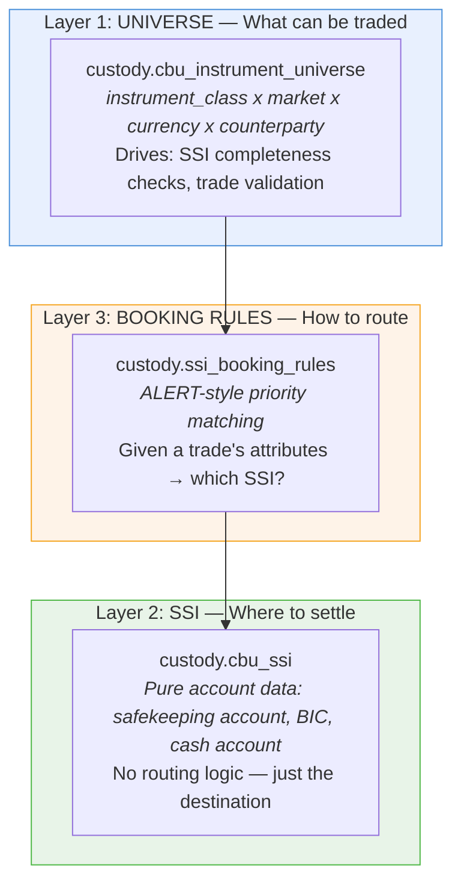

**Booking rule matching example:**

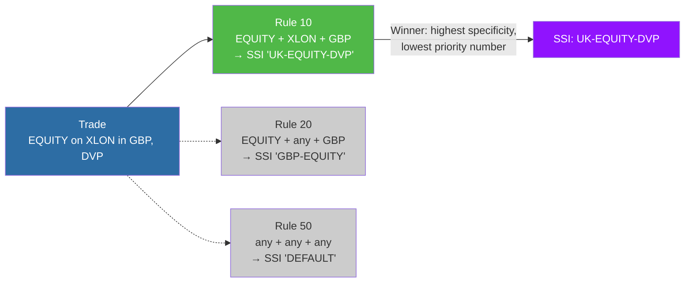

### 6.1 Specificity Score

The `specificity_score` column is a **GENERATED** column computed from which criteria are populated:

```sql
specificity_score INTEGER GENERATED ALWAYS AS (
    CASE WHEN counterparty_entity_id IS NOT NULL THEN 32 ELSE 0 END +
    CASE WHEN instrument_class_id    IS NOT NULL THEN 16 ELSE 0 END +
    CASE WHEN security_type_id       IS NOT NULL THEN  8 ELSE 0 END +
    CASE WHEN market_id              IS NOT NULL THEN  4 ELSE 0 END +
    CASE WHEN currency               IS NOT NULL THEN  2 ELSE 0 END +
    CASE WHEN settlement_type        IS NOT NULL THEN  1 ELSE 0 END
) STORED
```

| Criterion | Weight | Rationale |
|-----------|--------|-----------|
| Counterparty | 32 | OTC-specific, highest specificity |
| Instrument class | 16 | Asset class is primary discriminator |
| Security type | 8 | Sub-class refinement |
| Market | 4 | Market-specific routing |
| Currency | 2 | Currency-specific accounts |
| Settlement type | 1 | DVP vs FOP vs RVP |

A rule matching on `counterparty + instrument_class + market` scores 52 (32+16+4), beating a rule matching only `instrument_class` (score 16).

### 6.2 SSI Lookup Function

The `custody.find_ssi_for_trade()` function implements the ALERT-style lookup:

```sql
SELECT ssi_id, ssi_name, rule_id, rule_name, rule_priority, specificity_score
FROM custody.ssi_booking_rules r
JOIN custody.cbu_ssi s ON r.ssi_id = s.ssi_id
WHERE r.cbu_id = p_cbu_id
  AND r.is_active = true
  AND s.status = 'ACTIVE'
  AND (r.expiry_date IS NULL OR r.expiry_date > CURRENT_DATE)
  -- NULL = wildcard (matches anything)
  AND (r.instrument_class_id IS NULL OR r.instrument_class_id = p_instrument_class_id)
  AND (r.security_type_id    IS NULL OR r.security_type_id    = p_security_type_id)
  AND (r.market_id           IS NULL OR r.market_id           = p_market_id)
  AND (r.currency            IS NULL OR r.currency            = p_currency)
  AND (r.settlement_type     IS NULL OR r.settlement_type     = p_settlement_type)
  AND (r.counterparty_entity_id IS NULL OR r.counterparty_entity_id = p_counterparty_entity_id)
ORDER BY r.priority ASC
LIMIT 1;
```

**Key design:** NULL in a rule column means "matches anything" — this is the wildcard/catch-all pattern from the ALERT settlement matching standard.

---

## 7. ISDA & CSA — OTC Derivatives Infrastructure

### 7.1 Why ISDA/CSA Are Part of the Trading Universe

ISDA master agreements and CSAs are not separate from the trading matrix — they are the **4th dimension**. Without an ISDA in place with a counterparty, a CBU cannot trade OTC derivatives with them. Without a CSA, collateral cannot flow.

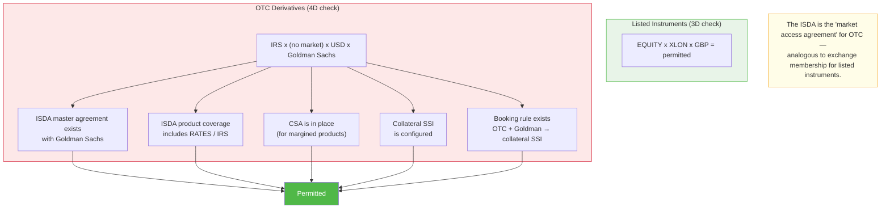

### 7.2 ISDA Data Model

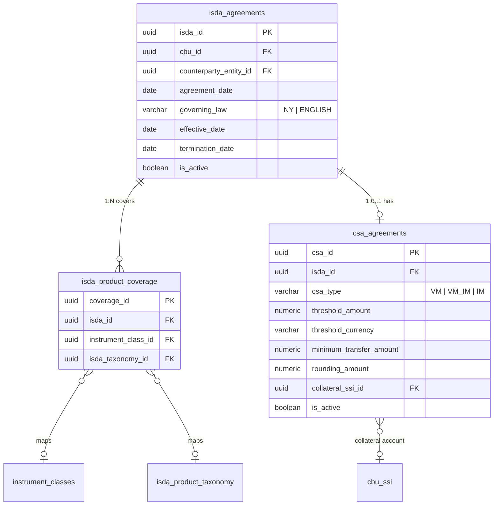

### 7.3 CSA Collateral Flow

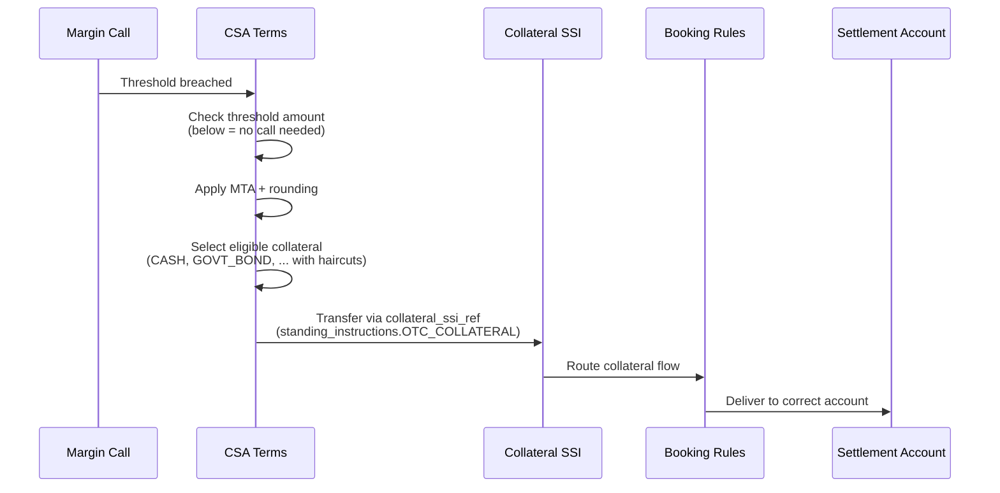

### 7.4 ISDA Product Taxonomy

The `custody.isda_product_taxonomy` table maps ISDA's 5-level classification to our instrument classes:

| Asset Class | Base Product | Sub Product | Maps To |
|-------------|-------------|-------------|---------|
| RATES | IRS | Fixed-Float | `OTC_IRS` / `IRS` |
| RATES | FRA | — | `FRA` |
| RATES | SWAPTION | — | `SWAPTION` |
| FX | FORWARD | — | `FX_FORWARD` |
| FX | SWAP | — | `FX_SWAP` |
| CREDIT | CDS | Single-Name | `CDS` |
| EQUITY | SWAP | Total-Return | `TRS` |

This enables regulatory reporting (UPI codes) and product coverage validation.

---

## 8. Product Overlay System

Products (CUSTODY, PRIME_BROKERAGE, FUND_ACCOUNTING, etc.) add attributes to matrix entries — they don't define the trading universe. The overlay system layers product-specific services on top of the base matrix.

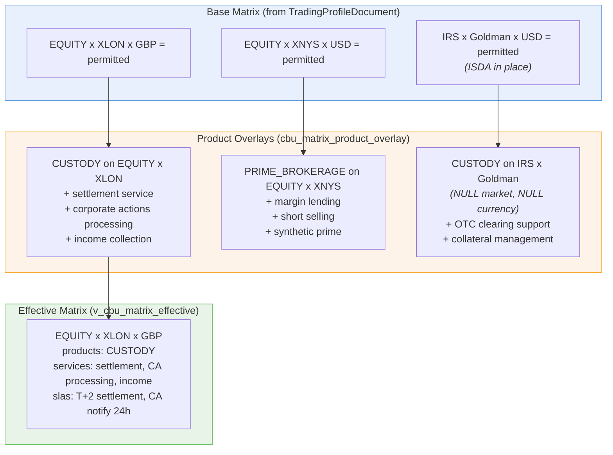

### 8.1 Overlay Table

```sql
CREATE TABLE "ob-poc".cbu_matrix_product_overlay (
    overlay_id              UUID PRIMARY KEY DEFAULT gen_random_uuid(),
    cbu_id                  UUID NOT NULL,
    subscription_id         UUID NOT NULL REFERENCES cbu_product_subscriptions,
    instrument_class_id     UUID REFERENCES custody.instrument_classes,  -- NULL = all
    market_id               UUID REFERENCES custody.markets,             -- NULL = all
    currency                VARCHAR(3),                                   -- NULL = all
    counterparty_entity_id  UUID REFERENCES entities,                    -- NULL = all
    additional_services     JSONB DEFAULT '[]',
    additional_slas         JSONB DEFAULT '[]',
    additional_resources    JSONB DEFAULT '[]',
    product_specific_config JSONB DEFAULT '{}',
    status                  VARCHAR(20) DEFAULT 'ACTIVE',
    -- UNIQUE NULLS NOT DISTINCT for deterministic wildcard matching
    UNIQUE NULLS NOT DISTINCT (cbu_id, subscription_id, instrument_class_id,
                               market_id, currency, counterparty_entity_id)
);
```

**Key design:** `UNIQUE NULLS NOT DISTINCT` means NULL values are treated as equal for uniqueness — so there can be only one overlay per CBU × subscription × (instrument, market, currency, counterparty) combination, even when some dimensions are NULL (wildcard).

---

## 9. Reference Data

### 9.1 Instrument Class Taxonomy (67 Active Classes)

```mermaid
graph TD
    ROOT["Instrument Classes<br/><i>67 active</i>"]

    ROOT --> EQ["EQUITY"]
    EQ --> EQ1["EQUITY_COMMON"]
    EQ --> EQ2["EQUITY_PREFERRED"]
    EQ --> EQ3["EQUITY_ETF"]
    EQ --> EQ4["EQUITY_ADR / GDR"]
    EQ --> EQ5["EQUITY_REIT"]
    EQ --> EQ6["EQUITY_WARRANT / RIGHT"]
    EQ --> EQ7["EQUITY_CONVERTIBLE"]

    ROOT --> FI["FIXED_INCOME"]
    FI --> FI1["GOVT_BOND"]
    FI --> FI2["CORP_BOND"]
    FI --> FI3["MUNI_BOND / COVERED_BOND"]
    FI --> FI4["INFLATION_LINKED_BOND"]
    FI --> FI5["CONVERTIBLE / HIGH_YIELD / SUKUK"]
    FI --> FI6["ABS / MBS / CDO / CLO"]

    ROOT --> MM["MONEY_MARKET"]
    MM --> MM1["MMF / CD / COMMERCIAL_PAPER / T_BILL / REPO"]

    ROOT --> LD["LISTED_DERIVATIVE"]
    LD --> LD1["EQUITY / BOND / INDEX /<br/>COMMODITY / FX FUTURE"]
    LD --> LD2["EQUITY / INDEX /<br/>COMMODITY / FX OPTION"]

    ROOT --> OTC["OTC_DERIVATIVE"]
    OTC --> OTC1["OTC_IRS<br/><i>IRS, FRA, CAP_FLOOR,<br/>SWAPTION, XCCY_SWAP</i>"]
    OTC --> OTC2["OTC_FX<br/><i>FX_FORWARD, FX_SWAP,<br/>FX_OPTION, FX_NDF</i>"]
    OTC --> OTC3["OTC_CDS<br/><i>CDS, TRS, CDX, ITRAXX</i>"]
    OTC --> OTC4["OTC_EQD<br/><i>EQUITY_SWAP, VARIANCE,<br/>DIVIDEND_SWAP</i>"]

    ROOT --> CIS["CIS"]
    CIS --> CIS1["MUTUAL_FUND / ETF /<br/>HEDGE_FUND / PE / RE_FUND"]

    style ROOT fill:#2d6da4,color:#fff
    style EQ fill:#4a90d9,color:#fff
    style FI fill:#50b848,color:#fff
    style MM fill:#f5a623,color:#fff
    style LD fill:#e67e22,color:#fff
    style OTC fill:#d0021b,color:#fff
    style CIS fill:#8e44ad,color:#fff
```

Each class carries:
- `default_settlement_cycle` — T+0 to T+2 (listed) or VARIES (funds)
- `swift_message_family` — MT5xx (securities), MT3xx (FX/derivatives)
- `requires_isda` — true for OTC derivatives
- `requires_collateral` — true for margined products
- `cfi_category` / `cfi_group` — ISO 10962 classification
- `isda_asset_class` — ISDA taxonomy mapping (RATES, CREDIT, FX, EQUITY, COMMODITY)

### 9.2 Markets

Markets are identified by **MIC** (Market Identifier Code, ISO 10383):

| MIC | Name | Country | Primary Currency | CSD BIC |
|-----|------|---------|------------------|---------|
| XNYS | New York Stock Exchange | US | USD | — |
| XNAS | NASDAQ | US | USD | — |
| XLON | London Stock Exchange | GB | GBP | CABORB — |
| XETR | Deutsche Börse (Xetra) | DE | EUR | — |
| XPAR | Euronext Paris | FR | EUR | — |
| XHKG | Hong Kong Exchange | HK | HKD | — |
| XTKS | Tokyo Stock Exchange | JP | JPY | — |

---

## 10. Corporate Actions Policy

The CA policy is authored directly in the JSONB document via `trading-profile.ca.*` verbs, then materialized to operational tables for execution.

### 10.1 Event Type Taxonomy (53 ISO Event Types)

| Category | Events | Examples |
|----------|--------|---------|
| INCOME | Dividend, Interest | DVCA (cash dividend), INTR (interest payment) |
| REORGANIZATION | Merger, Split, Reverse Split | MRGR, SPLF, SPLR |
| VOLUNTARY | Tender Offer, Rights, Exchange | TEND, RHTS, EXOF |
| MANDATORY | Name Change, Conversion | CHAN, CONV |
| INFORMATION | Notice, Meeting | MEET, REDO |

### 10.2 Processing Modes

| Mode | Behavior |
|------|----------|
| `AUTO_INSTRUCT` | System makes election automatically using default |
| `MANUAL` | Human intervention required for every election |
| `DEFAULT_ONLY` | Use default if simple, escalate if complex |
| `THRESHOLD` | Auto below threshold, manual above |

### 10.3 Cutoff Rules

Deadline management with market/depository-specific internal cutoffs:

```yaml
cutoff_rules:
  - event_type: TEND
    market_code: XLON
    days_before: 5        # Internal cutoff: 5 days before market deadline
    warning_days: 3       # Warning notification 3 days before cutoff
    escalation_days: 1    # Escalation 1 day before cutoff
```

---

## 11. Additional Operational Tables

### 11.1 Settlement Chains

Multi-hop settlement chains define the intermediary path for complex markets:


| Table | Purpose |
|-------|---------|
| `custody.cbu_settlement_chains` | Chain definition per market/instrument/currency |
| `custody.settlement_chain_hops` | Individual intermediaries in sequence |

### 11.2 Tax Infrastructure

| Table | Purpose |
|-------|---------|
| `custody.tax_jurisdictions` | Tax jurisdictions with withholding rates and reclaim rules |
| `custody.tax_treaty_rates` | Bilateral treaty rates by income type |
| `custody.cbu_tax_status` | CBU tax status per jurisdiction (FATCA/CRS/QI) |
| `custody.cbu_tax_reporting` | Reporting obligations (FATCA, CRS, DAC6, etc.) |
| `custody.cbu_tax_reclaim_config` | Tax reclaim processing rules |

### 11.3 Cash Sweep

| Table | Purpose |
|-------|---------|
| `custody.cbu_cash_sweep_config` | Idle cash investment rules (STIF, MMF, overnight repo) |

---

## 12. DSL Verb Coverage

### 12.1 Trading Profile Verbs (47 verbs)

| Category | Verbs | Count |
|----------|-------|-------|
| **Lifecycle** | `import`, `read`, `get-active`, `list-versions`, `create-draft`, `clone-to`, `create-new-version`, `activate`, `submit`, `approve`, `reject`, `archive` | 12 |
| **Universe** | `add-instrument-class`, `remove-instrument-class`, `add-market`, `remove-market`, `set-base-currency`, `add-allowed-currency` | 6 |
| **SSI** | `add-standing-instruction`, `remove-standing-instruction` | 2 |
| **Booking Rules** | `add-booking-rule`, `remove-booking-rule` | 2 |
| **ISDA/CSA** | `add-isda-config`, `remove-isda-config`, `add-isda-coverage`, `add-csa-config`, `remove-csa-config`, `add-csa-collateral`, `link-csa-ssi` | 7 |
| **IM Mandates** | `add-im-mandate`, `update-im-scope`, `remove-im-mandate` | 3 |
| **Validation** | `validate-go-live-ready`, `validate-universe-coverage` | 2 |
| **Projection** | `materialize`, `diff` | 2 |
| **CA Policy** | `ca.enable-event-types`, `ca.disable-event-types`, `ca.set-notification-policy`, `ca.set-election-policy`, `ca.set-default-option`, `ca.remove-default-option`, `ca.add-cutoff-rule`, `ca.remove-cutoff-rule`, `ca.link-proceeds-ssi`, `ca.remove-proceeds-ssi`, `ca.get-policy` | 11 |

### 12.2 Product & Matrix Overlay Verbs (14 verbs)

| Category | Verbs | Count |
|----------|-------|-------|
| **Subscription** | `product-subscription.subscribe`, `unsubscribe`, `suspend`, `reactivate`, `list` | 5 |
| **Overlay CRUD** | `matrix-overlay.add`, `remove`, `suspend`, `activate`, `list`, `list-by-subscription` | 6 |
| **Analysis** | `matrix-overlay.effective-matrix`, `unified-gaps`, `compare-products` | 3 |

### 12.3 Total Verb Count: 61

---

## 13. DSL Examples

### 13.1 Create and Configure a Trading Profile

```clojure
;; Create a new draft profile for a CBU
(trading-profile.create-draft :cbu-id <Allianz IE ETF SICAV> :as @profile)

;; Define the universe
(trading-profile.set-base-currency :profile-id @profile :currency "EUR")
(trading-profile.add-allowed-currency :profile-id @profile :currency "USD")
(trading-profile.add-allowed-currency :profile-id @profile :currency "GBP")

(trading-profile.add-instrument-class :profile-id @profile :class-code "EQUITY"
    :cfi-prefixes ["ES" "EP"])
(trading-profile.add-instrument-class :profile-id @profile :class-code "GOVT_BOND"
    :cfi-prefixes ["DB"])

(trading-profile.add-market :profile-id @profile :instrument-class "EQUITY" :mic "XLON")
(trading-profile.add-market :profile-id @profile :instrument-class "EQUITY" :mic "XNYS")
(trading-profile.add-market :profile-id @profile :instrument-class "EQUITY" :mic "XETR")
```

### 13.2 Configure SSIs and Booking Rules

```clojure
;; Add standing settlement instructions
(trading-profile.add-standing-instruction :profile-id @profile
    :ssi-type "SECURITIES" :ssi-name "UK-EQUITY-DVP"
    :safekeeping-account "12345" :safekeeping-bic "BNYGB2L"
    :cash-account "67890" :cash-bic "BNYGB2L"
    :cash-currency "GBP")

(trading-profile.add-standing-instruction :profile-id @profile
    :ssi-type "SECURITIES" :ssi-name "US-EQUITY-DVP"
    :safekeeping-account "23456" :safekeeping-bic "BNYAUS33"
    :cash-account "78901" :cash-bic "BNYAUS33"
    :cash-currency "USD")

;; Add ALERT-style booking rules
(trading-profile.add-booking-rule :profile-id @profile
    :rule-name "UK Equities" :priority 10 :ssi-ref "UK-EQUITY-DVP"
    :match-instrument-class "EQUITY" :match-mic "XLON" :match-currency "GBP")

(trading-profile.add-booking-rule :profile-id @profile
    :rule-name "US Equities" :priority 20 :ssi-ref "US-EQUITY-DVP"
    :match-instrument-class "EQUITY" :match-mic "XNYS" :match-currency "USD")
```

### 13.3 Add OTC Derivatives (ISDA + CSA)

```clojure
;; Add ISDA master agreement with Goldman Sachs
(trading-profile.add-isda-config :profile-id @profile
    :counterparty-entity-id <Goldman Sachs>
    :counterparty-name "Goldman Sachs International"
    :governing-law "ENGLISH" :agreement-date "2024-01-15")

;; Add product coverage (what can be traded under this ISDA)
(trading-profile.add-isda-coverage :profile-id @profile
    :isda-ref "Goldman Sachs International"
    :asset-class "RATES" :base-products ["IRS" "FRA"])

;; Add CSA (collateral agreement)
(trading-profile.add-csa-config :profile-id @profile
    :isda-ref "Goldman Sachs International"
    :csa-type "VM" :threshold-currency "USD"
    :threshold-amount 10000000 :minimum-transfer-amount 500000)

;; Add collateral SSI
(trading-profile.add-standing-instruction :profile-id @profile
    :ssi-type "OTC_COLLATERAL" :ssi-name "GS-COLLATERAL"
    :safekeeping-account "COL001" :safekeeping-bic "GOLDGB2L"
    :cash-account "COL002" :cash-bic "GOLDGB2L")

;; Link CSA to collateral SSI
(trading-profile.link-csa-ssi :profile-id @profile
    :counterparty-ref "Goldman Sachs International"
    :ssi-name "GS-COLLATERAL")
```

### 13.4 Configure Corporate Actions Policy

```clojure
;; Enable CA event types
(trading-profile.ca.enable-event-types :profile-id @profile
    :event-types ["DVCA" "DVOP" "RHTS" "TEND" "MRGR"])

;; Set notification policy
(trading-profile.ca.set-notification-policy :profile-id @profile
    :channels ["email" "portal"] :sla-hours 24
    :escalation-contact "ops@fund.com")

;; Set default elections
(trading-profile.ca.set-default-option :profile-id @profile
    :event-type "DVCA" :default-option "CASH")
(trading-profile.ca.set-default-option :profile-id @profile
    :event-type "DVOP" :default-option "STOCK")

;; Add cutoff rules for UK market
(trading-profile.ca.add-cutoff-rule :profile-id @profile
    :market-code "XLON" :days-before 5 :warning-days 3)
```

### 13.5 Activate and Materialize

```clojure
;; Validate readiness
(trading-profile.validate-go-live-ready :profile-id @profile :strictness "STRICT")

;; Submit for approval
(trading-profile.submit :profile-id @profile :submitted-by "ops-team")

;; Client approves
(trading-profile.approve :profile-id @profile :approved-by "client-pm")

;; Materialize to operational tables
(trading-profile.materialize :profile-id @profile)
```

---

## 14. Entity Relationship Diagram


---

## 15. Key Views

### 15.1 v_cbu_matrix_effective

Joins the base universe with product overlays to produce the effective trading matrix:

```sql
-- Simplified structure
WITH matrix_base AS (
    SELECT u.*, ic.code AS instrument_class, m.mic AS market, e.name AS counterparty_name
    FROM custody.cbu_instrument_universe u
    JOIN custody.instrument_classes ic ON ic.class_id = u.instrument_class_id
    LEFT JOIN custody.markets m ON m.market_id = u.market_id
    LEFT JOIN entities e ON e.entity_id = u.counterparty_entity_id
    WHERE u.is_active = true
),
product_overlays AS (
    SELECT o.*, p.product_code, p.product_name
    FROM cbu_matrix_product_overlay o
    JOIN cbu_product_subscriptions s ON s.subscription_id = o.subscription_id
    JOIN products p ON p.product_id = s.product_id
    WHERE o.status = 'ACTIVE' AND s.status = 'ACTIVE'
)
SELECT
    mb.*,
    COALESCE(array_agg(DISTINCT po.product_code), '{}') AS products,
    COALESCE(jsonb_agg(po.additional_services), '[]') AS combined_services
FROM matrix_base mb
LEFT JOIN product_overlays po ON mb.cbu_id = po.cbu_id
    AND (po.instrument_class_id IS NULL OR po.instrument_class_id = mb.instrument_class_id)
    AND (po.market_id IS NULL OR po.market_id = mb.market_id)
    AND (po.currency IS NULL OR po.currency = ANY(mb.currencies))
    AND (po.counterparty_entity_id IS NULL OR po.counterparty_entity_id = mb.counterparty_entity_id)
GROUP BY mb.*;
```

---

## 16. Completeness Summary

### 16.1 Schema Coverage

| Domain | Tables | Key Tables |
|--------|--------|------------|
| Reference Data | 5 | `instrument_classes`, `markets`, `security_types`, `settlement_locations`, `isda_product_taxonomy` |
| Trading Profile | 2 | `cbu_trading_profiles`, `trading_profile_materializations` |
| Universe | 1 | `cbu_instrument_universe` |
| Settlement | 6 | `cbu_ssi`, `ssi_booking_rules`, `cbu_settlement_chains`, `settlement_chain_hops`, `cbu_settlement_location_preferences`, `subcustodian_network` |
| SSI Overrides | 1 | `cbu_ssi_agent_override` |
| OTC/ISDA | 3 | `isda_agreements`, `isda_product_coverage`, `csa_agreements` |
| IM Assignments | 1 | `cbu_im_assignments` |
| Pricing | 1 | `cbu_pricing_config` |
| Corporate Actions | 4 | `ca_event_types`, `cbu_ca_preferences`, `cbu_ca_instruction_windows`, `cbu_ca_ssi_mappings` |
| Tax | 5 | `tax_jurisdictions`, `tax_treaty_rates`, `cbu_tax_status`, `cbu_tax_reporting`, `cbu_tax_reclaim_config` |
| Cash | 1 | `cbu_cash_sweep_config` |
| Entity Settlement | 2 | `entity_settlement_identity`, `entity_ssi` |
| Cross-Border | 1 | `cbu_cross_border_config` |
| Product Overlay | 2 | `cbu_product_subscriptions`, `cbu_matrix_product_overlay` |
| **Total** | **35** | |

### 16.2 Verb Coverage

| Domain | Verb Count | Coverage |
|--------|-----------|----------|
| `trading-profile` | 47 | Full lifecycle + authoring + CA policy |
| `product-subscription` | 5 | Subscription CRUD |
| `matrix-overlay` | 9 | Overlay CRUD + analysis |
| **Total** | **61** | |

### 16.3 Rust Type Coverage

| Type | File | Purpose |
|------|------|---------|
| `TradingProfileDocument` | `trading_profile/types.rs` | Root document type |
| `Universe` | `trading_profile/types.rs` | Trading universe config |
| `InstrumentClassConfig` | `trading_profile/types.rs` | Instrument class entry |
| `MarketConfig` | `trading_profile/types.rs` | Market entry |
| `BookingRule` | `trading_profile/types.rs` | ALERT-style routing rule |
| `StandingInstruction` | `trading_profile/types.rs` | SSI account data |
| `IsdaAgreementConfig` | `trading_profile/types.rs` | ISDA master agreement |
| `CsaConfig` | `trading_profile/types.rs` | Credit Support Annex |
| `InvestmentManagerMandate` | `trading_profile/types.rs` | IM mandate with scope |
| `PricingRule` | `trading_profile/types.rs` | Pricing source hierarchy |
| `MaterializationResult` | `trading_profile/types.rs` | Audit record |
| `ProfileStatus` | `trading_profile/types.rs` | Status state machine |
| `EntityRef` | `trading_profile/types.rs` | Portable entity reference |

---

## 17. Open Design Questions (For Peer Review)

1. **Tax materialization**: The tax tables (`cbu_tax_status`, `cbu_tax_reporting`, `cbu_tax_reclaim_config`) exist but are not yet included in the `TradingProfileDocument`. Should tax configuration be added as a document section, or remain as direct operational table writes?

2. **Cash sweep materialization**: `cbu_cash_sweep_config` is partially in the document (`pricing_matrix`, `valuation_config`) but the actual sweep vehicle config is not. Should cash sweep be a document section?

3. **Settlement chain authoring**: Settlement chains (`cbu_settlement_chains`, `settlement_chain_hops`) are complex multi-hop structures. Should they be authored in the document or via dedicated verbs that write directly to operational tables?

4. **Cross-border config**: `cbu_cross_border_config` (bridge vs direct vs ICSD routing) is not yet in the document. This is market-pair-specific routing that could be part of settlement_config.

5. **Entity SSI integration**: `custody.entity_ssi` (counterparty-level SSIs) exists separately from CBU SSIs. Should the document reference entity SSIs for OTC booking rules?

6. **Multi-version materialization**: Currently only the ACTIVE profile is materialized. Should we support materializing a DRAFT for "what-if" analysis in a sandbox schema?

---

## Appendix A: Related Architecture Documents

| Document | Location | Coverage |
|----------|----------|----------|
| Trading Matrix Database Architecture v1.1 | `migrations/TRADING_MATRIX_DATABASE_ARCHITECTURE_v1_1.md` | Schema-level detail, ER diagrams, key queries |
| Schema Entity Overview | `migrations/OB_POC_SCHEMA_ENTITY_OVERVIEW.md` | Full schema overview with mermaid diagrams |
| Verb Definition Spec | `docs/verb-definition-spec.md` | YAML verb authoring guide |
| ob-agentic Pipeline | CLAUDE.md §Structured Onboarding Pipeline | Multi-entity onboarding with universe derivation |

## Appendix B: Seed Data

A complete seed profile exists at:
```
rust/config/seed/trading_profiles/allianzgi_complete.yaml
```

This demonstrates a multi-asset global fund with:
- 11 markets (XETR, XLON, XSWX, XPAR, XAMS, XNYS, XNAS, XHKG, XTKS, XASX, XSES)
- 5 instrument classes (EQUITY, GOVT_BOND, CORP_BOND, ETF, OTC_DERIVATIVE)
- 8 currencies (EUR, USD, GBP, CHF, JPY, HKD, SGD, AUD)
- Multiple IM mandates with priority-based scope
- ISDA agreements with CSA and collateral SSI references
- ALERT-style booking rules with priority ordering
- Full pricing matrix and corporate actions policy
