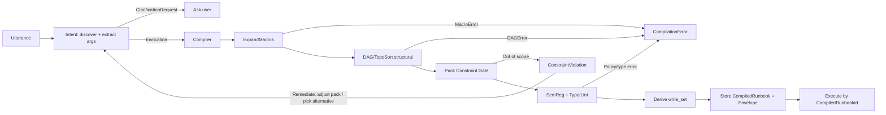

# Macro Expansion as a Compiler Phase — Deterministic Preprocessor for Runbook Truth (v0.6)

**Status:** Draft — mini architecture paper (normative)  
**Audience:** OB‑POC Semantic OS / REPL + Chat runtime owners  
**Date:** 2026‑02‑16  
**Revision:** v0.6 — defines `canonical()` serialization strategy; adds phase dependency graph; states replay‑under‑schema‑evolution rule; sets default locking policy (pessimistic + timeout); adds Claude Code implementation hints per phase for AI‑assisted development.

---

## 1. Vision

Treat **macros as compiler sugar** — a deterministic preprocessor that expands composite operations into atomic DSL steps **before** a runbook is accepted for execution.

> **Invariant:** The only executable truth is the **compiled runbook**.  
> A macro invocation is never executed; it is expanded into DSL and disappears, leaving only atomic steps.

This preserves:
- determinism (same inputs → same expanded steps),
- replayability (expanded artefact + envelope),
- auditability (expansion digest + resolved bindings),
- governance (packs + SemReg applied to *real* steps).

**System‑wide enforcement:** applies to **REPL and Chat** — no pathway may execute raw DSL that is not represented by a `CompiledRunbookId`.

---

## 2. Scope

This paper defines:

- the boundary between **intent selection** and **compilation**
- macro expansion as a **compiler phase** (not intent)
- the error model and validation order
- pack↔macro alignment (shared metadata + event flow)
- write‑set derivation as a prerequisite for entity UUID locking
- storage + ID/versioning semantics (runbook retrievability + idempotency)
- end‑to‑end cut‑over strategy (REPL + Chat, one path)
- end‑to‑end acceptance tests
- canonicalization and locking policy defaults

Out of scope:
- UI rendering details beyond the response contract
- full durable workflow/BPMN semantics (except that park/resume must remain runbook‑representable)
- detailed YAML authoring conventions (except where needed for subject bindings + pack alignment metadata)

---

## 3. Why expansion "near intent" is wrong (risk taxonomy)

Expanding macros near intent creates systemic risks:

1) **Bypass risk** — expansion becomes a special path and raw DSL gets executed directly.  
2) **Governance drift** — packs/SemReg get applied to macro names, not expanded steps.  
3) **DAG correctness risk** — macros span multiple entity transforms; only the compiler sees the full step graph.  
4) **Replay ambiguity** — if expansion depends on session context, replay becomes non‑deterministic unless pinned.

---

## 4. Required Capabilities

### 4.1 Intent layer: select, extract args, clarify
Intent may:
- discover and rank primitive verbs and macros,
- extract arguments using schemas,
- request clarification for missing/ambiguous args.

Intent outputs one of:
- `PrimitiveInvocation { verb_fqn, args }`
- `MacroInvocation { macro_fqn, args }`
- `ClarificationRequest { ... }`

**Intent does not expand.**

### 4.2 Compiler: ExpandMacros pass
Compiler accepts an invocation plan and must:
- expand macro invocations into atomic DSL steps,
- produce an expanded candidate plan for validation,
- record macro expansion evidence in the replay envelope (see §9.2).

### 4.3 Execution safety: governance, DAG, locking inputs
Compiler must apply (in the order defined in §6):
- structural validation (DAG/toposort and dependency sanity),
- pack constraint gate,
- SemReg checks,
- `write_set` derivation for entity UUID locking.

### 4.4 Artefacts (authoritative)
The compiler emits two authoritative artefacts:

- `CompiledRunbook { id, steps, status, created_at, … }`
- `ReplayEnvelope { snapshot_cursor, bindings, pinned_lookups, macro_audit, … }`

**Note:** `MacroExpansionAudit` is not a separate artefact; it is a required field inside the envelope (`macro_audit`).

---

## 5. Pack ↔ Macro Alignment (close coupling without semantic collapse)

Macros are tightly aligned to pack scenarios and "context drill‑down" — they are adjacent in workflow.

### 5.1 The rule
> Packs may **reference and prioritize** macros, but packs must not **contain executable expansions**.

- Packs are control plane (constraints + guidance + progress).
- Macros are execution plane (compile sugar → expanded steps).

### 5.2 Shared metadata (single vocabulary layer)

Add pack-aware metadata to macro schemas:

- `pack.scenarios[]` / `pack.stage` — canonical usage
- `intent.synonyms[]` / `intent.keywords[]` — ranking bias in that stage
- `preconditions` — required session facts (focus bindings, required entities)
- `produces.events[]` — events indicating "macro expansion + execution satisfied stage gate"
- `subject_kinds[]` — aligns with verb contract subject vocab (see §10; same `EntityKind` taxonomy)

And add macro references to pack stage definitions:

- `recommended_macros[]` (ordered)
- stage `constraints` (allowed domains/entity kinds)
- `complete_on_events[]` (gate conditions)

### 5.3 Close the loop with session events
1) Pack stage narrows + biases candidates  
2) Intent selects a macro (often because pack recommended it)  
3) Compiler expands macro → atomic runbook steps  
4) Execution emits session events  
5) Pack Manager advances stage gates from those events

No special cases. No bypass.

---

## 6. Macro Expansion Pipeline (select near intent, expand near compiler)

### 6.1 Two-stage flow (with error/rejection paths)



### 6.2 Validation order (normative)
1) expand macros  
2) DAG/toposort (structural)  
3) pack constraint gate (scope)  
4) SemReg + lint/type checks (semantic)  
5) derive `write_set` (locking input)  
6) store compiled artefact + envelope

---

## 7. Compiler Outcomes and UX Flow (normative)

Compilation is **all-or-nothing**. Partial expansion is not accepted into a compiled runbook.

The compile surface returns one of:

- `ClarificationRequest { question, missing_fields, context }`  
  Returned to the user. Intent resumes after clarification.

- `ConstraintViolation { explanation, expanded_plan?, active_constraints, remediation_options }`  
  Returned to the user **and** used as a negative signal to intent ranking. The system should offer remediation options:
  - widen/suspend/deactivate pack,
  - select alternative macro/verb set,
  - change entity scope.

- `CompilationError { kind, message, location?, details? }`  
  Returned to the user (operator‑grade diagnostics). Not a clarification; it is a plan build failure.

- `CompiledRunbook { id, session_version, preview, envelope_refs }`  
  Ready to execute via the runbook gate (§11).

### 7.1 Required compiler error kinds
- `UnknownMacro` / `UnknownVerbInMacro`
- `MacroCycle` (macro nesting recursion/cycle)
- `ArgTypeMismatch` / `MissingRequiredArg`
- `DAGCycle` / `UnresolvedDependency`
- `SemRegViolation`
- `InternalError` (must still be safe)

---

## 8. Macro Composition Rules and Limits (normative)

Macros **may nest** only if:
- expansion is resolved by repeated `ExpandMacros` until fixpoint,
- with limits:
  - `max_expansion_depth` (default 8)
  - `max_expanded_steps` (default 500)
- with cycle detection on the macro reference graph (`MacroCycle`).

**Configuration semantics (auditable):**
- limits are compiler configuration (per environment), not per-macro overrides,
- values must be logged at compile time and persisted into the envelope (so replay has the same guardrails).

If you want simpler semantics, enforce "macros expand to primitives only" and treat nested macros as errors. Either policy is acceptable; pick one and encode it. (Default here: nesting allowed with limits.)

---

## 9. Determinism Boundary and Replay Envelope

### 9.1 ResolutionContext (recommended)
Where compilation needs session context (autofill, focus bindings, pinned lookups), pass an explicit:

`ResolutionContext { snapshot_cursor, focus_bindings, pinned_lookups, now?, operator? }`

This makes the determinism boundary obvious:
- expansion reads from `ResolutionContext`,
- compiler persists resolved values into the envelope,
- replay reuses the envelope; it does not re‑resolve.

### 9.2 MacroExpansionAudit in the envelope (required)
The envelope must contain:

`macro_audit { macro_fqn, params, resolved_autofill, resolved_bindings, digest, expansion_limits }`

So replay is:
- "execute expanded artefact under pinned envelope"
- never "re‑expand with new state".

### 9.3 Replay under schema evolution
Replay always uses the **stored compiled artefact**. It never re‑expands from macro schemas.

If macro schemas or verb contracts have been updated since compilation, re‑compilation under current schemas produces a **new artefact with a distinct content‑addressed ID** (see §12.2). This is correct behavior — the two artefacts are different compilations and are tracked independently.

To "re‑run with updated schemas": re‑compile from the original invocation, producing a new ID, then execute the new artefact. Never mutate or overwrite the original.

---

## 10. write_set Strategy (normative target)

`write_set` is load‑bearing for correctness. The target state is **contract‑driven extraction**:

- Each primitive verb has a contract describing:
  - subject kinds, required subject bindings, and which args identify subjects.
- The compiler derives `CompiledStep.write_set` from the expanded step's **resolved subject bindings** according to those contracts.

Phaseable implementation:
- Phase A: heuristic UUID extraction from args (bootstrap only)
- Phase B (target): contract-driven subject extraction
- Macro schemas may declare subject-binding rules to ensure expanded steps expose subjects

This aligns with the `subject_kinds[]` vocabulary on macros (§5.2): same entity kind taxonomy, different layer.

---

## 11. System‑wide Execution Gate (REPL + Chat)

To make the invariant enforceable:

- Execution must accept **only** a `CompiledRunbookId` (or `{session_id, session_version}`) plus cursor/range.
- Runtime must reject:
  - executing a verb directly,
  - executing a macro directly,
  - executing an in-memory DSL string not persisted as a compiled runbook.

**Operational requirement:** both Chat and REPL call the same executor surface. Any "combined_dsl" generator behavior must be removed or forced through compile → store → execute by ID.

---

## 12. Storage, IDs, Versioning, and Idempotency (normative decisions)

A runbook ID is only meaningful if it is retrievable. For regulated finance, compiled artefacts must be durable and auditable.

### 12.1 Storage decision (normative default)
**Default:** persistent, append‑only storage in Postgres for:

- compiled runbooks (steps + status),
- replay envelopes,
- session mapping to compiled IDs (version history),
- execution events.

**Why:** durability across restarts, auditability, and replay requirements.

In-memory stores are acceptable only for local dev and must be feature-gated.

### 12.2 CompiledRunbookId strategy (normative default)
**Default:** content-addressed ID:

- `CompiledRunbookId = hash(canonical(expanded_steps) + canonical(envelope_core))`

Where `envelope_core` excludes volatile fields like timestamps, but includes:
- resolved bindings
- pinned lookups digests
- macro audit digest + limits

**Benefits:**
- natural idempotency (same inputs → same ID),
- deduplication,
- "re-run that" can mean "execute the same compiled artefact again".

### 12.3 Canonicalization strategy (normative)

`canonical()` must produce **byte‑identical output** for semantically identical inputs across serialization runs.

**Default:** deterministic binary serialization via `bincode` with the following rules:
- struct fields serialized in declaration order (Rust `#[derive(Serialize)]` guarantees this),
- maps/sets serialized in sorted‑key order (use `BTreeMap`/`BTreeSet`, never `HashMap`/`HashSet` in canonical types),
- no floating‑point fields in canonical types (use fixed‑point or string representations),
- enum variants serialized by discriminant.

**Hash function:** SHA‑256 truncated to 128 bits (collision-resistant, compact).

**Implementation constraint:** types that participate in `canonical()` must be in a dedicated `canonical` module with a `#[cfg(test)]` round‑trip property test asserting `canonical(x) == canonical(deserialize(canonical(x)))`.

### 12.4 Session versioning (also required)
Even with content-addressed IDs, operators want session-local ordering.

Each session maintains a monotonic `session_version` counter:

- `session_version -> CompiledRunbookId` mapping persisted in DB
- compilation returns both:
  - `CompiledRunbookId` (global content address)
  - `session_version` (session ordering)

### 12.5 TTL / retention policy (explicit)
- compiled artefacts + envelopes are append-only
- retention is policy-controlled:
  - dev: TTL allowed (e.g., 7 days)
  - prod/reg: retention per compliance (months/years)
- deletion, if allowed, must be auditable (tombstones, not silent removal)

---

## 13. Entity Locking Policy (normative default)

Execution acquires entity locks from the compiled `write_set` before running steps.

**Default policy: pessimistic locking with timeout + audit trail.**

- Before execution, acquire exclusive locks on all entity UUIDs in `write_set`.
- Lock acquisition has a configurable timeout (default: 30s).
- On timeout: fail the execution with `LockTimeout { entity_ids, holder_runbook_id? }`.
- On success: hold locks for the duration of the runbook execution; release on commit/abort.
- All lock acquisitions and releases are logged to the execution event stream (audit).

**Why pessimistic:** for regulated finance, optimistic conflict detection risks partial execution followed by rollback. Pessimistic locking with timeout is simpler to reason about, audit, and explain to compliance.

Optimistic locking may be introduced later for read‑heavy workflows where contention is low, but pessimistic is the normative default.

---

## 14. Cut‑over Strategy (one path, no partial adoption)

The correct constraint: **this must become one path end-to-end**.

### 14.1 Strategy A — Big‑bang cut‑over (single PR)
- land compile/store/execute gate surfaces
- rewire Chat and REPL to route all execution through the gate
- delete raw DSL execution in the same PR
- update harnesses to compile→store→execute by ID

### 14.2 Strategy B — Feature flag with atomic flip (recommended operationally)
- land vnext behind `RUNBOOK_GATE_VNEXT`
- wire **both** Chat and REPL to support vnext without enabling by default
- add E2E tests that run with the flag enabled
- flip the flag once both paths are wired and tests pass
- delete legacy raw execution immediately after the flip

This preserves "no partial adoption": either the flag is on everywhere or off everywhere.

---

## 15. End‑to‑End Acceptance Tests (non‑negotiable)

Add tests that fail if any raw execution survives:

1) **Chat path:** utterance → compile/store → returns `CompiledRunbookId` → execute by ID  
2) **REPL path:** adding step compiles to stored artefact; execute loop runs by ID  
3) **Negative:** any attempt to execute raw DSL via legacy executor is rejected / unreachable  
4) **ConstraintViolation loop:** out‑of‑scope macro expansion returns CV; intent re-ranks alternatives under same pack  
5) **Macro nesting:** depth/step limits enforced; cycles produce `MacroCycle`  
6) **DAG cycle:** expanded plan with cycle yields `DAGCycle` before SemReg work  
7) **Locking:** concurrent executions touching same entity block on timeout; audit events emitted; holder ID reported  
8) **Replay:** compiled artefact + envelope replays deterministically (pinned lookups, no re‑expansion)  
9) **Idempotency:** same invocation + same ResolutionContext produces same CompiledRunbookId  
10) **Schema evolution:** re‑compilation under updated macro schemas yields distinct ID from original

---

## 16. Implementation Outline (phaseable)

### Phase dependency graph

Phases are logical groupings. Implementation dependencies exist across them:

```
Phase 0 (surfaces)
  ├── Phase 1 (expand macros)
  │     └── Phase 2 (DAG validation)
  │           └── Phase 3 (governance)
  │                 └── Phase 4 (write_set)
  └── Phase 5 (storage + IDs) ← required by Phase 6; useful as early as Phase 2 for integration tests
        └── Phase 6 (system gate)
```

**Recommendation:** implement Phase 5 (storage) in parallel with Phases 1–2, so that Phase 3+ can integration‑test against real persistence. Phase 6 (gate enforcement) is last because it requires everything upstream.

### Phase 0 — One compile surface + one execute surface
- `compile_invocation(ctx: ResolutionContext, invocation: Invocation) -> OrchestratorResponse`
- `execute_runbook(compiled_runbook_id: CompiledRunbookId, cursor: Option<Cursor>) -> ExecutionResult`

### Phase 1 — ExpandMacros + nesting limits
- expand until fixpoint with `max_depth/max_steps`
- record macro audit (digest + resolved bindings + limits) into envelope

### Phase 2 — Structural validation early
- build DAG + toposort
- fail fast on `DAGCycle` / `UnresolvedDependency`

### Phase 3 — Governance + scope
- PackConstraintGate on expanded steps
- SemReg on each step

### Phase 4 — write_set (bootstrap → target)
- bootstrap UUID extraction from args
- migrate to contract-driven extraction (target)

### Phase 5 — Storage + IDs + version mapping
- persist compiled artefacts + envelopes (append-only Postgres)
- content-addressed IDs via `canonical()` + SHA-256 (§12.3)
- session version mapping
- retention policy enforcement

### Phase 6 — System‑wide gate enforcement (Chat + REPL)
- route **all** execution through `execute_runbook`
- forbid raw DSL execution outside the gate (grep-findable violations)
- delete legacy execution paths

---

## 17. Claude Code Implementation Hints

This section provides per‑phase guidance for AI‑assisted implementation via Claude Code. Each phase is scoped to be completable in a single session with clear inputs, outputs, and acceptance criteria.

> **General rules for Claude Code on this project:**
> - All types use `#[derive(Debug, Clone, Serialize, Deserialize)]` unless there is an explicit reason not to.
> - Use `thiserror` for error enums, `anyhow` only at binary boundaries.
> - All new modules get unit tests in the same file (`#[cfg(test)] mod tests`).
> - SQLx queries use compile‑time checked macros (`sqlx::query!` / `sqlx::query_as!`).
> - No `unwrap()` in library code. Use `?` propagation or explicit error variants.
> - Run `cargo test` after every file change and fix failures before proceeding.
> - **→ IMMEDIATELY proceed to the next sub‑task after completing each one. Do not stop after the first file.**

### 17.1 Phase 0 — Compile + Execute surfaces

**Goal:** Define the two entry‑point functions and the `OrchestratorResponse` / `ExecutionResult` enums. No logic yet — just types and routing stubs.

**Inputs:** existing crate structure, existing session types.

**Tasks:**
1. Create `src/compiler/mod.rs` (or extend existing compiler module) with:
   - `pub fn compile_invocation(ctx: ResolutionContext, invocation: Invocation) -> Result<OrchestratorResponse>`
   - stub that returns `OrchestratorResponse::CompilationError` with `kind: InternalError` and message "not yet implemented"
2. Create `src/executor/gate.rs` with:
   - `pub fn execute_runbook(id: CompiledRunbookId, cursor: Option<Cursor>) -> Result<ExecutionResult>`
   - stub returning error
3. Define enum types in `src/compiler/types.rs`:
   - `Invocation` (PrimitiveInvocation | MacroInvocation)
   - `OrchestratorResponse` (ClarificationRequest | ConstraintViolation | CompilationError | CompiledRunbook)
   - `CompilationErrorKind` (UnknownMacro, UnknownVerbInMacro, MacroCycle, ArgTypeMismatch, MissingRequiredArg, DAGCycle, UnresolvedDependency, SemRegViolation, InternalError)
   - `ResolutionContext` struct
   - `CompiledRunbookId` newtype over `[u8; 16]`
4. Wire `compile_invocation` into the existing orchestrator dispatch (Chat + REPL call sites) behind `RUNBOOK_GATE_VNEXT` feature flag — both paths should call compile but fall back to legacy when flag is off.

**Acceptance:** `cargo test` passes; types compile; stubs are callable from both Chat and REPL orchestrator paths.

**Claude Code prompt hint:**
```
Read this paper: MACRO_EXPANSION_COMPILER_PHASE_PAPER_v0_6.md §4, §7, §9.1, §16 Phase 0.
Create the type definitions and stub functions described in §17.1.
Use thiserror for CompilationErrorKind. Add #[cfg(test)] round-trip serde tests for all new types.
Wire into existing orchestrator behind RUNBOOK_GATE_VNEXT feature flag.
→ IMMEDIATELY proceed to all 4 tasks. Do not stop after task 1.
Run cargo test after every file. Fix before continuing.
```

### 17.2 Phase 1 — ExpandMacros pass

**Goal:** Load macro schemas from registry; expand `MacroInvocation` into `Vec<CompiledStep>` with fixpoint loop and limits.

**Inputs:** macro registry (YAML files), `Invocation` type from Phase 0.

**Tasks:**
1. Define `MacroSchema` struct (parsed from YAML): `macro_fqn`, `params[]`, `expands_to[]` (list of step templates with `{{param}}` interpolation), `subject_binding_rules`, `pack` metadata.
2. Implement `expand_macros(invocation: Invocation, registry: &MacroRegistry, limits: &ExpansionLimits) -> Result<Vec<ExpandedStep>, CompilationError>`:
   - if `PrimitiveInvocation`: wrap as single `ExpandedStep`, return
   - if `MacroInvocation`: load schema, interpolate params, emit steps
   - loop until fixpoint (no remaining macro refs in expanded steps) or limits hit
   - track visited macro FQNs per expansion path for `MacroCycle` detection (use a `HashSet<String>` on the recursion stack, not global)
3. Emit `MacroExpansionAudit` struct with: `macro_fqn`, `params`, `resolved_bindings`, `digest` (SHA-256 of canonical expanded steps), `expansion_limits` snapshot.
4. Unit tests: expand a simple macro; expand nested macro (depth 2); hit depth limit; hit step limit; detect cycle.

**Acceptance:** `cargo test` passes; macro expansion produces deterministic output; limits and cycles are caught.

**Claude Code prompt hint:**
```
Read §8, §9.2, §17.2. Implement the ExpandMacros pass.
Key: fixpoint loop with depth/step counters. Cycle detection uses a per-path HashSet, not global.
MacroSchema loads from YAML (use serde_yaml). ExpandedStep must carry resolved subject bindings.
Write 5+ unit tests covering: simple expand, nested expand, depth limit, step limit, cycle detection.
→ IMMEDIATELY proceed through all 4 tasks sequentially. Do not stop after the schema definition.
Run cargo test after every file.
```

### 17.3 Phase 2 — DAG / Toposort

**Goal:** Build a step dependency graph from expanded steps; toposort; fail on cycles or unresolved deps.

**Tasks:**
1. Define `StepDependencyGraph` (adjacency list, nodes are step indices).
2. Implement `build_dag(steps: &[ExpandedStep]) -> Result<StepDependencyGraph, CompilationError>`:
   - dependencies derived from: explicit `depends_on[]` in step schema, or implicit from write→read on same entity UUID.
3. Implement `toposort(dag: &StepDependencyGraph) -> Result<Vec<usize>, CompilationError>`:
   - Kahn's algorithm (iterative, not recursive — avoids stack overflow on large plans).
   - On cycle: return `DAGCycle` with the cycle participant step indices.
4. Unit tests: linear chain sorts correctly; diamond dependency; cycle detected; unresolved ref detected.

**Claude Code prompt hint:**
```
Read §6.2 step 2, §17.3. Implement DAG build + toposort.
Use Kahn's algorithm (iterative). Return DAGCycle with participant indices on failure.
Dependency edges: explicit depends_on[] plus implicit write→read on same entity UUID.
4+ unit tests. → IMMEDIATELY proceed through all tasks. Run cargo test after every file.
```

### 17.4 Phase 3 — Governance (PackConstraintGate + SemReg)

**Goal:** Validate expanded steps against active pack constraints and semantic registry.

**Tasks:**
1. `pack_constraint_gate(steps: &[ExpandedStep], active_packs: &[Pack]) -> Result<(), ConstraintViolation>`:
   - check each step's verb domain / entity kind against pack `constraints.allowed_domains[]` / `allowed_entity_kinds[]`
   - on violation: return `ConstraintViolation` with `expanded_plan`, `active_constraints`, and `remediation_options` (computed from pack metadata)
2. `semreg_check(steps: &[ExpandedStep], registry: &SemReg) -> Result<(), CompilationError>`:
   - validate each step against SemReg (verb exists, arg types match contract, required args present)
3. Unit tests: step passes; step violates pack scope; step fails SemReg type check.

**Claude Code prompt hint:**
```
Read §5, §6.2 steps 3-4, §7, §17.4. Implement pack constraint gate and SemReg checks.
ConstraintViolation must carry remediation_options (computed from pack metadata, not hardcoded).
SemReg check validates against verb contracts (verb exists, arg types, required args).
→ IMMEDIATELY proceed through all tasks. Run cargo test after every file.
```

### 17.5 Phase 4 — write_set derivation

**Goal:** Extract entity UUIDs that will be written, from resolved subject bindings.

**Tasks:**
1. Bootstrap: `derive_write_set_heuristic(steps: &[ExpandedStep]) -> Vec<EntityUuid>` — scan args for UUID‑typed values.
2. Target: `derive_write_set_contract(steps: &[ExpandedStep], contracts: &VerbContracts) -> Result<Vec<EntityUuid>, CompilationError>` — use verb contract `subject_bindings` to extract subjects.
3. Feature‑gate: `WRITE_SET_CONTRACT` flag switches between heuristic and contract‑driven. Default off initially.
4. Unit tests: heuristic finds UUIDs in args; contract‑driven extracts correct subjects; missing binding produces error.

**Claude Code prompt hint:**
```
Read §10, §17.5. Implement write_set derivation — both heuristic (bootstrap) and contract-driven (target).
Feature-gate with WRITE_SET_CONTRACT. Heuristic scans for UUID args. Contract-driven uses verb subject_bindings.
3+ unit tests. → IMMEDIATELY proceed through all tasks. Run cargo test after every file.
```

### 17.6 Phase 5 — Storage + IDs + versioning

**Goal:** Persist compiled runbooks and envelopes; content‑addressed IDs; session version mapping.

**Tasks:**
1. Create `canonical` module:
   - types that participate in hashing use `BTreeMap`/`BTreeSet` (never `HashMap`)
   - `pub fn canonical_bytes<T: Serialize>(value: &T) -> Vec<u8>` using `bincode` with deterministic config
   - `pub fn content_id(steps: &[ExpandedStep], envelope_core: &EnvelopeCore) -> CompiledRunbookId` — SHA-256 truncated to 128 bits
   - property test: `canonical(x) == canonical(deserialize(canonical(x)))` for every canonical type
2. Postgres schema (SQLx migration):
   - `compiled_runbooks (id BYTEA PRIMARY KEY, session_id UUID, session_version INT, steps JSONB, status TEXT, created_at TIMESTAMPTZ)`
   - `replay_envelopes (runbook_id BYTEA REFERENCES compiled_runbooks, envelope JSONB, created_at TIMESTAMPTZ)`
   - `session_version_map (session_id UUID, session_version INT, runbook_id BYTEA, PRIMARY KEY (session_id, session_version))`
   - append-only: no UPDATE/DELETE in application code
3. Repository trait + Postgres impl:
   - `store_compiled_runbook(runbook, envelope) -> Result<()>` — upsert (content-addressed = natural dedup)
   - `get_compiled_runbook(id) -> Result<Option<CompiledRunbook>>`
   - `get_by_session_version(session_id, version) -> Result<Option<CompiledRunbook>>`
4. Unit tests for canonical round-trip; integration test for store+retrieve.

**Claude Code prompt hint:**
```
Read §12 (all subsections), §17.6. Implement storage layer.
CRITICAL: canonical module uses BTreeMap only, bincode for serialization, SHA-256 truncated to 128 bits.
Add property test: canonical round-trip identity for every canonical type.
Postgres migration with SQLx. Append-only — no UPDATE/DELETE.
Repository trait + Postgres impl with sqlx::query_as! compile-time checked queries.
→ IMMEDIATELY proceed through all 4 tasks. Do not stop after the canonical module.
Run cargo test after every file.
```

### 17.7 Phase 6 — System gate enforcement

**Goal:** Route all execution (Chat + REPL) through `execute_runbook`; delete legacy paths.

**Tasks:**
1. Implement `execute_runbook` for real:
   - load `CompiledRunbook` from store by ID
   - acquire entity locks from `write_set` (pessimistic, 30s timeout — see §13)
   - execute steps sequentially (or per DAG order)
   - emit session events
   - release locks on commit/abort
   - log all lock acquire/release to execution event stream
2. Flip `RUNBOOK_GATE_VNEXT` to default-on.
3. Audit: `grep -rn "execute.*dsl\|combined_dsl\|raw.*execute" src/` — every hit must be removed or routed through the gate.
4. Delete legacy raw execution paths.
5. Run full E2E acceptance test suite (§15).

**Claude Code prompt hint:**
```
Read §11, §13, §15, §17.7. Implement the real execute_runbook with pessimistic locking.
Lock acquisition: 30s timeout, LockTimeout error with holder_runbook_id, audit trail on event stream.
After implementation: grep for raw DSL execution paths and remove them.
Flip RUNBOOK_GATE_VNEXT to default-on. Run ALL acceptance tests from §15.
→ IMMEDIATELY proceed through all 5 tasks. Do not stop after executor implementation.
Run cargo test after every file. Then run full integration suite.
```

---

## 18. Definition of Done

- Macros are selectable like verbs, but expanded **only** by the compiler.
- Expansion is deterministic under `ResolutionContext` and auditable via envelope + digest.
- Compiler outcomes are explicit: Clarification, ConstraintViolation, CompilationError, CompiledRunbook.
- DAG/toposort is performed early and failures are first-class.
- Macro composition policy is explicit and enforced with auditable limits.
- `write_set` target is contract-driven extraction from resolved subject bindings.
- **No DSL executes anywhere (REPL or Chat) without `CompiledRunbookId`.**
- Compiled artefacts are durable, retrievable, and content-addressed; session versioning is unambiguous.
- Canonicalization is deterministic and property-tested.
- Entity locking is pessimistic with timeout + audit trail.
- Legacy raw execution paths are deleted.

---

## 19. Revision History

| Version | Date | Notes |
|---|---|---|
| v0.1 | 2026‑02‑16 | Initial draft: select vs expand; compiler-phase expansion; phased implementation |
| v0.2 | 2026‑02‑16 | Added Pack↔Macro alignment section (metadata + events) |
| v0.3 | 2026‑02‑16 | Fixed numbering; error model; validation order; macro composition; determinism boundary; write_set target; system-wide gate |
| v0.4 | 2026‑02‑16 | Added end‑to‑end refactor outline for unified REPL+Chat gate execution |
| v0.5 | 2026‑02‑16 | Added storage + ID/versioning/idempotency, cut‑over strategy, and E2E acceptance tests; clarified CV loop + envelope audit |
| v0.6 | 2026‑02‑16 | Defined `canonical()` serialization (bincode + BTreeMap + SHA-256); entity locking policy (pessimistic + timeout); phase dependency graph; replay‑under‑schema‑evolution rule; Claude Code implementation hints per phase |
