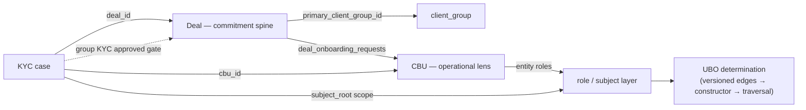

# Verb-Governed State
### The Onboarding Platform Data & Interface Architecture — Deal, CBU and UBO
#### The implementation reference ("the bible")

| | |
|---|---|
| **Document** | EOP-SA-OBP-001 |
| **Type** | Solution Architecture — implementation reference |
| **Version** | 0.6 — Draft for Further Review |
| **Owner** | Adam Cearns |
| **Audience** | Engineering (builds against Parts IV–VI) and Product (consults Parts I, III). Written to be **navigated**, not read cover-to-cover. |
| **Status** | Draft. Foundation (Parts I–II) ratified. Describes the **target contract**; where the branch has not yet reached it, Part VI says so — contract and completeness are distinct throughout. |
| **Supersedes framing in** | EOP-DD-KYCUBO-002 §2 ("the stream is the system of record") — see §I.7. Retains its append mechanism. |
| **Related** | EOP-VS-KYCUBO-001 (Vision & Scope); EOP-DD-KYCUBO-001/002 (substrate + append protocol); EOP-RP-STATEGRAPH-001 (state-graph closure). |

---

## Problem Statement — transactional maps over ordinary entities

The Enterprise Onboarding Platform is not primarily a system for maintaining ordinary business entities.

Ordinary entities exist in the traditional sense: companies, people, contacts, products, services, resources, documents, shareholdings, accounts, books and legal identifiers. These are real-world or referenceable things. They have identity. They have attributes. They change over time. They can be modelled conventionally as entities, and a Java/Spring/ORM implementation could represent them as mutable objects and database rows. This document does not deny that model; it demotes it from the centre of the architecture.

The hard problem in onboarding sits one layer above those entities. **Deal, CBU and UBO are transactional correlation constructs.** They are not rich entities in the same sense as a company, person or product. They are long-running state machines over baskets of real-world entities: foreign-key memberships, role bindings, evidence links, statuses, determinations, gates and operational transitions. Their meaning is not the content of one row. Their meaning is the governed association of many referenced entities over time.

A **Deal** is not just a commercial row. It is a commitment spine: a changing correlation between client groups, negotiated products, rate cards, onboarding requests, KYC clearance, contracting state and live-service readiness.

A **CBU** is not the client entity. It is an operational lens over a client business unit: a role composition, service-readiness container and onboarding target that references companies, products, books, services and resources.

A **UBO** is not an ownership table. It is an evidential determination process over asserted, evidenced and verified control/economic relationships between entities, producing a regulated answer at a point in time.

This distinction is the reason conventional CRUD/ORM modelling is insufficient as the governing architecture. ORM is naturally suited to rows that represent mutable entities. It is much weaker when the primary thing being modelled is not the entity content itself, but the stateful, governed, point-in-time membership and meaning of relationships between entities.

The platform therefore treats Deal, CBU and UBO as **versioned transactional maps**: correlation windows over slower-moving, independently versionable real-world entities. The content of a referenced entity matters, but it is secondary to the question this platform must answer:

> **Which entities, in which roles, under which authority, with which evidence, in which state, belonged to this Deal / CBU / UBO determination at this point in time — and why?**

That is the core problem. The architecture that follows exists to make that answer deterministic, auditable and recoverable from the data alone.

---

## How to use this document

| If you are… | Read |
|---|---|
| Product, understanding *what and why* | Problem Statement, Part I (approach), Part III (problems solved) |
| An architect assessing the model | Parts I–II (foundation + governance + risk) |
| An engineer adding a capability | Part V (manuals + playbook), Part VI.1 (worked example) |
| An engineer designing a table or API | Part V.1 (schema), Part V.2 (API) |
| A reviewer checking a PR against the law | Part V.4 (positions), Part V.3 (review gate) |
| Anyone asking "is it done?" | Part VI.2 (closure register) |

**Navigation.** The Problem Statement establishes the key distinction: ordinary entities versus transactional maps over entities. Part I — the approach. Part II — the substrate, governance and the honest de-risking. Part III — the problems this solves. Part IV — the three constructs. Part V — the design manuals and the capability playbook (the working reference). Part VI — a worked example, the completeness register, and direction of travel.

> **The one idea, up front.** The platform models **data, and only data** — immutable, time-tagged, precedence-ordered versions — but the primary data under governance is the **transactional map**: the versioned association of entities into Deal, CBU and UBO state. Every change enters through a **governed semantic verb** that appends the next version, stamped with *why* it happened, *who* did it, and *under what authority*. The **shape** of the data — the node/edge graph — is not stored; it is **constructed** on demand by a deterministic function that reads the versions valid at a point in time. The database and the verb set exist to serve that temporal reconstruction; not the other way round.

---

# Part I — The Approach

## I.1 The one requirement

> **Any valid state of the onboarding domain — the complete node/edge graph of Deal, CBU and UBO — must be reconstructable, directly and deterministically, as of any point in time, from the data alone.**

This is the *primary* requirement, not a feature. Point-in-time recovery is not a capability the system has; it is the shape the system is. Every subsequent decision — storage shape, key strategy, verb design, index design — is a consequence of taking this as the axiom.

## I.2 The persistence model: versioned rows are the truth

State is stored as **immutable, precedence-ordered, bitemporally-tagged versions** — a versioned row for every state-bearing thing: a value, a status, an edge, a role, a membership, an association, a determination snapshot. But the Problem Statement's two-class distinction is a **persistence rule**, not just exposition, and the strength of this model is that it holds the two classes to different standards:

- **Transactional maps (Deal, CBU, UBO) — versioned rows are *mandatory*.** The map *is* a long-running state machine whose point-in-time membership, authority and status is the regulated product. Its whole meaning is history: which entities, in which roles, in which state, at which instant. Append-only versioning, constructor-assembled shape and bitemporal recovery are *forced* here — there is no correct mutable representation of a map, because a mutated map has destroyed the very record it exists to keep. No ORM, no in-place update, non-negotiable.

- **Ordinary entities (company, person, product, shareholding) — versioned rows are *preferred, not required*.** An entity's meaning lives in its own content, and it *can* be modelled conventionally — a mutable ORM row with its own audit — without breaking the architecture. We *choose* to snapshot entities too, because they have lifecycle changes a regulator may need point-in-time (a shareholding at two dates is two versions), but that is a **preference weighed per entity by its regulatory weight**, not a derived necessity.

The reason the architecture survives an entity being a plain mutable row is the load-bearing mechanic: **a map references an entity by stable identity, and versions the *binding*, not the entity's content.** The regulated fact is the association-over-time — "this company, in this role, bound to this Deal, from this instant, under this authority" — and that fact is captured in the *map's* version, keyed to the entity's identity. If the company later changes its registered address (mutable entity churn), the map is untouched, because it bound the company *by identity*, not by address. The map's integrity therefore does **not** depend on the entity being versioned. That asymmetry — mandatory for maps, preferred for entities, binding-versioned regardless — is what makes the two-class distinction architectural rather than rhetorical.

- **Append, never update.** A state change is a new version inserted. Nothing is updated in place; nothing is destructively deleted.
- **Correction is supersession.** A correction is a later version that supersedes an earlier one by precedence; the earlier version remains physically present.
- **Precedence is last-insert-wins**, resolved by a **monotonic insert sequence per identity** — never by wall-clock time (§I.4).
- **Provenance is inline on every version**: the **verb** (semantic intent — the leading cause), the **actor**, the **authority** (object-capability), and **both time axes**. Who, why, under what right, when-true and when-known — columns on the row, not a joined-away log.

This is bitemporal versioning as an **architectural law**, not an event-sourcing log. The data *is* the record.

## I.3 Shape is constructed, not stored — the constructor

The database holds no graph structure. Any stable state has nodes and edges — but the *shape* they form is not a schema artifact. It is the output of a **reconstruction constructor** (Rust / `nom`):

> **The constructor reads the versions valid at (time T, axis A) for a scope, resolves precedence (last-insert-wins by insert-sequence), and assembles the complete node/edge taxonomy graph for that instant.**

This is a **solved problem** — it is exactly what a compiler front-end does to build an AST/DAG from tokens: lex, resolve, build typed graph. It is pure, deterministic, and testable in isolation. Point-in-time recovery is therefore neither "replay a log" nor "temporal-select one table"; it is *select the versions valid at T → hand them to the constructor → receive a complete, valid graph.* The store is dumb and uniform; **meaning is a reading of the store**, assembled by a defined function over it — not baked into the schema. (This is the FORTH shape: a uniform cell store; a vocabulary that constructs meaning over it.)

## I.4 Precedence is total and deterministic

Last-insert-wins is valid only if "last insert" is unambiguous. Two jobs are kept strictly separate:

- **Time axes (valid-time, knowledge-time)** — what you *query against*. May collide (same millisecond, clock skew); therefore **never** resolve precedence.
- **Insert sequence (monotonic, per identity)** — what *resolves precedence*. Deterministic, total, never a timestamp.

**Causation (the verb) is carried on every version but never orders it** — it explains; the insert-sequence orders. Given the same versions, the same (T, A), and the same constructor version, the reconstructed graph is **bit-identical, provably**.

## I.5 Bitemporal, always

Every version carries **both** time axes — valid-time (when the fact holds) and knowledge-time (when we recorded it) — with no exceptions and no per-node judgement. The constructor takes the axis as a **parameter**: "what was true as of T" vs "what we believed at T, given what we knew then." These diverge the instant a past fact is corrected; a regulator can ask either.

**Uniformity is the reason, not regulation.** Mixed uni/bitemporal nodes force the constructor, the queries, and every new node type to branch — drift. One shape, always two timestamps. Cost: one `timestamptz` and one predicate. Saving: an entire category of special-casing eliminated, and you never migrate a node to bitemporal when a rule tightens, because it always was.

## I.6 The DSL verbs are the sanctioned version-appenders

A verb does not mutate state. It **appends the next precedence-tagged version** of a node or edge, stamping it with verb/actor/authority/time inline. The verb set is designed so every domain transition is expressible as "supersede this node/edge with a new version." This is the inversion made concrete: **the node/edge design and the verb vocabulary are co-designed so the versioned-row model is sufficient to express every transition.** The DSL exists to lay down versions the constructor can later reassemble.

## I.7 The intent stream collapses into per-row provenance

`kyc_intent_events` (EOP-DD-KYCUBO-002) was built as a separate append-only *event log* whose columns are pure provenance — `verb_fqn`, `actor`, `authority`, `target`, `as_of`, `payload` — carrying **no status of its own**; state was to be *folded* from it. Under versioned-rows, that provenance rides on **each version of the node/edge itself**. The separate stream stores the same causality twice, once unqueryably, and **collapses**:

- Provenance columns move **inline** onto every versioned data row.
- The separate table survives, if at all, only as a **non-authoritative write-ahead / ingest buffer** — never the record.
- The `FoldRegistry`/replay machinery shrinks to the one thing that genuinely must be computed (§II.3): the determination traversal.

This is a **re-foundation, not a revision**. DD-002's *append mechanism* (monotonic per-identity sequence via `FOR UPDATE` allocator, atomic append, provenance capture) is retained as the *versioning* mechanism; its *framing* ("the stream is the system of record, projections fold over it") is superseded by "the versioned rows are the record; the constructor assembles over them."

## I.8 Scope follows intent, not topology

This is the property that makes retrieval cheap and unifies three concerns into one key.

A reconstruction's scope is **the sliding window of the sub-domain that emitted the intent** — the verb/API utterance is the origin, and the version it wrote is stamped into *that* window. **Scope is causal, not structural.** It is not a graph-topology boundary (CBU-A vs CBU-B) discovered by walking; it is stamped at write, from the intent, and indexed.

The consequence: the **scope key, the authority boundary, and the causation record are the same fact**, written once. Retrieval ("what to load"), governance ("who may write this and why"), and audit ("what caused this slice to change") all key off the intent's window. So "what to load for a reconstruction" needs no traversal — it is *replay the window*: one indexed range read on the scope key. Topology never enters retrieval; the constructor discovers topology **after** the rows are in memory, which is exactly where graph assembly belongs.

---

# Part II — The Substrate and Its Governance

## II.1 One model, not two governance modes

Earlier drafts named two governance modes and called one of them the target. **Both are wrong destinations.** Mode 1 (in-place status update under a DAG guard) loses history. Mode 2 (append-event, fold-to-projection) interposes a log-and-fold indirection between what happened and what the data says. The actual target is a **third model both converge on**: versioned-rows-as-truth with a reconstruction constructor.

| | Mode 1 (legacy) | Mode 2 (stream/fold) | Target (versioned rows) |
|---|---|---|---|
| Write | in-place `UPDATE` under guard | append event to log | **append version row** |
| History | lost on update | in the log | **in the data itself** |
| Point-in-time | not recoverable | replay-and-fold | **direct temporal query + assemble** |
| State shape | the row | folded projection | **constructed by the tree-builder** |
| Provenance | not on the row | in the event log | **inline on every version** |

- **Mode-1 constructs** (Deal/CBU/case status) migrate by becoming versioned: the status column becomes a versioned node; in-place update becomes version-append.
- **Mode-2 constructs** (UBO determination) migrate by demoting the stream to per-row provenance and promoting versioned data to the record (§I.7).

The bible states **one** model. The mid-transition reality (both legacy modes still on the branch) lives in the closure register (§VI.2) as *completeness*, not as competing architecture.

## II.2 Governance under the one model

A verb is legal if the governance layer permits the version it wants to append. One mechanism replaces both the Mode-1 DAG slot-check and the Mode-2 fold-precondition:

> **Resolve the active semantic context → validate authority (which verb may append which version, to which identity, under which object-capability) → validate preconditions against the *constructed current state* (the constructor at `now()`) → append the version. Nothing partial is written; a rejected verb writes nothing.**

**Authority follows the verb, not the row** (visibility ≠ authority — §I.8, and Part IV). Retained from the prior `stream_governed` declaration, restated: the KYC/UBO families are governed by semantic authority + constructor-checked preconditions, **not** by DAG from/to slots. The original artifact (retained verbatim as evidence; its framing now "governs version-append" rather than "governs the stream"):

```yaml
stream_governed:
  id: kyc_ubo_determination_stream
  verb_families: [ ubo.edge.*, ubo.determination.*, kyc.subject.*, kyc.role.*, kyc.obligation.*, kyc.person.* ]
  governance:
    dag_slots: intentionally_absent
    declaration: >
      Current state is derived from the versioned rows by the constructor.
      Legal status transitions are enforced as preconditions against the
      constructed current state (formerly "fold-output-only, K-11").
    content_addressed_lexicon_manifest: { table: kyc_lexicon_manifest }
    approval_gate: { key: K-23 }
```

## II.3 The one thing that is computed, not stored

Everything that is a **value** is a versioned row: edges, statuses, roles, evidence state, obligations, and the **frozen determination snapshot** (a determination made and acted upon is itself a regulated value, recoverable as-of when it was made).

The **live UBO determination** is the single computed thing, and it is *consistent with* the model, not a carve-out:

> **The determination is a traversal over the reconstructed graph. You version the inputs (control/economic edges) and you version the frozen output (the snapshot). You never store the live determination as mutable state — it is a read over the assembled graph.**

`OwnershipProngStrategy::resolve` runs over the constructor's output. This is the *purpose* of the tree-builder, not an escape from it: version the nodes/edges, assemble the graph at T, compute the determination as a function of that graph. So "everything is a versioned row" holds for values; the determination is a function *of* the assembled graph.

## II.4 The trust boundary — the constructor as crown jewel

The versioned-rows model concentrates all trust in **one component**: the reconstruction constructor. Audit, regulatory answer, current state, precondition validation, and determination all flow through it. In the log-fold model risk was spread; here it is concentrated. This is a **deliberate trade** — killing the log indirection in exchange for one crown-jewel component — and the bible names it rather than assuming it away. The constructor is a governed artifact:

- **Versioned / content-addressed itself.** A reconstruction is pinned to the *constructor version* C that produced it (the Q7 lexicon-hash principle applied to the constructor). "As of T" means "as C assembles T"; C is recorded, so a reconstruction is reproducible against the exact builder that made it.
- **Deterministic by construction** (§I.4).
- **Attestable**: re-run and check that a prior graph reproduces bit-identically.

That the constructor is a solved compiler problem (§I.3) is what makes this trade sound: the concentrated risk sits on the *most* well-understood component, not the least.

## II.5 Why this performs

The reflexive objection — "insert-versioned + bitemporal = huge row counts = slow" — is wrong, for a specific reason:

**Row count is not the cost driver; index selectivity is.** Every hot read is "the versions of *this* identity (or *this* scope window), valid at *this* time" — a range seek on a composite index `(identity, valid_time, insert_seq)` or `(scope_key, valid_time, insert_seq)` that touches only those versions, not the table. B-tree depth grows *logarithmically*, so 50M rows is a couple of index levels more than 5M, not 10× slower. And because nothing is ever updated: **no update locks, no MVCC dead-tuple bloat, no vacuum pressure** — appends are the cheapest write Postgres does; reads are index-covered range scans. An append-only versioned table with the right composite index is frequently *faster* than the mutable table it replaces.

Two consequences the bible mandates (a position naming its trade-offs):

- **Current-state is a query, not a row** — `DISTINCT ON (identity) … ORDER BY insert_seq DESC` valid at `now()`. The current-state access path is a *deliberate design artifact* (covering index by default; maintained current-view only where read/write ratio proves it — §V.1).
- **Retention/partitioning is a policy keyed on the regulated-value test** — regulated nodes keep everything; high-churn non-regulated nodes partition by time (which also keeps per-partition indexes shallow, compounding the win). The same test governs bitemporal strictness *and* retention — one principle, applied twice.

## II.6 Persistence risk and de-risking (stated, not hand-waved)

The risky part of this architecture is **not** the constructor (solved) and **not** the graph model (the graph lives in memory). The risky part is the claim that a relational store faithfully holds versioned rows and returns the correct temporal slice cheaply. The bible concedes the classic objection and shows the design already honours it:

**"Relational databases are bad at graphs" is true — about traversal.** Transitive closure, chain-walking, ancestor queries: this is why graph databases exist. **This design does not ask SQL to traverse.** Traversal happens in the constructor, in memory, over rows the DB already returned (§I.3, §I.8). The DB's job is reduced to "return the versions valid at (T, A) for this scope" — an **indexed range read**, relational's home ground. The one thing relational cannot do was architecturally removed from the database.

What genuinely remains to prove is three ordinary temporal-table properties (each a proof obligation, not an assertion — see §VI.2):

1. **Bitemporal slice correctness** — the `valid at (T, A)` predicate resolves to exactly one version per identity across supersession/boundary cases. *Proof:* a property-based harness generating random version histories, asserting the slice equals a brute-force reference. (Silent-wrong-answer class; fiddly interval logic; the reason SQL:2011 temporal exists.)
2. **Precedence-resolution plan** — last-insert-wins does not degrade to a full sort. *Proof:* `EXPLAIN ANALYZE` at realistic volume showing index-driven resolution.
3. **Hot-window append contention** — the per-identity monotonic sequence under concurrency. *Proof:* append-latency under load (the allocator is already chosen — `FOR UPDATE` on the seq row).

**The escape hatch (strongest de-risking).** Because traversal is in the constructor, the store is **swappable**. The architecture bets on the *versioned-row contract*, not on relational forever: those rows could come from Postgres, a columnar store, a scope-partitioned KV store, even a graph DB used purely as versioned storage. Postgres is the first, obvious, and (1–3 permitting) sufficient implementation — not a lock-in. A bible that says "here is the store contract, Postgres satisfies it, here is the proof, and we are not wedded to it" is more defensible than "relational graphs work, trust us."

---

# Part III — The Problems (what this solves, and why best)

Product reads this part. Each problem is stated as a problem, then answered.

**P0 — Entity modelling is not the core problem.** *Problem:* readers naturally reach for the familiar model: company row, person row, product row, service row, then ORM aggregates around them. That misses the real shape of onboarding. Deal, CBU and UBO are not ordinary entities; they are long-running transactional maps over ordinary entities. *Answer:* the architecture separates slower-moving, independently versionable entities from the governed correlation constructs that bind them into roles, statuses, evidence, determinations and operational gates. The construct is the state machine; the entity content is referenced substrate.

**P1 — Shared-mutable-state corruption.** *Problem:* many sub-domains touch the same onboarding rows; whoever holds a row can write it; a bad write silently corrupts state others depend on, with no record of who or why. *Answer:* authority follows the verb, not the row (§I.8); no in-place mutation — a change is a new version stamped with its cause; a "corruption" becomes a traceable, superseding version that can be inspected and itself superseded, never a silent overwrite.

**P2 — Audit reconstructed after the fact.** *Problem:* "why did this change, who, under what authority" is normally reconstructed post-hoc from logs and diffs — agony in a high-traffic app. *Answer:* causation is inline on every version; the audit answer is a column on the row you are already looking at. No reconstruction, no log-scrape.

**P3 — Point-in-time / regulatory replay.** *Problem:* regulators ask both "what was true as of X" and "what did you believe at X" — divergent bitemporal questions conventional stores cannot answer because they overwrite. *Answer:* bitemporal versions + the constructor → any (T, axis) graph is a direct query plus assembly, reproducible and pinned to the constructor version that produced it (§II.4).

**P4 — Taxonomy drift / stiffware.** *Problem:* baking domain structure (types, categories, control-means, jurisdictions) into schema (enums, per-type tables) makes every new structure a migration; an open domain is permanent migration. *Answer:* taxonomy is *assembled* by the constructor from versioned metadata, not baked; a new structure is data, not DDL. (The seven audited exceptions — Appendix A — are where this was violated; two retire.)

**P5 — CRUD authority sprawl.** *Problem:* CRUD/REST-per-table lets any service mutate any field; the API becomes table-ownership; authority diffuses. *Answer:* API windows expose **capability (verbs)**, not tables; visibility broad, authority narrow; no generic update/patch/save exists to abuse (§IV.2, §V.2).

**P6 — The ORM row-as-authority trap — *for maps*.** *Problem:* an ORM makes the mapped row the unit of authority — transparent in-place mutation by any holder. This is not wrong everywhere; it is wrong *for one class of data*. ORM is a perfectly good fit for **ordinary entities** (company, person, product) whose meaning is their content. The industry's mistake is applying that same model to a **transactional map** (Deal, CBU, UBO), whose meaning is a governed, point-in-time association — where in-place mutation destroys the very history the map exists to keep. *Answer:* for maps, the unit of authority is the verb, not the row; state is not a mutable aggregate but a versioned association assembled by the constructor. The ORM's central convenience — transparent in-place mutation of a mapped row — is exactly this model's central prohibition *for the map class*. This is a sharper position than a blanket anti-ORM stance: it concedes ORM its proper domain (entities) and indicts it only where it is genuinely wrong (governing a long-running map as if it were a mutable entity). (Language-neutral: the wrong model is buildable in raw SQL; the right one in Java — §I.3 carrier note.)

**P7 — Graphs in a relational store.** *Problem:* relational DBs cannot traverse graphs cheaply — the reason graph DBs exist. *Answer:* do not ask SQL to traverse. SQL does indexed temporal range reads scoped by a stored causal key; the constructor (a solved compiler problem) traverses in memory. The store is swappable because the constructor is the graph layer (§II.6).

**P8 — Determinism of historical answers.** *Problem:* if "state at T" is non-deterministic (ordering, precedence ties, non-deterministic assembly), the regulatory answer is worthless. *Answer:* precedence is total by insert-sequence; the constructor is deterministic, content-addressed and attestable; same rows + (T, axis) + constructor version ⇒ bit-identical graph (§I.4, §II.4).

---

# Part IV — The Three Constructs

The constructs are **synthetic transactional correlation constructs** — thin on owned attributes, heavy on relation, membership, role and business-operations meaning. Each is a **window** over one substrate. They are state machines over entities, not ordinary entities themselves.

## IV.1 Domain windows over one substrate

| Construct | Domain concern | Owns & governs (bounded write authority) | Reads / references (shared visibility) |
|---|---|---|---|
| **UBO** | evidential beneficial-ownership determination | the versioned control/economic edges, evidence state, obligations, and frozen determination snapshots | entity roles (from CBU), `subject_root` scope from the KYC case |
| **CBU** | operational lens on a client business unit | `cbus.status` (discovery), `cbus.operational_status`, entity-role composition | commercial client entity, product, book; KYC-case and Deal state (read for its aggregate) |
| **Deal** | commercial commitment spine | `deals.deal_status`, `deals.operational_status`, BAC/KYC substates, rate-card status | `client_group`, CBUs (via `deal_onboarding_requests`), `cases` |

No construct owns the whole onboarding state. Each owns a bounded slice of governed state and sees the rest. "Shared substrate, bounded semantic authority" made concrete.

## IV.2 Tailored API windows over shared data

The platform API exposes **sub-domain capability windows**, not table ownership. A window may *see* enough shared state to do its work but may *command* only the transitions for which it has semantic authority.

| API window | May command | May read / derive | Must not write directly |
|---|---|---|---|
| **Deal API** | commercial progression, rate-card lifecycle, onboarding-request creation, contract/live-service transitions | CBU membership, client-group linkage, KYC clearance, CBU operational readiness | CBU role composition, UBO edges/determination, KYC evidence |
| **CBU API** | discovery validation, operational lifecycle, role binding, service-readiness composition | Deal state, KYC case state, product/book/client-group reference, UBO rollup where exposed | Deal commitment, rate-card state, raw UBO edge/evidence mutation |
| **UBO/KYC API** | ownership/control assertion, evidence attachment, edge verification, conflict reconciliation, obligation tracking, determination/freeze | CBU role/subject linkage, client-group subject root, entity reference | Deal lifecycle, CBU lifecycle, rate-card state, service activation |

Two contracts per window: a **visibility contract** (read/correlate/derive) and an **authority contract** (which verbs, against which state, under which context). *A platform that exposes tailored interfaces but lets each call a shared repository directly has implemented a conventional shared database with prettier method names — not this architecture.*

## IV.3 UBO — an evidential determination process

**Concept.** UBO is not an ownership table. No row "is" the beneficial owner. The UBO is the **output of a process**: versioned control/economic edges, asserted → evidenced → verified, assembled into a graph and traversed into a determination, frozen as a versioned snapshot. The substrate stores evidence and versioned edges; the answer is *computed* (§II.3).

- **Verb surface** (`dsl-kyc.yaml`): `ubo.edge.assert-control`, `.assert-economic-interest`, `.attach-evidence`, `.verify`, `.supersede`; `ubo.determination.reconcile-conflict`, `.select-strategy`, `.compute-fold`, `.apply-smo-fallback`, `.freeze`; `ubo.board-controller.override`.
- **Model.** Multi-axis (economic and control independent), multi-prong (ownership → control-by-other-means → senior-managing-official), structure-class-selected, frozen with reproducibility pins (now including constructor version — §II.4).
- **Status under versioned-rows.** Edge epistemic status is a **versioned value**: `assert` writes an `Asserted` version, `attach-evidence` an `Evidenced` version, `verify` a `Verified` version — each a superseding version, the legal next-status enforced as a **precondition against the constructed current state** (§II.2). *(This changes the old "fold-output-only K-11" shape — see the consequences list, §VI.4.)*
- **Legacy retiring.** `ubo.registry.*` deleted (phantom-wrote non-existent columns, never executed); `control_edges` and `kyc_ubo_registry` tagged legacy-retiring (Appendix A).

## IV.4 CBU — an operational lens

**Concept.** CBU is an operational lens, distinct from the legal entity and the client group. It does not model *who the client legally is* (the entity/client-group layer); it models the **operational unit being onboarded and serviced** — discovery state, operational lifecycle, role composition. A correlation construct, thin on owned attributes by design.

- **Discovery lifecycle** (`cbus.status`, 5 states — `master-schema.sql:9633`): `cbu.submit-for-validation`, `.confirm`, `.reject`, `.request-proof-update`, `.reopen-validation`.
- **Operational lifecycle** (`cbus.operational_status`, 8 lowercase states — `:9632`): `cbu.suspend`, `.reinstate`, `.restrict`, `.unrestrict`, `.begin-winding-down`, `.complete-offboard`.
- **Owns vs references.** Owns `name`, `nature_purpose`, `source_of_funds`, `commercial_client_entity_id`, `product_id`, `book_id`, and governs its two status columns; references the entity/client-group layer; reads KYC + Deal for its aggregate. Roles held relationally (`cbu_entity_roles`).

## IV.5 Deal — the commitment spine

**Concept.** Deal is the commercial **commitment spine**: what was agreed and its progression prospect → contracted, and separately its live-service progression. It owns the commitment and correlates the parties; it does not own the whole onboarding state. Its **dual lifecycle** reflects that commercial status and live-service status are independent axes.

- **Commercial lifecycle** (`deals.deal_status`, 9 states — `:10969`), `deal.update-status` commercial-only.
- **Operational lifecycle** (`deals.operational_status`, 5 states — `:10677`), `deal.suspend`/`.reinstate`/`.begin-winding-down`.
- **Substates.** While `deal_status = IN_CLEARANCE`, `bac_status` and `kyc_clearance_status` carry BAC/KYC-clearance substate, guarded to require `IN_CLEARANCE`.
- **Rate cards.** `deal_rate_cards.status` (8 states) with a `deal.cancel` cascade superseding non-terminal cards.
- **Correlates.** `primary_client_group_id → client_group`; `deal_onboarding_requests` link Deal ↔ CBU; `cases` link via `cbu_id`/`deal_id`.

## IV.6 How the three interact

Constructs share **visibility** via structural FKs and cross-domain guards while each keeps **authority** over its own state:

- `cases.cbu_id` / `cases.deal_id` tie a KYC case to its CBU and Deal.
- `kyc-case.create` validates the linked deal's status and infers `client_group_id` from `deals.primary_client_group_id`.
- Deal contracting requires the client group's KYC approved.
- The CBU operational aggregate *reads* KYC (approved case) and Deal state.

UBO is reached **through** the role/subject layer and the `subject_root` scope, not a direct CBU→UBO dependency — the determination substrate carries no FK into Deal/CBU (§I.8: scope is causal).



---

# Part V — The Manuals (the working reference)

## V.1 Schema design manual

**The canonical versioned-row shape.** Every state-bearing table follows this shape (column names illustrative; the *shape* is the law):

```
identity      : id           uuid        -- stable surrogate identity of the node/edge
version       : version_seq  bigint      -- monotonic per id; RESOLVES precedence (never a timestamp)
valid time    : valid_from   timestamptz -- when the fact begins to hold
                valid_to     timestamptz -- null = open interval
knowledge time: recorded_at  timestamptz -- when we learned it (bitemporal, always)
scope         : scope_key    uuid        -- the causal window (subject_root / cbu / deal); INDEXED
provenance    : verb_fqn     text        -- the semantic intent (leading cause)
                actor        jsonb        -- principal
                authority    text         -- object-capability
                causation_id uuid         -- explains; never orders
                correlation_id uuid
payload       : <value columns, or jsonb for open shapes>
```

**Rules (each a Position — see §V.4 for the defence):**

0. **First, classify the table — map or entity (§I.2).** Before applying any rule below, decide which class you are building, using this test: *does this table's meaning live in its own content, or in the governed association of other identities over time?*
   - **Content-primary → it is an ordinary entity** (company, person, product, shareholding). Versioning is *preferred* (default to the versioned-row shape for anything with regulatorily-interesting lifecycle), but a conventional mutable/audited table is *tolerated*. It must expose a **stable identity** for maps to bind to.
   - **Association-primary → it is a transactional map** (Deal, CBU, UBO, and any role/membership/edge/status/determination binding). Versioning, append-only, scope-stamping and constructor-assembly are **mandatory** — rules 1–11 apply in full, no exceptions. A map is never an ORM aggregate.
   *If in doubt, it is a map:* the failure mode that corrupts regulated state is treating a map as an entity (mutating the association in place), not the reverse. The whole architecture exists for the map class; the entity class is the referenced substrate.

1. **Append-only.** No `UPDATE`, no destructive `DELETE`, on any state-bearing table. Ever. Enforced structurally (§V.3 gate). *(Mandatory for maps; the default-and-preferred for entities.)*
2. **Bitemporal always.** Both time axes on every version. No unitemporal exceptions.
3. **UUID surrogate identity.** The versioned `id` is a stable surrogate, independent of mutable attributes; natural keys are attributes/lookups, never the identity (a natural key can be corrected — the identity must not churn when it is).
4. **Scope stamped at write, indexed.** `scope_key` on every version; retrieval is one indexed range read on it (§I.8). Reconstruction never traverses to discover what to load.
5. **Two hot indexes.** `(id, valid_from, version_seq)` for single-identity reads; `(scope_key, valid_from, version_seq)` for window reconstruction. Design every table so both are index-driven range seeks.
6. **Current-state is a query.** `DISTINCT ON (id) … ORDER BY version_seq DESC` valid at `now()`, served by a covering index by default. Materialise a current-view only where a measured read/write ratio proves it — do not materialise by reflex.
7. **Enum-in-schema vs metadata taxonomy.** A `CHECK`/enum is permitted **only** for a value set that is *closed, small, and engine-internal* (e.g. an edge's epistemic status `Asserted|Evidenced|Verified|Superseded` — that is engine vocabulary). Any set that is *domain taxonomy* — categories, entity/vehicle types, control-means, jurisdictions — that can grow or vary by regulation **must** be versioned reference data assembled by the constructor, never a `CHECK`. *Test: "will this set grow or vary by jurisdiction/regulation?" Yes → metadata. No, and engine-internal → enum permissible.*
8. **No logic in the database.** No triggers, no stored-procedure business logic. The DB stores and indexes; it does not compute domain logic. Logic lives in verbs (version-appenders) and the constructor — both versioned, attestable, testable; a trigger is none of those (the `set_bods_interest_type` deletion is the lived precedent).
9. **FK by identity, not by version.** References point at the logical `id`, never at a specific version; nothing should block supersession.
10. **Regulated-value test drives bitemporal strictness and retention.** Regulated values keep every version forever; high-churn non-regulated nodes may partition by time and compact — same test, applied twice.
11. **Structural vs taxonomy-metadata tagging.** Every column is tagged: structural (a world-fact/value) or taxonomy-metadata (drives typing/assembly). The tag is a design-review artifact, not decoration.

## V.2 API / interface design manual

**The window template.** Every sub-domain API declares:

- a **visibility contract** — the shared state it may read, correlate and derive; and
- an **authority contract** — the closed set of verbs it may execute, against which identities, under which governance context.

**The Java 25 DOP implementation shape** (the enterprise carrier; the Rust DSL is the proven reference — §I.6):

```text
API endpoint receives an intent-specific request
  → maps to a sealed command record            (record; sealed interface closes the vocabulary)
  → command enters the central transition engine
  → governance context resolved
  → authority + precondition validated against the CONSTRUCTED current state
  → append the next version (provenance inline) / (legacy) guarded transition
  → (optional) refresh current-state view
  → audit is the version's inline provenance — nothing extra to write
```

**Forbidden shapes (executable prohibitions — enforce with module boundaries + architecture tests):**

```text
No controller calls repository.save(entity)
No service receives a mutable ORM aggregate and sets fields
No PATCH over a shared structure
No window owns the full CBU / Deal / UBO row
No persistence write exists except behind the governed transition engine
```

**Rejection semantics.** A verb failing authority or precondition returns a typed rejection **before** any append; there is no partial write and no compensating undo — the append never happened.

**Adding a new sub-domain.** Declare its window (visibility + authority contracts), its `scope_key` participation, its verbs, and its node/edge types (per §V.1). It sees the substrate; it commands only its verbs.

**Versioning of the vocabulary.** Verbs are content-addressed (lexicon hash); adding a verb is a governed reference-data act, and replay/reconstruction pins the vocabulary version (and constructor version — §II.4).

## V.3 The capability playbook

**Adding a new transition to an existing construct.**
1. Name the semantic intent (the verb): what version it appends, to which node/edge identity.
2. Declare it in the lexicon (YAML for the Rust carrier; a sealed command record for Java).
3. Register its authority (which window may command it) and its preconditions (checked against the constructed current state).
4. Ensure the version it writes carries `scope_key` + inline provenance.
5. Mandatory tests (RED-first): precondition rejection; determinism (same inputs ⇒ same result); PITR (append → supersede → reconstruct the prior graph bit-identically).
6. Review gate (§below).

**Adding a new node/edge type.**
1. Apply the §V.1 versioned-row shape (identity, version, bitemporal, scope, provenance, payload).
2. Regulated-value test → bitemporal strictness + retention.
3. Enum-vs-metadata for any taxonomy field → metadata unless engine-closed.
4. Index for the two hot reads.
5. Teach the constructor to assemble it (node/edge kind → graph shape).
6. Tests + gate.

**Adding a whole sub-domain.** Declare the window (V.2); its `scope_key`; its verbs and node/edge types (as above); its capability API (verbs, not tables).

**The review gate (a PR is rejected unless):** no in-place `UPDATE`/destructive `DELETE` on state-bearing tables; no trigger/stored-proc logic; `scope_key` stamped; provenance inline; verb goes through the governed engine (no direct repository write); preconditions checked against constructed current state; constructor still deterministic; the three mandatory tests present and green.

## V.4 Positions taken and defended

Each contested call, as a stated position with its reason and its trade-off, so it is not relitigated per-PR.

| # | Position | Reason | Trade-off / exception |
|---|---|---|---|
| 1 | Append-only versioned storage; never update-in-place | PITR, attestability, no MVCC bloat, contention-free writes | Storage growth; retention policy required (regulated-value test) |
| 2 | Bitemporal always | Uniformity eliminates constructor/query branching and future migration | One extra timestamp + predicate |
| 3 | Precedence = last-insert-wins by monotonic per-identity sequence, not timestamp | Determinism; timestamps collide | Requires a gap-free allocator (chosen: `FOR UPDATE`) |
| 4 | Causation carried inline, leads every change, never orders precedence | Audit is a column, not a reconstruction | — |
| 5 | Scope stamped at write, indexed; causal not structural | One indexed range read; unifies retrieval/authority/audit | Cross-window graphs load N windows (still no SQL traversal) |
| 6 | Graph traversal in the constructor, never in SQL | SQL is bad at traversal, excellent at indexed range reads | Constructor becomes the trust boundary (§II.4) |
| 7 | Constructor is pinned, content-addressed, attestable | "Point in time" must mean "as *this* builder assembled it" | Constructor versions must be retained |
| 8 | Domain taxonomy is metadata assembled by the constructor; enums only for closed engine-internal sets | Avoids stiffware / permanent migration in an open domain | The seven audited exceptions (Appendix A); two retire |
| 9 | Correlation constructs (Deal, CBU, UBO) are transactional FK-baskets + governed state, thin by design; not rich entities | Avoids false ownership; makes the state machine / entity distinction explicit; matches the Deal Record precedent | — |
| 9a | Versioning is *mandatory* for transactional maps, *preferred-but-tolerant* for ordinary entities; maps version the binding (by entity identity), so map integrity never depends on the entity being versioned | Makes the two-class distinction architectural, not rhetorical; concedes ORM its proper domain (entities) and forbids it only for maps; a plain audited entity table does not break the model | Entities carry a per-entity regulatory-weight judgement (§V.1 rule 0); the map must always bind by stable identity |
| 10 | UUID surrogate identity; natural keys are attributes | Identity must be stable across corrections of natural keys | — |
| 11 | Current-state is a query (covering index) by default; materialise only on measured need | Avoids premature materialisation and its refresh cost | Hot read-mostly paths may earn a maintained view |
| 12 | No business logic in the database (no triggers/stored procs) | Logic must be versioned, attestable, testable — a trigger is none | DB may enforce integrity constraints (not domain logic) |
| 13 | No repository mutation outside the governed append path | The whole authority model; enforced structurally | — |
| 14 | Store is swappable behind the versioned-row contract | De-risks the relational bet; traversal already out of the DB | — |

---

# Part VI — Worked Example, Closure Register, Direction

## VI.1 Worked example — assert a control link and freeze the determination

*Product intent:* record that Person **P** controls Entity **E** via a shareholders' agreement, evidenced by document **D**, then freeze the determination.

1. **API (UBO/KYC window)** receives an intent-specific request; maps to a sealed command `AssertControl { scope: subject_root, from: E, to: P, means: shareholders_agreement }`.
2. **Engine** resolves context (lexicon version, actor, authority), validates the UBO window *may* command edge assertion, and validates preconditions against the **constructed current state** — E and P exist as nodes in this scope.
3. **Append** a versioned edge: `id = edge(E,P,shareholders_agreement)`, `version_seq = n`, `valid_from = as_of`, `scope_key = subject_root`, `verb_fqn = ubo.edge.assert-control`, `actor`, `authority`, payload `status = Asserted`. No prior state mutated.
4. **`ubo.edge.attach-evidence`** → append edge `version_seq = n+1`, `status = Evidenced`, evidence ref = D. Precondition: current status is `Asserted`.
5. **`ubo.edge.verify`** → append `version_seq = n+2`, `status = Verified`. Precondition: current status is `Evidenced` (the ratchet, now precondition-enforced — §IV.3).
6. **`ubo.determination.freeze`** → the **constructor** assembles the graph for `(subject_root, T=now, axis=valid)`: all latest-version verified edges in scope. `OwnershipProngStrategy::resolve` traverses in memory → determination. `freeze` appends a **versioned determination snapshot** node pinned to `(policy, lexicon-manifest, constructor version, scope, as_of)` — an immutable regulated value.
7. **Point-in-time, later:** "what did the ownership graph look like on date X, as we believed it then" → select versions where `scope_key = subject_root` and `valid_from ≤ X` and `recorded_at ≤ X`, resolve last-insert-wins, hand to the pinned constructor → the exact graph, bit-identically, by query and assembly. No fold engine, no log scrape, no traversal in SQL.

## VI.2 Implementation closure register (completeness, not architecture)

The target contract (Parts I–V) is not fully built. Openly:

- **Both legacy modes still present on the branch.** Mode-1 in-place status updates (Deal/CBU/case) and the Mode-2 stream/fold (UBO) both exist; both migrate to versioned-rows (§II.1). This is the largest completeness gap.
- **`kyc_intent_events` is currently stream-first.** The §I.7 collapse (provenance inline, stream demoted) is *target*, not yet done. DD-002's append mechanism is retained; its "system of record" framing is superseded.
- **Two live divergences** (evidence *for* bounded authority, §P1): `deal.request-onboarding` writes an illegal `deal_status='ONBOARDING'`; `kyc-case.create` accepts obsolete deal statuses. Held for a ratified logic fix.
- **Wire-later states** (declared, unimplemented): deal operational `ONBOARDING`/`OFFBOARDED`; deal SLA `NEGOTIATED`/`ACTIVE`/`BREACHED`; CBU operational `trade_permissioned`/`archived`; `kyc_ubo_evidence` `REQUESTED`/`EXPIRED`.
- **The three de-risking proof obligations (§II.6) are open:** bitemporal-slice property test, precedence-resolution `EXPLAIN`, hot-window contention test. Until green, the store claim is faith.
- **Build-proof caveat (hygiene debt, not KYC):** the workspace test suite does not currently compile as a whole (pre-existing visibility/missing-module errors in unrelated targets); the platform's own gate presently passes only `cargo check`. Clear before it masks a regression.

## VI.3 Direction of travel

Versioned-rows-as-truth is the single target; Mode-1 and Mode-2 both converge on it. The enterprise carrier is a Java 25 DOP semantic-command API expressing the same closed algebra under the same law; the DSL syntax becomes optional authoring surface. The invariant across all of it: **all state change enters as a governed appended version, and the record of intent — not the current row — is the truth; the transactional map is constructed, deterministically, on demand.**

## VI.4 Consequences to confirm (raised by the re-foundation)

Flagged, not buried — each is a real change from prior design docs:

1. **`kyc_intent_events` collapse** (§I.7): supersedes DD-002 §2's "system of record" framing. *Confirmed in spine ratification; recorded here for the design-doc trail.*
2. **Edge status becomes a versioned value, ratchet precondition-enforced** (§IV.3, §VI.1) — this changes DD-001's "edge status is fold-output-only (K-11)." The invariant is preserved in effect (illegal transitions are rejected) but relocated from fold-output to precondition-against-constructed-state. **Confirm the relocation.**
3. **Determination pins now include constructor version** (§II.4) — the reproducibility pin set grows by one. **Confirm.**
4. **Current-state view policy** (§V.1 rule 6) — default to query-with-covering-index, materialise on measured need. **Confirm the default, or set a different one.**

---

## Appendix A — Baked-Taxonomy Exceptions (evidence)

The seven surviving exceptions to §P4/§V.1-rule-7, tagged, canonical `master-schema.sql`:

| Tag | Exception | Evidence |
|---|---|---|
| PERMANENT-BOUNDED | `attribute_registry.category` / `.value_type` | `:7110`, checks `:7130-7131` |
| PERMANENT-BOUNDED | `cbus.cbu_category` | `:9629` |
| **LEGACY-RETIRING** | `control_edges` edge/BODS/GLEIF/PSC checks | `:10390`, checks `:10412-10416` |
| PERMANENT-BOUNDED | `entity_ubos.ubo_type` | `:12912`, check `:12933` |
| PERMANENT-BOUNDED | `cbu_board_controller.method` / `.confidence` | `:8065`, checks `:8077-8078` |
| **LEGACY-RETIRING** | `kyc_ubo_registry.ubo_type` / `.status` | `:14472`, checks `:14493-14494` |
| PERMANENT-BOUNDED | `kyc_ubo_evidence.evidence_type` | `:14449`, check `:14464` |

*Note: the "permanent-bounded" tag itself is subject to §V.1-rule-7 — any of these that proves to vary by jurisdiction is reclassified to metadata.*

---

## Change Log

| Version | Date | Note |
|---|---|---|
| 0.1–0.3 | 2026-07-02 | Architecture drafts: four-part structure; consistent-insert-snapshots; visibility ≠ authority; API windows; conceptual construct summaries. |
| 0.4 | 2026-07-02 | **The bible.** Re-founded on the ratified versioned-rows-as-truth spine: temporal reconstruction primary; the constructor as the (solved) graph layer; bitemporal-always; last-insert-wins by monotonic sequence; scope causal-not-structural; `kyc_intent_events` collapsed to per-row provenance. Two governance modes collapse into one. Added the problems catalogue (Part III), the schema/API/capability manuals and the positions register (Part V), a worked example (VI.1), and the de-risking section (II.6, store-swappable). Retained and rebased all v0.3 content (constructs, API windows, closure register, exceptions). Structured six-part for consultation. Consequences-to-confirm listed (VI.4). |
| 0.5 | 2026-07-03 | Added explicit Problem Statement: ordinary entities versus transactional maps over entities. Tightened the opening idea, Part III problem catalogue, Part IV construct framing, Position 9 and Direction of Travel to keep the Deal/CBU/UBO-as-state-machines distinction visible throughout. |
| 0.6 | 2026-07-03 | Made the two-class distinction *architectural*, not just expository: carried it into the persistence model (§I.2 — versioning mandatory for maps, preferred-but-tolerant for entities; maps version the *binding* by entity identity, so map integrity never depends on entity versioning); added the entity-vs-map classification test as schema-manual rule 0 (§V.1); sharpened the ORM critique (P6) from a blanket stance to "correct for entities, wrong only for maps"; added Position 9a. Problem Statement itself unchanged. |
