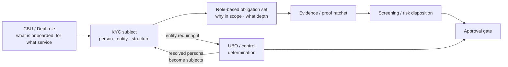
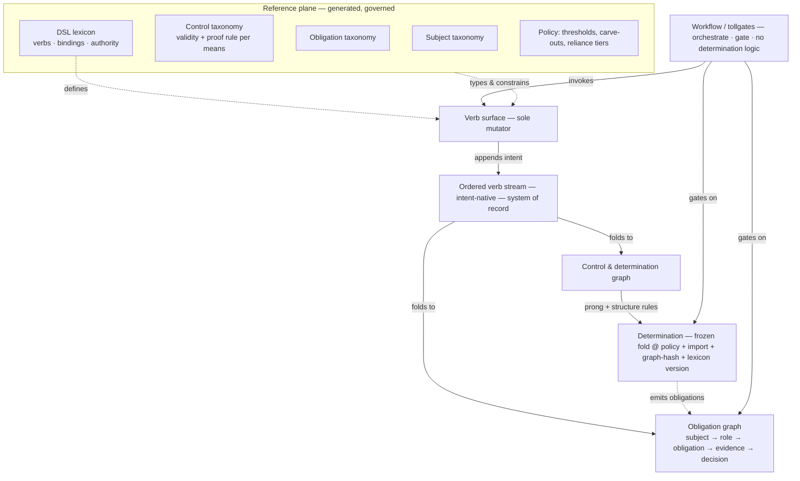
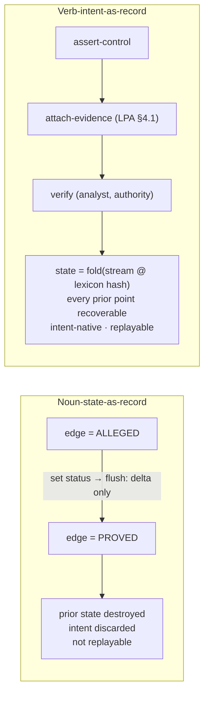

# From Percentage to Determination
### A Governed KYC / UBO Domain Model for All Group Structures

| | |
|---|---|
| **Document** | EOP-VS-KYCUBO-001 |
| **Type** | Vision & Scope |
| **Version** | 0.6 — Draft for Peer Review |
| **Owner** | Adam Cearns |
| **Date** | 2026-06-30 |
| **Status** | Target. Not yet agreed. No implementation, schema, or remediation is authorised against this document until it is peer-reviewed and signed off. |
| **Related** | KYC/UBO Implementation Report & Architectural Review (current-state baseline); EOP-VS-PSSR-001 *From Commitment to Capability*; the Deal Record cluster and `cbu_entity_roles`; the SemOS DSL position papers (governed-FORTH / vocabulary-as-program lineage). |

> **Scope note (v0.4).** v0.1–v0.2 set a UBO *determination* model; v0.3 added the *subject* and *obligation* layers for the full KYC capability; v0.4 makes the **DSL lexicon a normative part of the specification** and states the **functional orientation** that has governed ob-poc since inception: verbs are primary, data is aligned to them.
>
> **Scope note (v0.5).** A sharpening pass, not an expansion. It frames the verb-first orientation as a **regulated-causality design decision** — KYC state must be explainable as a sequence of semantic decisions, not a succession of data shapes — and reduces tool-specific (ORM) framing in favour of *noun-state vs verb-intent*. Adds point-in-time and audit-causality invariants (K-33–K-35).
>
> **Scope note (v0.6).** Adds the **bridge from V&S to refactor** without becoming a schema design: a *Refactoring Interpretation* section (§12 — implementation boundaries, displacement of the current code, sequencing, minimum slice), phased lexicon grouping (Appendix A), and an *informative* indicative-workstreams appendix (Appendix B) that seeds — but does not constitute — the separate refactoring plan.

---

## 1. Purpose and Thesis

This paper sets the **target end state** for KYC across all group structures the platform onboards, and across all means by which control is exercised. It is a target-setting document; it does not authorise schema, code, or remediation.

The organizing primitive, in four parts:

> **1. A KYC capability separates two questions it must never conflate: *determination* — who owns or controls a subject — and *obligation* — who or what must be checked, under which role, to what depth, and by which approval path.**
>
> **2. A determination resolves a subject entity to the natural persons who own or control it, by whichever tests its structure requires, recorded with the basis. The determination, not the percentage, is the regulated artifact.**
>
> **3. Both the determination graph and the obligation graph are governed *folds* over one ordered, intent-native verb stream — which, not the current state, is the system of record.**
>
> **4. The lexicon of semantic-intent verbs is primary; the data taxonomy is aligned to it. We model the legal *moves* over the world; the data is the fold that supports them, not a noun hierarchy that dictates them.**

Parts 1–3 are carried from v0.3. Part 4 states for the record the orientation that has run through ob-poc from the start (§3): the verbs are the behavioural specification, and the data exists to be read and written by them. The reason is domain-specific, not stylistic: **KYC is a regulated decision-history domain, so the system of record must be the sequence of semantic decisions, not the noun-shaped state they leave behind.**

This is authority-as-primitive applied to KYC: the verb surface is the bounded set of legal moves; the graphs are the world; non-determinism is quarantined to discovery; the governed atomics execute concrete, typed transitions.

---

## 2. Background

### 2.1 One test, one axis

The current implementation resolves a single test — the ownership prong — over a single axis. Correct where shares carry proportionate votes; wrong wherever capital and control are divorced (fund LPs, LLPs, GP/LP structures); inapplicable where there is no percentage (trusts, foundations). The defect is structural: the regulated determination is multi-axis, multi-prong, and structure-selected. For how this code is treated under the refactor — demoted to one strategy, not deleted — see §12.2.

### 2.2 The domain is open, so the structure cannot be baked

The set of control structures is not closed; new vehicles and contractual control mechanisms arrive continuously. Baking each into DDL puts the model in permanent migration. The end state commits to **structure-as-data** — taxonomies and correlation constructs generated from records, governed in the reference plane (§9), not carried as schema. Crucially, while the *structures* are open-ended, the *moves over them are bounded* — which is what makes a verb-first model the right fit (§3).

### 2.3 UBO determination is necessary but not sufficient

A determination answers *who owns or controls*. A KYC capability must also answer *which persons and entities require checking, under which role, with what evidence, screening, refresh cadence, source-of-wealth depth, and approval route*. v0.3 added the subject and obligation layers (§5) to close that gap.

---

## 3. The Functional Orientation

This section states explicitly the stance that has governed ob-poc since inception, because peer reviewers schooled in noun-first modelling will otherwise read the data model as the specification. It is not.

> **Design decision.** The DSL verb is primary; the shape of the data is its *effect*, not its cause. This is chosen, not inherited, for two regulated reasons: (1) every state change must be recoverable as it stood at any past point in time, and (2) every semantic intent must be explicit at the moment it is taken, never inferred afterward from a data difference or a log file. A model whose record of truth is the current data shape can satisfy neither.

### 3.1 State lives in data; behaviour and meaning live in the lexicon

The two graphs (§7) are the **state** of the machine — the configuration it is in. They are not the definition of what the machine can *do*. The legal transitions, their meaning, their preconditions, and their authority live in the **verb lexicon** (§8). The data is the state machine's state; the lexicon is its transition function. The data supports the functionality; it does not direct it.

### 3.2 Data is aligned to the verbs, not the reverse

A taxonomy struct exists because some verb reads or writes it. The data model is the *image* of the verb surface — derived and shaped to serve it. There is no struct without a verb that touches it, and no behaviour without a verb that names it (K-29, K-32). This is the inversion of object-oriented encapsulation, where a class binds data to the methods permitted on it and the data structure dictates the available behaviour.

| | Noun-first (object orientation) | Verb-first (this model) |
|---|---|---|
| Primary artifact | the class/entity (data + bound methods) | the lexicon of semantic-intent verbs |
| Where behaviour lives | encapsulated in the noun; data dictates its methods | in the verb surface; data carries state only |
| The specification *is* | the schema / class model | the lexicon — verbs, bindings, authority |
| New capability requires | new classes/methods; structural change | a new governed verb; data follows |
| Open-ended structure | enumerated as types → permanent migration | data the bounded verbs operate over |
| System of record | current object state | the ordered verb stream; data is a fold |
| At high structural complexity | behaviour fragments across a noun hierarchy; coupling and opacity grow | verb surface stays bounded; complexity moves into data and composition |

### 3.3 Why verb-first, for an arbitrarily complex open domain

The domain's *structures* are unbounded; its *intents* are not. One cannot enumerate the world's vehicles as types without permanent migration (§2.2), but one *can* bound the legal intents — assert, evidence, verify, supersede, reconcile, determine, oblige, screen, approve. The verb surface stays small and stable while the structural variety it governs grows without limit. A small, governed vocabulary composes to address arbitrarily complex structure — the vocabulary-as-program lineage, with typed binding in place of the stack and object-capability bounding the reach. Noun-first modelling inverts this: it forces the open-ended axis (structure) into the rigid medium (types) and leaves the bounded axis (intent) scattered across a class hierarchy, which is precisely where opacity and brittleness accumulate as the problem grows.

### 3.4 Why noun-state cannot carry regulated cause

For KYC this orientation is not stylistic. A KYC record is not merely a description of a customer; it is the regulated history of *why* the platform believed, at a given point in time, that a person or entity had been identified, evidenced, screened, risk-assessed, approved, rejected, waived, or superseded. The noun — customer, person, entity, edge, obligation — can show the state *now*. It cannot, by itself, show the semantic reason the state moved. The verb is the reason-bearing artifact: `verify-identity`, `attach-evidence`, `pierce-nominee`, `apply-smo-fallback`, `waive-with-authority`. A system that records only that a field changed, or that an object was flushed, has preserved the destination while losing the regulated cause. For KYC, that loss *is* the failure.

### 3.5 Consequence for this specification

Because the verbs are primary, **the lexicon is a normative specification artifact**, not downstream implementation. The data taxonomy is specified by what the verbs require of it. This is why §8 sits in the body, not an appendix: in a verb-first model the lexicon is the behavioural contract, exactly where a noun-first paper would place its schema.

---

## 4. The Domain in One Picture

The capability is a pipeline of distinct decisions, of which determination is one stage:



| Layer | Question answered |
|---|---|
| **CBU / Deal / Onboarding request** | What is being onboarded, for what services? |
| **KYC subject** | Who or what must be KYC'd? |
| **Role-based obligation** | Why is this subject in scope, and to what depth? |
| **UBO / control determination** | Which natural persons own or control this subject entity? |
| **Role map** | Which entities/persons act as ManCo, IM, trustee, GP, signatory, director? |
| **Evidence / proof** | What proves identity, registration, control, source of wealth/funds? |
| **Screening / risk disposition** | What is the PEP/sanctions/adverse-media and risk outcome? |
| **Approval gate** | Determination final **and** all required obligations terminal. |

Determination feeds the obligation layer; both converge at one approval gate. They couple **only through governed verbs** — determination *emits* obligations, but an obligation never mutates a determination except by a verb (no back-channel).

---

## 5. KYC Subjects and Role-Based Obligation

### 5.1 Subjects

KYC operates over **subjects**, not only over UBO determinations. A subject is anything that can carry a KYC obligation:

| Subject | Why it matters |
|---|---|
| Natural person as customer / investor | Retail or private individual directly onboarded. |
| Natural person as UBO | Resolved through ownership/control determination. |
| Natural person as controller | Director, GP principal, designated member, trustee, protector, signatory, fund director. |
| Natural person as SMO fallback | No UBO found; senior managing official recorded and screened. |
| Natural person as related party | May require screening/evidence without full UBO classification. |
| Institutional entity as customer | Company, fund, LLP, trust, partnership, foundation, state body. |
| Institutional entity as intermediate node | Entity in a control chain, not the customer. |
| Investor / subscriber | Routed out of pooled-vehicle UBO, but retains its own investor KYC path. |

A subject's **identity record** is distinct from its **obligations** (K-22). One verified identity may support several role-based obligations; one person may appear under many roles.

### 5.2 Role-based obligation

A subject is in scope because of a recorded **basis** — never inferred (K-21):

> **obligation = role + subject + jurisdiction + product/service exposure + risk policy + required evidence + required decisions**

The same natural person — as 30% shareholder, director, signatory, settlor, GP principal, retail investor, SMO fallback — does not collapse into one undifferentiated "requires KYC." Each basis is a separate obligation; they fold into a consolidated person case with multiple basis-obligations. Obligation selection is a function of **structure class × CBU/Deal role × jurisdiction × product/service exposure × risk** (K-24) — the bridge from determination to the onboarding platform.

---

## 6. The Determination — What It Resolves

### 6.1 Determination as artifact

For a case and subject entity: the natural persons resolved as beneficial owners, each carrying its **basis** (prong), axis values, applied strategy, provenance, and the obligations it emits. A determination naming no one is still a determination, recorded with equal rigour.

### 6.2 Two independent axes

**Economic interest** and **voting/control** are independent quantities, plus categorical control rights. The **economic tree** and **control tree** are computed independently and reconciled at the determination, never collapsed into one number before traversal (K-2).

### 6.3 The prong cascade

1. **Ownership** — economic interest at/above threshold, directly or via a chain of economic interests.
2. **Control by other means** — control through rights not capital; dominant-chain control propagates **as control, not a multiplied percentage** (K-3).
3. **Senior managing official (fallback)** — never returns empty (a person, or an explicit authorised waiver) (K-5).

A person may satisfy multiple prongs; basis records all, classified economic-only / control-only / dual.

### 6.4 Structure-class strategy selection

The subject's **structure class** selects the strategy, recorded on the determination (K-4). Minimum coverage:

| Structure class | Economic axis | Control axis | Primary prong | Notes |
|---|---|---|---|---|
| **Private company** | shareholding % | voting / board appointment | Ownership → Control → SMO | Axes coincide; today's model. |
| **Multi-tier holding group** | indirect % (multiplied) | dominant-chain (propagated) | Ownership and Control parallel | Chains can diverge in length/terminus. |
| **Listed entity (regulated market)** | shareholders above threshold | board / voting | Carve-out → Ownership/SMO | Exemption; qualifying markets are reference-plane data; directors/officers may still be in scope. |
| **Limited partnership / PE fund** | LP capital commitments | GP statutory; delegated IM; LPAC veto | **Control primary** | Investors route out; GP/manager line traced to persons. |
| **LLP** | member capital/profit (from agreement) | designated members; members' agreement; voting | **Control primary** | No shares; economic from instrument; low share ≠ excluded. |
| **Trust** | n/a | settlor, trustee, protector, beneficiaries, controller | **Role-based** | No percentage; persons by role and trust deed. |
| **Foundation (Stiftung / SPF)** | n/a | founder, council/board, beneficiaries | **Role-based** | Governed by founding instrument. |
| **Investment fund / SICAV / UCITS / AIF** | unit / shareholders | ManCo / AIFM; delegate IM | **Control primary** | Sub-fund/compartment, depositary, fund directors in role map; investors route out. |
| **State-owned / government body** | the state | public officials | SMO / special-handling | Exempt or special-handled per policy; recorded. |
| **Cooperative / mutual** | members | board; voting (often one-member-one-vote) | **Control primary** | Economic % often meaningless. |
| **Nominee / bearer** | nominal vs beneficial | beneficial controller behind nominee | Pierce to beneficial | Resolves *through* the nominee; never terminates at it. |

A class is **data**, so new classes are added without re-architecting the engine.

---

## 7. The Two Graphs — A Governed State Machine

One verb stream folds into **two coupled projections**: the *control & determination graph* and the *obligation graph*. One system of record; two views.

### 7.1 Three taxonomies

The reference plane carries three connected, generated, typed taxonomies, each aligned to the verbs that operate over it (§8):

1. **Subject taxonomy** — natural person, private company, listed company, LLP, LP, GP, trust, foundation, fund, sub-fund, state body, cooperative, nominee.
2. **Control taxonomy** — shareholding, voting agreement, GP statutory, designated member, delegated IM, trust role, protector, nominee, dominant influence, board appointment, veto. Each control type is a typed edge with its own **validity rule** and **proof rule**.
3. **Obligation taxonomy** — identity verification, address verification, registration proof, constitutional document, ownership chart, control instrument, source of wealth, source of funds, PEP/sanctions/adverse media, tax forms, signatory evidence, refresh/expiry.

Adding a means of control, subject class, or obligation type is a governed reference-plane act — vocabulary extension, not migration.

### 7.2 The control & determination graph

Edges are control **claims with epistemic status** — asserted, evidenced, verified, disputed, superseded, waived. Edge state advances only through a **proof ratchet**: a governed transition with cited evidence, never set directly (K-11). Terminal natural-person nodes carry the registry lifecycle and prong classification (decision-bearing). Intermediate nodes carry a resolution status that is a **fold** over upward edges plus stop-conditions, derived but checkpointed (K-12). Topology is **supersede-never-delete** (K-13). A determination is produced by tree-walking the hierarchy, checking edge proof state, applying prong and structure-class rules, folding terminal statuses.

### 7.3 The obligation graph

> **subject → role → obligation → evidence → review decision**

A subject acquires obligations by role; each requires evidence; each resolves to a decision. The second fold over the same stream. Determination **emits** obligations into it; obligations never write back except through a verb.

### 7.4 Person KYC lifecycle

Distinct from determination, folded from the same stream. Modelled as **parallel per-obligation tracks converging at an approval gate**, not one linear FSM (you can screen before identity is fully verified):

```
per obligation:  alleged → identified → evidence-requested → evidence-received → verified → {satisfied | rejected | waived | expired}
person overall:  fold over obligation states → {in-progress | approved | rejected}
```

A person can be determined in-scope before any of this is complete (K-23).

### 7.5 Institutional KYC profile

An entity is a KYC **subject**, not only a graph root (K-28). Every onboarded structure carries a profile: identity evidence; registration evidence; structure class; jurisdiction; product/service exposure; risk classification; required role map; required UBO/control determination; required documents; refresh/expiry; approval status. UBO determination is a *component* of the profile, not the whole.

### 7.6 Verbs as the transition function — one stream, two folds

Semantic-intent verbs are the **sole governed mutators** of both graphs (K-15). Every verb appends intent to one ordered stream; the control graph and obligation graph are folds over it. The lexicon that catalogues these verbs is §8.



### 7.7 State machine below, workflow above

The two graphs are the substrate. BPMN-lite and tollgates sit *above*, sequencing verb invocations and gating on aggregate state (the approval gate queries determination finality **and** obligation terminality). The workflow holds zero determination or obligation logic.

---

## 8. The DSL Lexicon

The lexicon is the **behavioural specification**: the bounded catalogue of semantic-intent verbs that are the only legal moves over the model. Per §3, it is normative here, where a noun-first paper would place its schema. It is itself governed reference-plane data — declarative, versioned, and content-addressed, like frozen templates — so a verb's definition is fixed at the hash it was written against, and an old stream replays against the exact verbs it used (K-31, and the replay-faithfulness this gives §9, §10).

### 8.1 The shape of a lexicon entry (normative)

Every verb declares:

| Field | Meaning |
|---|---|
| **FQN** | `namespace.family.verb` (e.g. `ubo.edge.verify`). |
| **Intent** | The move it makes, in one line. |
| **Arguments** | Typed operands and `@`-bindings. |
| **Governing taxonomy** | Which typed schema (subject / control / obligation) constrains its operands. |
| **Writes** | Which fold(s) it mutates: control graph, obligation graph, determination, or stream-only. |
| **Reads** | State / taxonomy consulted. |
| **Preconditions** | Ratchet ordering, prior state, evidence-cited requirements. |
| **Authority** | Object-capability: which principal/role may invoke; `interactive_only` vs `scripted_ok` classification. |
| **Emits** | Obligations/events produced (e.g. `determination.freeze` emits person obligations). |

This entry shape is the alignment contract: **a verb cannot exist without declaring the taxonomy it governs and the fold it writes** (K-30). It is the mechanism by which the data structs are aligned to the semantic intents.

### 8.2 The verb families and their alignment

The seed lexicon, mapped to the taxonomy it governs and the fold it writes. This is the verb→taxonomy alignment that binds intent to data.

| Verb (representative) | Intent | Governing taxonomy | Writes | Key precondition / authority |
|---|---|---|---|---|
| `kyc.subject.register` | bring a subject into scope | subject | obligation graph | onboarding authority; records basis (K-21) |
| `kyc.subject.classify-structure` | set structure class | subject | control + obligation | **drives both** determination strategy (K-4) and obligation set (K-24) |
| `kyc.subject.link-to-cbu-role` | attach a CBU/Deal role | subject + Deal Record | obligation graph | role participates in obligation selection (K-24) |
| `kyc.role.assign` / `.verify` / `.supersede` | manage role-holding | subject | obligation graph | supersede-never-delete |
| `ubo.edge.assert-control` | claim a control edge | control | control graph | validity rule checked; status = asserted |
| `ubo.edge.assert-economic-interest` | claim an economic edge | control | control graph | economic axis only (K-2) |
| `ubo.edge.attach-evidence` | cite proof for an edge | control + obligation | control graph | proof rule of the edge type (K-10) |
| `ubo.edge.verify` | ratchet edge to verified | control | control graph | evidence cited; never direct (K-11) |
| `ubo.edge.supersede` | retire/replace an edge | control | control graph | supersede-never-delete (K-13) |
| `ubo.edge.pierce-nominee` | resolve through a nominee | control | control graph | terminal-at-nominee forbidden (K-8) |
| `ubo.edge.reconcile-conflict` | canonicalise conflicting edges | control | control graph | runs before determination (K-14) |
| `ubo.determination.select-strategy` | choose the strategy | subject (class) | determination | reads control graph; records strategy (K-4) |
| `ubo.determination.compute-fold` | fold graph to candidates | control | determination | tree-walk + prong rules |
| `ubo.determination.apply-smo-fallback` | record SMO where empty | control | determination | no ownership/control UBO (K-5) |
| `ubo.determination.freeze` | pin an immutable determination | — | determination + obligation | pins policy + import + hash + lexicon version (K-18); **emits person obligations** |
| `ubo.determination.waive-with-authority` | authorised waiver | — | determination | authority required |
| `kyc.person.assert-identity` / `.verify-identity` | identity track | subject / obligation | obligation graph | ratchet; evidence (K-25) |
| `kyc.person.screen` / `.record-screening-disposition` | screening track | obligation | obligation graph | gates approval, not determination (K-26) |
| `kyc.person.assess-risk` | risk track | obligation | obligation graph | parallel track (§7.4) |
| `kyc.person.approve` / `.reject` / `.waive` | person decision | obligation | obligation graph | all required obligations terminal (K-23) |
| `kyc.entity.attach-registration-evidence` / `.verify-good-standing` / … | institutional profile | subject / obligation | obligation graph | profile completeness (K-28) |
| `kyc.entity.approve` / `.reject` / `.waive` | entity decision | obligation | obligation graph | profile terminal + UBO determination final |
| `kyc.obligation.create` | open an obligation | obligation | obligation graph | recorded basis (K-21) |
| `kyc.obligation.satisfy` / `.defer` / `.waive` / `.expire` / `.reopen` | obligation lifecycle | obligation | obligation graph | per-obligation ratchet |

The pattern the table makes visible: each verb names exactly one governing taxonomy and one (or a coupled pair of) folds, and the **non-obvious couplings are explicit** — `classify-structure` is the hinge that drives both determination and obligation; `determination.freeze` is the seam where the determination graph emits into the obligation graph. The data structs are specified by being on the receiving end of these declarations.

### 8.3 The lexicon is bounded; structure is open

The verb surface stays small and stable; the structural variety it governs is unbounded data (§3.3). Adding a *structure* is reference-plane data against an existing verb (`classify-structure` over a new subject class); adding a *capability* is a new governed verb. This is the discipline that keeps an arbitrarily complex domain tractable: complexity accumulates in composition and data, not in the vocabulary.

### 8.4 What the lexicon buys: regulated causality is native, not reconstructed

The DSL does not make KYC simple; it makes the regulated causality *explicit*. Because every legal move is named before it executes, the platform never infers intent from a later data difference. The verb already carries the business meaning, the authority boundary, the target binding, and the evidence precondition. That is the practical value of the lexicon: the audit trail is native to execution rather than reconstructed after it. The claim is "structurally natural," not "trivial" — hashes, ordering, authority, replay, projections, and idempotency are still real work; what the lexicon removes is the need to *guess the cause* of a state change.

The full consolidated seed lexicon is in **Appendix A**.

---

## 9. The Persistence Stance — Structure as Data, Events as System of Record

**Substrate hard, structure soft.** Entities exist; edges reference real endpoints; provenance and the ordered verb stream are DB-enforced — the referential integrity both folds replay over. The subject, control, and obligation taxonomies, the lexicon, the per-case hierarchy, CBU, and Deal Record are folds and FK baskets generated from records, never DDL.

**Integrity relocates, it does not vanish.** What a traditional model puts in typed tables and check constraints, this puts in the verb surface as sole mutator and the typed taxonomies. A typed-edge graph governed by a verb surface is not EAV. Type discipline outside DDL is already demonstrated by the sealed-type exhaustiveness of the Java DOP work.

**Structural change is governed in the reference plane.** A new control-means, subject class, obligation type, proof rule, **or verb** is an authored, authorised, audited reference-plane act, not a migration (K-20, K-31). The change-control gate relocates from migration-review to reference-plane authority — putting the soft model *ahead* of the baked one.

**The verb stream is the system of record.** Point-in-time recovery, replay, and the allegation→proved ratchet are derivations of an ordered, governed, deterministic stream of intents, not features added to a state store. A current-state store overwrites on write, persists destinations not transitions, and cannot hold an epistemic ratchet in a mutable field anything can set directly. The conflict with current-state-as-record persistence is at the level of **system-of-record**, not performance, so it cannot be tuned away.

**Authoritative state is append/supersede, not destructive update.** The authoritative KYC record prefers insertion of new facts — new verb events, new evidence links, new determinations, new projection snapshots — over in-place mutation. Where a fact is corrected, replaced, expired, or contradicted, the prior fact is *superseded*, not overwritten. This is not a blanket ban on `UPDATE` in non-authoritative projections, indexes, locks, or caches; it is a rule about the regulated record. The system must always be able to answer: what did we know, when did we know it, what semantic act changed it, under whose authority, and what evidence or policy justified the move.

**Intent is captured at decision time, not reconstructed from state deltas.** A current-state model can say that a person is now verified, a control edge is now superseded, or an obligation is now waived. It cannot, from that state alone, prove the semantic decision that caused the move. A delta log improves the mechanics but not the meaning: it records that values changed, not *why* the authorised platform act occurred. In KYC the "why" is not commentary; it is the audit object. A verb stream records the decision *before* state moves: the named semantic intent, actor, authority, evidence, policy version, and target. State is then a fold over those decisions. That is the required inversion — current state is the projection; semantic intent is the record. The question this forces on a reviewer is the only one that matters: *is the system of record the semantic verb stream, or the current noun state?*

**Replay pins the lexicon version.** Because the verbs carry the meaning (§3), faithful replay requires the verb definitions to be fixed. Content-addressed, frozen verbs give this by construction: an old stream replays against the exact lexicon hashes it was written with, so a determination is reproducible against the rules *and the verb semantics* as they stood (K-18, K-31).



---

## 10. Invariants

**Determination**
- **K-1 — Basis is mandatory.** Every determined UBO carries the prong that identified it.
- **K-2 — Axes are independent.** Economic interest and control are modelled independently.
- **K-3 — Control is not multiplied.** Dominant-chain control propagates as control; multiplication applies to economic interest only.
- **K-4 — Structure selects strategy.** Structure class selects the strategy explicitly; the applied strategy is recorded.
- **K-5 — No silent absence.** Absence of an ownership/control UBO triggers the SMO fallback (a person, or an explicit authorised waiver).
- **K-6 — Thresholds are sourced.** Thresholds and carve-outs are reference-plane values per jurisdiction, risk, structure class; never literals.
- **K-7 — Pooled investors route out.** Pooled-vehicle investors are not its UBOs by stake; they route to their own obligation.
- **K-8 — Nominees are pierced.** A determination resolves through a nominee, never terminating at it.

**Graph & state machine**
- **K-9 — Edges are typed control claims.** Each means-of-control is a typed edge with its own validity and proof rule.
- **K-10 — Non-register control is instrument-cited.** Such control edges cite the instrument and clause establishing them.
- **K-11 — Proof is a ratchet.** Edge proof state advances only by a governed transition with cited evidence; never set directly.
- **K-12 — Node-status discipline.** Terminal-person status is verb-set; intermediate-node resolution is a derived, checkpointed fold.
- **K-13 — Topology is supersede-never-delete.** Stale/conflicting topology is superseded, preserving bitemporal replay.
- **K-14 — Reconcile before determination.** Conflicting source edges are reconciled into a canonical projection before traversal.

**Persistence & governance**
- **K-15 — Verbs are the sole mutator.** All KYC state changes only through the verb surface.
- **K-16 — The verb stream is the system of record.** Both graphs are replayable folds over the ordered stream.
- **K-17 — Intent is recorded.** Every transition records its semantic intent, actor, authority, and time.
- **K-18 — Determinations are immutable and reproducible.** Pinned to policy version, import run(s), graph hash, **and lexicon version**, sufficient for bit-identical replay.
- **K-19 — Substrate rigid, structure soft.** Referential integrity and the stream are DB-enforced; taxonomies, lexicon, hierarchy, CBU, Deal Record are generated projections.
- **K-20 — Structural change is governed in the reference plane.** New control-means, subject class, obligation type, proof rule, or verb is a governed reference-plane act, not a migration.

**KYC obligation**
- **K-21 — Obligation is role-based.** A subject requires KYC because of a recorded role, relationship, product exposure, jurisdictional rule, or determination basis; never inferred without a basis.
- **K-22 — Identity and obligation are separate.** One identity may support several role-based obligations; one subject may carry many.
- **K-23 — Determination and KYC approval are separate decisions.** Case completion gates on determination finality **and** all required obligations reaching an allowed terminal state.
- **K-24 — CBU role drives obligation selection.** An entity's CBU/Deal role participates in selecting the obligation set; structure alone is insufficient.
- **K-25 — Evidence is reusable only through provenance.** Verified evidence satisfies multiple obligations only where its provenance and validity window cover them; never blanket.
- **K-26 — Screening gates approval, not determination.** A screening disposition is a precondition of approval, not of being determined in-scope.
- **K-27 — Retail/private-person KYC is first-class.** A directly-onboarded natural person is a full KYC subject, not a degenerate UBO case.
- **K-28 — Institutional KYC profile is first-class.** An onboarded entity carries its own KYC profile; UBO determination is a component of it.

**Lexicon & functional orientation**
- **K-29 — Verbs are primary; data is aligned to them.** The lexicon is the behavioural specification; every taxonomy struct exists to be read or written by a verb. No data without a verb that touches it; no behaviour without a verb that names it.
- **K-30 — Every verb declares its binding.** Each lexicon entry declares its governing taxonomy, the fold(s) it writes, its preconditions, and the authority to invoke it.
- **K-31 — The lexicon is governed, versioned reference-plane data.** Verbs are declarative, content-addressed, and added only by a governed reference-plane act. Replay pins the lexicon version; the verb surface is bounded while structure is open.
- **K-32 — State carries no behaviour.** The data graphs hold state only; legal transitions live solely in the lexicon. Data supports functionality; it does not direct it.

**Point-in-time recoverability & audit causality**
- **K-33 — Point-in-time KYC is mandatory.** Every regulated KYC conclusion is recoverable as it stood at a past point in time — including the then-current subject classification, roles, obligations, evidence status, screening disposition, UBO determination, policy version, lexicon version, actor, and authority. A current-state-only answer is not a KYC answer.
- **K-34 — Destructive mutation is not authoritative.** Authoritative KYC facts, determinations, obligations, evidence links, and decisions are inserted, superseded, expired, or waived through verbs — never overwritten as the record of truth. Mutable read models exist only as non-authoritative projections of the verb stream.
- **K-35 — No state without semantic cause.** No authoritative KYC state exists without a traceable originating verb. The audit trail identifies not merely what changed, but which semantic intent caused the change, what object it targeted, what evidence or policy it relied on, who invoked it, and under what authority.

---

## 11. Scope

### 11.1 In scope
- A determination engine that is multi-axis, multi-prong, structure-class-aware (§6.4).
- Subject, control, and obligation taxonomies, and the **DSL lexicon**, as typed/declarative, generated, governed reference-plane artifacts.
- Two coupled graphs as folds over one verb stream; determinations as pinned, immutable, replayable folds.
- First-class person KYC and institutional KYC profiles.
- Role-based obligation selection keyed on structure × CBU role × jurisdiction × exposure × risk.
- The obligation to screen and risk-assess each subject and record dispositions, gating approval (not determination).
- Reference-plane sourcing of thresholds/carve-outs and governance of structural and lexical change.

### 11.2 Out of scope / non-goals
- The screening engine itself (matching) and sanctions-list management; this model emits obligations and consumes dispositions.
- *Execution* of investor/subscriber onboarding; this model recognises and routes the obligation but does not run that path.
- Automated extraction of control terms from instruments; control edges are *cited*, not *extracted*.
- Re-opening the case FSM, tollgate, and outreach mechanics, except where obligations attach.
- Changes to provenance, import-run, or temporal-edge infrastructure (reused as-is).
- Full per-verb argument signatures and pre/post-condition bodies — these populate the lexicon per the §8.1 shape and are implementation, gated on agreement.

### 11.3 Boundaries
- **Screening engine** — defined interface for obligations out, dispositions in.
- **Investor onboarding** — defined interface for routed subscriber obligations.
- **Instrument capture** — this model requires a citation; capture/storage is the document subsystem's concern.

---

## 12. Refactoring Interpretation

This document is a Vision & Scope, not a schema design. For refactoring it is read as a set of **implementation boundaries** that any work package must respect. It tells engineers and coding agents how to interpret the contract above; it does not enumerate tickets — the sequenced plan is a separate companion artifact derived from these boundaries and from the indicative workstreams in Appendix B.

### 12.1 Implementation boundaries

1. **The current UBO percentage-chain implementation is retained only as one strategy under the ownership prong. It is not the UBO engine.**
2. **The first target is the write model:** governed semantic verbs, an ordered verb stream, append/supersede persistence, and replayable folds (K-15–K-18, K-33–K-35).
3. **Read models, analyst UI projections, and current-state convenience tables are permitted only as non-authoritative projections** of the verb stream (K-34).
4. **The control graph, obligation graph, and determination artifact must be recoverable from the verb stream and pinned reference-plane versions** (K-16, K-18, K-33).
5. **No refactor is complete until each new state transition maps to a named DSL verb** with actor, authority, target, evidence/policy basis, and replay behaviour (K-17, K-30, K-35).

### 12.2 Displacement of the current implementation

The existing percentage-chain calculation is **not deleted; it is demoted**. It becomes the implementation of the **ownership-prong strategy** for structure classes where economic ownership and control are expected to coincide, or where policy requires an economic threshold test. It must no longer be treated as the general UBO determination engine. Concretely: it is wrapped behind an `ownership_prong_strategy`; made to consume *verified, reconciled* economic edges rather than raw conflicting ones (K-14, which closes the >100% double-counting defect); and its output feeds `ubo.determination.compute-fold` rather than standing as the determination itself. This is a migration, not a rewrite — the lowest-risk bridge from the current code to the target.

### 12.3 Sequencing: prove the semantic model before hardening tables

The first coding slice does **not** start with database schema. It starts with the contracts and an in-memory model, then hardens persistence once the semantics are proven:

1. the verb-event contract (§8.1 shape, plus actor/authority/target/hash/idempotency/ordering);
2. the lexicon-entry contract (§8.1);
3. an in-memory fold/replay model;
4. a minimum control graph;
5. a minimum obligation graph;
6. then persistence.

This validates replay, folds, basis, and ratchet before any table is hardened, and keeps the refactor from collapsing into a schema-first rewrite.

### 12.4 Minimum refactoring slice

The seed lexicon (Appendix A) is **not a single delivery block**. The minimum slice that proves the architecture is: subject registration and classification; control/economic edge assertion; evidence attachment; edge verification; conflict reconciliation; strategy selection; determination fold; determination freeze; obligation creation; and append/supersede replay. Person approval, institutional approval, screening disposition, and advanced waiver flows follow once the authoritative stream and folds are proven. The phased verb grouping is in Appendix A; the indicative workstreams are in Appendix B.

---

## 13. Success Criteria

For every structure class in §6.4 and subject type in §5.1:

1. A determination resolves to ≥1 natural person with recorded basis, or an explicit authorised waiver — never silence (K-5).
2. A fund-LP/LLP determination surfaces controlling principals via the control prong and does not misattribute control to passive investors.
3. No economic total exceeds 100%; no determination sums conflicting source representations (K-14).
4. Every KYC state change is attributable to a named verb with actor and authority; no state is reachable except through the verb surface (K-15, K-17).
5. State is recoverable to any past point and replays bit-identically from the pinned stream, against the pinned lexicon version (K-16, K-18, K-31).
6. A new control-means, subject class, obligation type, or **verb** can be admitted by a governed reference-plane act without a schema migration (K-20).
7. No edge reaches *verified* without cited evidence (K-11); a subject reaches *approved* only with all required obligations terminal and screening disposed (K-23, K-26).
8. The same natural person in multiple roles folds into one consolidated case with distinct basis-obligations (K-21, K-22).
9. Each onboarded entity carries a populated institutional KYC profile of which UBO determination is one part (K-28).
10. Every taxonomy struct is reachable by at least one lexicon verb; the data model can be regenerated as a pure fold of the verb stream with no behaviour lost (K-29, K-32).
11. Every authoritative KYC fact, obligation, edge, determination, evidence link, and approval decision traces to the semantic verb that created, superseded, expired, waived, or approved it; no regulated state is explained only by a current row value or object update (K-33, K-34, K-35).

---

## 14. Glossary

- **Determination** — resolved set of natural persons who own/control a subject, with basis, axis values, strategy, provenance; a frozen fold; the UBO artifact.
- **Subject** — anything that can carry a KYC obligation.
- **Obligation** — role + subject + jurisdiction + exposure + policy + required evidence + required decisions.
- **Basis** — for determination, the prong; for obligation, the recorded reason a subject is in scope.
- **Means of control** — a typed control edge with its own validity and proof rule.
- **Proof ratchet** — governed, evidence-bearing advance of an edge's or obligation's status.
- **Taxonomy** — one of three typed reference-plane schemas: subject, control, obligation.
- **Lexicon** — the governed, versioned, content-addressed catalogue of semantic-intent verbs; the behavioural specification.
- **Semantic-intent verb** — a named legal move declaring its governing taxonomy, the fold it writes, its preconditions, and its authority.
- **Fold** — derivation of state, a determination, or an obligation view from the ordered verb stream.
- **Verb stream** — append-only, intent-native, ordered record of governed transitions; the system of record.
- **KYC profile** — an entity's standalone set of identity, registration, risk, role-map, determination, document, and approval state.

---

## 15. Open Questions for Peer Review

1. **Retitle.** Keep *From Percentage to Determination*, or name both halves (*Determination and Obligation*; or *From Ownership to Obligation*)?
2. **Control/ownership boundary for funds.** Where does an anchor LP's LPAC veto become de facto control rather than passive protection? Needs a bounded rule.
3. **Pooled-vehicle routing cutoff.** What qualifies an entity as a pooled vehicle whose investors route out (K-7)?
4. **Person KYC lifecycle (§7.4).** Confirm parallel per-obligation tracks converging at an approval gate, vs one linear FSM.
5. **Node-status fork (§7.2).** Confirm terminal-node verb-set, intermediate-node derived-and-checkpointed.
6. **Replay determinism boundary.** Beyond policy + import + graph hash + lexicon version, what else must be pinned — clock, ordering, external lookups? (Ties to wall-clock-timer residuals.)
7. **Lexicon evolution vs replay.** Confirm content-addressed/frozen verbs as the mechanism for replay-faithful lexicon change; define how a semantic change to a verb is versioned without breaking historical streams.
8. **Reference-plane authority (K-20, K-31).** Who may author a control-means, subject class, obligation type, proof rule, **or verb**, under what authority — reuse the existing principal/authority model?
9. **Read model.** A projected read model for the analyst UI, explicitly a non-authoritative projection of the stream?
10. **Trusts/foundations: relevant persons vs UBOs.** All parties as UBOs, or distinguish relevant-persons (all) from UBOs (a determined subset)?
11. **Listed-market carve-out scope.** Which regulated markets qualify, and is that reference-plane data with its own review cycle?
12. **Verb surface granularity.** Is the §8.2 family/verb breakdown at the right grain, or should some verbs be split/merged before the lexicon is populated?
13. **Acting in concert.** Modelled in v1, or an explicit deferred non-goal with a documented gap?

---

## Appendix A — Seed Lexicon (consolidated)

The consolidated verb surface, to be populated per the §8.1 entry shape. The taxonomy gates which verbs are available for which structure and role; per-verb argument signatures and condition bodies are implementation, gated on agreement (§11.2).

**Subject & role** — `kyc.subject.register`, `kyc.subject.classify-structure`, `kyc.subject.link-to-cbu-role`, `kyc.subject.assert-jurisdiction`, `kyc.subject.assert-regulatory-status`, `kyc.role.assign`, `kyc.role.supersede`, `kyc.role.verify`

**Control graph** — `ubo.edge.assert-control`, `ubo.edge.assert-economic-interest`, `ubo.edge.attach-evidence`, `ubo.edge.verify`, `ubo.edge.dispute`, `ubo.edge.supersede`, `ubo.edge.pierce-nominee`, `ubo.edge.reconcile-conflict`

**Determination** — `ubo.determination.select-strategy`, `ubo.determination.compute-fold`, `ubo.determination.record-basis`, `ubo.determination.apply-smo-fallback`, `ubo.determination.freeze`, `ubo.determination.reopen`, `ubo.determination.waive-with-authority`

**Person KYC** — `kyc.person.assert-identity`, `kyc.person.attach-evidence`, `kyc.person.verify-identity`, `kyc.person.screen`, `kyc.person.record-screening-disposition`, `kyc.person.assess-risk`, `kyc.person.approve`, `kyc.person.reject`, `kyc.person.waive`

**Institutional KYC** — `kyc.entity.attach-registration-evidence`, `kyc.entity.attach-constitutional-document`, `kyc.entity.verify-registration`, `kyc.entity.verify-good-standing`, `kyc.entity.assess-business-activity`, `kyc.entity.assess-risk`, `kyc.entity.approve`, `kyc.entity.reject`, `kyc.entity.waive`

**Obligation** — `kyc.obligation.create`, `kyc.obligation.satisfy`, `kyc.obligation.defer`, `kyc.obligation.waive`, `kyc.obligation.expire`, `kyc.obligation.reopen`

### Phasing (for implementation planning)

The seed lexicon is not a single delivery block (§12.4). Indicative phasing:

- **Phase 1 — substrate verbs:** `kyc.subject.register`, `kyc.subject.classify-structure`, `ubo.edge.assert-control`, `ubo.edge.assert-economic-interest`, `ubo.edge.attach-evidence`, `ubo.edge.verify`, `ubo.edge.reconcile-conflict`, plus append/supersede replay.
- **Phase 2 — determination verbs:** `ubo.determination.select-strategy`, `ubo.determination.compute-fold`, `ubo.determination.apply-smo-fallback`, `ubo.determination.freeze`, plus `ubo.edge.supersede`, `ubo.edge.pierce-nominee`.
- **Phase 3 — obligation / person / entity KYC verbs:** `kyc.obligation.*`, `kyc.person.*`, `kyc.entity.*`, `kyc.role.*`, `kyc.subject.link-to-cbu-role`.
- **Phase 4 — governance / reference-plane verbs:** lexicon and taxonomy authoring, `*.waive-with-authority`, `kyc.subject.assert-jurisdiction` / `.assert-regulatory-status`, reopen flows.

Phases 1–2 are the minimum slice that proves the architecture; Phases 3–4 follow once the authoritative stream and folds are proven.

---

## Appendix B — Indicative Refactoring Workstreams (informative)

Informative, not normative — the **seed** for the separate refactoring-plan document, not the committed plan. Each workstream names the invariants and sections it satisfies. Sequencing follows §12.3 (semantic model before schema); start with W1–W2, prove W4–W5 in-memory, then harden persistence.

| # | Workstream | Goal & key deliverables | Satisfies |
|---|---|---|---|
| **W1** | Verb-stream substrate | Make the semantic verb stream the authoritative write path: append-only event carrying verb FQN, version/hash, actor, authority, timestamp, target bindings, payload/content hash, idempotency key, causation/correlation IDs, replay ordering; no authoritative state mutation outside verb execution. | K-15, K-16, K-17, K-33, K-34, K-35 |
| **W2** | Reference-plane lexicon | Lexicon entry per §8.1 (FQN, intent, arguments, governing taxonomy, reads/writes, preconditions, authority, emits); content-addressed lexicon version; replay pins it. | §8, K-30, K-31 |
| **W3** | Subject taxonomy & KYC subject model | Subject model (natural person, entity, intermediate, investor/subscriber); role-based basis; CBU/Deal role link; classification and role verbs. | §5, K-21–K-24 |
| **W4** | Control graph & UBO determination | Economic + control axes; typed control edges with proof rules; proof ratchet; ownership / control-by-other-means / SMO prongs; structure-class strategy; determination freeze. | §6, §7.2 |
| **W5** | Obligation graph | subject → role → obligation → evidence → decision; obligation creation from determination freeze; per-obligation lifecycle; person-level and entity-profile folds; screening/risk hooks. | §7.3–§7.5, K-23, K-26 |
| **W6** | Projections & analyst read model | Current determination / obligation / subject-profile projections; replay/rebuild; freshness/hash; explicit disposable boundary. | §9 (append/supersede); §15 read-model question |
| **W7** | Migration of current UBO code | Wrap `ubo.compute-chains` behind `ownership_prong_strategy`; consume verified, reconciled economic edges; feed `ubo.determination.compute-fold`; differential old/new comparison for private-company cases. | §12.2, K-14 |

The sequenced, estimated, ticketed version of these workstreams is the **companion refactoring plan**, authored only once this V&S is agreed.

---

## Change Log

| Version | Date | Note |
|---|---|---|
| 0.1 | 2026-06-30 | Determination-not-percentage primitive; dual axis; prong cascade; structure-class table; K-1..K-12. |
| 0.2 | 2026-06-30 | Governed graph state machine; typed-edge control taxonomy; verb stream as system of record; intent-vs-delta; K-1..K-20. |
| 0.3 | 2026-06-30 | Added the obligation layer; determination/obligation split; KYC subjects, role-based obligation, obligation graph, person + institutional KYC; three-plane taxonomy; K-21..K-28. |
| 0.4 | 2026-06-30 | **Lexicon made normative.** Added §3 functional orientation (verbs primary, data aligned; noun-first vs verb-first contrast) and §8 the DSL lexicon (entry-shape contract, verb→taxonomy alignment mapping, bounded-verbs/open-structure). Lexicon version added to determination pinning (K-18). Added K-29..K-32. Appendix A reframed from non-normative to the consolidated seed surface. Reversed the v0.3 decision to park the lexicon as implementation-adjacent. |
| 0.5 | 2026-06-30 | **Sharpening pass.** Reframed the verb-first stance as a regulated-causality design decision (thesis + §3 design-decision callout + §3.4 "why noun-state cannot carry regulated cause"). Reduced ORM-specific framing in §9 to *noun-state vs verb-intent* (diagram relabelled; intent paragraph sharpened to actor/authority/evidence/policy/target). Added append/supersede discipline (§9) and §8.4 "regulated causality is native, not reconstructed" ("structurally natural," not "trivial"). Added K-33 (point-in-time KYC mandatory), K-34 (destructive mutation not authoritative), K-35 (no state without semantic cause) and success criterion 11. No scope expansion. |
| 0.6 | 2026-06-30 | **Refactor-readiness bridge.** Added §12 Refactoring Interpretation (implementation boundaries; §12.2 displacement of the current percentage-chain code as the ownership-prong strategy, demoted not deleted; §12.3 prove-semantics-before-schema sequencing; §12.4 minimum slice). Added phased lexicon grouping to Appendix A and informative Appendix B (indicative workstreams W1–W7, each mapped to invariants/sections). Renumbered Success Criteria/Glossary/Open Questions to §13–§15. No change to the determination/obligation model or invariants. |
