# Entity / DB / DAG / DSL Substrate Audit — 2026-04-29

> **Scope:** Substrate layer of `ob-poc` — platform-level entity schema, DB tables that materialise it, the twelve workspace DAG taxonomies that declare entity state templates, and DSL verb-to-entity bindings. Specific focus on the onboarding business path.
> **Reference context (NOT subject of audit):** `docs/todo/catalogue-platform-refinement-v1_2.md` for the eleven-workspace ontology and the `transition_args:` pattern.
> **Out of scope:** Three-axis verb declarations, tier classifications, validator behaviour, escalation DSL, runbook composition, R.1–R.9 reconciliation activity, or any catalogue-layer concerns.
> **Output consumer:** Sandbox Claude session for gap analysis and remediation recommendation.

---

## Section 0 — Inventory

### 0.1 Database tables

**Source:** `rust/migrations/master-schema.sql` (37,406 lines).
**Total tables in `"ob-poc"` schema:** 328 (base tables + materialised views).

#### Workspace ownership grouping

| Workspace (v1.2 §4.1) | Table family / prefix | Count | Representative tables |
|---|---|---|---|
| **CBU** | `cbus`, `cbu_*` | 35 | `cbus`, `cbu_evidence`, `cbu_entity_roles`, `cbu_trading_profiles`, `cbu_subscriptions`, `cbu_evidence`, `cbu_lifecycle_instances`, `cbu_resource_instances` |
| **KYC** | `cases`, `kyc_*`, `screenings`, `red_flags`, `doc_requests`, `outreach_requests`, `entity_workstreams`, `tollgate_*`, `ubo_*` | ~25 | `cases`, `kyc_decisions`, `kyc_ubo_registry`, `kyc_ubo_evidence`, `kyc_service_agreements`, `entity_workstreams`, `screenings`, `tollgate_definitions`, `tollgate_evaluations`, `tollgate_thresholds`, `red_flags`, `doc_requests`, `outreach_requests`, `ubo_evidence`, `ubo_registry`, `ubo_snapshots`, `ubo_assertion_log` |
| **Deal** | `deals`, `deal_*`, `fee_billing_*`, `legal_contracts`, `contract_*`, `rate_cards` | 17 | `deals`, `deal_products`, `deal_rate_cards`, `deal_rate_card_lines`, `deal_slas`, `deal_documents`, `deal_onboarding_requests`, `deal_ubo_assessments`, `deal_events`, `deal_participants`, `fee_billing_profiles`, `fee_billing_periods`, `legal_contracts`, `contract_template`, `contract_pack`, `rate_cards` |
| **InstrumentMatrix** | `cbu_trading_profiles`, `cbu_trading_activity` (DAG-first), `instrument_*`, `markets`, `settlement_*`, `cbu_settlement_chains`, `service_intents`, `service_delivery_map`, `cbu_corporate_action_*`, `ssi_*`, `cbu_pricing_config`, `cbu_cross_border_config` | ~22 | `cbu_trading_profiles`, `cbu_instrument_universe`, `instrument_classes`, `instrument_lifecycles`, `markets`, `settlement_types`, `settlement_locations`, `settlement_chain_hops`, `cbu_settlement_chains`, `service_intents`, `service_delivery_map`, `service_resource_types`, `cbu_corporate_action_events`, `cbu_ca_preferences`, `cbu_ca_instruction_windows`, `cbu_ca_ssi_mappings`, `cbu_pricing_config`, `cbu_cross_border_config`, `cbu_ssi`, `cbu_ssi_agent_override`, `ssi_types`, `ca_event_types` |
| **BookingPrincipal** | `booking_principal`, `booking_principal_clearances`, `booking_location` | 3 | `booking_principal`, `booking_principal_clearances` (2026-04-29 migration), `booking_location` |
| **LifecycleResources** | `application_instances`, `capability_bindings`, `lifecycle_*`, `provisioning_*`, `service_resource_*`, `cbu_resource_instances`, `cbu_lifecycle_instances`, `cbu_service_readiness` | 14 | `application_instances` (2026-04-27), `capability_bindings`, `lifecycles`, `lifecycle_resource_types`, `lifecycle_resource_capabilities`, `provisioning_requests`, `provisioning_events`, `service_resource_types`, `service_resource_capabilities`, `cbu_resource_instances`, `cbu_lifecycle_instances`, `cbu_service_readiness` |
| **ProductMaintenance** | `services`, `service_versions`, `products`, `product_services` | 4 | `products`, `services`, `service_versions`, `product_services` |
| **SemOsMaintenance** | `changesets`, `attribute_*`, `derivation_*`, `sem_reg.*` registry, `service_resource_defs`, `phrase_*`, `manco_regulatory_status`, `dsl_verbs`, `dsl_*` | ~20 | `changesets`, `attribute_defs`, `attribute_registry`, `derivation_specs`, `service_resource_defs`, `phrase_authoring`, `phrase_bank`, `phrase_blocklist`, `manco_regulatory_status` (2026-04-25), `dsl_verbs`, `dsl_verb_categories`, `dsl_verb_sync_log` |
| **SessionBootstrap** | `repl_sessions_v2`, `dsl_sessions`, `dsl_session_events`, `compiled_runbooks`, `repl_invocation_records` | 5 | (transient/runtime — no DAG carrier; in-memory `ReplSessionV2.entity_scope`) |
| **OnboardingRequest** | `onboarding_requests`, `onboarding_plans`, `deal_onboarding_requests` (shared with Deal) | 3 | `onboarding_requests` (legacy CBU-style), `onboarding_plans`, `deal_onboarding_requests` (Deal-owned) |
| **BookSetup** | `client_books` (DAG-first, NOT YET IN SCHEMA), `workflow_definitions`, `workflow_instances`, `staged_*`, `crud_operations` | 9 | `workflow_definitions`, `workflow_instances`, `workflow_audit_log`, `dsl_workflow_phases`, `staged_runbook`, `staged_command`, `staged_command_entity`, `staged_command_candidate`, `crud_operations` |
| **Catalogue** (Tranche 3) | `catalogue_proposals`, `catalogue_committed_verbs` | 2 | `catalogue_proposals`, `catalogue_committed_verbs` |
| **Core / Shared** | `entities`, `entity_*`, `client_group*`, `bods_*`, `delegation_*`, `control_edges` | ~36 | `entities`, `entity_types`, `entity_identifiers`, `entity_names`, `entity_addresses`, `entity_lifecycle_events`, `entity_limited_companies`, `entity_partnerships`, `entity_trusts`, `entity_manco`, `entity_proper_persons`, `entity_share_classes`, `entity_funds`, `entity_ubos`, `entity_relationships`, `entity_parent_relationships`, `entity_relationships_history`, `entity_regulatory_registrations`, `client_group`, `client_group_entity`, `client_group_relationship`, `client_group_entity_roles`, `client_principal_relationship`, `delegation_relationships`, `client_profile`, `client_group_alias`, `client_group_anchor`, `bods_entity_statements`, `bods_ownership_statements`, `bods_person_statements`, `bods_*_links`, `control_edges`, `investors` |
| **Reference / taxonomy** | `roles`, `role_categories`, `entity_types`, `attribute_registry`, etc. | ~38 | reference enums + lookup tables |
| **Cross-workspace state consistency** | `shared_atom_registry`, `shared_atoms`, `workspace_fact_refs`, `remediation_events`, `external_call_log`, etc. | ~10 | `shared_atom_registry`, shared facts, remediation FSM tables |
| **Infrastructure / support** | `bpmn_*`, `dsl_idempotency`, `audit_log`, `execution_audit`, `layout_cache`, `external_call_log`, calibration | ~34 | `bpmn_correlations`, `bpmn_job_frames`, `bpmn_parked_tokens`, `bpmn_pending_dispatches`, `dsl_idempotency`, `audit_log`, `external_call_log`, `layout_cache`, `calibration_runs`, `calibration_scenarios`, `calibration_utterances`, `learning_candidates`, `verb_pattern_embeddings`, `verb_centroids`, `semantic_match_cache` |

#### Flagged orphan / unclear-ownership tables

Tables with no clear workspace home or with ambiguous business semantics (subset; full list in agent dump):

| Table | Concern |
|---|---|
| `access_attestations` | Access review state; no workspace home; no inbound FKs from onboarding-path entities |
| `attribute_values_typed` | Parallel to `cbu_attr_values` and `attribute_observations`; minimal inbound FKs — possible dead code |
| `audit_log` | Heavy outbound; zero inbound FKs (logging-only) |
| `board_compositions` | Governance structure; no inbound FKs despite entity references |
| `bods_entity_types` / `bods_*_statements` | BODS integration; minimal inbound; only `entity_bods_links` references them |
| `case_import_runs` | Import audit; sparse inbound |
| `external_call_log` | API call audit; no domain inbound |
| `layout_cache` | UI cache; no semantic linkage |
| `phrase_blocklist` | Configuration with no trigger path |
| `research_anomalies` / `research_*` | KYC research output; sparse consumption |
| `shared_atom_registry` | Shared-atom registry; cross-workspace consumer pattern but no clear "owning" workspace |
| `subcustodian_network` | Settlement network; sparse links |
| `team_cbu_access` | Access matrix with no documented workflow |
| `standards_mappings` | Reference; minimal inbound |

### 0.2 DAG state templates

**Source:** `rust/config/sem_os_seeds/dag_taxonomies/` — 12 YAML files.

**Estate-level totals:**
- 12 DAG taxonomies (11 v1.2 workspaces + Catalogue from Tranche 3).
- ~50 declared state machines across the estate.
- ~300 declared states.
- ~250 declared transitions.
- ~54 slots (stateful + stateless).
- 4 dual-lifecycle patterns (CBU operational, Deal operational, attribute_def internal, IM amendment).
- 6+ cross-workspace constraint blocks declared.

**Per-workspace summary (state machines × declared states):**

| # | Workspace | DAG file | State machines | States (sum) | Transitions (sum) |
|---|---|---|---|---|---|
| 1 | Catalogue | `catalogue_dag.yaml` | 1 (`proposal`) | 5 | 5 |
| 2 | SessionBootstrap | `session_bootstrap_dag.yaml` | 0 (transient) | 0 (lifecycle 2-phase) | 0 |
| 3 | OnboardingRequest | `onboarding_request_dag.yaml` | 0 (reconcile-existing only) | 0 (lifecycle 6-phase) | 0 |
| 4 | ProductMaintenance | `product_service_taxonomy_dag.yaml` | 2 (`service`, `service_version`) | 9 | 9 |
| 5 | BookingPrincipal | `booking_principal_dag.yaml` | 1 (`clearance`) | 7 | 9 |
| 6 | KYC | `kyc_dag.yaml` | 12 | 87 | 80+ |
| 7 | LifecycleResources | `lifecycle_resources_dag.yaml` | 2 (`application_instance`, `capability_binding`) | 11 | 13 |
| 8 | CBU | `cbu_dag.yaml` | 9–13 | 48+ | 60+ |
| 9 | Deal | `deal_dag.yaml` | 8–10 | 67 | 60+ |
| 10 | BookSetup | `book_setup_dag.yaml` | 1 (`book`) | 8 | 7 |
| 11 | InstrumentMatrix | `instrument_matrix_dag.yaml` | 11 (trading_profile, group, trading_activity, settlement_pattern, trade_gateway, service_resource, service_intent, delivery, reconciliation, corporate_action_event, collateral_management) | 60+ | 50+ |
| 12 | SemOsMaintenance | `semos_maintenance_dag.yaml` | 5 (`changeset`, `attribute_def`, `derivation_spec`, `service_resource_def`, `phrase_authoring`) | 33 | 30+ |

### 0.3 Workspace carrier tables

#### Verification of v1.2 §4.1 carrier list against `master-schema.sql`

| Workspace | v1.2 §4.1 carrier | Schema | State column(s) | Type | Notes |
|---|---|---|---|---|---|
| Catalogue | `catalogue_proposals` | ✅ | `status` | varchar CHECK | DRAFT/STAGED/COMMITTED/ROLLED_BACK/REJECTED |
| SessionBootstrap | (transient) | ✅ session-only | (none) | n/a | `ReplSessionV2.entity_scope` |
| OnboardingRequest | `deal_onboarding_requests` | ✅ | `request_status` | varchar CHECK | Owned by Deal; OnboardingRequest is wrapper-pack |
| ProductMaintenance | `services`, `service_versions` | ✅ | `lifecycle_status` (both) | varchar CHECK | R2 2026-04-26 |
| BookingPrincipal | `booking_principal_clearances` | ✅ | `clearance_status` | varchar CHECK | R3.5 hoisted; migration 2026-04-29 |
| KYC | `cases`, `entity_workstreams`, `screenings`, `ubo_evidence`, `kyc_ubo_registry`, `kyc_ubo_evidence`, `red_flags`, `doc_requests`, `kyc_decisions`, `kyc_service_agreements`, `outreach_requests` | ✅ all | (per table; mostly `status`, some `verification_status`/`request_status`) | varchar CHECK | All declared states materialised |
| LifecycleResources | `application_instances`, `capability_bindings` | ✅ | `lifecycle_status`, `binding_status` | varchar CHECK | Migration 2026-04-27 |
| CBU | `cbus`, `cbu_evidence`, `entity_proper_persons`, `entity_limited_companies`, `investors`, `holdings`, `cbu_service_consumption` (DAG-first), `manco_regulatory_status`, `cbu_corporate_action_events` (DAG-first) | mostly ✅ | `cbus.status` (5 discovery states), `verification_status`, `person_state`, `ubo_status`, `holding_status`, `kyc_status`, `regulatory_status` | varchar CHECK | **`cbus.operational_status` DAG-only**; **`cbu_service_consumption` table missing**; **`cbu_corporate_action_events` table missing** |
| Deal | `deals`, `deal_products`, `deal_rate_cards`, `deal_documents`, `deal_onboarding_requests`, `deal_ubo_assessments`, `fee_billing_profiles`, `fee_billing_periods`, `deal_slas` | mostly ✅ | `deal_status`, `product_status`, `status`, `document_status`, `request_status`, `assessment_status`, `calc_status` | varchar CHECK | **`deals.deal_status` lacks BAC_APPROVAL, LOST/REJECTED/WITHDRAWN granularity, and operational dual-lifecycle**; **`deal_slas.sla_status` column missing** |
| InstrumentMatrix | `cbu_trading_profiles`, `cbu_trading_activity` (DAG-first), `cbu_settlement_chains`, `service_resource_types`, `service_intents`, `service_delivery_map` | partial | `status` (trading_profile), `is_active` (boolean for several), `delivery_status` | mixed | **`cbu_trading_activity` table missing**; settlement_pattern lifecycle (draft/configured/reviewed/parallel_run) collapsed onto boolean `is_active`; `service_resource` 4-state lifecycle collapsed onto boolean |
| SemOsMaintenance | `changesets`, `attribute_defs`, `derivation_specs`, `service_resource_defs`, `phrase_authoring` | ✅ | `status`/`lifecycle_status`/`authoring_status` | varchar CHECK | All states materialised |
| BookSetup | `client_books` (DAG-first) | ❌ | (deferred) | (deferred) | **Table not yet in schema** |

#### Carrier-only states (column values not in DAG)

None detected. Where a CHECK constraint exists, its enumeration matches the DAG state list. The lag direction is **always DAG-ahead, never schema-ahead** — no schema state is undeclared in any DAG.

#### DAG-only states (declared but not materialised)

| Workspace | DAG state(s) | Reason |
|---|---|---|
| CBU | `dormant`, `trade_permissioned`, `actively_trading`, `restricted`, `suspended`, `winding_down`, `offboarded`, `archived` (operational dual-lifecycle, 8 states) | **`cbus.operational_status` column not yet migrated** (D-2 lag) |
| CBU | `service_consumption` lifecycle (proposed/provisioned/active/suspended/winding_down/retired) | **`cbu_service_consumption` carrier missing** |
| CBU | `cbu_corporate_action_events` lifecycle (proposed/under_review/approved/effective/implemented/rejected/withdrawn) | **`cbu_corporate_action_events` carrier missing** |
| CBU | `cbu_disposition_status` (active/under_remediation/soft_deleted/hard_deleted) | DAG uses derived disposition; column missing |
| CBU | `share_class` lifecycle (5 states) | DAG-first; schema column absent |
| Deal | `BAC_APPROVAL` (G-1) | `deals.deal_status` CHECK not yet expanded |
| Deal | `LOST`, `REJECTED`, `WITHDRAWN` (G-3 terminal granularity) | CHECK still uses single `CANCELLED` |
| Deal | `ONBOARDING`, `ACTIVE`, `SUSPENDED`, `WINDING_DOWN`, `OFFBOARDED` (operational dual-lifecycle) | **`deals.operational_status` column missing** |
| Deal | `deal_sla.*` (6 states) | **`deal_slas.sla_status` column absent** |
| InstrumentMatrix | `trading_activity.*` (never_traded/trading/dormant/suspended) | **`cbu_trading_activity` table missing** |
| InstrumentMatrix | `settlement_pattern` pre-activation states (draft/configured/reviewed/parallel_run) | Collapsed onto boolean `is_active` |
| InstrumentMatrix | `service_resource` 4-state lifecycle (provisioned/activated/suspended/decommissioned) | Collapsed onto boolean `is_active` |
| InstrumentMatrix | `reconciliation`, `corporate_action_event`, `collateral_management` slots | Schema tables not yet created (P.2 deferred) |
| BookSetup | `book` lifecycle (8 states) | **`client_books` table missing entirely** |

### 0.4 Cross-workspace FK references

**Total cross-workspace FK edges identified: ~245 references crossing 15+ workspace boundaries.**

#### Top inbound-FK hubs

| Target | Inbound FKs | Role |
|---|---|---|
| `entities` | 156 | Universal identity hub — referenced by every operational workspace |
| `cbus` | 87 | Operational aggregation hub — Deal, KYC, IM, LifecycleResources, BookSetup all reference |
| `document_catalog` | 24 | Evidence/contract repository |
| `roles` | 18 | Role taxonomy |
| `attribute_registry` | 12 | Attribute enum hub |
| `products` | 11 | Product offering hub |
| `markets` | 9 | Trading reference |
| `instrument_classes` | 8 | Instrument taxonomy |

#### Boundary crossings (ranked)

| Boundary | Approx. count | Business meaning |
|---|---|---|
| → Core/Entities | 156 | All ops reference entities as participants/parties |
| CBU ↔ * | 87 | CBU is the configuration/provisioning anchor |
| Deal ↔ Core | 15 | Deals connect to client groups + parties |
| KYC → CBU | 8 | KYC cases scoped to CBU |
| InstrumentMatrix → CBU | 12 | Trading profiles per CBU |
| LifecycleResources ↔ CBU | 11 | Resource provisioning is CBU-scoped |
| → Reference (roles/types) | 42 | Cross-workspace reference taxonomies |

#### Onboarding-path-spine FKs (the spine of the audit)

| Source | Target | Workspace boundary | Semantic |
|---|---|---|---|
| `deals.primary_client_group_id` | `client_group(id)` | Deal → Core | Deal contracted with client group |
| `deal_products.deal_id` | `deals(deal_id)` | Deal → Deal | Product scope |
| `deal_products.product_id` | `products(product_id)` | Deal → ProductMaintenance | Product reference |
| `deal_rate_cards.deal_id` | `deals(deal_id)` | Deal → Deal | Rate card per deal |
| `cases.cbu_id` | `cbus(cbu_id)` | KYC → CBU | KYC case sponsored by CBU |
| `cases.subject_entity_id` | `entities(entity_id)` | KYC → Core | Case subject |
| `kyc_decisions.cbu_id` | `cbus(cbu_id)` | KYC → CBU | KYC decision tied to CBU onboarding |
| `tollgate_evaluations.case_id` | `cases(case_id)` | KYC → KYC | Tollgate per case |
| `tollgate_evaluations.workstream_id` | `entity_workstreams(workstream_id)` | KYC → KYC | Tollgate per workstream |
| `booking_principal.legal_entity_id` | `legal_entity(legal_entity_id)` | BookingPrincipal → Core | BP linked to legal entity |
| `booking_principal_clearances.booking_principal_id` | `booking_principal(booking_principal_id)` | BP → BP | Clearance per BP |
| `booking_principal_clearances.deal_id` | `deals(deal_id)` ON DELETE CASCADE | BP → Deal | Clearance per deal |
| `booking_principal_clearances.cbu_id` | `cbus(cbu_id)` ON DELETE SET NULL | BP → CBU | Clearance optionally per CBU |
| `deal_onboarding_requests.deal_id` | `deals(deal_id)` ON DELETE CASCADE | OnboardingRequest → Deal | Onboarding scoped to deal |
| `deal_onboarding_requests.cbu_id` | `cbus(cbu_id)` | OnboardingRequest → CBU | Onboarding scoped to CBU |
| `deal_onboarding_requests.product_id` | `products(product_id)` | OnboardingRequest → ProductMaintenance | Onboarding scoped to product |
| `deal_onboarding_requests.kyc_case_id` | `cases(case_id)` | OnboardingRequest → KYC | Optional KYC linkage |
| `deal_onboarding_requests.contract_id` | `legal_contracts(contract_id)` | OnboardingRequest → Deal | Contract reference |
| `cbu_entity_roles.cbu_id` | `cbus(cbu_id)` ON DELETE CASCADE | CBU → CBU | Role membership |
| `cbu_evidence.cbu_id` | `cbus(cbu_id)` ON DELETE CASCADE | CBU → CBU | Evidence binding |
| `cbus.commercial_client_entity_id` | `entities(entity_id)` | CBU → Core | Apex client |
| `cbu_trading_profiles.cbu_id` | `cbus(cbu_id)` ON DELETE CASCADE | InstrumentMatrix → CBU | Trading profile per CBU |
| `cbu_instrument_universe.cbu_id` | `cbus(cbu_id)` ON DELETE CASCADE | InstrumentMatrix → CBU | Instrument scope |
| `service_intents.cbu_id` | `cbus(cbu_id)` ON DELETE CASCADE | (split workspace) | Service intent per CBU |
| `service_intents.service_id` | `services(service_id)` | → ProductMaintenance | Service reference |
| `service_intents.product_id` | `products(product_id)` | → ProductMaintenance | Product reference |
| `cbu_resource_instances.cbu_id` | `cbus(cbu_id)` ON DELETE CASCADE | LifecycleResources → CBU | Resource binding per CBU |
| `cbu_resource_instances.resource_type_id` | `service_resource_types(resource_type_id)` | LifecycleResources → LifecycleResources | Resource typing |

#### Tables with NO inbound FKs from any onboarding-path entity (orphan candidates)

| Table | Severity |
|---|---|
| `access_attestations` | Minor — no entry path |
| `attribute_values_typed` | Significant — parallel to `cbu_attr_values`; possible dead code |
| `bods_*_statements` (entity/ownership/person) | Minor — only `entity_bods_links` references them |
| `board_compositions` | Significant — governance state with no integrity from onboarding flows |
| `case_import_runs` | Minor — sparse audit |
| `external_call_log` | Minor — informational |
| `layout_cache` | Minor — UI cache |
| `phrase_blocklist` | Minor — configuration |
| `research_anomalies` | Minor — research output, no consumption path |
| `subcustodian_network` | Significant — settlement network with no inbound FK from CBU/Deal/IM |
| `team_cbu_access` | Significant — access matrix with no documented inbound workflow |
| `audit_log` | Minor — logs only |

### 0.5 DSL verb inventory (binding evidence only)

**Source:** `cargo x reconcile status` — canonical count.
**Total verbs:** 1,282 across 134 domains, 100% three-axis declared.

#### Workspace heuristic (domain prefix → workspace)

| Workspace | Top domains | Verb count |
|---|---|---|
| Deal | deal, billing, trading-profile, contract, document, pack | 165 |
| InstrumentMatrix | capital, fund, investor, registry, ownership, manco, settlement-chain, collateral-management, trading-profile (overlap) | 157 |
| CBU | cbu, cbu-ca, cbu-custody, client-group, entity (split with Core) | 90 |
| ProductMaintenance | service-*, delivery, product | 67 |
| KYC | kyc, kyc-case, kyc-agreement, screening, ubo, ubo.registry, allegation | 68 |
| Custody (cross-cuts InstrumentMatrix and LifecycleResources) | settlement-chain, collateral-management, custody/* | 38 |
| LifecycleResources | application, application-instance, capability-binding, service-resource | 22 |
| SemOsMaintenance | attribute, sem-reg/*, changeset, governance, registry, schema | 27+ |
| BookingPrincipal | booking-principal, booking-principal-clearance, booking-location | 35 |
| BookSetup | book | 8 |
| SessionBootstrap | session, view, nav | 19+ |
| OnboardingRequest | onboarding | 1 |
| Catalogue | catalogue | 4 |
| **Unmapped** (cross-cutting / virtual Infrastructure) | access-review (17), agent (20), team (15), control (14), verify (16), audit (8), schema (13), batch (7), …  | ~181 |

**Unmapped domains** are predominantly cross-cutting / agentic / schema-introspection verbs treated as virtual Infrastructure workspace per v1.2 open question #18.

#### Sample verbs declaring `transition_args:`

A 50-verb sample of `transition_args:`-bearing verbs spans every domain workspace:

| FQN | declared `target_workspace` | declared `target_slot` |
|---|---|---|
| `cbu.begin-winding-down` | cbu | cbu |
| `cbu.submit-for-validation` | cbu | cbu |
| `cbu.decide` | cbu | cbu |
| `kyc-case.update-status` | kyc | kyc_case |
| `case.approve` / `case.reject` | kyc | kyc_decision |
| `entity-workstream.update-status` | kyc | entity_workstream |
| `screening-ops.start` / `screening.confirm` | kyc | screening |
| `ubo-registry.verify` / `.approve` | kyc | kyc_ubo_registry |
| `red-flag.raise` / `.resolve` | kyc | red_flag |
| `deal.update-status` | deal | deal |
| `deal.bac-approve` / `.bac-reject` | deal | deal |
| `deal.propose-rate-card` etc. | deal | deal_rate_card |
| `billing.activate-profile` | deal | billing_profile |
| `booking-principal-clearance.approve` etc. | booking_principal | clearance |
| `application-instance.activate` etc. | lifecycle_resources | application_instance |
| `capability-binding.start-pilot` etc. | lifecycle_resources | capability_binding |
| `service.define` / `.deprecate` / `.retire` | product_maintenance | service |
| `service-version.publish` / `.retire` | product_maintenance | service_version |
| `service-consumption.provision` / `.activate` | cbu | service_consumption |
| `trading-profile.go-live` etc. | instrument_matrix | trading_profile |
| `settlement-chain.go-live` etc. | instrument_matrix | settlement_pattern_template (or settlement_chain_hops) |
| `attribute.deprecate` etc. | semos_maintenance | attribute_def |
| `changeset.publish` etc. | semos_maintenance | changeset |
| `catalogue.commit-verb-declaration` etc. | catalogue | proposal |
| `book.create` / `.mark-ready` | book_setup | book |

### 0.6 Verb-to-entity bindings

For each verb in a representative 80+ sample (covering all 12 workspaces with bias toward onboarding-path verbs), the chain (verb → entity → carrier table → workspace) was traced. The chain is **clear for the substantial majority** of sampled verbs — 770 verbs (60.1%) do not declare a `crud.table` because they are plugin-behavior or read-only; this is expected and not a substrate gap.

The substrate-level mismatches surface in §4.

---

## Section 1 — The onboarding business path as code

### 1.1 Deal phase (commercial negotiation)

- **Entity:** `deals` — commercial opportunity hub.
- **Carriers:** `deals`, `deal_products`, `deal_rate_cards`, `deal_rate_card_lines`.
- **Workspace:** Deal.
- **DAG:** `deal_dag.yaml` — states touched: `PROSPECT → QUALIFYING → NEGOTIATING`.
- **DSL verbs (sample):** `deal.create`, `deal.update-status`, `deal.add-participant`, `deal.add-product`, `deal.create-rate-card`, `deal.propose-rate-card`, `deal.counter-rate-card`, `deal.agree-rate-card`.
- **Cross-references:**
  - `deals.primary_client_group_id → client_group(id)` (commercial client apex; **note CBU is NOT directly referenced here** — Deal is contracted with a client_group, not a CBU; CBU comes operationally later).
  - `deal_products.deal_id → deals(deal_id)`.
  - `deal_rate_cards.deal_id → deals(deal_id)`.

### 1.2 Compliance gates: Tollgate Clearances

- **Entity:** distributed; **NOT a first-class entity**. Tollgate is a *pattern* — evaluations are stored in `tollgate_evaluations` keyed to `case_id` or `workstream_id`.
- **Carriers:** `tollgate_definitions` (catalogue), `tollgate_evaluations` (instances), `tollgate_thresholds` (metrics).
- **Workspace:** KYC (case lifecycle owns group-level clearance evaluation).
- **DAG:** `kyc_dag.yaml` — states touched: `screening_in_flight → assessment → review`.
- **DSL verbs:** `tollgate.evaluate`, `tollgate.override` (10 verbs in `tollgate.*` domain).
- **Cross-references:** `tollgate_evaluations.case_id → cases(case_id)`, `tollgate_evaluations.workstream_id → entity_workstreams(workstream_id)`.
- **Substrate finding:** No state column on cases or workstreams persists "clearance status." Clearance is *derived* from `tollgate_evaluations.passed` + override logic. Tollgate is a pattern, not a state machine.

### 1.3 Compliance gates: KYC

- **Entity:** `cases`.
- **Carriers:** `cases`, `kyc_decisions`, `kyc_ubo_registry`, `kyc_ubo_evidence`, `kyc_service_agreements`, `entity_workstreams`, `screenings`, `red_flags`, `doc_requests`, `outreach_requests`.
- **Workspace:** KYC.
- **DAG:** `kyc_dag.yaml` — 12 state machines, fully materialised.
- **DSL verbs (sample):** `kyc-case.create`, `kyc-case.update-status`, `entity-workstream.update-status`, `kyc-case.set-risk-rating`, `ubo-registry.discover`, `ubo-registry.promote-to-ubo`, `case.approve`, `case.reject`.
- **Cross-references:**
  - `cases.cbu_id → cbus(cbu_id)`.
  - `deal_onboarding_requests.kyc_case_id → cases(case_id)` (Deal links KYC clearance).

### 1.4 Compliance gates: BAC (Business Acceptance Committee)

- **Entity:** *not first-class* — BAC is a state value (`BAC_APPROVAL`) on `deals.deal_status` (R-5 amendment, deal_dag.yaml §1).
- **Carriers:** `deals` only (no separate BAC carrier).
- **Workspace:** Deal.
- **DAG:** `deal_dag.yaml` (R-5 amendments §1–2) — states: `negotiating → bac_approval → kyc_clearance`.
- **DSL verbs:** `deal.submit-for-bac`, `deal.bac-approve`, `deal.bac-reject`.
- **Substrate finding:** **`BAC_APPROVAL` declared in DAG but `deals.deal_status` CHECK constraint NOT YET extended.** Schema migration is deferred (D-2 / Tranche 3 window). Until the migration lands, the `NEGOTIATING → BAC_APPROVAL → KYC_CLEARANCE` path will violate CHECK.

### 1.5 Compliance gates: Booking Principal

- **Entity:** `booking_principal_clearances` (per-deal-per-principal scope, R3.5 hoisted from cross_slot to standalone workspace).
- **Carriers:** `booking_principal_clearances` (clearance lifecycle), `booking_principal` (BP itself).
- **Workspace:** BookingPrincipal.
- **DAG:** `booking_principal_dag.yaml` — slot `clearance` with 7 states (PENDING → SCREENING → APPROVED/REJECTED → ACTIVE → SUSPENDED → REVOKED). Migration `20260429_booking_principal_clearance.sql` materialises CHECK.
- **DSL verbs:** `booking-principal-clearance.{create,start-screening,approve,reject,reopen,activate,suspend,reinstate,revoke}` (9 verbs).
- **Cross-references:**
  - `booking_principal_clearances.booking_principal_id → booking_principal(booking_principal_id)`.
  - `booking_principal_clearances.deal_id → deals(deal_id)` ON DELETE CASCADE.
  - `booking_principal_clearances.cbu_id → cbus(cbu_id)` ON DELETE SET NULL (optional).
  - UNIQUE constraint on `(booking_principal_id, deal_id, cbu_id)`.
- **Gate:** `deal_dag.yaml` cross_workspace_constraint `deal_contracted_requires_bp_approved` blocks `KYC_CLEARANCE → CONTRACTED` unless all BP clearances are APPROVED or ACTIVE.

### 1.6 Pivot: OnboardingRequest

- **Entity:** `deal_onboarding_requests` (Deal-owned; OnboardingRequest is a journey wrapper-pack).
- **Carriers:** `deal_onboarding_requests` (per-deal/CBU/product onboarding row), `onboarding_requests` (legacy, pack-level state), `onboarding_plans`.
- **Workspace:** OnboardingRequest (wrapper); state lives in Deal-owned table.
- **DAG:** `onboarding_request_dag.yaml` — overall lifecycle 6-phase (scoping → validating → submitted → in_progress → (blocked|completed) → cancelled).
- **DSL verbs:** `deal.request-onboarding`, `deal.request-onboarding-batch`, `deal.update-onboarding-status` (Deal verbs do the work).
- **Cross-references:**
  - `deal_onboarding_requests.deal_id → deals(deal_id)` ON DELETE CASCADE.
  - `deal_onboarding_requests.contract_id → legal_contracts(contract_id)`.
  - `deal_onboarding_requests.cbu_id → cbus(cbu_id)`.
  - `deal_onboarding_requests.product_id → products(product_id)`.
  - `deal_onboarding_requests.kyc_case_id → cases(case_id)` (optional).
  - UNIQUE `(deal_id, contract_id, cbu_id, product_id)`.
- **Substrate finding:** `deal_onboarding_requests` is the **strongest single FK hub on the onboarding-path spine** — it joins Deal/Contract/CBU/Product/KYC. No FK from `deal_onboarding_requests` *forward* to a downstream subscription/CBU subscription record; the operational wiring is implicit.

### 1.7 Operational creation: CBU setup

- **Entity:** `cbus`.
- **Carriers:** `cbus` (status), `cbu_entity_roles`, `cbu_evidence`, `cbu_lifecycle_instances`.
- **Workspace:** CBU (R-3 dual-lifecycle: discovery + operational).
- **DAG:** `cbu_dag.yaml` — discovery: `DISCOVERED → VALIDATION_PENDING → VALIDATED`. Operational dual: `dormant → trade_permissioned → actively_trading → restricted/suspended → winding_down → offboarded → archived`.
- **DSL verbs:** `cbu.create`, `cbu.create-from-client-group`, `cbu.ensure`, `cbu.assign-role`, `cbu.link-structure`, `cbu.set-category`, `cbu.attach-evidence`, `cbu.submit-for-validation`, `cbu.decide`.
- **Cross-references:**
  - `cbus.commercial_client_entity_id → entities(entity_id)` (apex client).
  - `cbu_entity_roles.cbu_id → cbus(cbu_id)` ON DELETE CASCADE.
  - `cbu_evidence.cbu_id → cbus(cbu_id)` ON DELETE CASCADE.
- **Substrate finding:** Operational dual-lifecycle (8 states) declared in DAG; **`cbus.operational_status` column missing** (D-2 lag).

### 1.8 Operational creation: Instrument Matrix

- **Entity:** `cbu_trading_profiles`.
- **Carriers:** `cbu_trading_profiles` (status), `cbu_instrument_universe` (scope), `cbu_trading_activity` (signals — DAG-first, missing).
- **Workspace:** InstrumentMatrix (R-4).
- **DAG:** `instrument_matrix_dag.yaml` — trading profile: `DRAFT → SUBMITTED → APPROVED → PARALLEL_RUN → ACTIVE → SUSPENDED/WINDING_DOWN → ARCHIVED`. Trading activity: `never_traded → trading → dormant`.
- **DSL verbs:** `trading-profile.{create,submit,approve,enter-parallel-run,go-live,suspend,restrict,create-new-version}`.
- **Cross-references:**
  - `cbu_trading_profiles.cbu_id → cbus(cbu_id)` ON DELETE CASCADE.
  - `cbu_instrument_universe.cbu_id → cbus(cbu_id)` ON DELETE CASCADE.
- **Substrate finding:** **`cbu_trading_activity` table missing** (DAG-first); first_trade_at signal cannot persist.

### 1.9 Operational creation: Subscribed commercial products

- **Entity:** distributed across Deal scope → CBU subscription. Three carriers in different workspaces:
  - `deal_products` (Deal scope, lifecycle: PROPOSED → NEGOTIATING → AGREED).
  - `service_intents` (CBU intent: active/suspended/cancelled) — **exists**.
  - `cbu_product_subscriptions` (CBU subscription: PENDING → ACTIVE → SUSPENDED/TERMINATED) — **exists**.
  - `cbu_service_consumption` (per-CBU-per-service-kind state machine: proposed → provisioned → active → suspended → winding_down → retired) — **DAG-first; table missing**.
- **Workspaces:** split (Deal owns deal_products; CBU owns subscriptions and service_consumption; ProductMaintenance owns catalogue).
- **DAG:** Deal §2.1.1 (`deal_product`); CBU §2.5 (`service_consumption`); ProductMaintenance (`service`, read-only catalogue).
- **DSL verbs:** `deal.add-product`, `deal.update-product-status`, `deal.agree-rate-card`, `cbu.add-product`, `service-consumption.provision`, `service-consumption.activate`.
- **Cross-references:**
  - `deal_products.deal_id → deals(deal_id)` ON DELETE RESTRICT.
  - `deal_products.product_id → products(product_id)`.
  - `service_intents.cbu_id → cbus(cbu_id)` ON DELETE CASCADE.
  - `service_intents.product_id → products(product_id)`, `service_intents.service_id → services(service_id)`.
  - `cbu_product_subscriptions.cbu_id → cbus(cbu_id)` ON DELETE CASCADE.
- **Substrate finding:** **`cbu_service_consumption` table missing** — verbs exist (`provision`, `activate`, `suspend`, `reinstate`, `begin-winddown`, `retire`) but cannot persist state. Adjacent table `service_intents` carries a 3-state lifecycle; the 6-state per-(cbu, service_kind) lifecycle has no carrier.

### 1.10 Discovery: Product → Service taxonomy

- **Entity:** read-only catalogue navigation (Product, Service, ServiceVersion).
- **Carriers:** `products`, `services` (lifecycle_status, R2 2026-04-26), `service_versions` (lifecycle_status), `product_services`, `service_resource_types`, `attribute_registry`.
- **Workspace:** ProductMaintenance.
- **DAG:** `product_service_taxonomy_dag.yaml` — service: `ungoverned → draft → active → deprecated → retired`. service_version: `drafted → reviewed → published → superseded → retired`.
- **DSL verbs:** `product.list`, `product.read`, `service.list`, `service.read`, `service.list-by-product`, `service-resource.list`, `service-resource.read`, `service-resource.list-attributes`, `service.define`, `service.publish`, `service.deprecate`, `service.retire`.
- **Cross-references:** `product_services.product_id → products(product_id)`, `product_services.service_id → services(service_id)`, `service_resource_types.service_id → services(service_id)`.

### 1.11 Discovery: Service → Resource binding

- **Entity:** `cbu_resource_instances` (CBU resource bindings); `application_instances` + `capability_bindings` (LifecycleResources lifecycle).
- **Carriers:** `cbu_resource_instances` (per-(CBU, service, resource) instance), `service_resource_types`, `cbu_service_readiness`, `application_instances` (lifecycle_status, 2026-04-27), `capability_bindings` (binding_status).
- **Workspace:** LifecycleResources.
- **DAG:** `lifecycle_resources_dag.yaml` — application_instance: `PROVISIONED → ACTIVE → MAINTENANCE_WINDOW → DEGRADED → OFFLINE → DECOMMISSIONED`. capability_binding: `DRAFT → PILOT → LIVE → DEPRECATED → RETIRED`.
- **DSL verbs:** `application-instance.activate`, `application-instance.enter-maintenance`, `application-instance.decommission`, `capability-binding.start-pilot`, `capability-binding.promote-live`, `capability-binding.retire`. Plus CBU-side: `cbu-custody.setup-ssi`.
- **Cross-references:** `cbu_resource_instances.cbu_id → cbus(cbu_id)` ON DELETE CASCADE; `cbu_resource_instances.resource_type_id → service_resource_types(resource_type_id)`.
- **Substrate finding:** No state column on `cbu_resource_instances` itself — only the CBU-side container; per-resource lifecycle lives in `application_instances` and `capability_bindings`. The "cbu service-readiness derived" flow assumes capability_binding `LIVE` on `application_instance` `ACTIVE` ⇒ service readiness `ready`.

### 1.12 Path completeness check

**Question:** Starting from a fresh Deal, can the platform be guided to a CBU with subscribed products bound to live capability resources, purely by invoking declared DSL verbs against the entity graph as it exists?

**Answer: NO — the substrate has gaps that block end-to-end traversal.**

Five concrete blockers:

| # | Component | DAG status | Schema status | Verb status | Severity |
|---|---|---|---|---|---|
| **G-A** | `deals.deal_status: BAC_APPROVAL` (R-5 amendment) | ✅ declared | ❌ CHECK not extended | ✅ 3 verbs (submit-for-bac, bac-approve, bac-reject) | **HIGH** — `NEGOTIATING → BAC_APPROVAL → KYC_CLEARANCE` violates CHECK |
| **G-B** | `cbu_service_consumption` table | ✅ declared (cbu_dag §2.5) | ❌ DAG-first; no table | ✅ 6 verbs (provision, activate, suspend, reinstate, begin-winddown, retire) | **HIGH** — `service_consumption` lifecycle has no persistence |
| **G-C** | `cbus.operational_status` column | ✅ declared (dual_lifecycle) | ❌ column missing | ✅ verbs target it via transitions | **MEDIUM** — `operationally_active` is computed dynamically; no persisted operational lifecycle |
| **G-D** | `cbu_resource_instances` state column | ✅ implied | ❌ no state column on the binding itself | ⚠ none specifically declared | **MEDIUM** — service-readiness derived without a strong substrate signal |
| **G-E** | `deal_onboarding_requests` → forward subscription FK | ⚠ documented narratively | ❌ no FK or cascade | ⚠ implicit | **MEDIUM** — handoff Deal→Ops is logical not enforced |

Other unmaterialised states that block lesser flows:
- `deals.deal_status` lacks `LOST`, `REJECTED`, `WITHDRAWN` granularity (G-3 amendment).
- `deals.operational_status` (5 states) DAG-only.
- `deal_slas.sla_status` column missing (G-7).
- `cbu_corporate_action_events` table missing (R-6).
- `client_books` table missing entirely (BookSetup workspace).
- `share_classes.lifecycle_status` column missing (Tranche 3).
- `cbu_disposition_status` derived; column missing.
- `cbu_trading_activity` table missing.
- `settlement_pattern_template` 7-state lifecycle collapsed onto boolean `is_active` on `cbu_settlement_chains`.
- `service_resource` 4-state lifecycle collapsed onto boolean `is_active`.

The path is **conceptually expressible end-to-end** (DAG defines every transition; verbs exist for every transition) but **not architecturally executable end-to-end** until the schema migrations land. This is the D-2 schema-lag pattern — DAG leads the schema deliberately during Tranche 3 transitional period.

---

## Section 2 — The platform schema as a single graph

### 2.1 Entity graph diagram

```mermaid
graph TD
    %% Core identity hub
    ENTITIES[entities<br/>156 inbound FKs<br/>universal identity hub]
    CG[client_group]
    LE[legal_entity / entities]

    %% Deal phase
    DEAL[deals<br/>Deal workspace]
    DP[deal_products]
    DRC[deal_rate_cards]
    DD[deal_documents]
    DSL[deal_slas<br/>state col MISSING]
    DUA[deal_ubo_assessments]
    FBP[fee_billing_profiles]
    FBPER[fee_billing_periods]
    DON[deal_onboarding_requests<br/>PIVOT]

    %% Compliance gates
    CASES[cases<br/>KYC]
    KD[kyc_decisions]
    KUR[kyc_ubo_registry]
    KSA[kyc_service_agreements]
    EW[entity_workstreams]
    SCR[screenings]
    RF[red_flags]
    DR[doc_requests]
    OR[outreach_requests]
    UE[ubo_evidence]
    TG[tollgate_evaluations<br/>pattern, not entity]
    BP[booking_principal]
    BPC[booking_principal_clearances<br/>R3.5 hoisted]

    %% Operational creation
    CBU[cbus<br/>87 inbound FKs<br/>operational hub]
    CER[cbu_entity_roles]
    CE[cbu_evidence]
    CTP[cbu_trading_profiles]
    CIU[cbu_instrument_universe]
    CTA[cbu_trading_activity<br/>TABLE MISSING]
    SI[service_intents]
    CPS[cbu_product_subscriptions]
    CSC[cbu_service_consumption<br/>TABLE MISSING]
    CRI[cbu_resource_instances]
    CSR[cbu_service_readiness]
    CCAE[cbu_corporate_action_events<br/>TABLE MISSING]
    SC[share_classes<br/>lifecycle MISSING]

    %% Discovery
    PRD[products]
    SVC[services<br/>R2 2026-04-26]
    SVV[service_versions]
    PS[product_services]
    SRT[service_resource_types]
    AI[application_instances<br/>2026-04-27]
    CB[capability_bindings<br/>2026-04-27]

    %% Catalogue
    CAT[catalogue_proposals]
    CCV[catalogue_committed_verbs]

    %% Book Setup
    CBOOK[client_books<br/>TABLE MISSING]

    %% Edges
    DEAL -->|primary_client_group_id| CG
    DEAL --> DP
    DP --> PRD
    DEAL --> DRC
    DEAL --> DD
    DEAL --> DSL
    DEAL --> DUA
    DEAL --> FBP
    FBP --> FBPER
    DEAL --> DON

    DON --> DEAL
    DON --> CBU
    DON --> PRD
    DON --> CASES
    DON -.->|NO FK| CSC

    CASES --> CBU
    CASES --> ENTITIES
    KD --> CBU
    EW --> CASES
    SCR --> EW
    RF --> CASES
    DR --> CASES
    OR --> CASES
    KUR --> ENTITIES
    UE --> ENTITIES
    KSA --> CBU
    TG --> CASES
    TG --> EW

    BP --> LE
    BPC --> BP
    BPC --> DEAL
    BPC --> CBU

    CBU -->|commercial_client_entity_id| ENTITIES
    CER --> CBU
    CE --> CBU
    CTP --> CBU
    CIU --> CBU
    CTA -.-> CBU
    SI --> CBU
    SI --> SVC
    SI --> PRD
    CPS --> CBU
    CPS --> PRD
    CSC -.-> CBU
    CSC -.-> SVC
    CRI --> CBU
    CRI --> SRT
    CSR --> CBU
    CCAE -.-> CBU
    SC -.-> CBU

    PS --> PRD
    PS --> SVC
    SVV --> SVC
    SRT --> SVC
    CB --> AI
    CB -.-> CSC

    CG --> ENTITIES
    CBOOK -.-> CBU

    style CBU fill:#fdd
    style ENTITIES fill:#ddf
    style CSC fill:#fee,stroke:#f00
    style CTA fill:#fee,stroke:#f00
    style CCAE fill:#fee,stroke:#f00
    style CBOOK fill:#fee,stroke:#f00
    style SC fill:#fee,stroke:#f00
    style DSL fill:#fee,stroke:#f00
    style DON fill:#ffd
```

Solid arrows = FK with `REFERENCES`. Dashed arrows = logical/declared relationship without an enforced FK. Red-tinted nodes = carriers missing or columns missing per schema-lag pattern.

### 2.2 Hub-and-spoke analysis

| Hub | Inbound FKs | First-appearance | Lifecycle owner |
|---|---|---|---|
| `entities` | 156 | Pre-deal (research, GLEIF import, manual create) | Core / GLEIF |
| `cbus` | 87 | Created during onboarding (post-Deal CONTRACTED) via `cbu.create`, `cbu.create-from-client-group`, `cbu.ensure` | CBU workspace |
| `document_catalog` | 24 | Throughout (evidence, contracts, KYC docs) | Core / Document |
| `deals` | (high) | Sales pipeline initiation | Deal |
| `services` | 11+ | Catalogue authoring (ProductMaintenance) | ProductMaintenance |

CBU is confirmed the operational aggregation hub. `entities` is the upstream identity spine. CBU has a clear lifecycle entry point (`cbu.create` / `cbu.create-from-client-group`), but **no FK from CBU back to `deal_onboarding_requests` or `deals`** — the lineage is implicit, reconstructable only by joining via `client_group_id` or `cbu_id` on the onboarding request row.

### 2.3 Orphan and redundancy detection

**Orphans (no inbound FKs from onboarding-path entities):** `access_attestations`, `attribute_values_typed`, `bods_*`, `board_compositions`, `case_import_runs`, `external_call_log`, `layout_cache`, `phrase_blocklist`, `research_*`, `subcustodian_network`, `team_cbu_access`, `audit_log` (~14 tables).

**Redundancies / overlapping semantics:**
- `attribute_values_typed` parallel to `cbu_attr_values` and `attribute_observations` — three places store attribute values, only one is widely referenced.
- `service_intents` (3-state lifecycle) and the missing `cbu_service_consumption` (6-state lifecycle) have semantic overlap — both describe per-(cbu, service) consumption state.
- `cbu_product_subscriptions` and `service_intents` may have redundant intent — both link CBU to product/service with state.
- `onboarding_requests` (legacy CBU-style) and `deal_onboarding_requests` (Deal-style) coexist — onboarding has been refactored but legacy table not deprecated.

**Missing bridges:**
- No FK from `deal_onboarding_requests` *forward* to `cbu_product_subscriptions` or `cbu_service_consumption`. The handoff "Deal commits → operational subscription created" is implicit.
- No FK from `cbu_resource_instances` *back* to a `service_intent` or `cbu_service_consumption` row. The "service is bound to specific resources" relationship is by-convention, not enforced.
- No FK from `booking_principal_clearances.cbu_id` to a "CBU has BP cleared" derived state on CBU — the gate is enforced runtime via cross_workspace_constraints, not schema.

### 2.4 Identity and lineage

- **Primary key strategy:** UUIDs throughout (`cbu_id`, `deal_id`, `case_id`, etc.). Composite keys on join tables (`(cbu_id, attr_id)`, `(deal_id, product_id)`).
- **Explicit lineage references:** Sparse. `cbus.commercial_client_entity_id → entities` is the only "originated from" link. **No `deals.cbu_id` (because Deal precedes CBU). No `cbus.deal_id` or `cbus.onboarding_request_id` (because CBU is meant to outlive the Deal that created it).** Lineage from CBU back to its originating Deal is reconstructable only via `deal_onboarding_requests` joined on `(deal_id, cbu_id)` — and the onboarding request doesn't track which CBU was *created* vs. *pre-existing* before the deal.
- **Reconstructibility:** Possible but multi-hop. The narrative "this CBU was created from this Deal's onboarding request" is FK-reachable through `deal_onboarding_requests` only when present; absent that row, the link is folklore.

A schema where a CBU can answer "what Deal originated me?" via a single FK does not exist. This is a deliberate decoupling (CBU survives Deal close-out) but it does mean the onboarding narrative is queryable forensically rather than semantically.

---

## Section 3 — DAG-to-platform correspondence

(See agent dump per workspace; key findings consolidated here.)

| Workspace | DAG file | Carrier(s) | Materialisation | Carrier-only states | Cross-ws deps |
|---|---|---|---|---|---|
| **Catalogue** | `catalogue_dag.yaml` | `catalogue_proposals` | ✅ all 5 states | none | (none — self-referential) |
| **SessionBootstrap** | `session_bootstrap_dag.yaml` | (transient) | n/a | n/a | (none — bootstrap pack) |
| **OnboardingRequest** | `onboarding_request_dag.yaml` | `deal_onboarding_requests` (Deal-owned) | ✅ all 5 states | none | Deal CONTRACTED + CBU VALIDATED gates |
| **ProductMaintenance** | `product_service_taxonomy_dag.yaml` | `services`, `service_versions` | ✅ all states | none | service active gates CBU service_consumption proposed→provisioned |
| **BookingPrincipal** | `booking_principal_dag.yaml` | `booking_principal_clearances` | ✅ all 7 states | none | clearance APPROVED/ACTIVE gates Deal CONTRACTED |
| **KYC** | `kyc_dag.yaml` | 11 carriers (cases, workstreams, etc.) | ✅ all 87 states | none | kyc_case APPROVED gates CBU VALIDATED + Deal CONTRACTED |
| **LifecycleResources** | `lifecycle_resources_dag.yaml` | `application_instances`, `capability_bindings` | ✅ all states | none | LIVE binding gates CBU service_consumption provisioned→active |
| **CBU** | `cbu_dag.yaml` | `cbus`, plus 9 supporting carriers; `cbu_service_consumption` MISSING; `cbu_corporate_action_events` MISSING; `share_classes` lifecycle MISSING | discovery 5/5 ✅; **operational 0/8 ❌**; **service_consumption 0/6 ❌**; **CA 0/7 ❌**; **share_class 0/6 ❌** | none | KYC, Deal, IM, ProductMaintenance, LifecycleResources all reference |
| **Deal** | `deal_dag.yaml` | `deals` and 8 supporting; `deal_slas` state col MISSING | commercial 6/10 ✅ (BAC_APPROVAL, LOST, REJECTED, WITHDRAWN missing); **operational 0/5 ❌**; deal_sla 0/6 ❌ | none | KYC, BookingPrincipal gate Deal CONTRACTED |
| **InstrumentMatrix** | `instrument_matrix_dag.yaml` | `cbu_trading_profiles`, plus 5 supporting; `cbu_trading_activity` MISSING; `reconciliation`, `corporate_action_event`, `collateral_management` slot tables MISSING | trading_profile 9/9 ✅; **trading_activity 0/4 ❌**; settlement_pattern partial (collapsed to boolean); service_resource partial | none | CBU VALIDATED gates trading_profile beyond DRAFT |
| **BookSetup** | `book_setup_dag.yaml` | `client_books` MISSING | **0/8 ❌** | n/a | KYC case in progress + Deal ready advisory |
| **SemOsMaintenance** | `semos_maintenance_dag.yaml` | `changesets`, `attribute_defs`, `derivation_specs`, `service_resource_defs`, `phrase_authoring` | ✅ all states | none | (governance source — no inbound gates) |

---

## Section 4 — Verb-to-entity binding (substrate-level only)

### 4.1 Sample selection

80+ verbs sampled across all 12 workspaces, biased toward onboarding-path verbs in Deal/KYC/BookingPrincipal/OnboardingRequest/CBU/InstrumentMatrix/ProductMaintenance/LifecycleResources. Sample includes the 50 verbs with `transition_args:` declared (per §0.5).

### 4.2 Findings

The chain (verb → entity → carrier table → workspace) is clear for the substantial majority of sampled verbs. Three classes of finding:

#### 4.2.1 Workspace-name case-normalisation mismatches (~193 verbs)

Verbs that derive their "claimed workspace" from domain-prefix in PascalCase (e.g. `LifecycleResources`) but declare `transition_args.workspace` in snake_case (e.g. `lifecycle_resources`). Functional impact: none (the runtime normalises). Substrate impact: cosmetic.

| Affected verb classes | Claimed | Declared |
|---|---|---|
| `application-instance.*` (6 verbs) | LifecycleResources | lifecycle_resources |
| `capability-binding.*` (5 verbs) | LifecycleResources | lifecycle_resources |
| `attribute.deprecate` (1 verb) | SemOsMaintenance | semos_maintenance |
| `billing.*` (8 profile/period verbs) | Deal | deal |
| `book.*` (4 verbs) | BookSetup | book_setup |
| `booking-principal-clearance.*` (8 verbs) | BookingPrincipal | booking_principal |
| `cbu-ca.*` (5 verbs) | CBU | cbu |

**Severity: LOW.** Naming convention; not a binding gap.

#### 4.2.2 Verbs with no carrier table declared (770 verbs, 60.1%)

Three categories:
- ~400 plugin-behavior verbs — runtime resolution; carrier inferred at execution time.
- ~250 read-only / observational verbs — no state write, no carrier needed.
- ~120 meta / orchestration verbs — workflow coordination.

**Severity: NONE / EXPECTED.** Plugin and observational verbs legitimately omit `crud.table`.

#### 4.2.3 Cross-workspace transitions (12 verbs)

Verbs whose `transition_args.workspace` differs from the verb's domain-prefix workspace, indicating an intentional cross-workspace state effect:

| FQN | Domain workspace | Transition workspace | Note |
|---|---|---|---|
| `service-consumption.activate` | ProductMaintenance | cbu | Service activation transitions a CBU service_consumption row |
| `service-consumption.provision` | ProductMaintenance | cbu | Same |
| `delivery.start` | ProductMaintenance | instrument_matrix | Service delivery affects IM matrix |
| `settlement-chain.add-hop` | Custody (cross-cuts) | instrument_matrix | Settlement chain composition affects IM |
| `collateral-management.activate` | Custody | instrument_matrix | Collateral availability reflects to IM |
| (plus 7 others in the same shape) | | | |

**Severity: NONE.** These are legitimate cross-workspace verbs by design. They do imply a non-trivial responsibility: the verb's actual carrier (and workspace) is the *target* slot, even though the verb's *domain prefix* matches the source. The catalogue layer (v1.2) needs to be aware of this when classifying tier severity, but the substrate is correct.

#### 4.2.4 Verbs declaring `transition_args.workspace` without `target_slot` (~15 verbs)

A handful of verbs (notably `booking-principal-clearance.create`, several `cbu.assign-*`, `booking-principal.{create,update,retire}`) declare `target_workspace` but omit `target_slot`. Static analysis cannot resolve workspace consistency without the slot.

**Severity: MEDIUM.** Not a substrate gap per se but a declaration-quality issue. The runtime infers the slot at handler time. Tightening the declaration (require `target_slot` whenever `target_workspace` is present) would make the binding statically resolvable.

#### 4.2.5 Substrate-level binding mismatches

After excluding the four classes above, the audit finds:

- **Zero verbs** where the verb's claimed workspace differs from its entity's carrier workspace in a non-cosmetic way.
- **Zero verbs** where the verb operates on an entity that has *no carrier table* AND is expected to have one.
- **Six verbs** in the `service-consumption.*` family where the *entity exists in DAG* (cbu.service_consumption slot) but the *carrier table does not exist in schema*. These are not strict binding gaps — they are schema-lag (G-B in §1.12) — but they will surface as orphan-bindings during R.1 if not resolved before reconciliation.

---

## Section 5 — Gaps and inconsistencies

The findings consolidated as a structured backlog. Categories per the audit prompt §5.

| ID | Category | Description | Evidence | Severity | Workspace(s) | Likely owner |
|---|---|---|---|---|---|---|
| **S-1** | Missing carrier table | `cbu_service_consumption` declared in `cbu_dag.yaml` §2.5 with full 6-state lifecycle but no schema table | `cbu_dag.yaml:742`; no CREATE TABLE in `master-schema.sql` | **BLOCKING** | CBU | Schema migration |
| **S-2** | Missing CHECK extension | `deals.deal_status` lacks `BAC_APPROVAL` declared in `deal_dag.yaml` §1 (R-5) | DAG `deal_dag.yaml:290`; current `deals_status_check` enumerates 9 states only | **BLOCKING** | Deal | Schema migration (CHECK extension) |
| **S-3** | Missing column | `cbus.operational_status` declared as dual-lifecycle (8 states) in `cbu_dag.yaml` §1 but column does not exist | DAG dual_lifecycle block; no operational_status column | SIGNIFICANT | CBU | Schema migration (column add + CHECK) |
| **S-4** | Missing carrier table | `cbu_corporate_action_events` declared in DAG (R-6) but no schema table | cbu_dag.yaml | SIGNIFICANT | CBU | Schema migration |
| **S-5** | Missing carrier table | `client_books` declared in `book_setup_dag.yaml` with 8-state lifecycle but no schema table | book_setup_dag.yaml; no CREATE TABLE | SIGNIFICANT | BookSetup | Schema migration |
| **S-6** | Missing carrier table | `cbu_trading_activity` declared in `instrument_matrix_dag.yaml` (R-4) — signal slot for first/last trade, dormancy — but no schema table | instrument_matrix_dag.yaml | SIGNIFICANT | InstrumentMatrix | Schema migration |
| **S-7** | Missing column | `deal_slas.sla_status` declared in `deal_dag.yaml` §2.X (R-5 G-7) but column missing | deal_dag.yaml | SIGNIFICANT | Deal | Schema migration |
| **S-8** | Missing CHECK granularity | `deals.deal_status` collapses LOST/REJECTED/WITHDRAWN/CANCELLED into single CANCELLED state per current CHECK, but DAG declares all four as separate terminal states (G-3) | deal_dag.yaml | SIGNIFICANT | Deal | Schema migration |
| **S-9** | Missing column / dual-lifecycle | `deals.operational_status` (5 states ONBOARDING/ACTIVE/SUSPENDED/WINDING_DOWN/OFFBOARDED) not in schema | deal_dag.yaml dual_lifecycle | SIGNIFICANT | Deal | Schema migration |
| **S-10** | Missing column | `share_classes.lifecycle_status` (6 states) DAG-only | cbu_dag.yaml | MINOR | CBU | Schema migration |
| **S-11** | Missing column | `cbu_disposition_status` (4 states) DAG-only; current code uses `cbus.deleted_at` | cbu_dag.yaml | MINOR | CBU | Schema migration |
| **S-12** | State-machine collapsed onto boolean | `cbu_settlement_chains` carries DAG 7-state lifecycle (draft/configured/reviewed/parallel_run/live/suspended/deactivated) on `is_active` boolean only | instrument_matrix_dag.yaml; master-schema | SIGNIFICANT | InstrumentMatrix | Schema migration (add lifecycle_status column) |
| **S-13** | State-machine collapsed onto boolean | `service_resource_types` carries DAG 4-state lifecycle (provisioned/activated/suspended/decommissioned) on `is_active` boolean only | instrument_matrix_dag.yaml | MINOR | InstrumentMatrix / LifecycleResources | Schema migration |
| **S-14** | Missing carrier tables | `reconciliation`, `corporate_action_event`, `collateral_management` slots in IM DAG without schema tables | instrument_matrix_dag.yaml | MINOR | InstrumentMatrix | Schema migration (Phase P.2 deferred) |
| **S-15** | Missing FK | No FK from `deal_onboarding_requests` *forward* to `cbu_product_subscriptions` or `cbu_service_consumption` (when it exists). Handoff is implicit | master-schema; absence | SIGNIFICANT | OnboardingRequest / Deal / CBU | Schema migration |
| **S-16** | Missing FK | No FK from `cbu_resource_instances` *back* to `service_intents` or `cbu_service_consumption` row that justified the binding | master-schema; absence | MINOR | LifecycleResources | Schema migration |
| **S-17** | Lineage gap | No FK from `cbus` back to originating `deals` or `deal_onboarding_requests`. CBU lineage to its creating Deal reconstructable only by joining via `(deal_id, cbu_id)` on onboarding-request rows | master-schema | MINOR (intentional decoupling) | CBU | Documented decision; potential audit-friendliness improvement |
| **S-18** | Identity / lineage gap | `deal_onboarding_requests` does not distinguish "CBU created here" vs "CBU pre-existing" — no `created_cbu` flag | deal_onboarding_requests schema | MINOR | OnboardingRequest | Schema migration (add boolean) |
| **S-19** | Tollgate as pattern, not entity | Tollgate clearances live in `tollgate_evaluations` keyed to case/workstream — no dedicated state column on cases/workstreams persists "clearance status." Clearance is derived from `passed` + override logic | tollgate_evaluations schema; kyc_dag.yaml absence of explicit slot | MINOR (by design, but worth flagging) | KYC | Documented decision |
| **S-20** | BAC entity status | BAC is a state value (`BAC_APPROVAL`) on `deals.deal_status`, NOT a first-class entity. v1.2 §4.1 does not list a `bac_*` carrier; none exists. Currently coupled with S-2 | deal_dag.yaml; absence of bac table | MINOR (consistent with v1.2, not a gap) | Deal | Documented decision |
| **S-21** | Naming inconsistency | Workspace-name case mismatch (PascalCase claimed vs snake_case in transition_args) on ~193 verbs | rust/config/verbs/* | MINOR | (cross-cutting) | Verb YAML normalisation (catalogue layer) |
| **S-22** | Verb declaration completeness | ~15 verbs declare `target_workspace` without `target_slot` | rust/config/verbs/* (booking-principal-clearance, cbu.assign-*, etc.) | MINOR | BookingPrincipal, CBU | Verb YAML tightening (catalogue layer) |
| **S-23** | Orphan tables | 14+ tables with no inbound FKs from onboarding-path entities (access_attestations, attribute_values_typed, bods_*, board_compositions, case_import_runs, external_call_log, layout_cache, phrase_blocklist, research_*, subcustodian_network, team_cbu_access, audit_log) | master-schema FK analysis | MINOR | (cross-cutting) | Governance review (deprecate vs document as orphan-by-design) |
| **S-24** | Carrier redundancy | `attribute_values_typed` parallel to `cbu_attr_values` and `attribute_observations` — three places store attribute values, only one widely referenced | master-schema | MINOR | SemOsMaintenance / CBU | Governance review |
| **S-25** | Carrier redundancy | `service_intents` (3-state) and missing `cbu_service_consumption` (6-state) have semantic overlap — both describe per-(cbu, service) consumption | master-schema; cbu_dag.yaml | SIGNIFICANT (resolve when S-1 lands) | CBU / ProductMaintenance | Schema migration design |
| **S-26** | Legacy carrier | `onboarding_requests` (legacy CBU-style) and `deal_onboarding_requests` (Deal-style) coexist; legacy not deprecated | master-schema | MINOR | OnboardingRequest | Deprecation review |
| **S-27** | Catalogue workspace inventory | Catalogue workspace was added in Tranche 3 but not listed in v1.2 §4.1 workspace inventory. The Catalogue carrier `catalogue_proposals` exists in schema and DAG | catalogue_dag.yaml; v1.2 §4.1 omission | MINOR | (catalogue) | v1.2 amendment (v1.3) |
| **S-28** | v1.2 §4.1 inventory gap | v1.2 §4.1 does not list per-workspace schema-lag annotations (DAG-first vs schema-backed) | v1.2 §4.1 | MINOR | (documentation) | v1.2 amendment |

### Summary by severity

- **BLOCKING (R.1 cannot proceed cleanly without):** S-1, S-2 (2 items).
- **SIGNIFICANT (R.1 will surface inefficiently if unaddressed):** S-3, S-4, S-5, S-6, S-7, S-8, S-9, S-12, S-15, S-25 (10 items).
- **MINOR (R.1 can absorb during reconciliation):** S-10, S-11, S-13, S-14, S-16, S-17, S-18, S-19, S-20, S-21, S-22, S-23, S-24, S-26, S-27, S-28 (16 items).

---

## Section 6 — Onboarding-path business-semantic completeness check

For each phase transition: is it expressible? what entity carries it? what verb causes it? what FK propagates identity? what's missing?

| Transition | Expressible? | Carrier | Verb(s) | Identity FK | Missing |
|---|---|---|---|---|---|
| **Deal → Tollgate** | Partial | `cases`, `tollgate_evaluations` (no first-class tollgate carrier) | `tollgate.evaluate`, `tollgate.override` | `tollgate_evaluations.case_id → cases` | Tollgate is pattern not entity (S-19) — not a blocker, but the substrate has no "tollgate clearance" state machine to point at |
| **Tollgate → KYC / BAC / BookingPrincipal (parallel gates)** | Partial | KYC: `cases` ✅; BAC: `deals.deal_status: BAC_APPROVAL` ❌ (S-2); BP: `booking_principal_clearances` ✅ | `kyc-case.update-status`, `deal.bac-approve`, `booking-principal-clearance.approve` | `cases.cbu_id`, `deal_id`, `booking_principal_clearances.deal_id` | **BAC_APPROVAL state not in schema** (S-2 BLOCKING) |
| **Compliance complete → OnboardingRequest** | Yes | `deal_onboarding_requests` ✅ | `deal.request-onboarding`, `deal.request-onboarding-batch` | `deal_onboarding_requests.kyc_case_id → cases` | None |
| **OnboardingRequest → CBU** | Yes (with caveat) | `cbus` for discovery 5/5 ✅ | `cbu.create`, `cbu.create-from-client-group`, `cbu.ensure`, `cbu.submit-for-validation`, `cbu.decide` | `deal_onboarding_requests.cbu_id → cbus`; **no FK from cbus back to onboarding** (S-17) | `cbus.operational_status` for post-VALIDATED states (S-3) |
| **CBU → InstrumentMatrix** | Yes (trading_profile) | `cbu_trading_profiles` ✅ all 9 states | `trading-profile.{create,submit,approve,enter-parallel-run,go-live,suspend,restrict,create-new-version}` | `cbu_trading_profiles.cbu_id → cbus` | `cbu_trading_activity` table for first_trade_at signals (S-6) |
| **CBU → SubscribedProducts** | Partial | `service_intents` ✅ (3-state); `cbu_product_subscriptions` ✅; `cbu_service_consumption` ❌ (S-1) | `cbu.add-product`, `service-consumption.provision`, `service-consumption.activate` | `service_intents.cbu_id → cbus`, `service_intents.product_id → products` | **`cbu_service_consumption` table missing** (S-1 BLOCKING) — full operational consumption lifecycle has no persistence |
| **SubscribedProducts → Services** | Yes (read-only) | `services` ✅ all 5 states (R2 2026-04-26); `product_services`, `service_versions` ✅ | `service.list`, `service.read`, `service-version.publish` | `service_intents.service_id → services`, `product_services.product_id`/`service_id` | None |
| **Services → Resources** | Partial | `application_instances` ✅ all 6 states; `capability_bindings` ✅ all 5 states; `cbu_resource_instances` ✅ (no own state column) | `application-instance.{activate,decommission}`, `capability-binding.{start-pilot,promote-live,retire}` | `cbu_resource_instances.cbu_id → cbus`, `.resource_type_id → service_resource_types` | `cbu_resource_instances` lacks lifecycle column (S-16); resource readiness derived rather than persisted |

**Path verdict:** The onboarding journey is **conceptually expressible** end-to-end (every transition has a DAG, every transition has a verb) but **not architecturally executable** end-to-end without three blocking gaps closed:
1. **S-1** — `cbu_service_consumption` carrier missing.
2. **S-2** — `deals.deal_status: BAC_APPROVAL` not in CHECK.
3. **S-3** — `cbus.operational_status` column missing for post-VALIDATED operational states.

After these three migrations, the path is fully traversable.

---

## Section 7 — Audit summary

### 7.1 Substrate health

The recent refactor has produced a **coherent base with deliberate, documented schema lag** during the Tranche 3 transitional window. The substrate is sound at its joints — FKs are typed and enforced, entity hubs are well-identified (entities, cbus), and the DAG-to-carrier alignment is exact where carriers exist (no carrier-only states found anywhere).

The substrate is **not yet end-to-end executable for the onboarding business path** because three carriers/columns are declared in DAGs but not yet materialised in schema. These are tracked as the D-2 schema-lag pattern: the DAG leads the schema by design during Tranche 3, with migrations scheduled.

Quantified:
- 328 tables; ~245 cross-workspace FKs.
- 12 DAG taxonomies; ~50 state machines; ~300 declared states; ~250 transitions.
- 1,282 verbs (100% three-axis declared).
- 14 likely orphan tables.
- **2 BLOCKING substrate gaps** (S-1, S-2).
- **10 SIGNIFICANT substrate gaps** (carriers/columns DAG-declared but not migrated).
- **16 MINOR substrate findings** (lineage / orphan / convention / redundancy).
- **0 carrier-only states** detected (no schema state is undeclared in a DAG).
- **0 hard verb-to-entity binding mismatches** detected (all 193 "mismatches" are case-normalisation; all 12 cross-workspace transitions are intentional).

### 7.2 Pre-R.1 remediation candidates

Sorted by severity. R.1 surfaces these inefficiently if unaddressed: each will appear as orphan declarations, broken `transition_args:` resolution, or runtime triage Bucket 3 fixes.

| Priority | ID | Action | Reason |
|---|---|---|---|
| 1 | **S-1** | Create `"ob-poc".cbu_service_consumption (cbu_id uuid, service_kind text, status text CHECK (...), ...)` and FK to `cbus(cbu_id)` ON DELETE CASCADE. | 6 verbs in `service-consumption.*` family will fail static `transition_args:` validation when R.1 runs because the slot's authoritative declaration in DAG cannot resolve to a schema column. |
| 2 | **S-2** | `ALTER TABLE deals DROP CONSTRAINT deals_status_check; ADD CONSTRAINT ... CHECK (deal_status IN (...BAC_APPROVAL...))` | 3 verbs (`deal.submit-for-bac`, `deal.bac-approve`, `deal.bac-reject`) will fail at runtime / R.1 will report constraint mismatch. |
| 3 | **S-3** | `ALTER TABLE cbus ADD COLUMN operational_status text CHECK (operational_status IN ('dormant', 'trade_permissioned', 'actively_trading', 'restricted', 'suspended', 'winding_down', 'offboarded', 'archived'))` | CBU operational verbs cannot persist state without it; cross-workspace constraint `cbu.operationally_active` cannot evaluate. |
| 4 | **S-9** | `ALTER TABLE deals ADD COLUMN operational_status text CHECK (...)` | Deal operational lifecycle (5 states) DAG-only; same shape as S-3. |
| 5 | **S-15** | Add FK `deal_onboarding_requests.created_cbu_subscription_id` (or similar) to make Deal→Ops handoff schema-enforceable. | Eases lineage queries; prevents folklore. |
| 6 | **S-25** | Resolve overlap: when S-1 lands, deprecate `service_intents` or formalise its role as "intent-only" distinct from `cbu_service_consumption` "operational state". | Prevents two state-machines for the same business concept. |
| 7 | **S-12** | `ALTER TABLE cbu_settlement_chains ADD COLUMN lifecycle_status text CHECK (...)` | Settlement-pattern 7-state lifecycle currently collapsed onto `is_active` boolean; orphan-verb classification will produce confusion. |
| 8 | **S-7** | `ALTER TABLE deal_slas ADD COLUMN sla_status text CHECK (...)` | deal_sla 6-state lifecycle DAG-only. |

### 7.3 During-R.1 absorbable findings

These naturally surface as orphan-verb classification or coherence-pass items in R.1; no pre-remediation needed:

- **S-21** (workspace-name case mismatches) — addressed by R.1 verb-YAML normalisation.
- **S-22** (target_slot omission) — addressed by R.1 verb declaration tightening.
- **S-23** (orphan tables) — addressed by R.1 governance review (deprecate vs document-as-orphan).
- **S-24** (`attribute_values_typed` redundancy) — addressed during R.4.
- **S-26** (legacy `onboarding_requests` table) — addressed by deprecation review during R.1.
- **S-27, S-28** (v1.2 §4.1 inventory gaps) — addressed by v1.3 spec amendment.
- **S-19, S-20** (tollgate / BAC documentation) — already documented; flag in R.1 coherence pass for explicit acceptance.
- **S-13, S-14, S-16, S-17, S-18** — minor; R.1 absorbs.

### 7.4 Findings that v1.2 §4.1 should incorporate

Three items where v1.2's mental model of the substrate diverges from observed schema. The sandbox session may decide these warrant a v1.3 amendment:

1. **Catalogue workspace not in §4.1 inventory.** Tranche 3 added `catalogue_proposals` and `catalogue_committed_verbs`; §4.1 still lists eleven workspaces. v1.3 should restate as twelve.
2. **§4.1 silent on schema-lag (D-2 pattern).** Several carriers listed in §4.1 (e.g. `cbu_service_consumption`) do not exist in schema. v1.3 should annotate "DAG-first (schema migration pending)" per workspace.
3. **§4.1 BookingPrincipal carrier was historically `booking_principal`; the actual carrier of the lifecycle is `booking_principal_clearances` (added 2026-04-29).** v1.3 should reflect.

---

**End of substrate audit. 2026-04-29.**
