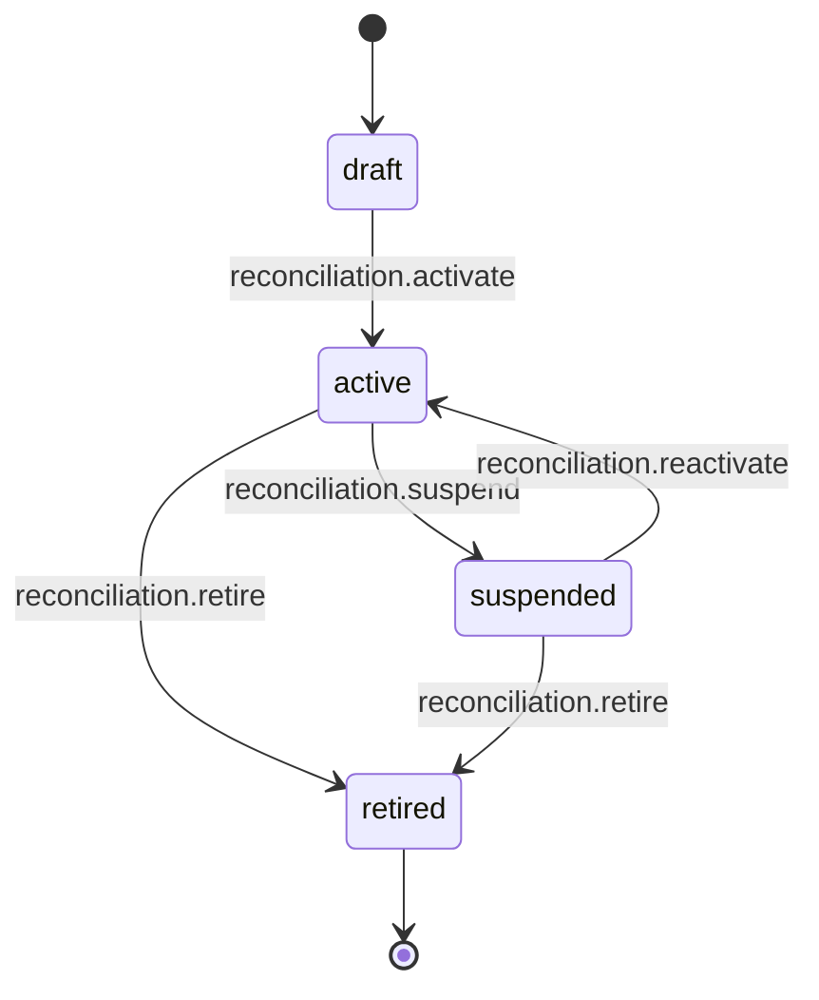
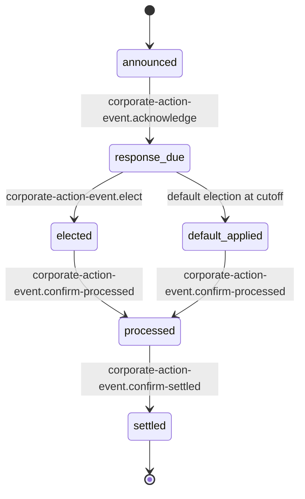
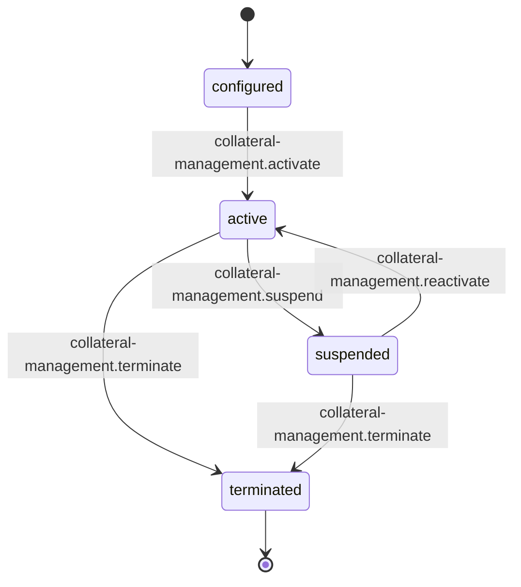
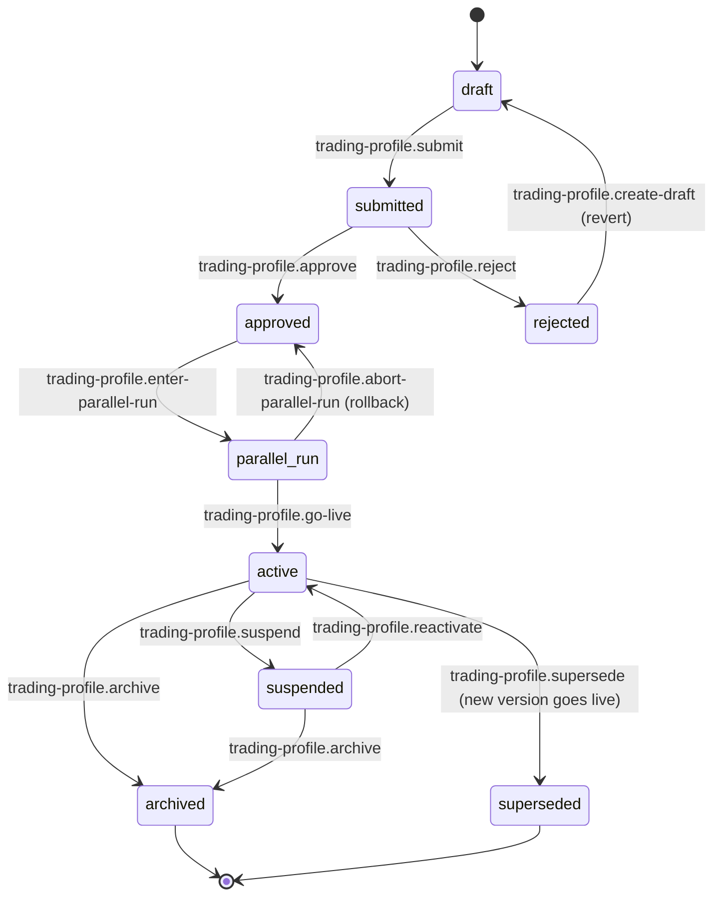
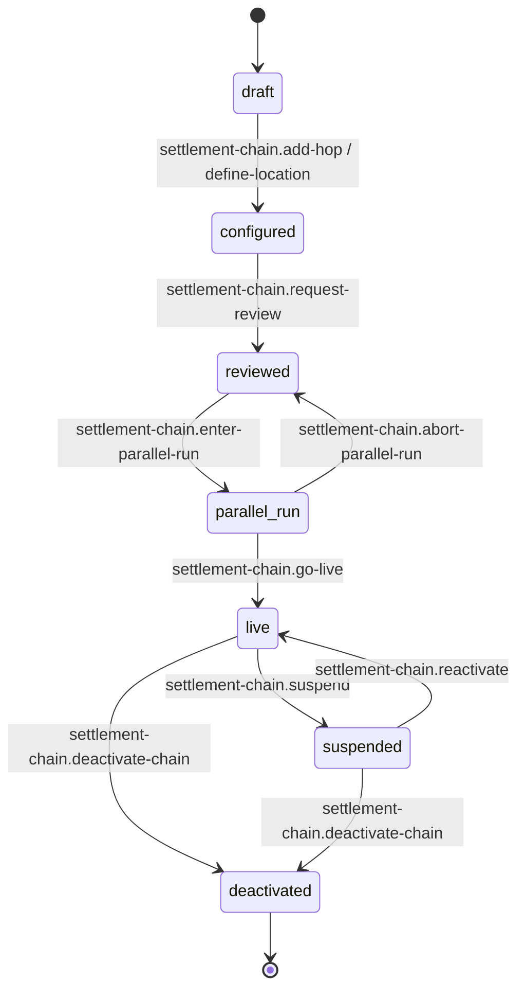
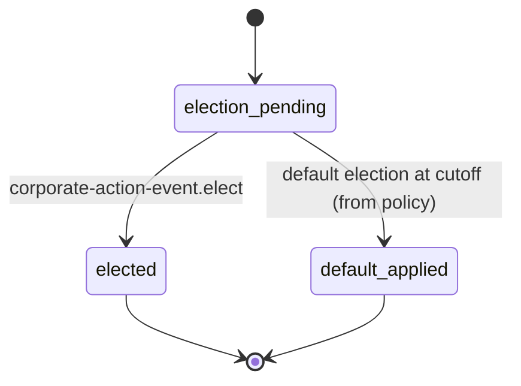

# Instrument Matrix DAG — Pass 3: "What vs How" Framing + New Slots (2026-04-23)

> **Status:** CLOSED. Adam's triage of pass-2 Q-A through Q-F (and the
> organizing principle in his response) resolves the remaining open
> questions. This doc captures:
>
> 1. The **"what vs how"** architectural principle — the unifying rule
>    for which slots belong in the DAG and which don't.
> 2. Decisions on Q-A through Q-F.
> 3. Three new slots added to the inventory (recon, CA event,
>    collateral management).
> 4. Updated state machines for `trading_profile` and `settlement_pattern`
>    (parallel_run states added).
> 5. Revised slot count: **18 → 21**.
>
> **Parent docs:** DAG diagram (pass 1), sanity review pass 2, A-1 v3
> slot inventory. This doc supersedes pass-2 findings with Adam's
> resolutions.

---

## 1. The organizing principle — **"what vs how"**

Adam's response crystallizes the rule:

> *"overall the instrument matrix is what are the assets types / classes
> in scope to be held / traded. and then what are the config setting -
> BIC swift fix etc being used to instruct (BNY)"*

This is a decisive architectural frame. The Instrument Matrix DAG
captures:

**WHAT** — the standing substance of the mandate:
- **Asset types / classes** in scope to be held / traded.
- **Config** used to instruct external parties (BIC, SWIFT, FIX,
  custodian instructions, settlement paths, CA election rules).
- **Lifecycle state of the config itself** — draft / active / suspended
  / retired — for those configs that need governance.

**HOW** — operational execution that the DAG does NOT model:
- **Service quality** — certifications, UAT, parallel-run readiness
  testing (these live in service resource setup, not the DAG).
- **Exception handling** — settlement fails, unmatched trades, CA
  misses (these live in service-profile territory).
- **Operational sub-states** — partial-settlement mechanics, FIX cert
  progression, etc.

**Decision rule for any proposed state or slot:**

> Is this a **standing property** of the mandate (what the mandate IS
> or is configured to do), or an **operational detail** of executing it
> (how the mandate runs day-to-day)?
>
> - Standing property → belongs in the DAG.
> - Operational detail → belongs in service profile / ops workspace,
>   outside the DAG.

This rule explains why Adam kept (recon, CA events, collateral mgmt)
in IM scope and rejected (gateway UAT, partial-settlement state,
exception handling). Recon is *what we check the mandate against*;
CA events are *what hits the mandate's holdings*; collateral is *what
the mandate posts to counterparties*. All three are standing mandate
properties. UAT, partial settlement, exception handling are all
operational execution details.

This principle will be referenced throughout pilot P.2 / P.3 / P.9 as
the test for any future "should this be a DAG slot / state?"

---

## 2. Decisions on pass-2 open questions

| Q | Topic | Adam's answer | Resolution |
|---|---|---|---|
| **Q-A** | Reconciliation config on mandate | *"recon is part of a mandate"* | **Add `reconciliation` slot to IM.** See §3.1 for state machine. |
| **Q-B** | Corporate Action event tracking | *"CA is part of the instrument matrix - as are stiffs / cash sweeps"* | **Add `corporate_action_event` slot to IM.** See §3.2. CA events are the "what happens to holdings"; IM owns them. |
| **Q-C** | Derivatives in pilot scope? | *"derivatives are 100% in scope"* + *"add collateral management as a first class branch"* | **Add `collateral_management` slot to IM.** S-3 escalates from MEDIUM-conditional to **HIGH-confirmed**. See §3.3. |
| **Q-D** | Exception / break handling | *"not part of the mandate - we don't need to cover that - its part of the service profile - which we don't specify on this dag"* | **DEFER out of DAG.** Service profile territory. IM does not own. No action in P.2. |
| **Q-E** | `parallel_run` state | *"parallel run - add to state"* | **ADD `parallel_run` state to `trading_profile_lifecycle` and `settlement_pattern`.** See §4. |
| **Q-F** | Trade gateway UAT intermediate | *"that is service resource setup - that the how - not the what - we are capturing the what in the DAG"* | **DO NOT ADD UAT state.** Trade gateway keeps its 4-state lifecycle (defined/enabled/active/suspended). UAT / FIX-cert is service resource setup and lives on the `service_resource` slot, not trade_gateway. |

| R | Refinement | Adam's answer | Resolution |
|---|---|---|---|
| **R-4** | CBU `actively_trading` distinction | *"r4 - derived"* | **Derived attribute, not a state.** CBU keeps 7 states per A-1 v3 §Q7. |
| **R-5** | CA policy stateless | *"ca policy is a what not a how - stateless"* | **Confirmed declare-stateless.** CA policy is static config — what-elections-we-make-by-default. The CA EVENT is stateful (new slot §3.2); the POLICY is not. |
| **R-6** | Delivery partial-settlement | *"we are covering the what - that is getting into the how"* | **DO NOT ADD.** Partial-settlement is operational execution; belongs in service profile. `delivery` keeps 5-state lifecycle. |

---

## 3. New slots — state machines + verb requirements

Three new stateful slots. Each needs P.2 authoring (state machine in
YAML) + P.3 authoring (per-verb three_axis declarations for the verbs
that transition it).

### 3.1 `reconciliation` — mandate reconciliation config

**What it models.** The mandate's declaration that "we reconcile
positions / cash / NAV against source X with tolerance Y and
escalation path Z." This is config — what-we-reconcile — not the
event of running a recon.

**Classification:** new-state-machine, HIGH confidence (Adam confirmed
"part of mandate"). Config-level lifecycle.

**Proposed states:** 4 — matches most mandate config lifecycle patterns.



**Proposed verbs** (P.3 authors):

| Transition | Verb |
|---|---|
| (new) → draft | `reconciliation.create-config` |
| draft → active | `reconciliation.activate` |
| active → suspended | `reconciliation.suspend` |
| suspended → active | `reconciliation.reactivate` |
| active / suspended → retired | `reconciliation.retire` |

**State-preserving (config):** `reconciliation.set-sor`, `.set-tolerance`,
`.set-escalation-path`, `.add-recon-stream`, `.remove-recon-stream`,
`.list`, `.read`.

**What this slot does NOT cover (per "what vs how"):**
- The event of running a recon (scheduled → running → matched → breaks).
  That's operational — belongs in service profile.
- Break investigation workflow. Operational.
- Auto-remediation. Operational.

Only the config + its governance lifecycle.

---

### 3.2 `corporate_action_event` — per-mandate CA event lifecycle

**What it models.** An individual CA event (AAPL 4:1 split, MSFT
dividend, tender offer) as it hits a specific mandate's holdings.
Distinct from `corporate_action_policy` which is the mandate's default
election rules.

**Classification:** new-state-machine, HIGH confidence (Adam explicitly
scoped CA into IM alongside stiffs / cash sweeps). Event-level lifecycle.

**Proposed states:** 6 — matches real CA event flow.



**Proposed verbs:**

| Transition | Verb |
|---|---|
| (feed-in) → announced | `corporate-action-event.announce` |
| announced → response_due | `corporate-action-event.acknowledge` |
| response_due → elected | `corporate-action-event.elect` |
| response_due → default_applied | (automatic at cutoff per `corporate_action_policy.default_option`) |
| elected / default_applied → processed | `corporate-action-event.confirm-processed` |
| processed → settled | `corporate-action-event.confirm-settled` |

**State-preserving:** `corporate-action-event.read`, `.list-open`,
`.list-pending-election`, `.get-impact-summary`.

**What this slot does NOT cover:**
- Global CA event data (record date, ratios, etc.) — that's reference
  data from external feeds.
- Ops break on CA (missed election, failed processing) — operational,
  belongs in service profile.

Per-mandate election state + transition through its lifecycle is in
scope.

**Interaction with `corporate_action_policy` (stateless):**

The POLICY (stateless) feeds into the EVENT (stateful):
- `default_applied` transition uses `corporate_action_policy.default_option`
  for the election value.
- `cutoff_rule` in the policy determines when `response_due → default_applied`
  fires.
- `proceeds_ssi` in the policy routes `settled`-stage proceeds.

Policy is the static rule; event is the instantiation. Clean split.

---

### 3.3 `collateral_management` — derivatives collateral config

**What it models.** The mandate's collateral posting arrangement:
which CSAs are in play, what's the collateral schedule, what's the
overall status of collateral management for this mandate.

**Classification:** new-state-machine, HIGH confidence (Adam's Q-C
answer — derivatives 100% in scope, collateral as first-class branch).

**Proposed states:** 4 — config-level lifecycle matching other mandate
slots.



**Proposed verbs:**

| Transition | Verb |
|---|---|
| (new) → configured | `collateral-management.configure` |
| configured → active | `collateral-management.activate` |
| active → suspended | `collateral-management.suspend` |
| suspended → active | `collateral-management.reactivate` |
| active / suspended → terminated | `collateral-management.terminate` |

**State-preserving:**
- Config attrs: `.set-threshold`, `.set-mta` (minimum transfer amount),
  `.set-eligible-collateral-schedule`, `.link-csa`, `.link-triparty-agent`.
- Read: `.read`, `.list`.

**Interaction with `isda_framework`:**

`isda_framework` remains declare-stateless (per A-1 v3 / Q2 — IM
doesn't own ISDA lifecycle; legal-ops system does). `collateral_management`
references the CSAs attached to an ISDA but operationalizes them for
this mandate. The ISDA is the legal umbrella (owned externally); CSA
is the collateral annex (referenced by us); collateral_management is
how the mandate operationalizes posting.

**What this slot does NOT cover:**
- Margin call events (announced → pending → posted → reconciled).
  That's operational execution — a candidate for a future
  `margin_call_event` slot IF we later decide to surface individual
  margin calls as events (parallel to `corporate_action_event`).
  Deferred for pilot.
- Triparty reconciliation. Operational.

---

## 4. State-machine updates — `parallel_run` addition

R-1 and R-2 both confirmed. Adding `parallel_run` between "approved"
and "active" on two slots.

### 4.1 `trading_profile_lifecycle` — revised to 8 states



**New verbs P.3 authors:**
- `trading-profile.enter-parallel-run` (approved → parallel_run)
- `trading-profile.go-live` (parallel_run → active)
- `trading-profile.abort-parallel-run` (parallel_run → approved)
- `trading-profile.supersede` (active → superseded) — already noted
  in pass 1

### 4.2 `settlement_pattern` — revised to 6 states



**New verbs P.3 authors:**
- `settlement-chain.request-review` (configured → reviewed)
- `settlement-chain.enter-parallel-run`
- `settlement-chain.go-live`
- `settlement-chain.abort-parallel-run`
- `settlement-chain.suspend`, `.reactivate` — already flagged in pass 1

**R-2 supersede attribute.** Add `superseded_by` reference column to
the chain row (not a state — a graph attribute). Lets ops trace "chain
A was replaced by chain B on date D." Small schema addition to be
written alongside the other chain verbs.

---

## 5. Revised slot inventory — 18 → 21

Adding 3 new slots to A-1 v3's 18-slot classification. Net tally:

| Classification | A-1 v3 count | Pass-3 adds | Pass-3 total |
|---|---|---|---|
| declare-stateless | 9 | 0 | 9 |
| new-state-machine | 8 | **+3** (reconciliation, CA event, collateral_management) | **11** |
| reconcile-existing | 1 | 0 | 1 |
| **Total slots** | **18** | **+3** | **21** |

**Total states across all stateful slots:**

| Slot | States | Source |
|---|---|---|
| group.discovery | 5 | A-1 v3 (schema) |
| trading_profile (template) | 2 | A-1 v3 (Q6) |
| settlement_pattern | **6** (+1 parallel_run) | pass 3 |
| cbu | 7 | A-1 v3 + Q7 |
| trading_profile (streetside) | **9** (+1 parallel_run, +1 superseded) | pass 3 |
| trade_gateway | 4 | A-1 v3 |
| service_resource | 4 | A-1 v3 (Q9b) |
| service_intent | 3 | A-1 v3 (schema) |
| delivery | 5 | A-1 v3 (schema) |
| **reconciliation** | **4** | pass 3 NEW |
| **corporate_action_event** | **6** | pass 3 NEW |
| **collateral_management** | **4** | pass 3 NEW |
| **Total** | **59 states** | — |

(A-1 v3 estimated ~42 states; pass-3 brings it to ~59 with the new
slots and additional states. ~40% growth in authoring scope.)

**P.2 effort recalibration.** Original pilot estimate was 3 days (2-5
range). With 59 states instead of 42, expect ~15 additional states ×
10 minutes = ~2.5 hours. P.2 still inside the 2-5 day range, now
closer to upper-mid.

---

## 6. Updated "what vs how" verb taxonomy reminder

For P.3's per-verb declaration work, the test for any proposed verb:

- **What verb** (standing property / config): `state_effect: transition`
  (moves a standing config through lifecycle) or `state_effect:
  preserving` with config-mutation (updates config within a state).
  Belongs in the pack.
- **How verb** (operational execution detail): probably does NOT belong
  in the Instrument Matrix pack. Belongs in service profile /
  operations workspace.

This is the governance rule for verb admission into the pack. P.3
applies it when declaring the ~186 pack verbs + the new ones added by
pass 3.

---

## 7. Summary of what changes for P.2 and P.3

### P.2 (DAG taxonomy YAML authoring):

- Author the DAG YAML for **21 slots** (was 18).
- 11 state machines (was 8) + 1 reconcile + 9 stateless.
- Revised state counts on `trading_profile_lifecycle` (9 states) and
  `settlement_pattern` (6 states) — parallel_run + superseded.
- New `cross_slot_constraints:` section (pass 1 O-3).
- Hybrid-persistence marker for `trade_gateway` (Q3).
- `superseded_by` reference attribute on `settlement_pattern` rows
  (small schema note).

### P.3 (per-verb three_axis declaration):

- 186 pack verbs (post-prune) + ~15 new verbs to declare for the new
  slots and parallel_run transitions:
  - 5 `reconciliation.*` transition verbs
  - 6 `corporate-action-event.*` transition verbs
  - 5 `collateral-management.*` transition verbs
  - 4 `trading-profile.*` new verbs (enter-parallel-run, go-live,
    abort-parallel-run, supersede)
  - 4 `settlement-chain.*` new verbs (request-review, enter-parallel-run,
    go-live, abort-parallel-run)
- Total ~24 new verbs. P.3 scope: **186 existing + 24 new = ~210 verbs**
  (ironically back to the original pack-size figure, but now with a
  clean declared surface).

### P.9 (findings):

- Codify the "what vs how" architectural principle as a v1.1 candidate
  amendment.
- Document the policy-vs-event split pattern (CA policy stateless;
  CA event stateful — applies the same lens to recon config vs recon
  events, collateral config vs margin call events).
- Note that exception/break handling + UAT certification + partial-
  settlement mechanics all live outside the DAG in service profile /
  operations workspace.

---

## 8. Exit

Pass 3 CLOSES all pass-2 open questions. The slot inventory is now
frozen at 21 slots. P.2 can proceed to YAML authoring with no further
domain gating.

**Pattern captured for future audits:**

> When asking "should X be a DAG slot or a state?":
> 1. Is X a standing property of the mandate (what it IS, what it's
>    configured to do, what it holds, how it instructs)? → DAG.
> 2. Is X operational execution quality (how fast, how reliable, how
>    well-certified, how breaks are handled)? → service profile /
>    operations workspace.
>
> Adam's framing is the test. Apply consistently.

---

## 9. Addendum — Adam's sharper framing (post-commit clarification)

After pass 3 landed, Adam offered a sharper statement of what the
DAG is:

> *"'how' i mean operational run time issues — we are capturing
> static ref data mostly — and enough setup / config info to allow the
> service resources to be configured (e.g. accounts to be opened, tax
> flags set, trade and instruction routings — BIC / SWIFT / FIX etc —
> to be configured)"*

This is a sharper lens than "what vs how" alone. The DAG is **the
upstream declarative specification that feeds downstream service-
resource provisioning.** Specifically:

**What the DAG carries:**
1. **Static reference data** — asset classes, jurisdictions, identifiers,
   endpoint codes (BIC, SWIFT, FIX session IDs, DTC participant codes,
   custodian names, broker identifiers, subcustodian networks).
2. **Standing configuration** — what each mandate is *set up to do*:
   policies, rates, preferences, routings, thresholds.
3. **Config lifecycle** — the governance state of that config
   (draft → approved → active → retired). Includes config-level
   intermediate states like `parallel_run` (the config is in test mode
   — a static property of the config itself, not a runtime event).
4. **Enough info for service resources to be provisioned** — accounts
   to be opened, tax flags to be set, trade/instruction routings wired.

**What the DAG does NOT carry:**
1. **Operational run-time events** — daily settlement runs, recon
   executions, margin call events, CA processing flows, broken
   trades, FIX session drops.
2. **Service execution state** — partial settlement mechanics, UAT
   certification progression, processing/settlement status of
   individual events.
3. **Incident / exception lifecycle** — investigations, write-offs,
   escalations.

### 9.1 What this refines in pass 3

**Most pass-3 decisions stand unchanged.** Under this sharper lens:

- `reconciliation` slot (config-level lifecycle) ✅ correct — recon
  config is what-we-compare-against; recon RUN events are operational
  and excluded.
- `collateral_management` slot (config-level lifecycle) ✅ correct —
  CSA config is what-we've-arranged; margin call events are
  operational.
- `parallel_run` state on `trading_profile` and `settlement_pattern`
  ✅ correct — this is the CONFIG's state ("the config is in pilot
  test"), not a runtime event.
- `superseded` state ✅ correct — graph attribute + state transition,
  both config-level.
- Trade gateway 4-state lifecycle (no UAT) ✅ correct — `defined` /
  `enabled` / `active` / `suspended` are all config states. UAT cert
  is operational and excluded (service resource territory).
- `isda_framework` stateless (read-only from legal-ops) ✅ correct —
  we don't own the ISDA lifecycle.
- Exclusions — exception handling, partial settlement, FIX cert
  progression ✅ correctly out of scope.

**One pass-3 decision needs refinement.**

### 9.2 `corporate_action_event` — narrow from 6 states to 3

Pass-3 proposed a 6-state CA event lifecycle:
`announced → response_due → elected → default_applied → processed → settled`.

Under the sharper lens, `processed` and `settled` are **operational
runtime events** — they're *how* the election gets settled, not
*what* the mandate has decided. The DAG's legitimate scope per event
is: "did the mandate elect, and what was elected?"

**Revised `corporate_action_event` slot — 3 states (decision-capture only):**



**States:**

- `election_pending` — event has been announced and attached to the
  mandate; no election yet.
- `elected` — mandate actively chose an election.
- `default_applied` — cutoff passed, `corporate_action_policy.default_option`
  applied automatically.

**Processing + settlement** of the election are operational runtime
— tracked in service profile, not this slot. Downstream consumers
(settlement ops, custody feeds) read the elected decision from here
and execute; their execution state is their own concern.

**Revised verbs (P.3 scope):**

| Transition | Verb |
|---|---|
| (event feed) → election_pending | `corporate-action-event.attach` |
| election_pending → elected | `corporate-action-event.elect` |
| election_pending → default_applied | (automatic at cutoff) |

**State-preserving:** `corporate-action-event.read`, `.list-pending-election`.

**DROPPED from P.3 scope** (no longer in DAG):
- `corporate-action-event.confirm-processed` — operational.
- `corporate-action-event.confirm-settled` — operational.

### 9.3 Revised state counts

| Slot | Pass-3 states | Revised | Delta |
|---|---|---|---|
| corporate_action_event | 6 | 3 | **-3** |
| All others | unchanged | unchanged | 0 |
| **Total** | 59 | **56** | **-3** |

P.3 verb scope reduces by 2 verbs (dropped `confirm-processed`,
`confirm-settled`). Net P.3 scope: ~22 new verbs (was 24).

### 9.4 Borderline note — `delivery` slot

`delivery` currently has a 5-state machine per schema (PENDING /
IN_PROGRESS / DELIVERED / FAILED / CANCELLED). Under the sharper lens,
this IS operational — it tracks the execution of individual service
deliveries, not config.

**Decision: keep as-is per A-1 v3.** Schema is authoritative;
retrofitting the slot out of the DAG would require schema changes and
migration. Flag in P.9 findings as "borderline — operational slot
retained because schema persists it; future refactor could relocate
delivery tracking out of the IM workspace."

### 9.5 Pattern codified

The DAG sits **one layer upstream** of operations:

```
┌──────────────────────────────────────────────────────────┐
│  INSTRUMENT MATRIX DAG (this workspace)                  │
│    - ref data (asset types, identifiers, endpoints)      │
│    - standing config (policies, routings, thresholds)    │
│    - config lifecycle (draft→active→retired, parallel)   │
│    - enough to provision downstream                      │
└──────────────────────────────────────────────────────────┘
                            │
                            ▼ (feeds provisioning of)
┌──────────────────────────────────────────────────────────┐
│  SERVICE RESOURCES (downstream of DAG)                   │
│    - accounts opened                                     │
│    - tax flags set                                       │
│    - SWIFT/FIX/BIC routings configured                   │
│    - custodian relationships wired                       │
└──────────────────────────────────────────────────────────┘
                            │
                            ▼ (operated by)
┌──────────────────────────────────────────────────────────┐
│  SERVICE PROFILE / OPERATIONS (not in DAG)               │
│    - runtime events (recon runs, margin calls)           │
│    - exception handling (fails, breaks, investigations)  │
│    - execution quality (UAT, SLA, cert)                  │
│    - processing/settlement lifecycle                     │
└──────────────────────────────────────────────────────────┘
```

Three layers, clear boundaries. The DAG is the spec; service resources
are the provisioned infrastructure; operations run on top. Rule of
thumb: if a proposed state or verb describes DAILY ACTIVITY on the
provisioned infrastructure, it's operational (layer 3). If it
describes the CONFIG ITSELF and its governance, it's DAG (layer 1).

**Codify this diagram in v1.1 of the refinement paper** — it's a
clean architectural statement that resolves many of the edge-case
"should this be a DAG slot?" questions.

---

**End of pass 3 + addendum.**
