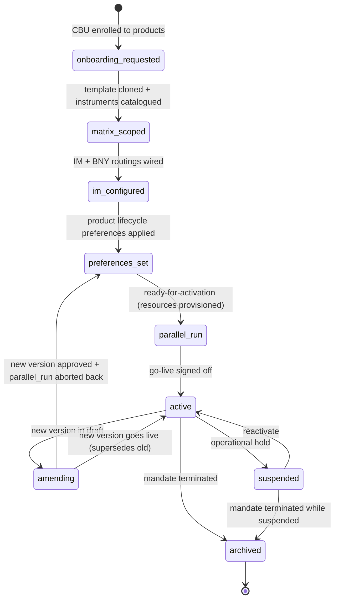

# Instrument Matrix DAG — Pass 7: Overall IM Lifecycle (End-to-End Onboarding Flow) (2026-04-23)

> **Status:** Adam's end-to-end onboarding flow clarification resolves a gap pass 3-6
> didn't capture: **the DAG has an overall state model** that threads through
> individual slot lifecycles to describe the matrix's progression from onboarding
> request to ready-to-transact.
>
> **Parent:** passes 3 (what-vs-how), 4 (product-modular), 5 (conditional
> reachability), 6 (alignment with existing pipeline). This pass adds the
> **aggregate state machine** over the slot state machines.

---

## 1. Adam's clarification (verbatim)

> *"the lifecycle — where instrument matrix fits — is after a CBU is requested
> to be onboarded (to a set of products — with service-specific options
> clarified) — then a vanilla instrument matrix — could be a clone of a template —
> has all instruments CBU is trading — exchange traded and OTC derivatives —
> plus cash options, CA options, FX options and Special settlement instructions —
> these are the services that need to have the assigned resource profiles
> created — to align with the CBU streetside activity — so — initial matrix —
> is what is the client trading — then we get into who is the IM and how are
> they instructing BNY — then recon and pricing and other product lifecycle
> services (preferences) — so the DAG has an overall state model"*

Three things established:

1. **The IM is preceded by an upstream CBU-onboarding phase.** CBU is requested
   to be onboarded to a set of products with service-specific options clarified —
   that's what produces the `service_intents` rows (pass 6).
2. **The IM unfolds in a specific sequence of configuration phases** — not
   arbitrary slot order, but a deliberate "what-is-being-captured-when"
   progression.
3. **The DAG has an OVERALL state model** spanning all slots — one top-level
   lifecycle for the instrument matrix as a whole (per CBU), driven by the
   progression of the underlying slot state machines.

---

## 2. The end-to-end onboarding flow — five phases

### Phase 0 (upstream — pre-matrix) — CBU onboarding request

**Who drives:** Client relationship / sales / onboarding team (outside IM).

**What happens:** A CBU is requested. Products selected. Service-specific
options clarified (which markets, currencies, instrument classes, counterparties).

**Existing tables:**
- `cbus` — CBU record created; status `DISCOVERED → VALIDATION_PENDING → VALIDATED`.
- `service_intents` — one row per (cbu, product, service) with options JSONB.
- KYC workspace runs alongside.

**IM matrix:** does not yet exist.

### Phase 1 — Initial matrix: "what is the client trading"

**Driver:** Vanilla matrix cloned from a template (per-group or per-product-bundle
template).

**What gets captured:**
- Instrument scope:
  - Exchange-traded (equities, bonds, ETFs, listed derivatives — scoped by
    market).
  - OTC derivatives (swaps, forwards, options — scoped by counterparty).
  - Cash options (currencies, sweep vehicles).
  - CA options (corporate action types enabled — from policy).
  - FX options (hedging framework, currency pairs).
  - Special settlement instructions (non-standard custody paths).
- These are the **services that need resource profiles** — each scope decision
  creates a service intent demanding specific SRDEFs.

**Existing tables in play:**
- `cbu_trading_profiles.status: draft`.
- `service_intents` for each product — options JSONB lists markets, currencies,
  instrument_classes, counterparties.
- `matrix-overlay.*` verbs begin populating.
- `movement.*` verbs model fund-specific events (subscriptions/redemptions)
  where TA is taken.

**Slot states:**
- `trading_profile_lifecycle`: `draft`
- `settlement_pattern`: pre-slot state (not yet created) or `draft`
- `isda_framework`, `collateral_management`, `cash_sweep`: not yet created
  (created as scope becomes clear)

### Phase 2 — IM identity + BNY instruction framework: "who is the IM and how are they instructing BNY"

**Driver:** IM identity captured; BNY-side routing configured.

**What gets captured:**
- **Who is the IM:** the party making portfolio-management decisions for the CBU
  (identified via legal_entity + booking_principal rules).
- **How the IM instructs BNY:**
  - `trade_gateway.*` — broker/exchange gateways (FIX sessions, market
    routing preferences).
  - `booking_principal.*` — which IM legal entity books the trade (tax,
    regulatory).
  - `booking_location.*` — jurisdictional booking perimeter.
  - `settlement_pattern` — settlement chains with BIC/SWIFT routings wired.
  - `custody` — SSIs attached to entity_settlement_identity.
  - `instruction_profile.*` — per-message-type instruction templates.

**Existing tables in play:**
- `cbu_trading_profiles.status: submitted` (typically by Phase 2 end).
- `booking_principal` rows created.
- `cbu_settlement_chains` populated.
- `entity_settlement_identity` SSIs set.

**Slot states (end of phase):**
- `trading_profile_lifecycle`: `submitted`
- `settlement_pattern`: `configured → reviewed`
- `trade_gateway`: `defined → enabled` (active requires broker confirmation)
- `booking_principal`: `active` (rules in place)

### Phase 3 — Product lifecycle service preferences: recon + pricing + product-specific config

**Driver:** Per-product config applied based on which products are in the
`service_intents` set.

**What gets captured (product-conditional per pass 4):**

| Product | Preferences captured |
|---|---|
| **Fund Accounting** | Pricing preferences per instrument class + security type; valuation policy; NAV-calc inputs. |
| **Custody** | Tax configurations per jurisdiction; tax reclaim rules; corporate action policy (default elections, notification policy). |
| **Transfer Agency** | Share class definitions; subscription/redemption cut-offs; dealing day rules. |
| **Derivatives** | CSA details; collateral schedule; margin thresholds; triparty arrangements. |
| **Cash Management** | Sweep vehicle + frequency; FX hedge policy; interest allocation. |
| **Reconciliation** (cross-product) | Recon streams (position / cash / NAV); tolerance thresholds; escalation paths. |
| **All** | Regulatory classifications per position; reporting frequency. |

**Existing tables in play:**
- `corporate_action_policy` — CA config on trading_profile.
- `tax-config.*` — tax rules applied.
- `isda_framework` + `collateral_management` (if derivatives).
- `cash_sweep` config.
- `reconciliation` slot (new in pass 3).
- `attribute_registry` values populated per `cbu_unified_attr_requirements`.

**Slot states:**
- `trading_profile_lifecycle`: `submitted → approved → parallel_run`
- All product-specific slots: progressing through their own lifecycles.

### Phase 4 — Ready-for-activation + activation

**Driver:** All required config complete; approvals signed off; resources
provisioned; readiness validated.

**What happens:**
- `cbu_service_readiness` computed green across all active service_intents.
- `cbu_resource_instances` provisioned for all required SRDEFs.
- Final `trading-profile.go-live` executed.

**Slot states:**
- `trading_profile_lifecycle`: `parallel_run → active`
- All downstream slots: `active` / `live`
- CBU: `VALIDATED` with the trading profile active.

**Outcome:** CBU is "good to transact."

### Phase 5 — Ongoing operations + amendments

- Mandate amendments: new version of trading_profile → back through Phase 3 for
  changed preferences → Phase 4 for activation.
- Suspension: `trading_profile_lifecycle: active → suspended`.
- Archival / termination: terminal.

---

## 3. The overall instrument-matrix state machine

Drawing the aggregate across the phases:



**Eight overall states:**

| State | Meaning | Derived from |
|---|---|---|
| `onboarding_requested` | CBU + service_intents exist; no matrix yet | `cbus.status ∈ {DISCOVERED, VALIDATION_PENDING}` |
| `matrix_scoped` | Template cloned; instrument scope captured | `cbu_trading_profiles.status = draft` AND at least one instrument class / market scoped |
| `im_configured` | IM identity + BNY routings configured | `cbu_trading_profiles.status = submitted` AND `settlement_pattern.status ∈ {configured, reviewed}` AND `trade_gateway.status ∈ {defined, enabled}` |
| `preferences_set` | Product-specific preferences complete | `cbu_trading_profiles.status = approved` AND all required product-slot states active per product in service_intents |
| `parallel_run` | Resources provisioned; in shadow mode | `cbu_trading_profiles.status = parallel_run` |
| `active` | Trading live | `cbu_trading_profiles.status = active` AND `cbu_service_readiness` green across active service_intents |
| `amending` | New version in-flight | A newer version of the trading profile in `draft / submitted / approved` |
| `suspended` / `archived` | Terminal or operational | `cbu_trading_profiles.status ∈ {suspended, archived}` |

### 3.1 Is this derived or stored?

**Derived.** The overall state is computed from:
- `cbus.status`
- `cbu_trading_profiles.status`
- Slot states per product family (via `service_intents → slot_states`)
- `cbu_service_readiness` aggregate
- Presence of a newer-version trading profile

No new column / table needed. The DAG YAML declares the derivation rules;
the UI + agent surface that derived state to the user.

### 3.2 What this gives the agent / MCP / UX

A single answer to "where are we with this CBU's instrument matrix?":

```
CBU: Allianz Global Investors / AGI Global Equities Fund
Overall matrix state: preferences_set (4 of 6 phases complete)
  ✔ onboarding_requested   — 2026-03-14 (7 products, 14 service intents)
  ✔ matrix_scoped          — 2026-03-18 (28 markets, 12 instrument classes)
  ✔ im_configured          — 2026-03-22 (3 booking principals, 4 gateways)
  ● preferences_set        — 2026-04-10 (FA pricing 40/45 complete;
                                           collateral mgmt pending)
  ○ parallel_run           — pending (awaiting FA pricing completion)
  ○ active                 — pending

Next action: Complete pricing preferences for remaining 5 instrument classes
            (pricing-preference.set for equity.ADR, equity.GDR, ...)
```

The derivation + narration is what makes the DAG **operator-observable**. Today
ops teams ask "where is this CBU in onboarding?" by querying multiple tables
and piecing it together. The DAG's overall state model answers that in one
place.

### 3.3 Relationship to `cbu_service_readiness`

The existing `cbu_service_readiness` table computes **per-service** readiness
(good-to-transact for that service). The overall matrix state computes
**aggregate** across all services + upstream CBU + trading_profile state + any
in-flight amendments.

Both are derived. `cbu_service_readiness` is finer-grained (per service);
overall matrix state is a coarser phase view. Both coexist.

---

## 4. Phase-slot mapping

For P.2 author: which slots' states contribute to each phase.

| Phase | Required active slots | Key verbs that drive entry |
|---|---|---|
| `onboarding_requested` | `cbus` only | (upstream: cbu.discover, service-intent.create) |
| `matrix_scoped` | `cbus` + `trading_profile.draft` + (`settlement_pattern.draft` ∨ `configured`) | `trading-profile.create-draft`, `trading-profile.clone-to`, `trading-profile.add-instrument-class`, `settlement-chain.create-chain` |
| `im_configured` | `matrix_scoped` + `booking_principal.active` + `trade_gateway.enabled` + `settlement_pattern.reviewed` + `custody` configured | `booking-principal.create`, `trade-gateway.define-gateway`, `settlement-chain.request-review`, `cbu-custody.setup-ssi` |
| `preferences_set` | `im_configured` + product-conditional slots: `corporate_action_policy` configured + `tax-config` set + (if FA) pricing preferences + (if derivatives) `collateral_management.configured` + (if cash) `cash_sweep.active` + `reconciliation.active` | Product-specific configuration verbs |
| `parallel_run` | `preferences_set` + `cbu_resource_instances` provisioned + `cbu_service_readiness` green | `trading-profile.enter-parallel-run` |
| `active` | `parallel_run` complete + sign-off | `trading-profile.go-live` |

### 4.1 Product-conditional Phase 3

Phase 3 (`preferences_set`) is where pass-4's product-modular concept
concretely lands: the slots that MUST be configured are determined by the
CBU's `service_intents` set.

For a custody-only CBU:
- Required for Phase 3: `corporate_action_policy`, `tax-config`, `reconciliation`
- Not required: `collateral_management` (no derivatives), FA pricing
  preferences (no FA), TA share class rules (no TA).

For a custody + FA + derivatives + cash CBU:
- Required for Phase 3: all of the above + FA pricing + collateral mgmt +
  cash sweep.

The phase completion gate per CBU = "all slots required by my service_intents
are in their respective active states." Clean product-modular gating.

---

## 5. Representation in the DAG taxonomy YAML

Addition to `instrument_matrix_dag.yaml` (P.2 authors):

```yaml
# Top-level overall lifecycle (per CBU's instrument matrix)
overall_lifecycle:
  id: instrument_matrix_overall_lifecycle
  scope: per_cbu  # one state per CBU's matrix
  phases:
    - name: onboarding_requested
      derivation:
        - cbus.status IN [DISCOVERED, VALIDATION_PENDING]
        - has_service_intents: true
      progression_verbs:
        - cbu.validate

    - name: matrix_scoped
      derivation:
        - cbus.status = VALIDATED
        - trading_profile.status = draft
        - instruments_scoped: true
      progression_verbs:
        - trading-profile.submit

    - name: im_configured
      derivation:
        - trading_profile.status = submitted
        - booking_principal.has_active: true
        - trade_gateway.has_enabled: true
        - settlement_pattern.has_reviewed: true
      progression_verbs:
        - trading-profile.approve

    - name: preferences_set
      derivation:
        - trading_profile.status = approved
        - all_product_conditional_slots_active: true   # see §4.1
      progression_verbs:
        - trading-profile.enter-parallel-run

    - name: parallel_run
      derivation:
        - trading_profile.status = parallel_run
      progression_verbs:
        - trading-profile.go-live
        - trading-profile.abort-parallel-run

    - name: active
      derivation:
        - trading_profile.status = active
        - cbu_service_readiness.all_green: true
      progression_verbs:
        - trading-profile.supersede
        - trading-profile.suspend
        - trading-profile.archive
        - (any state-preserving configuration verb)

    - name: amending
      derivation:
        - trading_profile.status = active
        - has_newer_version_in_progress: true
      progression_verbs: (back to preferences_set or to active when new version goes live)

    - name: suspended
      derivation:
        - trading_profile.status = suspended OR cbus.status = SUSPENDED
      progression_verbs:
        - trading-profile.reactivate

    - name: archived
      derivation:
        - trading_profile.status = archived
      progression_verbs: (terminal)
```

**P.2 author task:** author this section alongside the per-slot state machines.
The overall lifecycle is a higher-level projection but declared from the same
YAML root.

---

## 6. UX + agent implications

### 6.1 Agent next-step guidance

The agent / Sage's "what's next" narration now has a clean algorithm:

1. Compute overall matrix state (derived).
2. Identify which slots within the current phase still have incomplete
   configuration.
3. Surface the verbs that transition those slots toward phase completion.

This is cleaner than today's per-slot "available verbs" surface because it
gives the operator a **sequenced runbook** aligned with real onboarding
workflow, not just a flat list of verbs.

### 6.2 Progress indicators

Observatory / UI can show:
- Phase breadcrumbs (6 phases visible with check-marks).
- Per-phase progress bars (X of Y slot-requirements met).
- Next-action button tied to the current phase.

### 6.3 Validation gates at phase boundaries

The validator (extended in Tranche 3) can add phase-completion gates:
- "Cannot enter phase N+1 unless phase N's derivation conditions are satisfied."
- Prevents out-of-order progression (e.g. can't set pricing preferences until
  instrument scope is captured).

---

## 7. Net of passes 3-7 — the complete architectural picture

| Dimension | Source pass | Rule |
|---|---|---|
| Vertical 3-layer | 3 addendum | DAG (L1) → Service Resources (L2) → Operations (L3) |
| Horizontal product-module | 4 | DAG = core ∪ modules-per-product-in-service_intents |
| Runtime reachability | 5 | Per-CBU effective DAG = catalogue ∩ CBU's service_intents |
| Alignment with existing infra | 6 | products/services/SRDEFs exist; DAG is lifecycle semantics over them |
| **End-to-end lifecycle** | **7** | **Overall state machine threads through 6 phases: request → scoped → IM-configured → preferences-set → parallel_run → active** |

Together: the Instrument Matrix DAG is a **product-modular, per-CBU reachable,
lifecycle-governed declarative spec** that layers lifecycle semantics over the
existing products/services/SRDEFs/service_intents pipeline, with an overall
state model aggregating per-slot states into an onboarding progression.

---

## 8. Pilot impact

**Scope stays controlled.** What pass 7 adds:
- P.2 author includes the `overall_lifecycle:` section in the DAG YAML.
- ~8 phase definitions with derivation rules and progression verbs.
- Small increment (~1-2 hours additional P.2 authoring).

**No code changes in P.1.** The overall state derivation is a read-time
projection; no new validator / parser / evaluator changes.

**Feeds P.8** (Catalogue workspace prototype) with natural UX: progress view,
phase-scoped verb surfacing.

**Feeds P.9 findings** as a core architectural contribution — "instrument
matrix has an overall lifecycle aggregating its slot states."

---

## 9. Questions for Adam (pass-7 gate)

**Q-CA.** Is the six-phase onboarding progression I've sketched (onboarding_requested → matrix_scoped → im_configured → preferences_set → parallel_run → active) the right shape, or do you see a different decomposition?

**Q-CB.** Should the overall state be derived (my recommendation) or stored explicitly on a CBU-level column (e.g. `cbu.matrix_lifecycle_phase`)? Derived is cleaner but loses at-a-glance DB queryability.

**Q-CC.** Is there a "matrix scoped but NOT yet IM-configured" state worth calling out separately, or does my Phase-2 / Phase-3 split capture it?

**Q-CD.** For `amending`, does the amendment lifecycle mirror the full five-phase flow each time (a minor amendment ALSO re-enters preferences_set briefly), or do minor amendments bypass the early phases?

---

**End of pass 7.** This closes the overall state model gap. Pending Adam's
answers before P.2 authoring begins.
