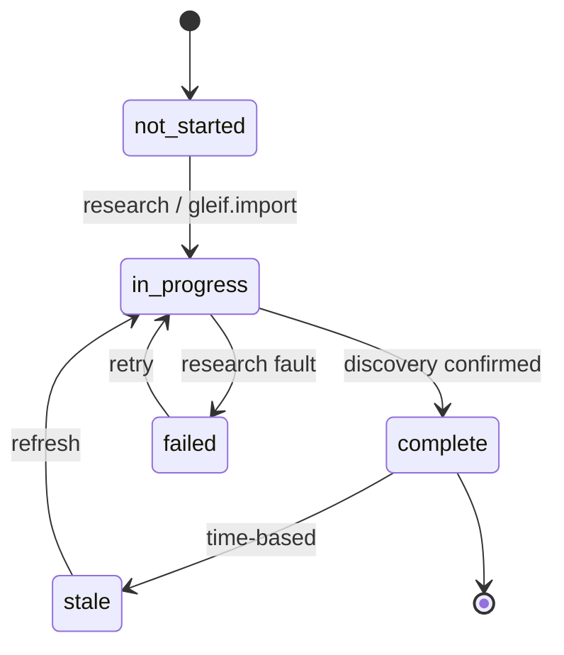
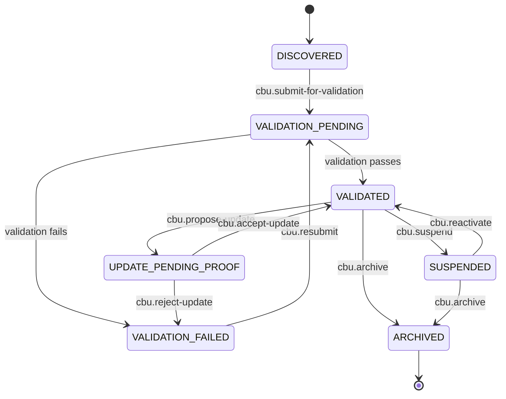
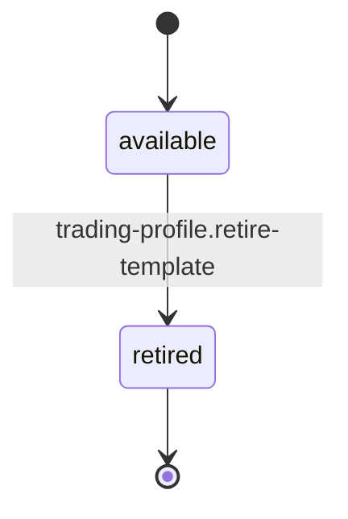
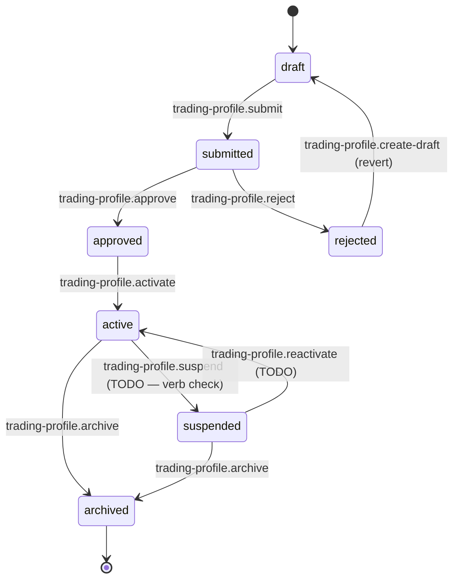
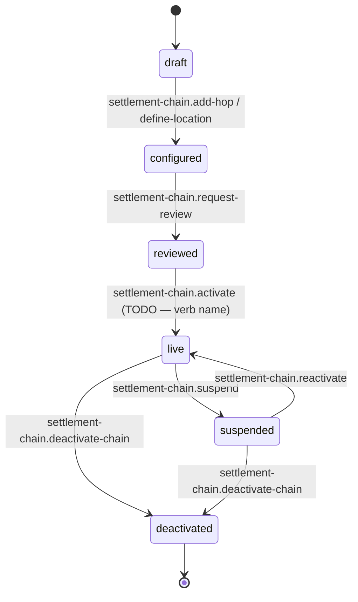
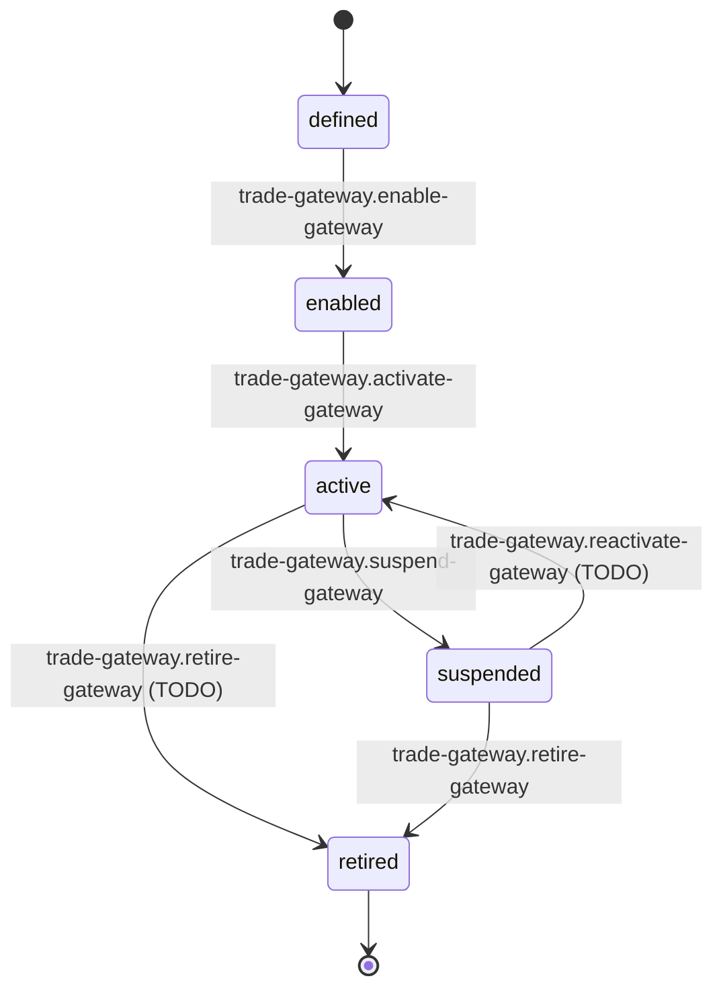
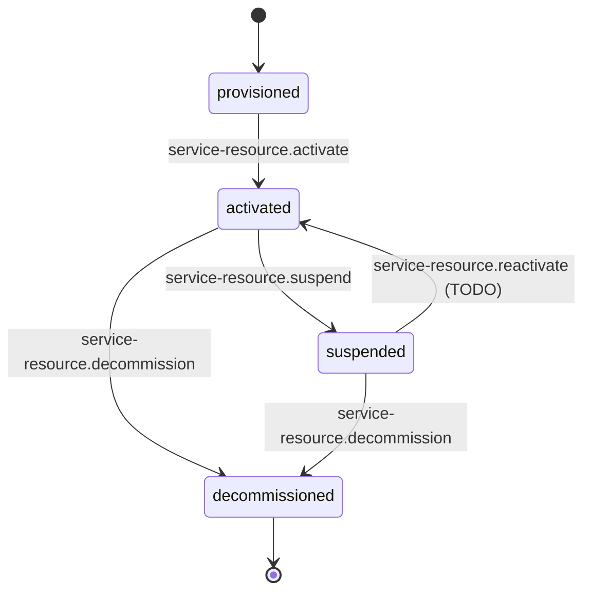
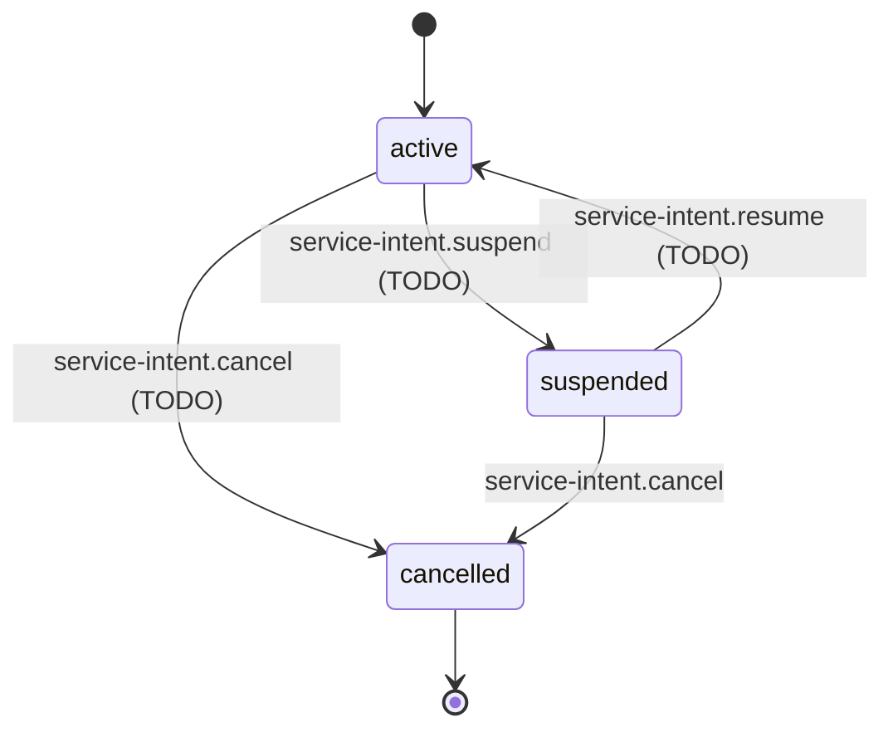
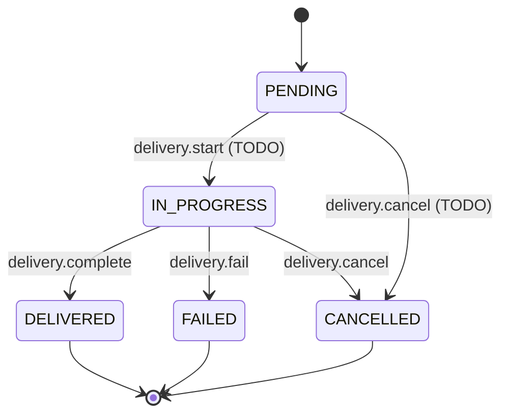

# Instrument Matrix — DAG Workspace Diagram + IM-Mandate Sanity Review (2026-04-23)

> **Purpose:** consolidated diagram-form view of the Instrument Matrix
> workspace: state-machines per slot, verb-to-state mappings, stateless
> slot composition map, and a sanity review from the investment-manager
> trading-mandate perspective.
>
> **Intended audience:** three faces of the same source-of-truth:
> - **Human operator** — browsing workspace capabilities in the REPL or
>   docs.
> - **Agent / Sage** — composing runbooks and verifying what's reachable
>   from the current state.
> - **MCP / external client** — introspecting the catalogue before
>   issuing actions.
>
> The rendered diagrams below MUST stay consistent with what P.2 authors
> in `rust/config/sem_os_seeds/dag_taxonomies/instrument_matrix_dag.yaml`
> — if P.2 refines a state name or adds an edge, this doc updates. The
> YAML remains the machine source-of-truth; this doc is the human view.
>
> **Parent docs:**
> - `instrument-matrix-pilot-plan-2026-04-22.md` (pilot plan)
> - `instrument-matrix-slot-inventory-2026-04-23.md` (A-1 v3, CLOSED)
> - `instrument-matrix-dag-dsl-break-remediation-2026-04-23.md`
>
> **Diagram format:** Mermaid `stateDiagram-v2`. Renders natively in
> GitHub and most markdown viewers.

---

## 1. Workspace framing — what this workspace models

**The Instrument Matrix workspace is, at its heart, the operational
model of an investment-manager trading mandate.** A mandate is the
contract between an IM and a client (the CBU — fund, portfolio, SMA,
or book) that says *"on behalf of this client, you are authorized to
trade these instruments, on these markets, through these counterparties,
settling through these paths, with this cash management."*

The workspace captures everything the IM needs to OPERATIONALIZE that
contract — not the trade execution itself (that's a separate workspace),
but the standing configuration that every trade is validated against
and settled through.

Three layers, matching the three constellation maps:

| Layer | Constellation | Purpose |
|---|---|---|
| Workspace-level | `instrument.workspace` | Capability root — the surface of verbs exposed to the workspace |
| Template-level | `instrument.template` | Reusable mandate template — author once, clone to many CBUs |
| Instance-level | `trading.streetside` | The mandate bound to a specific CBU, with its own lifecycle and slot instances |

**What the mandate operationally includes** (checked against A-1 v3):

| Mandate facet | A-1 v3 slot | State machine? |
|---|---|---|
| Trading profile (the mandate document itself) | `trading_profile` (template + streetside) | ✅ yes — full lifecycle |
| Settlement chain & SSIs | `settlement_pattern` + `custody` | ✅ settlement_pattern lifecycle; custody compositional |
| ISDA / CSA framework | `isda_framework` | ⚠️ schema-binary; IM reality richer (see §6) |
| Corporate actions policy | `corporate_action_policy` | compositional (inherits from trading_profile) |
| Trade gateway (broker routing) | `trade_gateway` | ✅ planned lifecycle (hybrid persistence) |
| Booking principal (tax/regulatory booking entity) | `booking_principal` | stateless rule |
| Cash sweep (idle-cash vehicle) | `cash_sweep` | binary |
| Service resource lifecycle | `service_resource` | ✅ full 4-state |
| Service intent | `service_intent` | ✅ 3-state |
| Delivery (service-delivery status) | `delivery` | ✅ 5-state |
| Booking location (jurisdictional perimeter) | `booking_location` | stateless reference |
| Legal entity reference | `legal_entity` | stateless reference (KYC workspace owns lifecycle) |
| Product reference | `product` | stateless (inherits from profile) |

**What's NOT here** (by design — belongs in other workspaces): trade
execution, KYC case transitions, counterparty due-diligence, fund
subscription / redemption matching, valuation / NAV calc. See §6 for
edge cases where IM domain knowledge suggests something might be
missing from the Instrument Matrix scope.

---

## 2. Stateful slots — state diagrams + verb maps

Nine stateful slots. For each: Mermaid state diagram, verbs that trigger
each transition, and state-preserving verbs (operations that work within
a state without moving to another).

### 2.1 `group.discovery_status` — client-group discovery lifecycle

**States:** 5 (schema-confirmed).

**Transition verbs (Instrument Matrix pack scope):**

| From | To | Verb(s) |
|---|---|---|
| not_started | in_progress | `client-group.read` (implicit trigger), external research entry |
| in_progress | complete | (backend: discovery completion signal) |
| in_progress | failed | (backend: research fault signal) |
| complete | stale | (time-decay trigger) |
| stale / failed | in_progress | (backend: refresh / retry) |

**Note.** Most transitions are backend-driven (discovery runs
asynchronously). The pack's `client-group.read` verb is the only
user-facing entry — the lifecycle is mostly system-managed.

**State-preserving verbs:** `client-group.read`.

**IM context.** Groups are the top-level corporate umbrella (e.g.
"Allianz Global Investors" at the group level, with multiple funds
beneath). Discovery completion is a prerequisite to creating any
trading mandate under the group.

---

### 2.2 `cbu.status` — CBU validation + operational lifecycle

**States:** 7 (5 schema-confirmed + 2 from Q7: SUSPENDED, ARCHIVED).

**Transition verbs.** Most CBU transitions are driven via `cbu.*` verbs
(declared in `config/verbs/cbu.yaml`). The Instrument Matrix pack
references several of these as peer-workspace verbs — see §5 on
cross-slot interactions.

**State-preserving verbs (from IM pack):** `cbu.read`.

**IM context.** The CBU is the mandate's *client* — the fund, portfolio,
or SMA being traded. It must reach `VALIDATED` before any
`trading_profile` can be `activated` against it. `SUSPENDED` means
"operational hold" (stop trading, don't unwind). `ARCHIVED` is terminal
(fund closed / terminated).

---

### 2.3 `trading_profile` (template-level) — template lifecycle

**States:** 2 per Adam's Q6 answer.

**Transition verbs:**

| From | To | Verb |
|---|---|---|
| (create) | available | `trading-profile.create-template` (new verb; pilot P.3 adds) |
| available | retired | `trading-profile.retire-template` (new verb) |

**State-preserving verbs:** `trading-profile.list-versions`,
`trading-profile.diff`, `trading-profile.read`, `trading-profile.clone-to`.

**IM context.** A template is a "mandate boilerplate" — e.g. "UCITS
equity long-only template" — that gets cloned per CBU and then
specialized. Template retirement means "don't allow new clones"; it
doesn't invalidate CBUs already cloned from it. Templates live at the
*group* level — one template serves many CBUs within the same group.

---

### 2.4 `trading_profile` (streetside instance) — mandate lifecycle (`trading_profile_lifecycle`)

**States:** 7 (existing, reconcile-existing from `trading_streetside.yaml`).

**Transition verbs:**

| From | To | Verb | Declared today? |
|---|---|---|---|
| (new) | draft | `trading-profile.create-draft` | ✅ |
| draft | submitted | `trading-profile.submit` | ✅ |
| submitted | approved | `trading-profile.approve` | ✅ |
| submitted | rejected | `trading-profile.reject` | ✅ |
| approved | active | `trading-profile.activate` | ✅ |
| active | suspended | `trading-profile.suspend` | ❌ **GAP** |
| suspended | active | `trading-profile.reactivate` | ❌ **GAP** |
| active / suspended | archived | `trading-profile.archive` | ✅ |
| rejected | draft | `trading-profile.create-draft` | ✅ (re-use) |

**State-preserving verbs (within `active`):**
- Read-only: `trading-profile.read`, `.get-active`, `.list-versions`, `.diff`
- Configuration: `.add-component`, `.remove-component`, `.set-base-currency`, `.add-instrument-class`, `.remove-instrument-class`, `.add-market`, `.remove-market`, `.add-ssi`, `.remove-ssi`, `.add-booking-rule`, `.remove-booking-rule`, `.add-isda-config`, `.add-isda-coverage`, `.add-csa-config`, `.add-csa-collateral`, `.link-csa-ssi`, `.remove-csa-config`, `.update-im-scope`, `.add-allowed-currency`, `.add-im-mandate`, `.remove-im-mandate`
- CA policy: `.ca.set-election-policy`, `.ca.set-notification-policy`, `.ca.enable-event-types`, `.ca.disable-event-types`, `.ca.set-default-option`, `.ca.remove-default-option`, `.ca.link-proceeds-ssi`, `.ca.remove-proceeds-ssi`, `.ca.add-cutoff-rule`, `.ca.remove-cutoff-rule`, `.ca.get-policy`
- Validation: `.validate-coverage`, `.validate-go-live-ready`, `.validate-universe-coverage`
- Versioning: `.create-new-version`, `.clone-to`, `.materialize`
- Matrix overlay: `matrix-overlay.add`, `.remove`, `.suspend`, `.activate`, `.list`, `.list-by-subscription`, `.effective-matrix`, `.unified-gaps`, `.compare-products`

**IM context.** This is *the mandate itself* — the operational contract.
The `draft → submitted → approved → active` chain is the compliance
gate. Amendments flow through versioning (`create-new-version`), which
produces a new draft referencing the active profile. Suspension is
"operational pause" (rare — e.g. regulatory investigation); archiving is
terminal (mandate terminated or fund wound down).

**Proposed addition from IM review:** add an explicit `superseded`
terminal state for versions that have been replaced by a newer active
version. Today the old version is silently archived; making `superseded`
explicit helps audit ("this version was replaced by v3 on 2026-04-12")
vs ("this version was operationally archived"). Flagged for P.2 author's
consideration.

---

### 2.5 `settlement_pattern` — settlement-chain lifecycle

**States:** 5 proposed (Adam Q1: "has a pre-activation lifecycle").

**Transition verbs:**

| From | To | Verb | Declared today? |
|---|---|---|---|
| (new) | draft | `settlement-chain.create-chain` | ✅ |
| draft | configured | `settlement-chain.add-hop`, `.define-location`, `.set-location-preference` | ✅ (multiple) |
| configured | reviewed | `settlement-chain.request-review` | ❌ **GAP** |
| reviewed | live | `settlement-chain.activate` or `settlement-chain.go-live` | ❌ **GAP** |
| live | suspended | `settlement-chain.suspend` | ❌ **GAP** |
| suspended | live | `settlement-chain.reactivate` | ❌ **GAP** |
| live / suspended | deactivated | `settlement-chain.deactivate-chain` | ✅ |

**State-preserving verbs:** `settlement-chain.list-*`,
`settlement-chain.set-cross-border`, `settlement-chain.remove-hop` (if
done in `draft` or `configured`).

**IM context.** A settlement chain is the operational path a security
takes from execution to final custody: e.g. `broker (GS) → sub-custodian
(State Street NY) → CSD (DTC) → end-custodian (BONY)`. Each hop is
a legal counterparty relationship with agreed SSIs. A chain goes live
only after:
1. **SSIs confirmed** by all hops (configured → reviewed).
2. **Ops review** — treasury / settlement ops confirm the chain is
   correctly wired (reviewed → live).
3. **Go-live** is the actual activation (reviewed → live).

Suspension happens when a sub-custodian flags an operational issue
(e.g. corporate action in-flight, settlement hold). Deactivation is
when the chain is replaced by a new one (common when an IM changes
sub-custodians).

**IM gap (flagged for P.3):** the current verb set is heavy on
creation/configuration but missing four transitions (`request-review`,
`activate`, `suspend`, `reactivate`). P.3 must either declare these as
new verbs OR tell Adam this is an IM-reality gap that needs filling
before pilot exit. My recommendation: declare them as new verbs with
stubs first, flag as "pilot discovers ~4 verbs need adding to close the
settlement-chain lifecycle" in P.9 findings.

---

### 2.6 `trade_gateway` — broker / exchange-gateway lifecycle (hybrid persistence)

**States:** 4 proposed. Persistence: hybrid (Q3 follow-up — `is_active`
column + authoritative state inside JSON document).

**Transition verbs:**

| From | To | Verb | Declared? |
|---|---|---|---|
| (new) | defined | `trade-gateway.define-gateway` | ✅ |
| defined | enabled | `trade-gateway.enable-gateway` | ✅ |
| enabled | active | `trade-gateway.activate-gateway` | ✅ |
| active | suspended | `trade-gateway.suspend-gateway` | ✅ |
| suspended | active | `trade-gateway.reactivate-gateway` | ❌ **GAP** |
| active / suspended | retired | `trade-gateway.retire-gateway` | ❌ **GAP** |

**State-preserving verbs:** `trade-gateway.read-gateway`,
`.list-gateways`, `.add-routing-rule`, `.remove-routing-rule`,
`.set-fallback`.

**IM context.** A trade gateway is a broker or exchange-access config:
how does this mandate route orders to Goldman, Morgan Stanley, LSE, etc.
Each gateway has negotiated commercial terms (rates, tickets), technical
wiring (FIX sessions, symbology), and operational rules (cut-off times,
routing preferences). The `enabled → active` distinction is: enabled
means the config is complete and the IM side is ready; active means
the counterparty has confirmed and the session is live. `suspended`
is an operational break (counterparty outage, cert expiry); `retired`
is terminal (broker relationship ended).

**Hybrid persistence reminder:** the state lives inside the JSON
document body (`document.state = "active"`). The row's `is_active`
boolean is a materialized view for query speed. The state machine is
owned by the gateway's document type, not the SQL CHECK.

---

### 2.7 `service_resource` — service-resource lifecycle

**States:** 4 (Adam Q9b confirmed).

**Transition verbs:**

| From | To | Verb | Declared? |
|---|---|---|---|
| (new) | provisioned | `service-resource.provision` | ✅ |
| provisioned | activated | `service-resource.activate` | ✅ |
| activated | suspended | `service-resource.suspend` | ✅ |
| suspended | activated | `service-resource.reactivate` | ❌ **GAP** |
| activated / suspended | decommissioned | `service-resource.decommission` | ✅ |

**State-preserving verbs:** `service-resource.read`, `.list`,
`.set-attr`, `.validate-attrs`.

**IM context.** A service resource is an operational asset servicing
the mandate — a nostro, cash account, SWIFT BIC, FIX session, etc.
Provisioning is asking for the resource; activation is when it's live;
decommissioning is when it's permanently torn down. Usually decomm
happens when a mandate changes service provider.

---

### 2.8 `service_intent` — mandate service-intent lifecycle

**States:** 3 (schema-confirmed).

**Transition verbs:**

| From | To | Verb | Declared? |
|---|---|---|---|
| (new) | active | `service-intent.create` | ✅ |
| active | suspended | `service-intent.suspend` | ❌ **GAP** |
| suspended | active | `service-intent.resume` | ❌ **GAP** |
| active / suspended | cancelled | `service-intent.cancel` | ❌ **GAP** |
| active / suspended | (superseded) | `service-intent.supersede` | ✅ |

**State-preserving verbs:** `service-intent.list`.

**IM context.** A service intent declares "I want this capability on
this mandate" — e.g. "I want FX-hedging on all GBP positions", "I want
cash-sweep into EUR STIF." The intent is active until cancelled or
superseded by a newer intent.

**IM quirk (flagged):** the existing DSL has `supersede` but not the
three transition verbs. Adam's answer made service_intent "compositional
/ immutable log-like" in spirit, but the schema has active/suspended/
cancelled states. Suggest: either (a) declare the three missing verbs
or (b) flip the slot to declare-stateless and flag the schema states as
legacy. Flag for Adam's second look.

---

### 2.9 `delivery` — service-delivery lifecycle

**States:** 5 (schema-confirmed).

**Transition verbs:**

| From | To | Verb | Declared? |
|---|---|---|---|
| (new) | PENDING | `delivery.record` | ✅ |
| PENDING | IN_PROGRESS | `delivery.start` | ❌ **GAP** |
| IN_PROGRESS | DELIVERED | `delivery.complete` | ✅ |
| IN_PROGRESS | FAILED | `delivery.fail` | ✅ |
| PENDING / IN_PROGRESS | CANCELLED | `delivery.cancel` | ❌ **GAP** |

**State-preserving verbs:** (none currently in pack — read-only delivery
records).

**IM context.** Delivery tracks discrete service-execution events —
e.g. "deliver 1,000 shares of AAPL to client custody account" or "FX
hedge executed for £5M GBP-USD." States are self-explanatory.

---

## 3. Stateless slots — compositional map

Nine slots are `declare-stateless` in A-1 v3. They're not dead — they're
either reference-lookup surfaces, compositional projections over other
entities, or binary flags that don't warrant machinery.

| Slot | Why stateless | Verbs that operate on it | IM context |
|---|---|---|---|
| `workspace_root` | No DB table; pure projection | (all verbs in the workspace scope) | The capability root |
| `group` | Read-only reference to parent group | `client-group.read` | Group corpus umbrella (Allianz, BlackRock) |
| `isda_framework` | DSL binary (per Q2); see §6 for domain critique | `isda.create`, `.add-csa`, `.remove-csa`, `.add-coverage`, `.remove-coverage`, `.list` | ISDA agreement + CSA (bilateral derivative framework) |
| `corporate_action_policy` | No table; compositional over `trading-profile.ca.*` attrs | 11 `trading-profile.ca.*` verbs + `corporate-action.*` event-type verbs | CA election + notification + cut-off rules |
| `custody` | No dedicated slot table; projects from `entity_settlement_identity` scoped to CBU counterparties | `cbu-custody.*` read + `setup-ssi` + validation | SSI / custody-universe view |
| `booking_principal` | Rule-entity, no lifecycle (per Q8) | `booking-principal.create/update/retire/evaluate/select/explain/coverage-matrix/gap-report/impact-analysis` | Which IM entity books this trade (tax/regulatory) |
| `cash_sweep` | Binary flag (per Q9a) | `cash-sweep.configure/suspend/reactivate/remove/update-threshold/update-timing/change-vehicle` | Idle-cash auto-sweep (STIF, MMF, repo) |
| `booking_location` | Static reference | `booking-location.create`, `.update`, `.list` | Jurisdictional booking perimeter (LU, IE, UK) |
| `legal_entity` | Binary (per Q4 — KYC owns granular lifecycle) | `legal-entity.create`, `.list`, `.read` | Legal-entity reference data |
| `product` | Inherits from trading-profile (per Q5) | `product.read`, `.list` | Service-product label |

**A-1 v3 already notes** that `cash_sweep`, `booking_principal`, and
`product` have DSL verbs that imply richer lifecycle than the schema
admits. Those are tracked in A-1 v3 §3.2 as v1.1 candidate findings —
not blockers for pilot.

---

## 4. Cross-slot interactions

The mandate operates as a *system* — verbs and states interact across
slots. Key cross-slot dependencies:

| Source slot | Source state | Target slot | Required state | Why |
|---|---|---|---|---|
| `trading_profile` | `active` | `cbu` | `VALIDATED` | Can't activate a mandate on an un-validated CBU |
| `trading_profile` | `approved` | `settlement_pattern` | `live` (≥ 1) | Mandate go-live requires at least one live settlement chain |
| `trading_profile` | `archived` | `settlement_pattern`, `trade_gateway`, `cash_sweep`, `service_intent` | — | Archiving the mandate should cascade-deactivate its dependents (policy TBD — flag for P.4) |
| `cbu` | `SUSPENDED` | `trading_profile` | (implicit suspend) | If CBU is suspended, trading_profile behavior should reflect it |
| `cbu` | `ARCHIVED` | `trading_profile` | must be `archived` | Can't archive a CBU with a non-archived mandate |
| `trade_gateway` | `retired` | `trading_profile.routing_rules` | (rule pruned) | Retiring a gateway must prune routing rules that reference it |
| `settlement_pattern` | `deactivated` | `trading_profile.universe` | (universe-coverage re-validated) | Deactivating a chain leaves some universe un-settleable — requires re-validation |
| `service_resource` | `decommissioned` | `service_intent` | `cancelled` | Service-intent cannot reference a decommissioned resource |
| `isda_framework` | `removed` | `trading_profile.csa_configs` | (CSA refs pruned) | Removing ISDA must unlink associated CSA configs |

These cross-slot rules are **not** fully captured in the current verb
catalogue. Most flow through the validator (`trading-profile.validate-go-live-ready`) or implicit checks in verb handlers.

**P.2 recommendation:** the DAG taxonomy YAML should include a
`cross_slot_constraints:` section declaring these explicitly, so that
Component C (cross-scope) in runbook composition can actually detect
them structurally.

---

## 5. Full verb-to-slot matrix (reference)

Every pack verb mapped to its primary slot. Use this as the
authoritative reference for "when I see verb X, what slot does it
operate on?"

| Verb prefix | Primary slot | Count | Notes |
|---|---|---|---|
| `trading-profile.*` | trading_profile (streetside + template) | 32 | Full mandate lifecycle + component assembly |
| `matrix-overlay.*` | trading_profile (streetside) | 9 (post-prune) | Overlays on top of the profile |
| `settlement-chain.*` | settlement_pattern | 13 | Chain lifecycle + hop mgmt |
| `movement.*` | trading_profile (streetside) | 14 | Subscription / redemption / capital-call events |
| `tax-config.*` | custody | 11 | Tax rules; lives on custody slot composition |
| `trade-gateway.*` | trade_gateway | 12 | Broker gateway lifecycle |
| `cash-sweep.*` | cash_sweep | 9 | Sweep config + operation |
| `booking-principal.*` | booking_principal | 9 | Rule entity — mostly read/list/evaluate |
| `corporate-action.*` | corporate_action_policy | 9 | CA event types + preferences + SSIs |
| `cbu-custody.*` | custody | 8 | SSI + booking-rule lookups |
| `instruction-profile.*` | (hybrid — currently stateless; likely JSON-document candidate) | 7 | Per-message-type instruction templates |
| `isda.*` | isda_framework | 6 | ISDA / CSA / coverage |
| `booking-location.*` | booking_location | 3 | Reference data |
| `delivery.*` | delivery | 3 (post-prune) | Delivery tracking |
| `entity-settlement.*` | custody | 3 | Entity-level SSI anchoring |
| `instrument-class.*` | (reference) | 3 | Reference data — ensure / list / read |
| `security-type.*` | (reference) | 2 | Reference data |
| `subcustodian.*` | custody | 3 | Subcustodian network lookup |
| `instrument.*` (macros) | (cross-slot) | 12 | Asset-family setup macros — compose across multiple slots |
| Total | 18 FQN prefixes | 186 | |

---

## 6. IM-mandate sanity review — gaps, terminology, architectural observations

This is the "domain sanity check" pass. I apply investment-manager
operational knowledge to the slot inventory and flag where the pilot's
model diverges from how an IM actually operates.

### 6.1 Terminology corrections to consider

| Current term | IM-industry term | Recommendation |
|---|---|---|
| `trading_profile` | **trading mandate** (streetside) / **mandate template** (template-level) | Keep `trading_profile` — it's the system name — but UI labels should say "Mandate" for human users. Flag for P.8 Catalogue workspace prototype's UI layer. |
| `booking_principal` | **booking entity** or **booking branch** | The term "principal" is ambiguous (could mean fiduciary, counterparty, or capital source). IM ops usually say "booking entity" (the legal branch — LU, NY, LN — where the trade is booked). Rename worth considering but LOW priority. |
| `service_intent` | **mandate capability request** or **capability intent** | `service_intent` is generic; these are specifically "I want capability X on this mandate." Fine as-is. |
| `service_resource` | **operational resource** or **service asset** | Fine. |
| `instrument_class` / `security_type` | Both are used in IM; often `security_type` is the regulatory classification (equity/bond/derivative) and `instrument_class` is the more granular trading category. Check current usage. | No change; flag for P.4 cluster review. |

### 6.2 Gaps — missing slots / concepts from the IM mandate model

**G-1 — Counterparty approval — RESOLVED 2026-04-23 (Adam).**

**Decision:** **(b) counterparty approval lives outside Instrument Matrix;
IM references it read-only.** Instrument Matrix does NOT gain a new slot.

**Architectural implication:** counterparty lifecycle (`proposed →
kyc_review → approved → active → suspended → terminated`) lives in the
KYC / credit workspace. Instrument Matrix verbs that need counterparty
state (e.g. `trade-gateway.activate-gateway` checking whether the
broker is approved, or `isda.add-coverage` checking whether the
ISDA counterparty is approved) reach across workspace boundary via
cross-workspace facts (per `cross_workspace` plane) rather than
owning the state.

**Consequence for pilot:** no new slot in A-1 v3 inventory. The
`trade_gateway` and `isda_framework` slots continue to model technical
and legal framework config respectively; counterparty APPROVAL state
is sourced from the KYC/credit workspace via a shared-atom reference.
Flag for P.9 findings: document the counterparty-approval → IM
boundary explicitly, so downstream operators know where to look.

**G-2 — Investment guidelines / benchmark — RESOLVED 2026-04-23 (Adam).**

**Decision:** **CBU level, not mandate level.** Investment guidelines
(leverage caps, sector concentration, benchmark reference, ESG
overlays, turnover limits) are attributes of the CBU, not the trading
profile.

**Architectural implication:** these become data attributes on the
`cbus` row (or on a child table scoped to CBU). They're NOT a new
Instrument Matrix slot. The CBU's 7-state lifecycle from §2.2 is
unchanged — guidelines are static attributes, not lifecycle state.

**Consequence for pilot:** IM validator (`trading-profile.validate-go-live-ready`)
should read CBU-level investment-guideline attributes when validating
a mandate — but this is a data read, not a slot-state check.

**G-3 — Risk limits — subsumed under G-2.**

Position limits / leverage / concentration caps all sit at CBU-level
per G-2's resolution. No separate slot.

**G-4 (LOW): Cash-account slot.**

Per-currency cash accounts have their own states (active / frozen /
closed). Today `cash_sweep` handles sweep configuration but not the
underlying cash account lifecycle. Probably fine — cash accounts are
often managed at the custodian level, not here.

**Recommendation:** Document as out-of-scope (lives with custodian
relationship, which is the sub-custodian in custody slot).

**G-5 (HIGH): Mandate amendment lifecycle.**

Today `create-new-version` + the 7-state lifecycle models
"new draft → submit → approve." But IM reality has a distinction:
- **Minor amendment** (e.g. add a market) — fast-track approval, no
  new active version.
- **Material amendment** (e.g. change benchmark) — full compliance
  review, new version with sign-off.
- **Urgent amendment** (e.g. sanctions-triggered) — emergency path
  with post-hoc approval.

The current model collapses these into "new version goes through full
lifecycle." That's defensible for pilot, but in estate-scale reality
the branching would likely be formalized.

**Recommendation:** Pilot keeps the 7-state model; P.9 findings note
this as a v1.1 candidate amendment ("amendment lifecycle should support
minor / material / urgent branches").

### 6.3 Domain critique of A-1 v3 classifications

**ISDA framework** (A-1 v3 declare-stateless, Adam Q2 "yes/no").

This is the biggest domain-gap flag. In reality:
- An ISDA agreement has a real lifecycle (negotiated → signed → executed → amended → terminated).
- The IM's ISDA coverage on a specific mandate has its own lifecycle too.
- CSA / collateral arrangements have a dependent lifecycle under the ISDA.

Adam's "yes/no" answer means "for our purposes we only track coverage-
yes-or-no, not the ISDA lifecycle itself." That's defensible if:
- The ISDA lifecycle is managed in a separate legal-ops system that
  ob-poc reads from.
- Our verbs only operate on "do we have coverage for this product?"
  and never on "has the ISDA been executed?"

If that's true, declare-stateless is fine AND we should document the
ISDA as a read-only projection from an external system.

**Recommendation:** P.9 findings note this as v1.1 amendment candidate:
"ISDA should formally declare as a read-only projection from legal
system X, not just 'stateless.'"

**Trading profile amendments and superseded state.**

The current 7-state lifecycle lacks `superseded`. When
`create-new-version` creates v3 of a profile and v3 goes active, what
happens to v2? Today v2 is silently archived. In IM audit reality, v2
should be marked `superseded-by-v3` distinctly from `archived` (which
means "mandate terminated"). This matters for compliance reporting —
"which version was active on 2026-03-15 for trade X?"

**Recommendation:** Add `superseded` as an explicit terminal state to
`trading_profile_lifecycle`. Flag for P.2 authoring.

### 6.4 Architectural observations

**O-1: Settlement-chain state machine is the most important addition.**

Settlement chains are the plumbing. When a chain moves from `live` to
`suspended` mid-trade, downstream effects include: pending trades route
to fallback chain; new trades may be blocked; client notification
fires. The state machine needs real discipline.

**O-2: Hybrid persistence for trade_gateway is a useful pattern.**

Trade gateways really ARE documents (they carry arbitrary JSON with FIX
session details, routing rules as graphs, etc.). Making the state
machine live on the document body (not the SQL CHECK) is the right
call. Worth codifying the pattern: "slots whose configuration is
document-shaped use hybrid persistence; slots whose configuration is
relational use column-persisted state."

**O-3: Cross-slot constraints need a first-class declaration.**

§4 lists ~9 cross-slot state dependencies (e.g. "mandate active requires
CBU validated"). Today these are scattered — in validator code, in
verb handlers, in implicit checks. P.2's DAG taxonomy YAML should have
a dedicated `cross_slot_constraints:` section that makes them explicit
and lets the runbook composition engine (P.1.e Component C) detect
violations structurally.

**O-4: Reference-data slots lack explicit lifecycle.**

`booking_location`, `legal_entity`, `product`, `instrument_class`,
`security_type`, `subcustodian` — all reference data with no lifecycle.
In an estate-scale model, reference data often does have lifecycle
(deprecated / superseded / etc.). For pilot, declare-stateless is
right; for estate-scale, revisit.

### 6.5 Actionable summary for P.2 / P.3 / P.9

| Finding | Phase | Action |
|---|---|---|
| Add `superseded` terminal state to trading_profile_lifecycle | P.2 | Author in `instrument_matrix_dag.yaml` |
| Declare 10+ missing transition verbs (suspend/reactivate across settlement_pattern, trade_gateway, service_resource, service_intent, delivery, trading_profile) | P.3 | Add YAML declarations, mark `state_effect: transition` with proper transitions block |
| ISDA is a read-only projection from external legal system | P.9 | v1.1 candidate amendment |
| Counterparty slot (G-1) — **RESOLVED: IM references external KYC/credit workspace, no new slot** | P.9 | Document the cross-workspace boundary in findings; no pilot-scope change |
| Investment-guidelines slot (G-2) — **RESOLVED: CBU-level attributes, not mandate-level** | P.9 | IM validator reads CBU attrs when validating mandate go-live; no new slot |
| Cross-slot constraints need formal declaration | P.2 | Add `cross_slot_constraints:` section to DAG taxonomy YAML |
| Hybrid persistence pattern for document-shaped slots | v1.1 | Amendment candidate |
| Trading-profile amendment branching (minor/material/urgent) | P.9 | v1.1 candidate amendment |
| Reference-data lifecycle at estate-scale | Tranche 2 (future) | Not pilot scope |

### 6.6 What an IM operator would say reviewing this

**"This looks right for the mechanical plumbing of a mandate — the
ordering of settlement, custody, gateways, cash sweep, ISDAs. The
trading-profile lifecycle (draft → submit → approve → activate → archive)
matches our real approval chain. The settlement-chain states are
under-specified but fixable — we can tell you the exact lifecycle.**

**What's missing is the investment substance: what the mandate can
actually trade, under what constraints, against what benchmark. That's
typically where compliance and portfolio-management sit. You're right
that it lives elsewhere (KYC + credit for counterparty approval;
compliance for investment guidelines) but the Instrument Matrix should
probably HAVE REFERENCES to those, even if it doesn't own the lifecycle.**

**The ISDA 'yes/no' is a pragmatic choice — if your legal-ops system
owns the ISDA lifecycle, and you just need 'do we have coverage,'
that's fine. Document the boundary clearly.**

**One thing I'd change: add 'superseded' to the mandate lifecycle. We
need it for audit. Right now your model can't distinguish 'this v2
was replaced by v3' from 'this mandate was terminated.'"**

---

## 7. Feed-forward to P.2, P.3, P.9

This document is the input for three downstream pilot phases:

**P.2 (DAG taxonomy YAML).** Authors `instrument_matrix_dag.yaml`
matching the diagrams above. Adds `superseded` state per §6.2.5. Adds
`cross_slot_constraints:` section per O-3. Uses hybrid-persistence
marker for `trade_gateway` per Q3.

**P.3 (per-verb declaration).** Every verb in §5's matrix gets a
three_axis declaration. Verbs marked **GAP** in §2 need YAML
declarations created (~10 new transition verbs).

**P.9 (findings).** Surfaces the 5+ v1.1 candidate amendments flagged
in §6: terminology (G-1 to G-5), ISDA-as-projection, hybrid-persistence
pattern, amendment-branching, superseded-state.

---

## 8. Maintenance

This doc and `instrument_matrix_dag.yaml` must stay in lockstep. Suggested
check: add a `cargo x verbs diagram` subcommand that regenerates this
markdown from the YAML. Nice-to-have; not pilot scope.

**End of document.** Companion YAML to come from P.2 authoring.
