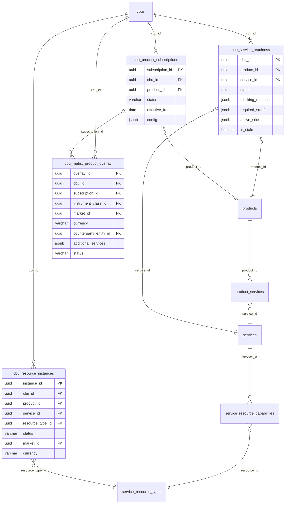
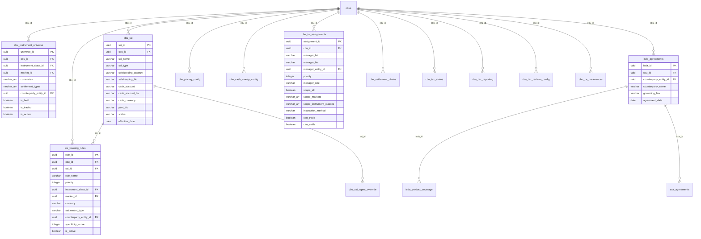

# CBU Construct — Deep Dive

> **Last reconciled:** 2026-02-11 — against 77 migrations, 20 DSL verb domains, live database schema
> **Scope:** The CBU (Client Business Unit) aggregate and all tables, views, verbs, and cross-schema links that orbit it
> **Method:** SQL DDL cross-referenced with DSL verb YAML (`rust/config/verbs/*.yaml`), domain ops (`rust/src/domain_ops/`), and live `information_schema` queries
> **Tables covered:** 38 tables (23 `ob-poc`, 15 `custody`) + 20 views + 3 `kyc` schema links
> **Verbs covered:** 299 verbs across 15 DSL domains

---

## Reading Order — From Commercial Intent to Operational Readiness

This paper follows the lifecycle of a CBU from commercial origination through to operational go-live:


---

## 1) What Is a CBU? — Business Context

The **Client Business Unit** is the atomic operational container in the BNY custody and fund services model. It represents a single onboarded trading unit — typically a fund, a segregated mandate, or a corporate treasury — that has its own:

- **Entity roster** — the people and organisations that participate (depositary, management company, investment manager, directors, signatories, UBOs)
- **Product subscriptions** — what services BNY delivers (custody, fund accounting, transfer agency, FX, securities lending)
- **Trading universe** — what instruments, markets, and currencies the unit trades
- **Settlement infrastructure** — SSIs, booking rules, settlement chains
- **KYC scope** — the regulatory due diligence perimeter

**Why not just use "account" or "fund"?** Because the operational perimeter rarely maps 1:1 to a legal fund. A SICAV umbrella with 30 sub-funds may be one CBU (shared depositary, shared ManCo, shared TA) or 30 CBUs (each sub-fund independently onboarded). A corporate treasury group may have one legal entity but three CBUs (one per currency book). The CBU is a **configurable lens**, not a legal entity.

### CBU in the Wider Architecture


---

## 2) The CBU Record — Core Table

**Verb domain:** `cbu` (20 verbs)

The `cbus` table is the root of the CBU aggregate. Every child table in the CBU constellation has a foreign key back to `cbus.cbu_id`.


### CBU Category Taxonomy

The `cbu_category` column classifies the operational nature of the unit:

| Category | Use Case | Example |
|----------|----------|---------|
| `FUND_MANDATE` | Regulated or unregulated fund | UCITS SICAV sub-fund, AIF, hedge fund |
| `CORPORATE_GROUP` | Corporate treasury or SPV | Allianz SE treasury, securitisation vehicle |
| `INSTITUTIONAL_ACCOUNT` | Segregated institutional mandate | Pension fund segregated portfolio |
| `RETAIL_CLIENT` | Retail distribution unit | Wealth management book |
| `FAMILY_TRUST` | Trust vehicle | Family office trust |
| `CORRESPONDENT_BANK` | Correspondent banking relationship | Sub-custodian relationship |
| `INTERNAL_TEST` | Internal testing unit | UAT, regression test book |

### CBU Status State Machine


### CBU Verbs (20)

| Verb | Behavior | Purpose |
|------|----------|---------|
| `cbu.create` | plugin | Create CBU with entity linking (idempotent by fund-entity-id) |
| `cbu.read` | crud | Read CBU by ID |
| `cbu.update` | crud | Update CBU fields |
| `cbu.delete` | crud | Delete CBU (fails if dependencies) |
| `cbu.delete-cascade` | plugin | Delete CBU + all related data across 25+ tables |
| `cbu.list` | crud | List CBUs with filters (status, jurisdiction, client-type) |
| `cbu.ensure` | crud | Upsert CBU by natural key (name + jurisdiction) |
| `cbu.show` | plugin | Full CBU structure (entities, roles, docs, screenings, services) |
| `cbu.decide` | plugin | Record KYC/AML decision (APPROVED/REJECTED/REFERRED) |
| `cbu.set-category` | crud | Set CBU category classification |
| `cbu.assign-role` | crud | Assign entity role within CBU |
| `cbu.remove-role` | crud | Remove entity role |
| `cbu.parties` | crud | List all entities with roles |
| `cbu.add-product` | plugin | Add product (creates service delivery + resource instances) |
| `cbu.remove-product` | crud | Remove product subscription |
| `cbu.attach-evidence` | crud | Attach document/attestation evidence |
| `cbu.verify-evidence` | crud | Mark evidence verified/rejected |
| `cbu.list-evidence` | crud | List evidence for CBU |
| `cbu.create-from-client-group` | plugin | Bulk create CBUs from client group entities |

### Key Design Decisions

**Entity-based idempotency:** `cbu.create` checks if the `:fund-entity-id` is already linked to a CBU as ASSET_OWNER. If yes, returns the existing CBU. This prevents duplicate CBUs for the same legal fund entity.

**Cascade delete scope:** `cbu.delete-cascade` removes data from `ob-poc`, `kyc`, and `custody` schemas in dependency order within a single transaction. 25+ tables are cleaned.

**Embedding column:** The `embedding` column (pgvector 384-dim) enables semantic search for CBUs by name/description via the same Candle pipeline used for verb discovery.

---

## 3) Entities & Roles — Who Participates

**Verb domains:** `cbu-role-v2` (10 verbs)

Entities connect to CBUs through typed roles. The `cbu_entity_roles` table is the **membership register** — it defines who participates in the CBU and in what capacity. Roles are drawn from a governed taxonomy in the `roles` table.


### Role Category Taxonomy

| Category | Roles | Entity Types |
|----------|-------|--------------|
| **Governance** | Depositary, ManCo, Board Director, Chairman, Auditor | Legal entity, Natural person |
| **Investment** | Investment Manager, Sub-Advisor, Prime Broker, Overlay Manager | Legal entity |
| **Operations** | Transfer Agent, Custodian, Fund Administrator, Paying Agent | Legal entity |
| **Ownership** | Asset Owner, Beneficial Owner, Shareholder, Limited Partner | Legal entity, Natural person |
| **Control** | Director, Managing Director, Chief Executive, Secretary | Natural person |
| **Trust** | Settlor, Trustee, Protector, Beneficiary (fixed/discretionary) | Natural person, Legal entity |
| **Signatory** | Authorized Signatory, Authorized Trader, Representative | Natural person |

### Specialized Role Assignment Verbs

The `cbu-role-v2` domain provides **typed assignment verbs** that enforce domain-specific validation:

| Verb | Validation | Key Arguments |
|------|-----------|---------------|
| `cbu-role-v2.assign` | Generic role assignment | `role`, `entity-id`, `effective-from/to` |
| `cbu-role-v2.assign-ownership` | Percentage required, creates ownership edge | `owner-entity-id`, `owned-entity-id`, `percentage`, `ownership-type` |
| `cbu-role-v2.assign-control` | Control role validation (director, officer) | `controller-entity-id`, `controlled-entity-id`, `appointment-date` |
| `cbu-role-v2.assign-trust-role` | Trust-specific roles (settlor, trustee, beneficiary) | `trust-entity-id`, `participant-entity-id`, `interest-percentage` |
| `cbu-role-v2.assign-fund-role` | Fund structure roles (ManCo, IM, depositary) | `fund-entity-id`, `is-regulated`, `regulatory-jurisdiction` |
| `cbu-role-v2.assign-service-provider` | Service provider roles (custodian, admin, prime broker) | `provider-entity-id`, `service-agreement-date` |
| `cbu-role-v2.assign-signatory` | Signatory roles with authority limits | `person-entity-id`, `authority-limit`, `requires-co-signatory` |
| `cbu-role-v2.validate` | Validate all role assignments against requirements | `cbu-id` |

### Entity ↔ CBU: The Tripartite Link

An entity participates in a CBU via a role, but the role may also reference a **target entity** (the entity upon which the role is exercised). This models relationships like "Person A is a Director OF Entity B WITHIN CBU C":


This tripartite link is essential for:
- **Board composition analysis** — who sits on whose board
- **Signatory authority** — who can sign on behalf of whom
- **Ownership chains** — who owns what percentage of whom

---

## 4) Onboarding Gate — Contracts & Subscriptions

**Verb domain:** `contract` (14 verbs)

CBUs cannot access products without a contract. The onboarding gate is enforced by a **composite foreign key** on `cbu_subscriptions` that references `contract_products(contract_id, product_code)`. If the contract doesn't cover the product, the subscription INSERT fails.


### The Gate in Action


### Subscription Status

| Status | Meaning |
|--------|---------|
| `ACTIVE` | CBU is subscribed and can use the product |
| `PENDING` | Subscription requested, awaiting activation |
| `SUSPENDED` | Temporarily paused |
| `TERMINATED` | Permanently ended |

---

## 5) Product & Service Overlay — What the CBU Consumes

**Verb domains:** `product-subscription` (5 verbs), `matrix-overlay` (9 verbs), `service-resource` (10 verbs), `lifecycle` (18 verbs), `sla` (17 verbs)

Products compose services; services require resources. When a product is added to a CBU, the system creates service delivery map entries and provisions resource instances. The `cbu_matrix_product_overlay` adds product-specific configuration to individual cells in the instrument matrix.



### Service Readiness Status

The `cbu_service_readiness` table is a **materialized derivation** — it computes whether each (CBU, product, service) triple is operationally ready by checking resource provisioning, attribute completeness, and dependency chains.

| Status | Meaning |
|--------|---------|
| `ready` | All resources provisioned, all attributes populated, all dependencies met |
| `blocked` | One or more blocking reasons prevent go-live |
| `partial` | Some resources ready, others blocked |

**Blocking reason types:**

| Reason | Description |
|--------|-------------|
| `missing_srdef` | Service resource definition not provisioned |
| `pending_provisioning` | Resource provisioning in progress |
| `failed_provisioning` | Resource provisioning failed |
| `missing_attrs` | Required attributes not yet populated |
| `attr_conflict` | Conflicting attribute values from different sources |
| `dependency_not_ready` | Upstream dependency not ready |

### The Product → Service → Resource Cascade

When `cbu.add-product` is called, the system automatically cascades:


---

## 6) Trading Profile — The Instrument Matrix Document

**Verb domain:** `trading-profile` (66 verbs)

The trading profile is the **single richest domain** in the entire system (66 verbs). It defines what a CBU trades, where, how, and with whom. The profile is stored as a **JSONB AST document** — a tree-structured source of truth that is edited via verbs and materialized to operational tables when activated.


### Trading Profile Status State Machine


### Document Structure (JSONB AST)

The profile document is a tree with four major sections:


### Verb Groups (66 verbs organized by section)

**Core Lifecycle (10 verbs):**

| Verb | Purpose |
|------|---------|
| `trading-profile.import` | Import profile from YAML/JSON |
| `trading-profile.create-draft` | Create empty draft |
| `trading-profile.create-new-version` | Version from active profile |
| `trading-profile.clone-to` | Clone to another CBU |
| `trading-profile.activate` | Activate (supersedes previous) |
| `trading-profile.materialize` | Write to operational tables |
| `trading-profile.submit` | Submit for review |
| `trading-profile.approve` | Approve and activate |
| `trading-profile.reject` | Reject, return to draft |
| `trading-profile.diff` | Compare two versions |

**Universe Section (6 verbs):** `add-instrument-class`, `remove-instrument-class`, `add-market`, `remove-market`, `set-base-currency`, `add-allowed-currency`

**SSI Section (2 verbs):** `add-standing-instruction`, `remove-standing-instruction`

**Booking Rules (2 verbs):** `add-booking-rule`, `remove-booking-rule`

**ISDA/CSA Section (7 verbs):** `add-isda-config`, `add-isda-coverage`, `add-csa-config`, `add-csa-collateral`, `link-csa-ssi`, `remove-isda-config`, `remove-csa-config`

**Investment Manager (3 verbs):** `add-im-mandate`, `update-im-scope`, `remove-im-mandate`

**Corporate Actions (4 verbs):** `ca.enable-event-types`, `ca.disable-event-types`, `ca.set-notification-policy`, `ca.set-election-policy`

**Validation (2 verbs):** `validate-go-live-ready`, `validate-universe-coverage`

**Queries (4+ verbs):** `read`, `get-active`, `list-versions`, `archive`

---

## 7) Custody Projection — Materialized Operational Tables

**Verb domains:** `custody` (various), `pricing-config` (15 verbs), `cash-sweep` (9 verbs), `investment-manager` (7 verbs)

When `trading-profile.materialize` runs, it projects the JSONB document into operational tables in the `custody` schema. These tables are the **runtime truth** for settlement, pricing, and tax.



### The Three-Layer Settlement Model

Settlement infrastructure follows a strict three-layer architecture:


**Booking rule specificity score** — a generated column that ranks rule precision:

| Criterion | Points | Example |
|-----------|--------|---------|
| Counterparty specified | 32 | `counterparty_entity_id IS NOT NULL` |
| Instrument class specified | 16 | `instrument_class_id IS NOT NULL` |
| Security type specified | 8 | `security_type_id IS NOT NULL` |
| Market specified | 4 | `market_id IS NOT NULL` |
| Currency specified | 2 | `currency IS NOT NULL` |
| Settlement type specified | 1 | `settlement_type IS NOT NULL` |

Rules are evaluated in priority order, with specificity as tiebreaker. NULL fields act as wildcards.

### All 15 Custody CBU Tables

| Table | Verb Domain | Purpose |
|-------|------------|---------|
| `cbu_instrument_universe` | trading-profile | What instruments/markets/currencies the CBU trades |
| `cbu_ssi` | trading-profile | Settlement accounts (safekeeping, cash, collateral) |
| `ssi_booking_rules` | trading-profile | ALERT-style routing rules for settlement |
| `cbu_ssi_agent_override` | custody | SSI agent chain overrides |
| `isda_agreements` | trading-profile | ISDA master agreements with OTC counterparties |
| `cbu_im_assignments` | investment-manager | Investment manager assignments with trading scope |
| `cbu_pricing_config` | pricing-config | Pricing source by instrument class (Bloomberg, Reuters, etc.) |
| `cbu_cash_sweep_config` | cash-sweep | Cash sweep/STIF configuration per currency |
| `cbu_settlement_chains` | custody | Settlement chain definitions |
| `cbu_settlement_location_preferences` | custody | Preferred settlement locations |
| `cbu_cross_border_config` | custody | Cross-border settlement configuration |
| `cbu_tax_status` | custody | Tax status per jurisdiction (exempt, treaty rate) |
| `cbu_tax_reporting` | custody | Tax reporting obligations (FATCA, CRS) |
| `cbu_tax_reclaim_config` | custody | Tax reclaim processing configuration |
| `cbu_ca_preferences` | trading-profile | Corporate actions preferences |

---

## 8) Governance Groups — ManCo Books & Control Chains

**Verb domain:** `manco` (10 verbs)

CBUs are grouped into **governance books** — sets of CBUs under a common governance controller (typically a management company or holding entity). Groups are auto-derived from board appointment rights, voting control, and GLEIF relationships.


### Group Type Taxonomy

| Type | Derivation | Example |
|------|-----------|---------|
| `GOVERNANCE_BOOK` | Computed from board appointment/control signals | AGI Holdings → 12 Luxembourg SICAVs |
| `MANCO_BOOK` | Fallback from MANAGEMENT_COMPANY role in `cbu_entity_roles` | Aviva Investors Global → 8 funds |
| `CORPORATE_GROUP` | Corporate parent hierarchy | Allianz SE → 3 treasury units |
| `INVESTMENT_MANAGER` | IM mandate assignments | BlackRock Fund Advisors → 50 funds |
| `UMBRELLA_SICAV` | SICAV umbrella structure | Allianz Global SICAV → 15 sub-funds |
| `CUSTOM` | Manually created | Regulatory reporting group |

### Membership Source

| Source | Derivation |
|--------|-----------|
| `GOVERNANCE_CONTROLLER` | Computed from board appointment/control rights |
| `MANCO_ROLE` | From `cbu_entity_roles` MANAGEMENT_COMPANY role assignment |
| `GLEIF_MANAGED` | From GLEIF IS_FUND_MANAGED_BY relationship |
| `SHAREHOLDING` | From controlling shareholding (>50% voting) |
| `MANUAL` | Manually assigned |

### Control Chain Analysis

The `manco.control-chain` verb traces the shareholding control chain upward from a governance controller to the ultimate parent entity. This is used for UBO discovery and group structure visualization.


### Master Refresh Pipeline

The `manco.refresh` verb runs the complete governance derivation pipeline:


---

## 9) Deal Record Link — Commercial Origination

**Verb domains:** `deal` (43 verbs), `billing` (17 verbs)

The deal record is the **commercial hub** that links sales pipeline, contracts, rate cards, and CBU onboarding. CBUs connect to deals through `deal_onboarding_requests` (the handoff from commercial to operational) and `fee_billing_profiles` (the closed-loop billing path).


### Onboarding Request Status


### The Closed Billing Loop

The billing loop connects commercial rate cards to operational CBU activity:

```mermaid
graph LR
    RC["Deal Rate Card<br/>(negotiated fees)"] --> FBP["Fee Billing Profile<br/>(CBU + product + frequency)"]
    FBP --> TAR["Account Targets<br/>(which resource instances)"]
    TAR --> RI["cbu_resource_instances<br/>(safekeeping accounts, etc.)"]
    FBP --> PER["Billing Period<br/>(monthly/quarterly cycle)"]
    PER --> LINES["Period Lines<br/>(calculated fees)"]
    LINES --> INV["Invoice"]
```

---

## 10) Attributes & Readiness — Completeness Tracking

The attribute system tracks **what data is required** for each CBU and **what data has been collected**. Requirements are rolled up from service resource definitions; values come from entities, documents, manual entry, or derivation.

```mermaid
erDiagram
    cbus ||--o{ cbu_unified_attr_requirements : "cbu_id"
    cbus ||--o{ cbu_attr_values : "cbu_id"
    cbu_unified_attr_requirements }o--|| attribute_registry : "attr_id"
    cbu_attr_values }o--|| attribute_registry : "attr_id"

    cbu_unified_attr_requirements {
        uuid cbu_id PK
        uuid attr_id PK
        text requirement_strength
        jsonb merged_constraints
        text preferred_source
        jsonb required_by_srdefs
        jsonb conflict
    }

    cbu_attr_values {
        uuid cbu_id PK
        uuid attr_id PK
        jsonb value
        text source
        jsonb evidence_refs
        jsonb explain_refs
        timestamptz as_of
    }

    attribute_registry {
        text id PK
        text display_name
        text category
        text value_type
        jsonb validation_rules
    }
```

### Requirement Strength

| Strength | Meaning |
|----------|---------|
| `required` | Must be populated before go-live |
| `optional` | Nice to have, not blocking |
| `conditional` | Required under certain conditions (e.g., jurisdiction-specific) |

### Value Sources

| Source | Description |
|--------|-------------|
| `derived` | Computed from other data (e.g., UBO from ownership chain) |
| `entity` | Inherited from linked entity attributes |
| `cbu` | Set directly on the CBU |
| `document` | Extracted from uploaded documents |
| `manual` | Manually entered by operator |
| `external` | From external system (GLEIF, screening) |

### Key Views

| View | Purpose |
|------|---------|
| `v_cbu_attr_gaps` | Required attributes that are missing values |
| `v_cbu_attr_summary` | Per-CBU completeness percentage |
| `v_cbu_readiness_summary` | Service readiness summary per CBU |
| `v_cbu_unified_gaps` | Unified gap analysis across attributes and services |
| `v_cbu_validation_summary` | Overall validation status |

---

## 11) Session & Navigation — How Users Work with CBUs

**Verb domain:** `session` (39 verbs)

Users work with CBUs through **sessions** — scoped workspaces that load sets of CBUs using an astronomical metaphor. The session is the lens through which the operator sees the CBU landscape.

### Navigation Hierarchy

```mermaid
graph TD
    U["UNIVERSE<br/>session.load-universe<br/>All CBUs globally"] --> G["GALAXY<br/>session.load-galaxy<br/>All CBUs in a jurisdiction"]
    U --> CL["CLUSTER<br/>session.load-cluster<br/>All CBUs under a governance controller"]
    G --> S["SYSTEM<br/>session.load-system<br/>Single CBU focus"]
    CL --> S
```

### Session Context Stack

The V2 REPL maintains a **ContextStack** — a 7-layer fold from executed runbook entries:

```mermaid
graph TD
    DS["derived_scope<br/>(CBU IDs, client group)"] --> PC["pack_context<br/>(active journey pack)"]
    PC --> TH["template_hint<br/>(next expected verb)"]
    TH --> FC["focus<br/>(pronoun resolution: 'it', 'that entity')"]
    FC --> RC["recent<br/>(recent entity mentions)"]
    RC --> ES["exclusion_set<br/>(rejected candidates, 3-turn decay)"]
    ES --> OR["outcome_registry<br/>(execution results for @N refs)"]
```

### Session Verbs by Category

**Scope Loading (6 verbs):**

| Verb | Resolution | Loads |
|------|-----------|-------|
| `session.load-universe` | Optional client filter | All CBUs (optionally for client) |
| `session.load-galaxy` | Jurisdiction code | All CBUs in jurisdiction |
| `session.load-cluster` | Client name → group → anchor → CBUs | All CBUs under governance controller |
| `session.load-system` | CBU name or ID | Single CBU |
| `session.load-deal` | Deal name or ID | Deal context for taxonomy viz |
| `session.filter-jurisdiction` | Jurisdiction code | Narrow existing scope |

**Context Setting (3 verbs):**

| Verb | Sets | Used By |
|------|------|---------|
| `session.set-structure` | Current CBU (for macros) | `structure.*` operator macros |
| `session.set-case` | Current KYC case | `case.*` operator macros |
| `session.set-mandate` | Current trading profile | `mandate.*` operator macros |

**History (2 verbs):** `session.undo`, `session.redo`

**Query (3 verbs):** `session.info`, `session.list`, `session.clear`

### Two-Stage Client Resolution

The `session.load-cluster` verb uses a two-stage resolution process to convert a natural language client name into a set of CBUs:

```mermaid
sequenceDiagram
    participant User
    participant Session
    participant CGA as client_group_alias
    participant CGAnch as client_group_anchor
    participant CGE as client_group_entity
    participant CBUs as cbus

    User->>Session: "load the allianz book"
    Session->>CGA: Stage 1: "allianz" → alias lookup
    CGA-->>Session: group_id (Allianz Global Investors)
    Session->>CGAnch: Stage 2: group_id + role(governance_controller)
    CGAnch-->>Session: anchor_entity_id (AGI Holdings GmbH)
    Session->>CGE: Query all entities under group
    CGE-->>Session: entity_ids with cbu_ids
    Session->>CBUs: Load all linked CBUs
    CBUs-->>User: 12 CBUs in scope
```

---

## 12) KYC Integration — Cases, Share Classes, Holdings

CBUs are the **KYC scope perimeter**. KYC cases are opened per CBU, and the share class / holdings register provides the investor data needed for UBO discovery.

```mermaid
erDiagram
    cbus ||--o{ kyc_cases : "cbu_id"
    cbus ||--o{ kyc_share_classes : "cbu_id"
    cbus ||--o{ kyc_board_compositions : "cbu_id"
    cbus ||--o{ kyc_partnership_capital : "cbu_id"
    cbus ||--o{ kyc_trust_provisions : "cbu_id"
    kyc_share_classes ||--o{ kyc_holdings : "share_class_id"
    kyc_share_classes ||--o{ kyc_special_rights : "share_class_id"
    kyc_holdings }o--|| entities : "investor_entity_id"
    kyc_board_compositions }o--|| entities : "person_entity_id"

    kyc_cases {
        uuid case_id PK
        uuid cbu_id FK
        varchar case_type
        varchar status
        varchar risk_rating
    }

    kyc_share_classes {
        uuid id PK
        uuid cbu_id FK
        varchar name
        varchar isin
        char currency
        numeric nav_per_share
        varchar class_category
        varchar instrument_kind
        numeric votes_per_unit
        numeric economic_per_unit
    }

    kyc_holdings {
        uuid id PK
        uuid share_class_id FK
        uuid investor_entity_id FK
        numeric units
        numeric cost_basis
        varchar holding_status
    }

    kyc_board_compositions {
        uuid id PK
        uuid cbu_id FK
        uuid entity_id FK
        uuid person_entity_id FK
        uuid role_id FK
        uuid appointed_by_entity_id FK
        date appointment_date
    }

    kyc_partnership_capital {
        uuid id PK
        uuid cbu_id FK
        uuid partnership_entity_id FK
        uuid partner_entity_id FK
        varchar partner_type
        numeric capital_commitment
        numeric profit_share_pct
        numeric voting_pct
        boolean management_rights
    }

    kyc_trust_provisions {
        uuid id PK
        uuid cbu_id FK
        uuid trust_entity_id FK
        varchar provision_type
        uuid holder_entity_id FK
        numeric interest_percentage
        varchar discretion_level
    }
```

### KYC Tables Scoped by CBU

| Table | Purpose | Key for UBO |
|-------|---------|-------------|
| `kyc.cases` | KYC case management | Case status drives CBU status |
| `kyc.share_classes` | Fund share class master data | Voting + economic rights per class |
| `kyc.holdings` | Investor ownership by share class | Ownership % for UBO threshold |
| `kyc.board_compositions` | Directors/officers with appointment chains | Control analysis |
| `kyc.partnership_capital` | LP/GP capital accounts | Profit share for partnership UBO |
| `kyc.trust_provisions` | Trust deed provisions | Beneficial interest for trust UBO |
| `kyc.special_rights` | Non-percentage control rights | Veto powers, board seats, etc. |
| `kyc.appointment_rights` | Board appointment/removal rights | Indirect control |

### How CBU Scopes KYC

The CBU's `kyc_scope_template` field defines which KYC checks apply. The case type taxonomy determines the workflow:

| Case Type | Trigger | Checks |
|-----------|---------|--------|
| `NEW_CLIENT` | First onboarding | Full identity, ownership, UBO, screening |
| `PERIODIC_REVIEW` | Scheduled review cycle | Re-verify ownership, re-screen |
| `TRIGGER_REVIEW` | Material change event | Targeted re-verification |
| `ENHANCED_DUE_DILIGENCE` | High-risk indicator | Extended checks, source of wealth |

---

## Full CBU Table Inventory

### `ob-poc` Schema (23 tables)

| Table | Verb Domain | Purpose |
|-------|------------|---------|
| `cbus` | `cbu` | **Root** — CBU aggregate |
| `cbu_entity_roles` | `cbu-role-v2` | Entity-to-CBU role assignments |
| `cbu_entity_roles_history` | — | Audit trail of role changes |
| `cbu_product_subscriptions` | `product-subscription` | Product subscriptions |
| `cbu_trading_profiles` | `trading-profile` | Trading profile documents |
| `cbu_matrix_product_overlay` | `matrix-overlay` | Product overlay per matrix cell |
| `cbu_resource_instances` | `service-resource` | Provisioned resource instances |
| `cbu_service_readiness` | — | Computed service readiness |
| `cbu_subscriptions` | `contract` | Contract+product subscription (onboarding gate) |
| `cbu_groups` | `manco` | Governance book groups |
| `cbu_group_members` | `manco` | CBU membership in groups |
| `cbu_unified_attr_requirements` | — | Rolled-up attribute requirements |
| `cbu_attr_values` | — | Attribute values with evidence |
| `cbu_evidence` | `cbu` | Document/attestation evidence |
| `cbu_sla_commitments` | `sla` | SLA commitments |
| `cbu_lifecycle_instances` | `lifecycle` | Active lifecycle instances |
| `cbu_board_controller` | — | Board controller assignment |
| `cbu_control_anchors` | — | Control anchor entities |
| `cbu_change_log` | — | CBU change audit trail |
| `cbu_creation_log` | — | CBU creation audit trail |
| `cbu_layout_overrides` | — | UI layout overrides |
| `cbu_ownership_graph` | — | Materialized ownership graph (view) |
| `cbu_convergence_status` | — | Convergence tracking (view) |

### `custody` Schema (15 tables)

| Table | Verb Domain | Purpose |
|-------|------------|---------|
| `cbu_instrument_universe` | `trading-profile` | Trading scope declaration |
| `cbu_ssi` | `trading-profile` | Settlement accounts |
| `ssi_booking_rules` | `trading-profile` | ALERT-style booking routing |
| `cbu_ssi_agent_override` | `custody` | SSI agent chain overrides |
| `cbu_im_assignments` | `investment-manager` | Investment manager scope |
| `cbu_pricing_config` | `pricing-config` | Pricing source configuration |
| `cbu_cash_sweep_config` | `cash-sweep` | Cash sweep/STIF configuration |
| `cbu_settlement_chains` | `custody` | Settlement chain definitions |
| `cbu_settlement_location_preferences` | `custody` | Preferred settlement locations |
| `cbu_cross_border_config` | `custody` | Cross-border settlement config |
| `cbu_tax_status` | `custody` | Tax status per jurisdiction |
| `cbu_tax_reporting` | `custody` | Tax reporting obligations |
| `cbu_tax_reclaim_config` | `custody` | Tax reclaim processing |
| `cbu_ca_preferences` | `trading-profile` | Corporate actions preferences |
| `cbu_ca_instruction_windows` | `trading-profile` | CA instruction time windows |

### Views (20)

| View | Purpose |
|------|---------|
| `v_cbu_subscriptions` | CBU contract subscriptions with names |
| `v_cbu_products` | Product subscriptions with product names |
| `v_cbu_attr_gaps` | Missing required attributes |
| `v_cbu_attr_summary` | Per-CBU completeness percentage |
| `v_cbu_readiness_summary` | Service readiness per CBU |
| `v_cbu_unified_gaps` | Unified gap analysis |
| `v_cbu_validation_summary` | Overall validation status |
| `v_cbu_service_gaps` | Service-level gap analysis |
| `v_cbu_entity_with_roles` | Entities with role names |
| `v_cbu_entity_graph` | Entity graph for visualization |
| `v_cbu_kyc_summary` | KYC case summary per CBU |
| `v_cbu_investor_details` | Investor details for holdings |
| `v_cbu_investor_groups` | Investor groupings |
| `v_cbu_lifecycle` | Lifecycle status |
| `v_cbu_lifecycle_coverage` | Lifecycle coverage analysis |
| `v_cbu_lifecycle_gaps` | Lifecycle gap analysis |
| `v_cbu_matrix_effective` | Effective product overlay matrix |
| `v_cbus_by_manco` | CBUs grouped by governance controller |
| `v_cbu_ownership_graph` | Materialized ownership graph |
| `v_cbu_convergence_status` | Convergence tracking |

---

## Verb Domain Summary

| Domain | Verb Count | Primary Tables |
|--------|-----------|----------------|
| `trading-profile` | 66 | `cbu_trading_profiles`, custody projection tables |
| `deal` | 43 | `deal_onboarding_requests`, `fee_billing_profiles` |
| `session` | 39 | (session state, reads `cbus`) |
| `cbu` | 20 | `cbus`, `cbu_evidence` |
| `lifecycle` | 18 | `cbu_lifecycle_instances` |
| `billing` | 17 | `fee_billing_profiles`, `fee_billing_periods` |
| `sla` | 17 | `cbu_sla_commitments` |
| `pricing-config` | 15 | `cbu_pricing_config`, fallback chains, stale policies |
| `contract` | 14 | `cbu_subscriptions` |
| `cbu-role-v2` | 10 | `cbu_entity_roles` |
| `manco` | 10 | `cbu_groups`, `cbu_group_members` |
| `service-resource` | 10 | `cbu_resource_instances` |
| `matrix-overlay` | 9 | `cbu_matrix_product_overlay`, `cbu_product_subscriptions` |
| `cash-sweep` | 9 | `cbu_cash_sweep_config` |
| `investment-manager` | 7 | `cbu_im_assignments` |
| `product-subscription` | 5 | `cbu_product_subscriptions` |
| **Total** | **309** | |

---

## Statistics

| Metric | Count |
|--------|-------|
| CBU-prefixed tables (`ob-poc` schema) | 23 |
| CBU-prefixed tables (`custody` schema) | 15 |
| Total CBU tables | 38 |
| CBU-related views | 20 |
| KYC tables with `cbu_id` FK | 8 |
| DSL verb domains operating on CBU tables | 16 |
| Total verbs across CBU-related domains | 309 |
| Materialized from trading profile | 15 custody tables |
| Composite FK constraints (onboarding gate) | 1 (`cbu_subscriptions`) |
