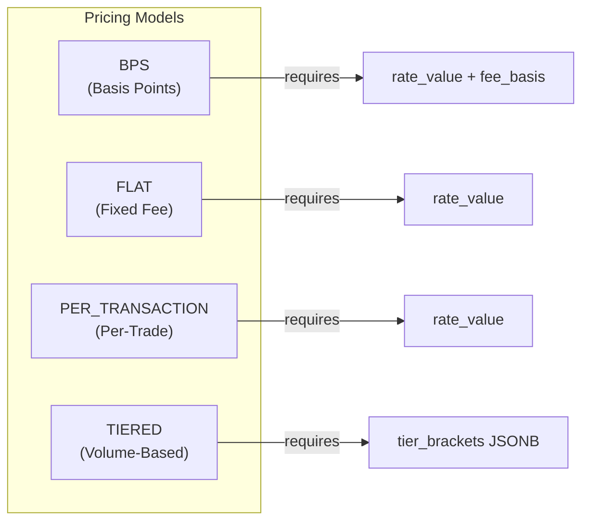

# Deal Record & Fee Billing — Closed-Loop Commercial Origination

> **Domain:** Deal record lifecycle, rate card negotiation, fee billing pipeline
> **Schema:** `ob-poc` (15 tables, 4 views, 2 functions, 1 trigger)
> **Verbs:** 44 (30 deal + 14 billing) across 2 YAML domains
> **CustomOps:** 44 Rust implementations in `deal_ops.rs` + `billing_ops.rs`
> **API:** 13 REST endpoints, 3 view modes
> **Migrations:** 067, 068, 069
> **Test Harness:** `cargo x aviva-deal-harness` (Aviva Investors end-to-end)

---

## 1. Problem Statement

In custody/fund-services origination the commercial journey from initial sales contact through to operational billing spans five silos:

1. **Sales** — Deal pipeline tracking, client qualification
2. **Contracting** — Legal agreements, product scheduling
3. **Pricing** — Rate card negotiation with counter-offer cycles
4. **Onboarding** — CBU creation, KYC clearance, go-live
5. **Billing** — Fee calculation, invoice generation, dispute management

Without a hub entity linking them, each silo operates independently. A rate card agreed by Sales may not match what Ops bills. An onboarding request may reference a product not covered by any contract. Revenue reporting requires manual reconciliation across disconnected systems.

The **Deal Record** solves this by serving as the single hub entity that links all five phases in a closed commercial loop.

---

## 2. Architecture Overview


---

## 3. Deal Status State Machine

The deal progresses through a linear pipeline with cancellation exits from every pre-active state:


**Transition validation** is enforced in Rust (`deal_ops.rs`):

```rust
fn is_valid_deal_status_transition(from: &str, to: &str) -> bool {
    matches!(
        (from, to),
        ("PROSPECT", "QUALIFYING") | ("PROSPECT", "CANCELLED") |
        ("QUALIFYING", "NEGOTIATING") | ("QUALIFYING", "CANCELLED") |
        ("NEGOTIATING", "CONTRACTED") | ("NEGOTIATING", "QUALIFYING") |
        ("NEGOTIATING", "CANCELLED") |
        ("CONTRACTED", "ONBOARDING") | ("CONTRACTED", "CANCELLED") |
        ("ONBOARDING", "ACTIVE") | ("ONBOARDING", "CANCELLED") |
        ("ACTIVE", "WINDING_DOWN") |
        ("WINDING_DOWN", "OFFBOARDED")
    )
}
```

Key design choices:
- **NEGOTIATING can step back** to QUALIFYING (deal complexity requires re-scoping)
- **No reactivation** from CANCELLED/OFFBOARDED (create a new deal instead)
- **ACTIVE cannot be cancelled** — must wind down gracefully (billing obligations)

---

## 4. Entity-Relationship Model

### 4.1 Core Deal Tables


### 4.2 Rate Card & Fee Line Tables


### 4.3 Billing Pipeline Tables


---

## 5. Rate Card Negotiation

### 5.1 Rate Card Status State Machine


### 5.2 Negotiation Sequence


### 5.3 Supersession Chain

The `supersede_rate_card()` SQL function atomically replaces an AGREED card:

```sql
-- Validations:
-- 1. Old card must be AGREED
-- 2. New card must be DRAFT, PROPOSED, or COUNTER_PROPOSED
-- 3. Both must share same (deal_id, contract_id, product_id)
-- Atomically:
-- 1. UPDATE old → SUPERSEDED, set superseded_by = new
-- 2. UPDATE new → AGREED
```

**Partial unique index** enforces at most ONE AGREED rate card per deal/contract/product:

```sql
CREATE UNIQUE INDEX idx_deal_rate_cards_one_agreed
ON "ob-poc".deal_rate_cards (deal_id, contract_id, product_id)
WHERE status = 'AGREED';
```

The **supersession trigger** (`trg_validate_rate_card_supersession`) prevents invalid chain links:
- `superseded_by` must reference a card for the same deal/contract/product
- Cannot supersede to a CANCELLED or already-SUPERSEDED card

A **recursive CTE** traverses the supersession chain for history:

```sql
WITH RECURSIVE history AS (
    SELECT ... WHERE rate_card_id = $1
    UNION ALL
    SELECT ... FROM rate_cards rc
    JOIN history h ON rc.superseded_by = h.rate_card_id
    WHERE h.depth < 10
)
```

---

## 6. Pricing Models

Four pricing models are supported, with CHECK constraints ensuring data integrity:



| Model | Formula | Example | CHECK Constraint |
|-------|---------|---------|-----------------|
| **BPS** | `AUM × (rate / 10000)` | 3.5 bps on $1B = $350K | `rate_value IS NOT NULL AND fee_basis IS NOT NULL` |
| **FLAT** | Fixed amount per period | $25,000/month | `rate_value IS NOT NULL` |
| **PER_TRANSACTION** | `count × rate` | $15/trade × 1000 = $15K | `rate_value IS NOT NULL` |
| **TIERED** | Bracket-based rates | 20bps ≤$100M, 15bps >$100M | `tier_brackets IS NOT NULL` |
| **SPREAD** | Markup on execution price | 0.5 bps spread | (no additional constraint) |
| **MINIMUM_FEE** | Floor amount | $50,000 minimum | (no additional constraint) |

### Fee Basis Options

| Basis | Activity Source | Typical Pricing Model |
|-------|----------------|----------------------|
| `AUM` | Assets Under Management | BPS |
| `NAV` | Net Asset Value | BPS |
| `TRADE_COUNT` | Transaction volume | PER_TRANSACTION |
| `POSITION_COUNT` | Number of positions held | PER_TRANSACTION / FLAT |

### Tier Brackets (JSONB)

```json
[
  { "from": 0, "to": 100000000, "rate_bps": 20 },
  { "from": 100000000, "to": 500000000, "rate_bps": 15 },
  { "from": 500000000, "to": null, "rate_bps": 10 }
]
```

---

## 7. Fee Billing Pipeline

### 7.1 Billing Period State Machine


### 7.2 Fee Calculation Flow


### 7.3 Billing Profile Lifecycle


**Activation gate:** At least one account target must exist before a profile can be activated. This prevents empty billing profiles from generating zero-line invoices.

**Profile uniqueness:** `UNIQUE(cbu_id, product_id, rate_card_id)` — one billing profile per CBU/product/rate-card combination.

---

## 8. Deal Products — Commercial Scope

Deal products define what the client is buying before rate card negotiation begins:


| Field | Purpose |
|-------|---------|
| `product_status` | PROPOSED → NEGOTIATING → AGREED / DECLINED / REMOVED |
| `indicative_revenue` | Pre-negotiation revenue estimate |
| `added_at` | When product entered deal scope |
| `agreed_at` | When client agreed to product inclusion |

Products must be added to the deal before rate cards can be created for them (`lifecycle.precondition_checks: requires_prior:deal.add-product`).

---

## 9. Participants & Contracts

### 9.1 Deal Participants

Participants are legal entities (by LEI) with roles in the deal:

| Role | Description |
|------|-------------|
| `CONTRACTING_PARTY` | Entity signing the agreement |
| `GUARANTOR` | Parent/affiliate providing guarantee |
| `INTRODUCER` | Entity that referred the client |
| `INVESTMENT_MANAGER` | ManCo/IM overseeing funds |
| `FUND_ADMIN` | Fund administrator |

**One-primary constraint:** Partial unique index `WHERE is_primary = true` ensures exactly one primary participant per deal.

### 9.2 Deal Contracts

Links to `legal_contracts` table (from migration 045):

| Role | Description |
|------|-------------|
| `PRIMARY` | Main service agreement |
| `ADDENDUM` | Amendment to primary |
| `SCHEDULE` | Service schedule / product appendix |
| `SIDE_LETTER` | Special terms for specific products |
| `NDA` | Non-disclosure agreement |

Contracts are referenced by rate cards and billing profiles, establishing the legal basis for pricing.

---

## 10. Onboarding Handoff

The deal-to-operations handoff creates onboarding requests that bridge the commercial deal to operational CBU setup:


### Onboarding Request Status


**Batch onboarding:** `deal.request-onboarding-batch` creates multiple onboarding requests at once (multiple CBUs × multiple products), each getting its own unique request.

**Uniqueness:** `UNIQUE(deal_id, contract_id, cbu_id, product_id)` prevents duplicate requests.

---

## 11. UBO Assessments

UBO assessments link deal entities to KYC cases:

| Field | Purpose |
|-------|---------|
| `entity_id` | Legal entity being assessed |
| `kyc_case_id` | Optional link to KYC case |
| `assessment_status` | PENDING → IN_PROGRESS → COMPLETED / REQUIRES_EDD / BLOCKED |
| `risk_rating` | LOW / MEDIUM / HIGH / PROHIBITED |

When `risk_rating = PROHIBITED`, the deal cannot advance to ONBOARDING status (business rule enforced in deal_ops).

---

## 12. Deal Documents

Documents attach to deals with type classification and status tracking:

| Document Type | Description |
|---------------|-------------|
| `CONTRACT` | Signed legal agreement |
| `TERM_SHEET` | Indicative terms before contract |
| `SIDE_LETTER` | Special arrangements |
| `NDA` | Confidentiality agreement |
| `RATE_SCHEDULE` | Agreed fee schedule |
| `SLA` | Service level agreement |
| `PROPOSAL` | Commercial proposal |
| `RFP_RESPONSE` | Response to request for proposal |
| `BOARD_APPROVAL` | Internal approval document |
| `LEGAL_OPINION` | External legal counsel opinion |

Document status: `DRAFT → UNDER_REVIEW → SIGNED → EXECUTED → SUPERSEDED → ARCHIVED`

---

## 13. Service Level Agreements

SLAs attach to deals with optional product/service/contract scoping:

| Field | Description |
|-------|-------------|
| `sla_type` | AVAILABILITY / TURNAROUND / ACCURACY / REPORTING |
| `metric_name` | What is measured (e.g., "NAV delivery time") |
| `target_value` | Target (e.g., "T+1 by 10:00 CET") |
| `measurement_unit` | Unit (e.g., "hours", "percentage") |
| `penalty_type` | FEE_REBATE / CREDIT / ESCALATION |
| `penalty_value` | Penalty amount when SLA is breached |

---

## 14. Deal Events — Audit Trail

Every significant deal mutation is recorded in `deal_events`:


Event structure:

| Field | Purpose |
|-------|---------|
| `event_type` | Categorized event type |
| `subject_type` | Entity type affected (DEAL, RATE_CARD, BILLING_PROFILE, etc.) |
| `subject_id` | UUID of affected entity |
| `old_value` | Previous state (for transitions) |
| `new_value` | New state |
| `description` | Human-readable detail |
| `actor` | Who triggered the event |
| `occurred_at` | Timestamp |

Indexed on `(deal_id, occurred_at)` for timeline queries and `(subject_type, subject_id)` for entity-centric audit.

---

## 15. Deal Graph API & View Modes

The Deal Graph Builder constructs taxonomy views for visualization:


### Three View Modes

| View Mode | Shows | Use Case |
|-----------|-------|----------|
| **COMMERCIAL** | Products, Rate Cards, Participants, Contracts, Onboarding | Full deal overview |
| **FINANCIAL** | Products, Rate Cards, Contracts | Fee and pricing focus |
| **STATUS** | Products, Onboarding Requests | Pipeline progress tracking |

### REST API Endpoints

| Method | Endpoint | Purpose |
|--------|----------|---------|
| `GET` | `/api/deals` | List deals with filters |
| `GET` | `/api/deal/:id` | Deal summary |
| `GET` | `/api/deal/:id/graph?view_mode=COMMERCIAL` | Full taxonomy graph |
| `GET` | `/api/deal/:id/products` | Product scope |
| `GET` | `/api/deal/:id/rate-cards` | All rate cards |
| `GET` | `/api/deal/:id/product/:pid/rate-cards` | Product-specific rate cards |
| `GET` | `/api/deal/rate-card/:id/lines` | Fee line items |
| `GET` | `/api/deal/rate-card/:id/history` | Supersession chain |
| `GET` | `/api/deal/rate-card/:id/detail` | Card + lines + history |
| `GET` | `/api/deal/:id/participants` | Deal participants |
| `GET` | `/api/deal/:id/contracts` | Linked contracts |
| `GET` | `/api/deal/:id/onboarding-requests` | Handoff status |
| `GET` | `/api/session/:sid/deal-context` | Session deal context |

---

## 16. Views

### v_deal_summary

Deal overview with computed counts across all related entities:

| Column | Source |
|--------|--------|
| `deal_id`, `deal_name`, `deal_reference`, `deal_status`, `sales_owner` | `deals` table |
| `client_group_name` | `client_group.canonical_name` |
| `product_count`, `agreed_product_count` | `deal_products` COUNT |
| `participant_count` | `deal_participants` COUNT |
| `contract_count` | `deal_contracts` COUNT |
| `rate_card_count`, `agreed_rate_card_count` | `deal_rate_cards` COUNT |
| `onboarding_request_count`, `completed_onboarding_count` | `deal_onboarding_requests` COUNT |
| `billing_profile_count` | `fee_billing_profiles` COUNT |

### v_billing_profile_summary

Billing profile with linked deal/CBU/product names and revenue totals:

| Column | Source |
|--------|--------|
| `profile_id`, `profile_name`, `status`, `billing_frequency` | `fee_billing_profiles` |
| `deal_name` | `deals.deal_name` |
| `cbu_name` | `cbus.cbu_name` |
| `product_name` | `products.name` |
| `invoice_entity_name` | `entities.name` |
| `account_target_count` | `fee_billing_account_targets` COUNT |
| `period_count` | `fee_billing_periods` COUNT |
| `total_billed_amount` | `fee_billing_periods` SUM(net_amount) WHERE INVOICED |

### v_active_rate_cards

Currently AGREED rate cards per deal/contract/product:

| Column | Source |
|--------|--------|
| `rate_card_id`, `deal_id`, `contract_id`, `product_id` | `deal_rate_cards` WHERE AGREED |
| `deal_name`, `contract_client`, `product_name` | Joined labels |
| `line_count` | `deal_rate_card_lines` COUNT |
| `superseded_count` | Count of cards this one superseded |

### v_rate_card_history

Supersession chain using recursive CTE:

| Column | Source |
|--------|--------|
| `rate_card_id`, `status`, `negotiation_round` | `deal_rate_cards` |
| `chain_depth` | Recursive traversal depth |
| `chain_status` | Status of each card in the chain |

---

## 17. Closed-Loop Commercial Flow

The complete deal-to-invoice flow demonstrates the closed-loop architecture:


---

## 18. Verb Inventory

### 18.1 Deal Verbs (30)

| Category | Verb | Behavior | Purpose |
|----------|------|----------|---------|
| **CRUD** | `deal.create` | plugin | Create deal with client group link |
| | `deal.get` | plugin | Retrieve deal by ID |
| | `deal.list` | plugin | List deals with filters |
| | `deal.search` | plugin | Full-text search by name/reference |
| | `deal.update` | plugin | Update deal fields |
| | `deal.update-status` | plugin | State machine transition |
| | `deal.cancel` | plugin | Cancel deal (validates cancellable state) |
| **Participants** | `deal.add-participant` | plugin | Add entity with role + LEI |
| | `deal.remove-participant` | plugin | Remove (validates no orphaned contracts) |
| | `deal.list-participants` | plugin | List participants |
| **Products** | `deal.add-product` | plugin | Add product to deal scope |
| | `deal.update-product-status` | plugin | Product status transition |
| | `deal.remove-product` | plugin | Soft-remove (status → REMOVED) |
| | `deal.list-products` | plugin | List deal products |
| **Contracts** | `deal.add-contract` | plugin | Link contract with role |
| | `deal.remove-contract` | plugin | Unlink (validates no rate cards reference it) |
| | `deal.list-contracts` | plugin | List linked contracts |
| **Rate Cards** | `deal.create-rate-card` | plugin | Create DRAFT rate card |
| | `deal.add-rate-card-line` | plugin | Add fee line (validates negotiable status) |
| | `deal.update-rate-card-line` | plugin | Update line (validates negotiable) |
| | `deal.remove-rate-card-line` | plugin | Remove line (validates no billing refs) |
| | `deal.list-rate-card-lines` | plugin | List lines for rate card |
| | `deal.propose-rate-card` | plugin | DRAFT → PROPOSED (validates ≥1 line) |
| | `deal.counter-rate-card` | plugin | Clone + apply counter values |
| | `deal.agree-rate-card` | plugin | → AGREED (validates PROPOSED/COUNTER) |
| | `deal.list-rate-cards` | plugin | List rate cards for deal |
| **SLAs** | `deal.add-sla` | plugin | Create SLA |
| | `deal.remove-sla` | plugin | Remove SLA |
| | `deal.list-slas` | plugin | List SLAs |
| **Documents** | `deal.add-document` | plugin | Link document with type |
| | `deal.update-document-status` | plugin | Document status transition |
| | `deal.list-documents` | plugin | List linked documents |
| **UBO** | `deal.add-ubo-assessment` | plugin | Link entity UBO assessment |
| | `deal.update-ubo-assessment` | plugin | Update assessment status/risk |
| **Onboarding** | `deal.request-onboarding` | plugin | Create onboarding request |
| | `deal.request-onboarding-batch` | plugin | Batch: multiple CBUs × products |
| | `deal.update-onboarding-status` | plugin | Update request status |
| | `deal.list-onboarding-requests` | plugin | List requests for deal |
| **Reporting** | `deal.summary` | plugin | Full deal with all related data |
| | `deal.timeline` | plugin | Event timeline |

### 18.2 Billing Verbs (14)

| Category | Verb | Behavior | Purpose |
|----------|------|----------|---------|
| **Profile** | `billing.create-profile` | plugin | Create profile (validates rate card AGREED) |
| | `billing.activate-profile` | plugin | Activate (validates ≥1 target) |
| | `billing.suspend-profile` | plugin | Suspend with reason |
| | `billing.close-profile` | plugin | Close with effective_to date |
| | `billing.get-profile` | plugin | Retrieve profile |
| | `billing.list-profiles` | plugin | List profiles |
| **Targets** | `billing.add-account-target` | plugin | Add target (validates CBU ownership) |
| | `billing.remove-account-target` | plugin | Soft-remove (is_active = false) |
| | `billing.list-account-targets` | plugin | List targets |
| **Periods** | `billing.create-period` | plugin | Create (validates ACTIVE, no overlap) |
| | `billing.calculate-period` | plugin | Run fee calculation engine |
| | `billing.review-period` | plugin | Apply adjustments, mark REVIEWED |
| | `billing.approve-period` | plugin | Approve for invoicing |
| | `billing.generate-invoice` | plugin | Generate invoice (validates APPROVED) |
| | `billing.dispute-period` | plugin | Mark DISPUTED with reason |
| | `billing.period-summary` | plugin | Period with line detail |
| | `billing.revenue-summary` | plugin | Aggregate revenue analytics |

---

## 19. Lifecycle Preconditions

Verbs declare preconditions that the V2 REPL preconditions engine enforces:

```yaml
# deal.create-rate-card requires both a deal AND products
lifecycle:
  precondition_checks:
    - "requires_prior:deal.create"
    - "requires_prior:deal.add-product"

# billing.create-profile requires an AGREED rate card
lifecycle:
  precondition_checks:
    - "requires_prior:deal.create"
    - "requires_prior:deal.agree-rate-card"
```

This creates a natural ordering in the V2 REPL's preconditions engine:

```
deal.create
  └── deal.add-product
       └── deal.create-rate-card
            └── deal.propose-rate-card
                 └── deal.agree-rate-card
                      └── billing.create-profile
                           └── billing.add-account-target
                                └── billing.activate-profile
                                     └── billing.create-period
                                          └── billing.calculate-period
```

---

## 20. Rust Implementation Architecture

### 20.1 CustomOperation Pattern

All 44 operations use the `#[register_custom_op]` macro for inventory-based auto-registration:

```rust
#[register_custom_op]
pub struct DealCreateOp;

#[async_trait]
impl CustomOperation for DealCreateOp {
    fn domain(&self) -> &'static str { "deal" }
    fn verb(&self) -> &'static str { "create" }
    fn rationale(&self) -> &'static str {
        "Creates deal and records initial event in deal_events audit trail"
    }

    #[cfg(feature = "database")]
    async fn execute(
        &self,
        verb_call: &VerbCall,
        ctx: &mut ExecutionContext,
        pool: &PgPool,
    ) -> Result<ExecutionResult> {
        // Extract args, validate, insert, record event
    }
}
```

### 20.2 Result Types

```rust
// Deal creation
pub struct DealCreateResult {
    pub deal_id: Uuid,
    pub deal_name: String,
    pub deal_status: String,
}

// Status transitions
pub struct DealStatusUpdateResult {
    pub deal_id: Uuid,
    pub old_status: String,
    pub new_status: String,
}

// Batch onboarding
pub struct BatchOnboardingResult {
    pub request_ids: Vec<Uuid>,
    pub count: i32,
}

// Fee calculation
pub struct BillingCalculationResult {
    pub period_id: Uuid,
    pub line_count: i32,
    pub gross_amount: f64,
    pub status: String,
}
```

### 20.3 API Types

```rust
// Full deal summary with computed counts
pub struct DealSummary {
    pub deal_id: Uuid,
    pub deal_name: String,
    pub deal_status: String,
    pub primary_client_group_id: Uuid,
    pub client_group_name: Option<String>,
    pub product_count: i32,
    pub rate_card_count: i32,
    pub participant_count: i32,
    pub contract_count: i32,
    pub onboarding_request_count: i32,
    // ... lifecycle timestamps
}

// Graph with view-mode-filtered children
pub struct DealGraphResponse {
    pub deal: DealSummary,
    pub products: Vec<DealProductSummary>,
    pub rate_cards: Vec<RateCardSummary>,
    pub participants: Vec<DealParticipantSummary>,
    pub contracts: Vec<DealContractSummary>,
    pub onboarding_requests: Vec<OnboardingRequestSummary>,
    pub view_mode: String,
}

// View modes
pub enum DealViewMode {
    Commercial,  // Full: products, cards, participants, contracts, onboarding
    Financial,   // Pricing: products, cards, contracts
    Status,      // Pipeline: products, onboarding
}
```

### 20.4 Repository Pattern

The `DealRepository` provides type-safe database access:

```rust
impl DealRepository {
    // Queries
    pub async fn get_deal_summary(pool, deal_id) -> Result<Option<DealSummary>>;
    pub async fn search_deals_by_name(pool, query, limit) -> Result<Vec<DealSummary>>;
    pub async fn list_deals(pool, filters) -> Result<Vec<DealSummary>>;
    pub async fn get_deals_for_client_group(pool, group_id) -> Result<Vec<DealSummary>>;

    // Products
    pub async fn get_deal_products(pool, deal_id) -> Result<Vec<DealProductSummary>>;

    // Rate cards (with recursive CTE history)
    pub async fn get_deal_rate_cards(pool, deal_id) -> Result<Vec<RateCardSummary>>;
    pub async fn get_product_rate_cards(pool, deal_id, product_id) -> Result<Vec<RateCardSummary>>;
    pub async fn get_rate_card_lines(pool, rate_card_id) -> Result<Vec<RateCardLineSummary>>;
    pub async fn get_rate_card_history(pool, rate_card_id) -> Result<Vec<RateCardSummary>>;

    // Participants, contracts, onboarding
    pub async fn get_deal_participants(pool, deal_id) -> Result<Vec<DealParticipantSummary>>;
    pub async fn get_deal_contracts(pool, deal_id) -> Result<Vec<DealContractSummary>>;
    pub async fn get_deal_onboarding_requests(pool, deal_id) -> Result<Vec<OnboardingRequestSummary>>;
}
```

Internal `FromRow` types convert from SQL result sets to API types:

```rust
#[derive(sqlx::FromRow)]
struct DealSummaryRow { /* DB columns */ }

impl From<DealSummaryRow> for DealSummary {
    fn from(row: DealSummaryRow) -> Self { /* field mapping */ }
}
```

---

## 21. Database Indexes

41 indexes across the 15 tables, organized by access pattern:

### Deal Lookup Patterns

| Index | Table | Purpose |
|-------|-------|---------|
| `idx_deals_primary_client` | deals | Client group queries |
| `idx_deals_status` | deals | Pipeline stage filtering |
| `idx_deals_client_status` | deals | Composite: client + status |
| `idx_deals_sales_owner` | deals | Sales team queries |
| `idx_deals_opened_at` | deals | Timeline ordering |

### Rate Card Integrity

| Index | Table | Purpose |
|-------|-------|---------|
| `idx_deal_rate_cards_one_agreed` | deal_rate_cards | Partial unique: max 1 AGREED per deal/contract/product |
| `idx_deal_rate_cards_deal` | deal_rate_cards | Deal lookup |
| `idx_deal_rate_cards_contract` | deal_rate_cards | Contract lookup |
| `idx_deal_rate_cards_product` | deal_rate_cards | Product lookup |
| `idx_deal_rate_cards_status` | deal_rate_cards | Status filtering |

### Billing Performance

| Index | Table | Purpose |
|-------|-------|---------|
| `idx_fee_billing_deal` | fee_billing_profiles | Deal lookup |
| `idx_fee_billing_cbu` | fee_billing_profiles | CBU lookup |
| `idx_fee_billing_rate_card` | fee_billing_profiles | Rate card lookup |
| `idx_fee_billing_status` | fee_billing_profiles | Status filtering |
| `idx_fee_targets_active` | fee_billing_account_targets | Partial: active targets only |
| `idx_fee_periods_dates` | fee_billing_periods | Period range queries |

### Event Audit

| Index | Table | Purpose |
|-------|-------|---------|
| `idx_deal_events_deal` | deal_events | Deal timeline |
| `idx_deal_events_type` | deal_events | Event type filtering |
| `idx_deal_events_deal_occurred` | deal_events | Composite: deal + timestamp |
| `idx_deal_events_subject` | deal_events | Entity-centric audit |

---

## 22. Test Harness — Aviva Deal

The `cargo x aviva-deal-harness` creates a complete deal for Aviva Investors using only DSL verbs:


Products are split between contracts:
- **Core Services (Contract 1):** Custody, Fund Accounting
- **Ancillary Services (Contract 2):** Transfer Agency, Collateral Management, Markets FX, Middle Office, Alternatives

All operations are idempotent — the harness checks for existing records before creating.

```bash
# Create complete deal
cargo x aviva-deal-harness

# Preview without execution
cargo x aviva-deal-harness --dry-run

# Show all DSL statements
cargo x aviva-deal-harness --verbose
```

---

## 23. DSL Examples

### Complete Deal Setup

```clojure
;; Phase 1: Create deal
(deal.create :deal-name "Allianz Custody 2024"
             :primary-client-group-id <Allianz>
             :deal-reference "ALZ-MSA-2024"
             :sales-owner "john.smith@bny.com"
             :estimated-revenue 2500000
             :currency-code "EUR"
             :as @deal)

;; Phase 2: Add participants
(deal.add-participant :deal-id @deal
                      :entity-id <Allianz SE>
                      :participant-role "CONTRACTING_PARTY"
                      :is-primary true)

;; Phase 3: Link contract and products
(deal.add-contract :deal-id @deal
                   :contract-id <MSA-2024>
                   :contract-role "PRIMARY")

(deal.add-product :deal-id @deal
                  :product-id <Custody>
                  :product-status "PROPOSED"
                  :indicative-revenue 800000)

;; Phase 4: Rate card negotiation
(deal.create-rate-card :deal-id @deal
                       :contract-id <MSA-2024>
                       :product-id <Custody>
                       :rate-card-name "Allianz Custody 2024"
                       :effective-from "2024-01-01"
                       :as @rate-card)

(deal.add-rate-card-line :rate-card-id @rate-card
                         :fee-type "CUSTODY"
                         :pricing-model "BPS"
                         :rate-value 3.5
                         :minimum-fee 25000
                         :fee-basis "AUM"
                         :currency-code "EUR")

(deal.propose-rate-card :rate-card-id @rate-card)
(deal.agree-rate-card :rate-card-id @rate-card)

;; Phase 5: Advance deal
(deal.update-status :deal-id @deal :new-status "CONTRACTED")
```

### Billing Cycle

```clojure
;; Create billing profile linked to agreed rate card
(billing.create-profile :deal-id @deal
                        :contract-id <MSA-2024>
                        :rate-card-id @rate-card
                        :cbu-id <Allianz IE UCITS>
                        :product-id <Custody>
                        :invoice-entity-id <Allianz SE>
                        :billing-frequency "MONTHLY"
                        :invoice-currency "EUR"
                        :effective-from "2024-01-01"
                        :as @profile)

;; Add account targets
(billing.add-account-target :profile-id @profile
                            :cbu-resource-instance-id <Allianz-IE-Custody-Account>
                            :activity-type "AUM")

;; Activate and run billing cycle
(billing.activate-profile :profile-id @profile)

(billing.create-period :profile-id @profile
                       :period-start "2024-01-01"
                       :period-end "2024-01-31"
                       :as @period)

(billing.calculate-period :period-id @period)
(billing.review-period :period-id @period :reviewed-by "ops-team@bny.com")
(billing.approve-period :period-id @period :approved-by "finance@bny.com")
(billing.generate-invoice :period-id @period)
```

---

## 24. Key Business Rules Summary

| Rule | Enforcement | Location |
|------|-------------|----------|
| Deal status transitions must follow valid paths | Rust `is_valid_deal_status_transition()` | `deal_ops.rs` |
| Only 1 primary participant per deal | Partial unique index WHERE `is_primary=true` | Migration 067 |
| Only 1 AGREED rate card per deal/contract/product | Partial unique index WHERE `status='AGREED'` | Migration 069 |
| Rate card supersession must be same deal/contract/product | Trigger `trg_validate_rate_card_supersession` | Migration 069 |
| BPS pricing requires `rate_value` AND `fee_basis` | CHECK constraint `chk_bps_requires_rate` | Migration 067 |
| TIERED pricing requires `tier_brackets` JSONB | CHECK constraint `chk_tiered_requires_brackets` | Migration 067 |
| Billing profile requires AGREED rate card | Rust validation in `BillingCreateProfileOp` | `billing_ops.rs` |
| Billing activation requires ≥1 account target | Rust validation in `BillingActivateProfileOp` | `billing_ops.rs` |
| No overlapping billing periods | SQL OVERLAPS check | `billing_ops.rs` |
| Invoice generation requires APPROVED period | Rust validation in `BillingGenerateInvoiceOp` | `billing_ops.rs` |
| Account target resource must belong to profile's CBU | Rust validation in `BillingAddAccountTargetOp` | `billing_ops.rs` |
| Contract removal blocked if rate cards reference it | Rust validation in `DealRemoveContractOp` | `deal_ops.rs` |
| Rate card line removal blocked if billing targets ref it | Rust validation in `DealRemoveRateCardLineOp` | `deal_ops.rs` |
| Participant removal blocked if orphaned contracts | Rust validation in `DealRemoveParticipantOp` | `deal_ops.rs` |
| Onboarding request unique per deal/contract/CBU/product | UNIQUE constraint | Migration 067 |

---

## 25. Cross-Domain Integration Points


| Integration | FK Path | Purpose |
|-------------|---------|---------|
| Client Group → Deal | `deals.primary_client_group_id → client_group.id` | Commercial client scope |
| Entity → Participant | `deal_participants.entity_id → entities.entity_id` | Legal entity with LEI |
| Legal Contract → Deal | `deal_contracts.contract_id → legal_contracts.contract_id` | Legal basis |
| Product → Deal | `deal_products.product_id → products.product_id` | Product scope |
| KYC Case → Assessment | `deal_ubo_assessments.kyc_case_id → kyc.cases.case_id` | KYC gate |
| CBU → Onboarding | `deal_onboarding_requests.cbu_id → cbus.cbu_id` | Operational target |
| Resource → Billing | `fee_billing_account_targets.cbu_resource_instance_id → cbu_resource_instances.instance_id` | Metering source |
| Rate Card → Billing | `fee_billing_profiles.rate_card_id → deal_rate_cards.rate_card_id` | Pricing source |

---

## 26. Key Files

| File | Purpose |
|------|---------|
| `migrations/067_deal_record_fee_billing.sql` | Core schema (14 tables, 2 views) |
| `migrations/068_deal_check_constraints.sql` | CHECK constraints, UUID v7 alignment |
| `migrations/069_deal_products_rate_card_rules.sql` | Products table, supersession, views |
| `rust/config/verbs/deal.yaml` | 30 deal verb definitions |
| `rust/config/verbs/billing.yaml` | 14 billing verb definitions |
| `rust/src/domain_ops/deal_ops.rs` | 30 deal CustomOperations |
| `rust/src/domain_ops/billing_ops.rs` | 14 billing CustomOperations |
| `rust/src/api/deal_types.rs` | API types (DealSummary, RateCardDetail, etc.) |
| `rust/src/api/deal_routes.rs` | 13 REST API endpoints |
| `rust/src/database/deal_repository.rs` | Repository with recursive CTE history |
| `rust/src/graph/deal_graph_builder.rs` | Graph builder with 3 view modes |
| `rust/xtask/src/aviva_deal_harness.rs` | End-to-end test harness |
