# Investment Registers — Three Lenses on Shared Capital

**Version:** 1.0  
**Date:** 2026-02-11  
**Status:** For Peer Review  
**Audience:** Engineering, Product, Domain Architects, Legal & Compliance  
> **Mermaid diagrams** render in GitHub, VS Code, and any CommonMark renderer with mermaid support.

---

## 1. Purpose

This paper describes the **three investment register types** in our system, how they share the same capital structure vocabulary (`share_classes`, `holdings`, `issuance_events`) but answer fundamentally different questions, and how the ownership graph flows between them.

**Key thesis:** A single share register underpins three distinct analytical lenses. The same holding of 1,000 shares simultaneously represents a voting right (control register), an economic entitlement (investor register), and an underlying exposure (fund-of-fund register). The registers are not separate databases — they are **projections** of the same capital structure, differentiated by the question being asked.

---

## 2. The Three Registers

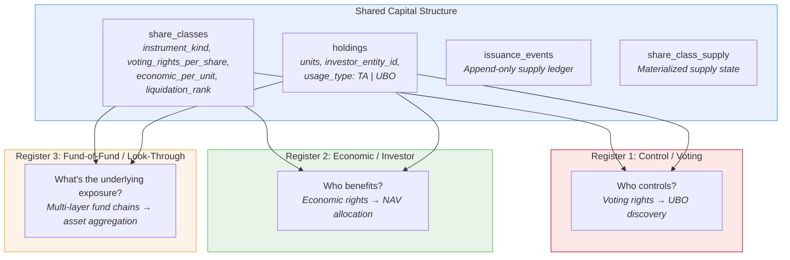

| Register | Question | Input | Output | Regulatory Driver |
|----------|----------|-------|--------|-------------------|
| **Control/Voting** | Who controls this entity? | Voting rights per share, board appointments, special instruments | UBO chain, PSC register, board controller | 4AMLD/5AMLD, UK PSC, BODS |
| **Economic/Investor** | Who has economic interest? | Economic rights per unit, NAV per share, distributions | Investor register, tax reporting, FATCA/CRS | MiFID II, AIFMD, UCITS, FATCA/CRS |
| **Fund-of-Fund** | What's the actual underlying exposure? | Holdings in other funds, look-through chains | Aggregated asset exposure, concentration risk | UCITS look-through, Solvency II, AIFMD Art. 7 |

---

## 3. The Shared Vocabulary: Share Classes

Share classes are the atomic unit that all three registers operate on. A single share class carries **both** voting rights and economic rights — the register lens determines which dimension matters.

### 3.1 Share Class Taxonomy

```mermaid
graph TD
    ROOT["Share Class<br/>(kyc.share_classes)"]

    ROOT --> IK["instrument_kind"]
    IK --> IK1["ORDINARY_EQUITY<br/><i>Standard voting + economic</i>"]
    IK --> IK2["PREFERENCE_EQUITY<br/><i>Senior economics, often non-voting</i>"]
    IK --> IK3["DEFERRED_EQUITY<br/><i>Subordinated, last to receive</i>"]
    IK --> IK4["FUND_UNIT / FUND_SHARE<br/><i>Open-ended fund participation</i>"]
    IK --> IK5["LP_INTEREST / GP_INTEREST<br/><i>Partnership structures</i>"]
    IK --> IK6["CONVERTIBLE / WARRANT<br/><i>Dilutive instruments</i>"]

    ROOT --> VR["Voting Dimension"]
    VR --> VR1["votes_per_unit<br/><i>default 1.0</i>"]
    VR --> VR2["voting_cap_pct<br/><i>max voting %, e.g. 10%</i>"]
    VR --> VR3["voting_threshold_pct<br/><i>min holding to vote</i>"]

    ROOT --> ER["Economic Dimension"]
    ER --> ER1["economic_per_unit<br/><i>default 1.0</i>"]
    ER --> ER2["dividend_rate"]
    ER --> ER3["liquidation_preference"]
    ER --> ER4["liquidation_rank<br/><i>lower = more senior</i>"]

    style ROOT fill:#2d6da4,color:#fff
    style IK fill:#4a90d9,color:#fff
    style VR fill:#d0021b,color:#fff
    style ER fill:#50b848,color:#fff
```

### 3.2 Key Insight: Voting vs Economic Divergence

The critical design insight is that **voting power and economic interest can diverge**:

| Scenario | Voting Rights | Economic Rights | Example |
|----------|---------------|-----------------|---------|
| Ordinary shares | 1 vote per share | 1x economic per share | Standard equity |
| Preference shares | 0 votes | 1.5x liquidation preference | Non-voting prefs |
| Dual-class (Class A) | 10 votes per share | 1x economic | Founder shares |
| Dual-class (Class B) | 1 vote per share | 1x economic | Public shares |
| LP interest | 0 votes | Full economic | Limited partners |
| GP interest | Full control | Carried interest only | General partner |
| Fund units | 0 votes (typically) | Full NAV participation | UCITS units |

This divergence is why we need **separate registers** — a 5% economic holder might have 0% voting power (preference shares), while a 2% holder might have 20% voting control (dual-class).

### 3.3 Share Class Storage

```sql
CREATE TABLE kyc.share_classes (
    id                      UUID PRIMARY KEY,
    cbu_id                  UUID REFERENCES cbus(cbu_id),        -- Which CBU issued this
    issuer_entity_id        UUID REFERENCES entities(entity_id), -- Legal issuer
    
    -- Classification
    instrument_kind         VARCHAR(30),   -- ORDINARY_EQUITY, FUND_UNIT, LP_INTEREST, ...
    instrument_type         VARCHAR(30),   -- UNITS, SHARES, LP_INTEREST
    
    -- Voting dimension (→ Control Register)
    votes_per_unit          NUMERIC(10,4) DEFAULT 1.0,
    voting_cap_pct          NUMERIC(5,2),
    voting_threshold_pct    NUMERIC(5,2),
    
    -- Economic dimension (→ Investor Register)
    economic_per_unit       NUMERIC(10,4) DEFAULT 1.0,
    dividend_rate           NUMERIC(10,4),
    liquidation_preference  DECIMAL(20,2),
    liquidation_rank        INTEGER DEFAULT 100,  -- Lower = more senior
    
    -- Supply
    authorized_shares       NUMERIC(20,6),
    issued_shares           NUMERIC(20,6),
    nav_per_share           DECIMAL(20,6),
    nav_date                DATE,
    
    -- Conversion (→ Dilution)
    converts_to_share_class_id UUID REFERENCES kyc.share_classes(id),
    conversion_ratio_num    NUMERIC(10,4),
    
    -- Fund context
    compartment_id          UUID REFERENCES kyc.fund_compartments(id),
    fund_type               VARCHAR(50),
    fund_structure          VARCHAR(50)
);
```

---

## 4. Register 1: Control / Voting — "Who Controls?"

The control register traces **voting rights and control mechanisms** through ownership chains to identify Ultimate Beneficial Owners (UBOs). It answers: "Who can direct the decisions of this entity?"

### 4.1 Architecture

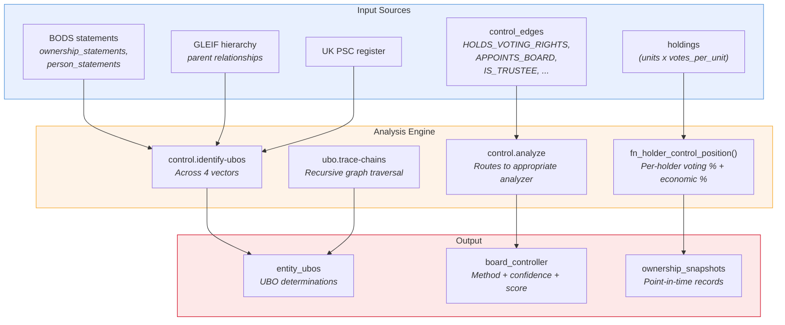

### 4.2 Control Edge Types (Standards-Aligned)

The `control_edges` table captures 16 edge types aligned to three international standards:

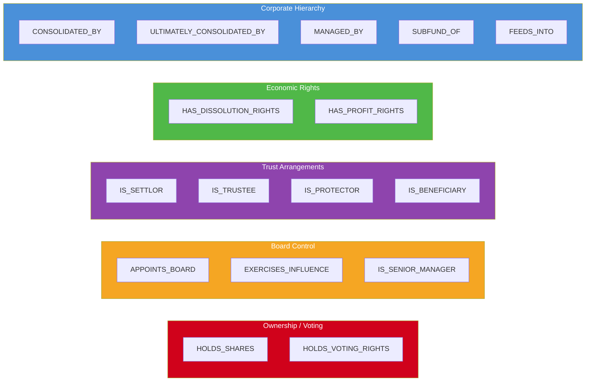

Each edge carries cross-references to **BODS** (`bods_interest_type`), **GLEIF** (`gleif_relationship_type`), and **UK PSC** (`psc_category`) for regulatory reporting.

### 4.3 UBO Discovery Pipeline

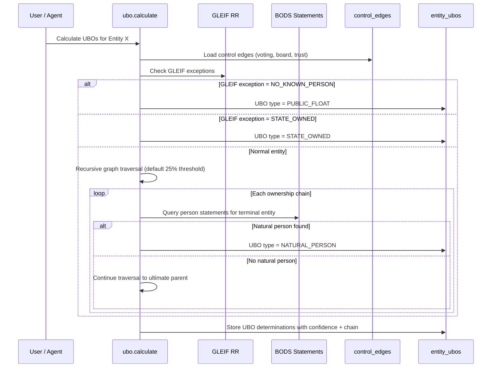

### 4.4 Board Controller Identification

Three rules determine who controls the board:

| Rule | Method | Example |
|------|--------|---------|
| **Rule A** | Board appointment rights | Shareholder agreement grants appointment of 3/5 directors |
| **Rule B** | Voting rights majority | Holder with >50% voting shares |
| **Rule C** | Special instrument | GP of LP, trustee of trust, golden share holder |

```rust
pub enum BoardControlMethod {
    BoardAppointmentRights,  // Rule A
    VotingRightsMajority,    // Rule B
    SpecialInstrument,       // Rule C
    Mixed,                   // Multiple rules apply
    NoSingleController,      // Widely held
}
```

### 4.5 Disclosure Thresholds (Configurable Per Issuer)

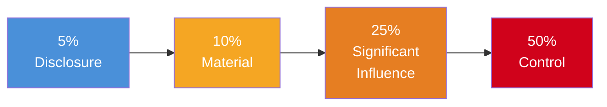

| Threshold | Default | Meaning | UI Treatment |
|-----------|---------|---------|--------------|
| `disclosure_pct` | 5% | Individual node in visualization | Shown as named holder |
| `material_pct` | 10% | Highlighted holding | Bold border |
| `significant_pct` | 25% | Blocking minority, UBO candidate | Warning indicator |
| `control_pct` | 50% | Majority control | Control badge |

Stored in `kyc.issuer_control_config` — per-issuer overrides for jurisdictions with different thresholds (e.g., Luxembourg requires 25% for UBO, UK uses 25% for PSC, some jurisdictions use 10%).

### 4.6 Key Verbs — Control Domain

| Verb | Purpose |
|------|---------|
| `control.add` | Add control edge with type + percentage |
| `control.end` | Terminate control relationship |
| `control.analyze` | Run control analysis (routes by entity type) |
| `control.build-graph` | Full control graph with nodes + edges |
| `control.identify-ubos` | UBO identification across 4 vectors |
| `control.trace-chain` | Trace specific control chain |
| `control.reconcile-ownership` | Verify voting shares sum to 100% |
| `control.show-board-controller` | Show current board controller determination |
| `control.import-psc-register` | Import UK PSC data |
| `control.import-gleif-control` | Import GLEIF relationship data |

### 4.7 Key Verbs — UBO Domain

| Verb | Purpose |
|------|---------|
| `ubo.add-ownership` | Record ownership interest |
| `ubo.add-control` | Record control mechanism |
| `ubo.add-trust-role` | Record trust arrangement |
| `ubo.calculate` | Recursive UBO calculation (25% threshold) |
| `ubo.trace-chains` | Trace all ownership chains |
| `ubo.list-ubos` | List determined UBOs |
| `ubo.mark-terminus` | Mark entity as terminal (LISTED_COMPANY, GOVT, etc.) |
| `ubo.mark-deceased` | Mark UBO as deceased |

---

## 5. Register 2: Economic / Investor — "Who Benefits?"

The investor register tracks **economic interest holders** — who is entitled to NAV participation, distributions, and redemption rights. It answers: "Who benefits financially from this entity?"

### 5.1 Architecture

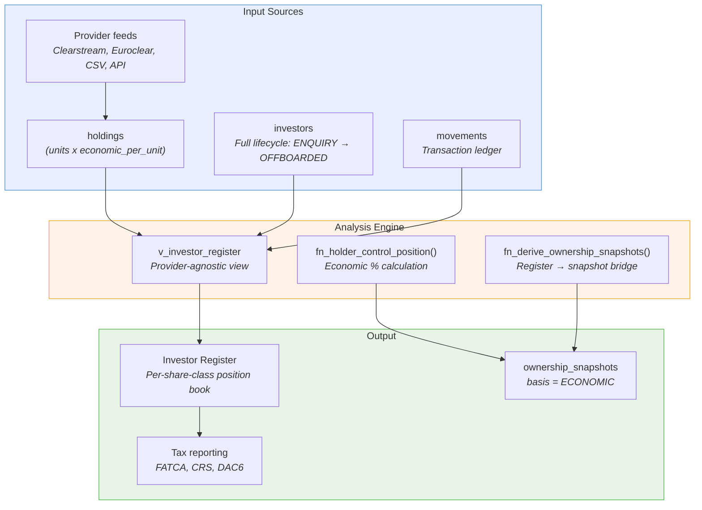

### 5.2 Investor Lifecycle State Machine

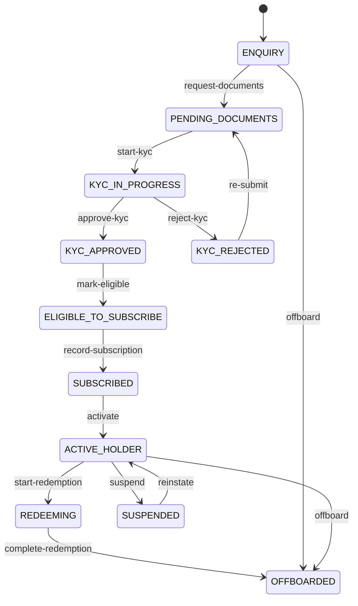

### 5.3 Dual-Purpose Holdings

The `holdings` table serves two modes via the `usage_type` discriminator:

| Mode | `usage_type` | Linked To | Purpose |
|------|-------------|-----------|---------|
| **Transfer Agency** | `TA` | `investor_id` (kyc.investors) | Client investor positions with full lifecycle |
| **UBO Tracking** | `UBO` | `investor_entity_id` only | Intra-group ownership for control analysis |

```sql
-- TA mode: full investor lifecycle, KYC tracking, tax reporting
SELECT * FROM kyc.holdings WHERE usage_type = 'TA';

-- UBO mode: ownership tracking for control register
SELECT * FROM kyc.holdings WHERE usage_type = 'UBO';
```

### 5.4 Movement Types (Transaction Ledger)

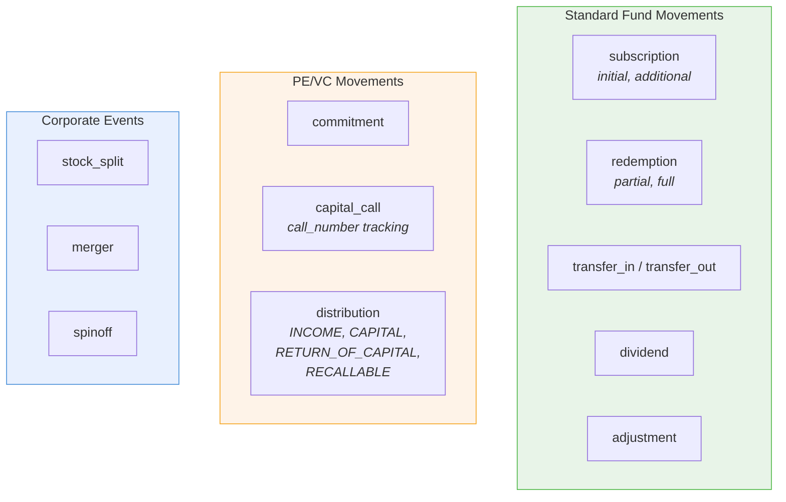

### 5.5 Provider-Agnostic Design

The investor register supports multiple data providers:

| Provider | Integration | Use Case |
|----------|------------|----------|
| `MANUAL` | Direct DSL entry | Small funds, ad-hoc |
| `CLEARSTREAM` | Automated feed | Luxembourg domiciled |
| `EUROCLEAR` | Automated feed | Belgian/European |
| `CSV_IMPORT` | Batch file | Migration, reconciliation |
| `API_FEED` | REST webhook | Real-time updates |

Each holding tracks `provider`, `provider_reference`, and `provider_sync_at` for reconciliation.

### 5.6 Investor Register View

The `v_investor_register` view presents a provider-agnostic, denormalized register:

| Field | Source | Purpose |
|-------|--------|---------|
| `investor_name` | entities | Display name |
| `investor_type` | investors | RETAIL, PROFESSIONAL, INSTITUTIONAL |
| `lifecycle_state` | investors | Current state in lifecycle |
| `kyc_status` | investors | KYC approval status |
| `holding_quantity` | holdings | Units held |
| `market_value` | units × NAV | Current value |
| `ownership_percentage` | units / total | Economic stake |
| `provider` | holdings | Data source |

### 5.7 Key Verbs — Investor Domain

| Verb | Purpose |
|------|---------|
| `investor.create` | Register new investor (starts at ENQUIRY) |
| `investor.request-documents` | ENQUIRY → PENDING_DOCUMENTS |
| `investor.approve-kyc` | KYC_IN_PROGRESS → KYC_APPROVED |
| `investor.mark-eligible` | KYC_APPROVED → ELIGIBLE_TO_SUBSCRIBE |
| `investor.record-subscription` | Record subscription event |
| `investor.activate` | SUBSCRIBED → ACTIVE_HOLDER |
| `investor.start-redemption` | Begin redemption process |
| `investor.suspend` / `reinstate` | Freeze/unfreeze investor |

### 5.8 Key Verbs — Holding Domain

| Verb | Purpose |
|------|---------|
| `holding.create` | Create holding (raw, entity-only) |
| `holding.create-for-investor` | Create holding linked to investor record |
| `holding.update-units` | Adjust position (with movement recording) |
| `holding.list-by-share-class` | All holders of a share class |
| `holding.list-by-investor` | All holdings for an investor |
| `holding.close` | Close position (zero units) |

---

## 6. Register 3: Fund-of-Fund / Look-Through — "What's the Exposure?"

The fund-of-fund register traces **economic ownership through multi-layer fund structures** to identify ultimate asset exposure. It answers: "If this investor holds Fund A, and Fund A holds Fund B, what is the investor's real exposure?"

### 6.1 Architecture

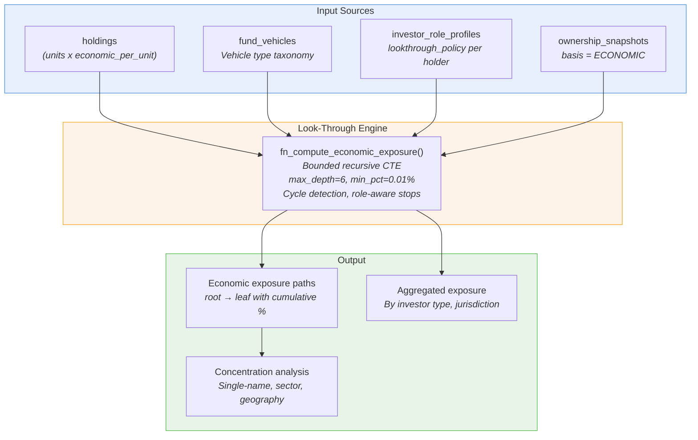

### 6.2 The Look-Through Problem

Consider a three-layer fund structure:

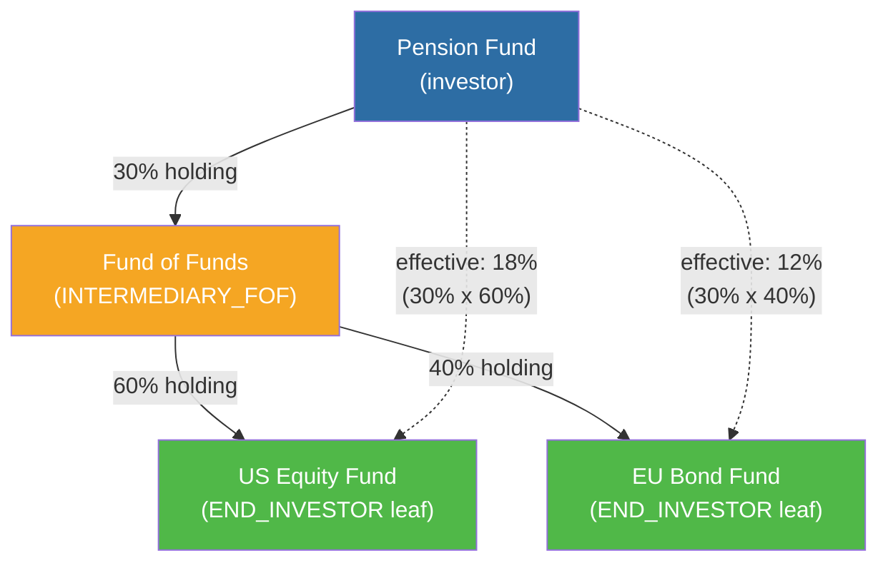

**Without look-through:** Pension Fund has a 30% position in Fund of Funds. That's all we know.

**With look-through:** Pension Fund has effective 18% exposure to US equities and 12% exposure to EU bonds.

### 6.3 Holder Role Profiles (The Look-Through Switch)

The `investor_role_profiles` table determines **whether and how** to look through each holder:

| Role Type | Look-Through | Rationale |
|-----------|-------------|-----------|
| `END_INVESTOR` | Never | Terminal node — UBO candidate |
| `NOMINEE` | Always if data | Holds on behalf, must look through |
| `OMNIBUS` | Always if data | Aggregated position, must disaggregate |
| `INTERMEDIARY_FOF` | Per policy | Fund-of-fund — look through to underlying |
| `MASTER_POOL` | Per policy | Master fund in master/feeder |
| `INTRA_GROUP_POOL` | Per policy | Internal group vehicle |
| `TREASURY` | Never | Self-held shares |
| `CUSTODIAN` | Always if data | Holds in custody, not beneficial |

**Look-Through Policies:**

| Policy | Behavior |
|--------|----------|
| `NONE` | Treat as leaf — stop here |
| `ON_DEMAND` | Only look through when explicitly requested |
| `AUTO_IF_DATA` | Automatically look through if beneficial owner data is available |
| `ALWAYS` | Always attempt look-through regardless of data |

### 6.4 Bounded Recursive Look-Through

The `fn_compute_economic_exposure()` function implements bounded recursive traversal:

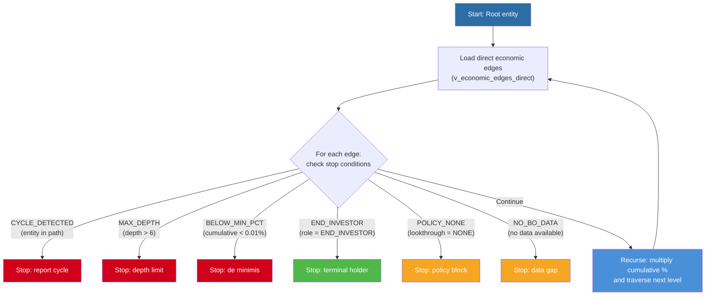

**Parameters:**

| Parameter | Default | Purpose |
|-----------|---------|---------|
| `p_max_depth` | 6 | Maximum recursion depth |
| `p_min_pct` | 0.0001 (0.01%) | De minimis threshold |
| `p_max_rows` | 200 | Safety limit on result set |
| `p_stop_on_no_bo_data` | true | Stop when no BO data available |
| `p_stop_on_policy_none` | true | Respect role profile policy |

### 6.5 Fund Vehicle Taxonomy

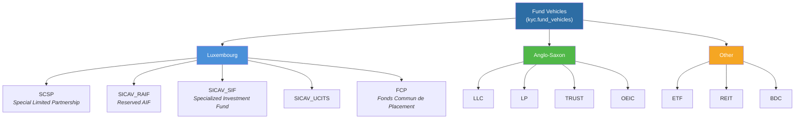

### 6.6 Umbrella / Compartment Structure

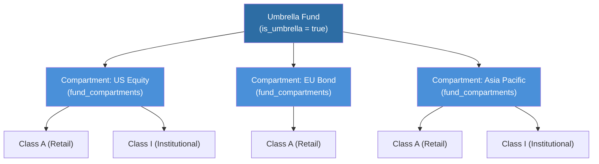

Compartments enable **ring-fencing** within umbrella funds — each compartment has its own share classes, NAV, and investor base, but shares the umbrella's legal identity.

### 6.7 Key Verbs — Economic Exposure Domain

| Verb | Purpose |
|------|---------|
| `economic-exposure.compute` | Bounded recursive look-through |
| `economic-exposure.summary` | Aggregated exposure by investor type |
| `issuer-control-config.upsert` | Set per-issuer thresholds |

### 6.8 Key Verbs — Ownership Domain (Register Bridge)

| Verb | Purpose |
|------|---------|
| `ownership.compute` | Derive ownership snapshots from register holdings |
| `ownership.snapshot.list` | List historical snapshots |
| `ownership.control-positions` | Holder control positions |
| `ownership.who-controls` | Who controls this entity? |
| `ownership.reconcile` | Cross-check register vs control edges |
| `ownership.trace-chain` | Trace specific ownership chain |

---

## 7. The Intersection: How Registers Connect

### 7.1 The Ownership Snapshot Bridge

The `ownership_snapshots` table is the **bridge between registers**, recording point-in-time ownership from multiple bases:

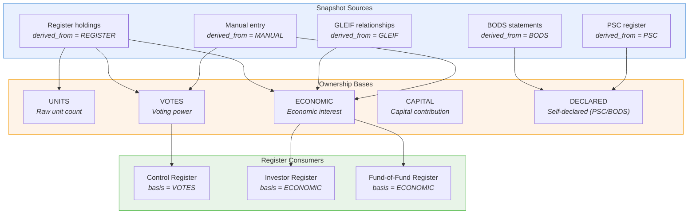

### 7.2 Snapshot Schema

```sql
CREATE TABLE kyc.ownership_snapshots (
    snapshot_id       UUID PRIMARY KEY,
    issuer_entity_id  UUID NOT NULL,     -- Who is owned
    owner_entity_id   UUID NOT NULL,     -- Who owns
    share_class_id    UUID,              -- Which class (optional)
    
    as_of_date        DATE NOT NULL,     -- Point in time
    basis             VARCHAR(20),       -- UNITS, VOTES, ECONOMIC, CAPITAL, DECLARED
    
    -- The numbers
    units             NUMERIC(20,6),
    percentage        NUMERIC(8,4),
    percentage_min    NUMERIC(8,4),      -- Range (for BODS declared)
    percentage_max    NUMERIC(8,4),
    
    -- Denominator (for audit)
    numerator         NUMERIC(20,6),
    denominator       NUMERIC(20,6),
    
    -- Provenance
    derived_from      VARCHAR(20),       -- REGISTER, BODS, GLEIF, PSC, MANUAL, INFERRED
    is_direct         BOOLEAN DEFAULT true,
    confidence        VARCHAR(20) DEFAULT 'HIGH',
    
    -- Temporal versioning
    superseded_at     TIMESTAMPTZ,
    superseded_by     UUID
);
```

### 7.3 The UBO Sync Trigger

When a holding crosses the 25% threshold, an automatic trigger creates/updates UBO relationships:

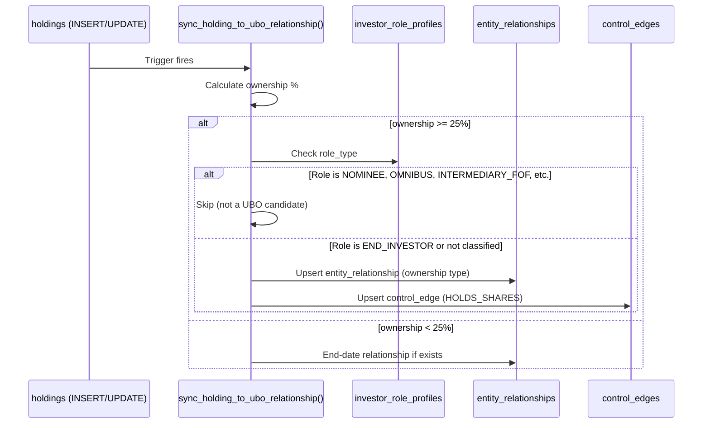

This ensures the control register automatically stays in sync with the investor register when significant holdings change.

### 7.4 Reconciliation

The `ownership.reconcile` verb cross-checks the three sources:

| Check | Source 1 | Source 2 | Finding Type |
|-------|----------|----------|-------------|
| Register vs Control | Holdings-derived voting % | Control edges voting % | `VOTING_MISMATCH` |
| Register vs BODS | Holdings-derived economic % | BODS declared % | `DECLARATION_GAP` |
| Voting totals | Sum of all voting % | 100% | `VOTING_TOTAL_MISMATCH` |
| Economic totals | Sum of all economic % | 100% | `ECONOMIC_TOTAL_MISMATCH` |
| Missing UBO | >25% holder | entity_ubos | `UBO_CANDIDATE_NO_DETERMINATION` |

---

## 8. Supply Chain: Issuance and Dilution

### 8.1 Capital Supply Model

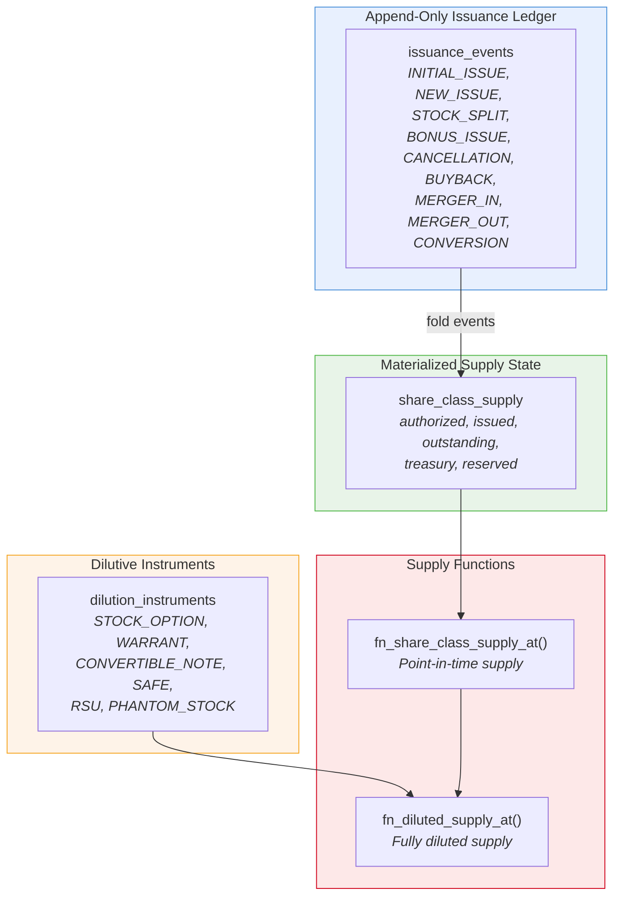

### 8.2 Dilution Instruments

For fully diluted ownership calculation, the system tracks instruments that **could** convert to equity:

| Instrument | Effect on Control | Effect on Economics |
|-----------|-------------------|---------------------|
| Stock options | Dilutes voting when exercised | Dilutes economic |
| Warrants | Same | Same |
| Convertible notes | Converts at valuation cap / discount | Adds new shares |
| SAFEs | Converts at next round | Adds new shares |
| RSUs | Vests into shares | Dilutes both |

**Fully diluted calculation:**

```
Outstanding shares: 1,000,000
+ Exercisable options: 100,000
+ In-the-money warrants: 50,000
+ Convertible note (at cap): 150,000
= Fully diluted: 1,300,000

Holder with 200,000 shares:
  Basic ownership: 200K / 1M = 20.0%
  Fully diluted: 200K / 1.3M = 15.4%
```

### 8.3 Special Rights (Beyond Shares)

Not all control comes from shares. The system tracks non-share rights:

| Right Type | Effect |
|-----------|--------|
| `BOARD_APPOINTMENT` | Appoints N directors |
| `BOARD_OBSERVER` | Observer seat (no vote) |
| `VETO_MA` | Veto on M&A transactions |
| `VETO_FUNDRAISE` | Veto on new fundraising |
| `VETO_DIVIDEND` | Veto on distributions |
| `ANTI_DILUTION` | Protection against dilution |
| `DRAG_ALONG` | Force sale of minority |
| `TAG_ALONG` | Right to sell alongside majority |
| `FIRST_REFUSAL` | Right of first refusal on transfers |
| `REDEMPTION` | Right to redeem shares |

These rights are stored per share class or per holder and feed into the control register's analysis.

---

## 9. Entity Relationship Diagram

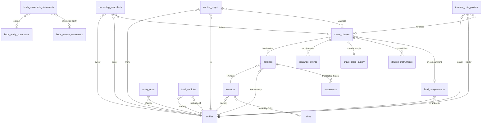

---

## 10. Worked Example: Three Lenses on Allianz

Consider an Allianz fund structure:

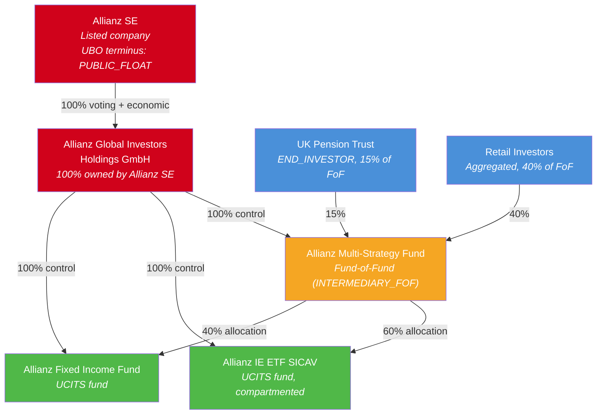

**Lens 1 — Control Register:**
- Allianz SE → AGI Holdings (100% voting) → all funds (100% control)
- UBO determination: Allianz SE is PUBLIC_FLOAT (listed terminus)
- Board controller: AGI Holdings via Rule B (100% voting rights)

**Lens 2 — Investor Register:**
- Multi-Strategy Fund share classes: UK Pension Trust holds 15%, Retail 40%, AGI 45%
- UK Pension Trust lifecycle: ACTIVE_HOLDER, KYC_APPROVED, PROFESSIONAL investor
- NAV allocation: 15% × NAV = Pension Trust's economic entitlement

**Lens 3 — Fund-of-Fund Look-Through:**
- UK Pension Trust (15% of FoF) → FoF holds 60% EQ + 40% FI
- Effective exposure: 9% to EU equity ETF, 6% to fixed income
- Stop condition on Allianz SE: PUBLIC_FLOAT (no further look-through)

---

## 11. Completeness Summary

### 11.1 Table Coverage

| Domain | Tables | Key Tables |
|--------|--------|------------|
| Share Classes | 3 | `share_classes`, `share_class_supply`, `share_class_identifiers` |
| Holdings | 2 | `holdings`, `movements` |
| Investors | 1 | `investors` |
| Fund Structure | 2 | `fund_vehicles`, `fund_compartments` |
| Control | 2 | `control_edges`, `board_controller` (derived) |
| UBO | 1 | `entity_ubos` |
| BODS | 3 | `bods_entity_statements`, `bods_person_statements`, `bods_ownership_statements` |
| Ownership Bridge | 1 | `ownership_snapshots` |
| Role Profiles | 1 | `investor_role_profiles` |
| Dilution | 1 | `dilution_instruments` |
| Issuance | 1 | `issuance_events` |
| Config | 1 | `issuer_control_config` |
| **Total** | **19** | |

### 11.2 Verb Coverage

| Domain | Verb Count | Coverage |
|--------|-----------|----------|
| `investor` | 16 | Full lifecycle (ENQUIRY → OFFBOARDED) |
| `holding` | 11 | CRUD + dual-mode (TA/UBO) |
| `share-class` | 8 | CRUD + NAV updates + identifiers |
| `ubo` | 18 | Ownership, control, trust, lifecycle |
| `control` | 14 | Analysis, graph, reconciliation, import |
| `ownership` | 15 | Snapshots, reconciliation, special rights |
| `economic-exposure` | 3 | Compute, summary, config |
| **Total** | **85** | |

### 11.3 SQL Function Coverage

| Function | Purpose |
|----------|---------|
| `fn_holder_control_position()` | Per-holder voting + economic % |
| `fn_share_class_supply_at()` | Point-in-time supply (basic) |
| `fn_diluted_supply_at()` | Fully diluted supply including options/warrants |
| `fn_compute_economic_exposure()` | Bounded recursive look-through |
| `fn_economic_exposure_summary()` | Aggregated exposure by investor type |
| `fn_derive_ownership_snapshots()` | Register → snapshot bridge |
| `sync_holding_to_ubo_relationship()` | Auto-sync UBO trigger (25% threshold) |

### 11.4 Rust Type Coverage

| Type | Module | Purpose |
|------|--------|---------|
| `InvestorRegisterView` | `ob-poc-types` | Top-level register view |
| `ControlHolderNode` | `ob-poc-types` | Per-holder control analysis |
| `ThresholdConfig` | `ob-poc-types` | Configurable disclosure thresholds |
| `ControlEdge` | `ob-poc-types` | Standards-aligned edge |
| `ControlEdgeType` | `ob-poc-types` | 16 edge type enum |
| `BoardControlMethod` | `ob-poc-types` | 3-rule board controller |
| `BoardControllerEdge` | `ob-poc-types` | Board controller determination |
| `DiscoveredUbo` | `bods/ubo_discovery` | UBO with chain + confidence |
| `UboResult` | `bods/ubo_discovery` | NaturalPersons / PublicFloat / StateOwned / Unknown |
| `PscCategory` | `ob-poc-types` | UK PSC category enum |

---

## 12. Open Design Questions (For Peer Review)

1. **Temporal consistency across registers:** When a holding changes at T1, the ownership_snapshot is created at T1, but the UBO sync trigger fires immediately. Should the UBO determination use a point-in-time snapshot or always reflect real-time holdings?

2. **Look-through depth limits by jurisdiction:** UCITS requires full look-through for 10% concentration. AIFMD Art. 7 requires look-through for leverage. Should `fn_compute_economic_exposure()` accept jurisdiction-specific depth limits?

3. **Nominee chain length:** Some custody chains are Investor → Nominee → Global Custodian → Local Custodian → CSD. Should we have a maximum nominee chain depth separate from the fund-of-fund depth limit?

4. **Hybrid role profiles:** An entity can be an END_INVESTOR for one issuer and an INTERMEDIARY_FOF for another. The current `investor_role_profiles` supports this (scoped per issuer × holder × share_class), but should we have a default role type per entity?

5. **Real-time vs batch look-through:** The current implementation is on-demand (verb invocation). Should we add a materialized view for frequently-queried exposure paths (e.g., for the top 10 funds)?

6. **BODS vs Register reconciliation frequency:** The auto-sync trigger handles register → control, but BODS → register reconciliation is manual. Should this be automated on BODS import?

---

## Appendix A: Related Architecture Documents

| Document | Location | Coverage |
|----------|----------|----------|
| Instrument Matrix & Trading Universe | `migrations/INSTRUMENT_MATRIX_TRADING_UNIVERSE.md` | Trading profile, settlement routing, ISDA/CSA |
| Schema Entity Overview | `migrations/OB_POC_SCHEMA_ENTITY_OVERVIEW.md` | Full schema overview |
| Group Taxonomy & Ownership | `ai-thoughts/019-group-taxonomy-intra-company-ownership.md` | Group structure design |
| Investor Register Visualization | `ai-thoughts/018-investor-register-visualization.md` | UI visualization approach |
| Entity Resolution Wiring | `ai-thoughts/033-entity-resolution-wiring-plan.md` | Entity linking for register entities |

## Appendix B: Standards Cross-Reference

| Standard | Tables Used | Purpose |
|----------|-----------|---------|
| **BODS 0.4** | `bods_entity_statements`, `bods_person_statements`, `bods_ownership_statements` | Beneficial ownership data exchange |
| **GLEIF RR** | `entity_relationships`, `control_edges` | Legal entity relationship register |
| **UK PSC** | `control_edges.psc_category` | Persons of Significant Control |
| **4AMLD/5AMLD** | `entity_ubos`, `issuer_control_config` | EU UBO thresholds (25%) |
| **FATCA** | `investors.fatca_status` | US tax compliance |
| **CRS** | `investors.crs_status` | Common Reporting Standard |
| **UCITS** | `fund_vehicles`, `economic-exposure.compute` | Fund look-through requirements |
| **AIFMD** | `fund_vehicles`, `economic-exposure.compute` | AIF look-through for leverage |
