# KYC, Group Structure & UBO Discovery

## Peer Review Paper — ob-poc Data Model, Verb Catalogue & Computation Engine

**Date:** 2026-02-11
**Scope:** KYC case management, group structure resolution, ownership graph, control analysis, UBO discovery, screening, adversarial verification, and BODS/GLEIF/PSC standard alignment.

---

## 1. Introduction

This paper documents the complete KYC and UBO subsystem within ob-poc. The system implements a **computed UBO model** — ownership and control edges are stored as facts; UBO status is derived dynamically via recursive graph traversal governed by jurisdiction-specific threshold rules.

Three interlocking subsystems are covered:

| Subsystem | Purpose | Key Tables |
|-----------|---------|------------|
| **KYC Case Management** | Lifecycle of due-diligence investigations | `kyc.cases`, `kyc.entity_workstreams`, `kyc.doc_requests` |
| **Group Structure** | Client group resolution, corporate hierarchy, GLEIF import | `client_group`, `client_group_anchor`, `entity_parent_relationships` |
| **UBO Discovery** | Ownership/control graph, chain traversal, threshold-gated UBO identification | `control_edges`, `ubo_registry`, `ownership_snapshots` |

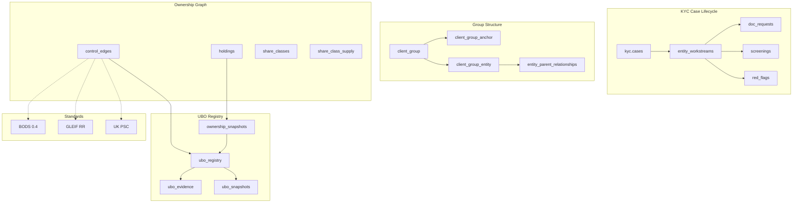

---

## 2. KYC Case Lifecycle

### 2.1 Case State Machine

A KYC case tracks the due-diligence investigation for a subject entity within a CBU context. The status field governs what operations are permitted.

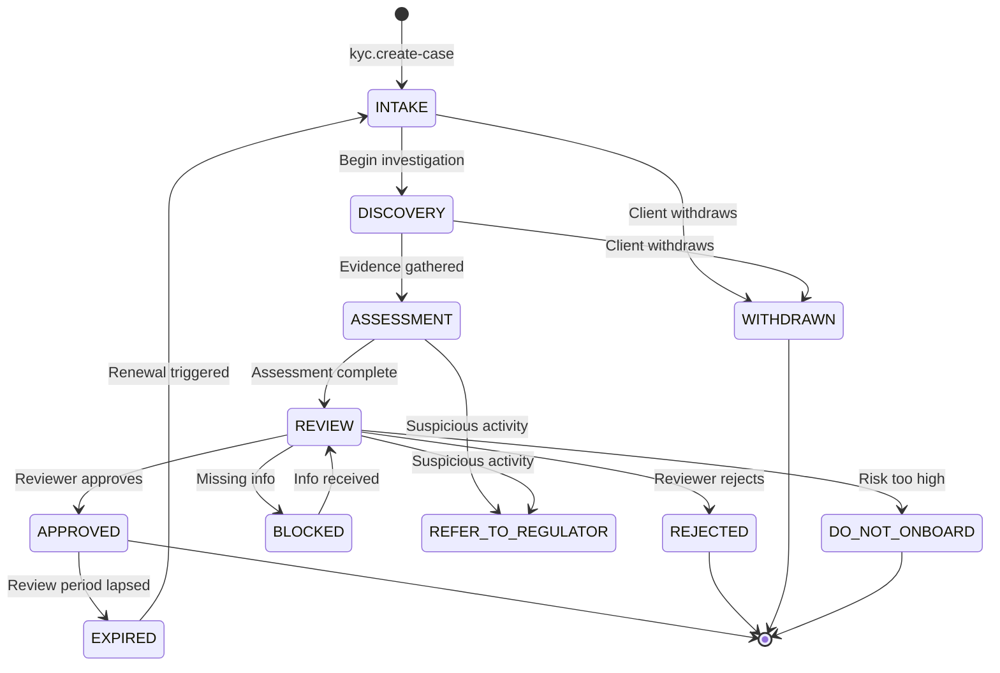

**Case Types:**

| Type | Trigger | Scope |
|------|---------|-------|
| `NEW_CLIENT` | New onboarding | Full KYC |
| `PERIODIC_REVIEW` | Scheduled interval | Refresh screening + docs |
| `EVENT_DRIVEN` | Ownership change, adverse media | Targeted re-assessment |
| `REMEDIATION` | Regulatory finding | Gap closure |

**Escalation Levels:** `STANDARD` → `SENIOR_COMPLIANCE` → `EXECUTIVE` → `BOARD`

**Risk Ratings:** `LOW`, `MEDIUM`, `HIGH`, `VERY_HIGH`, `PROHIBITED`

### 2.2 Case Data Model

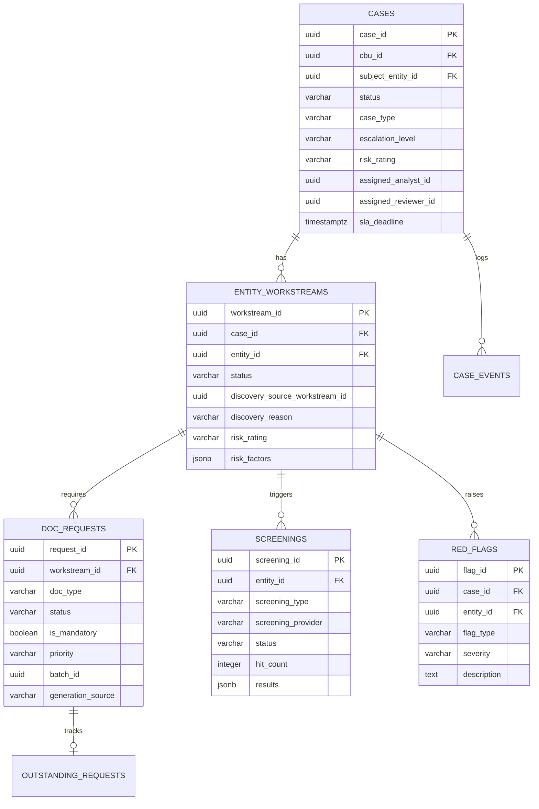

### 2.3 Entity Workstreams

Each entity discovered during a KYC investigation gets its own **workstream**. Workstreams can spawn child workstreams when new entities are discovered (e.g., UBO discovery finds an intermediate holding company).

**Workstream Status:** `PENDING` → `IN_PROGRESS` → `COMPLETED` | `BLOCKED` | `DEFERRED`

The `discovery_source_workstream_id` field creates a **discovery chain** — tracing how each entity was found during the investigation.

### 2.4 Document Request Lifecycle

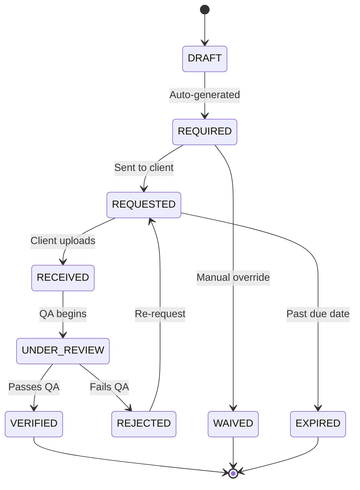

**Generation Sources:**
- `MANUAL` — Analyst creates request
- `THRESHOLD` — Auto-generated when ownership crosses threshold (via `kyc.generate_doc_requests_from_threshold()`)
- `PERIODIC_REVIEW` — Scheduled refresh

### 2.5 KYC Case Pack (V2 REPL Journey)

The KYC case pack defines a guided workflow in the V2 REPL:

```
kyc.create-case → ubo.discover → document.solicit-set → screening.run → kyc.assign-reviewer
```

**Pack questions:**
1. Which entity? (`entity_ref`)
2. New or renewal? (`case_type`)
3. Reviewer? (optional, `entity_ref`)
4. Risk rating? (optional, default `medium`)
5. Document types? (optional, default `[passport, proof_of_address]`)

---

## 3. Group Structure & Client Resolution

### 3.1 Two-Stage Client Group Resolution

The system resolves natural language client references (e.g., "allianz") to concrete entity scopes through a two-stage pipeline.

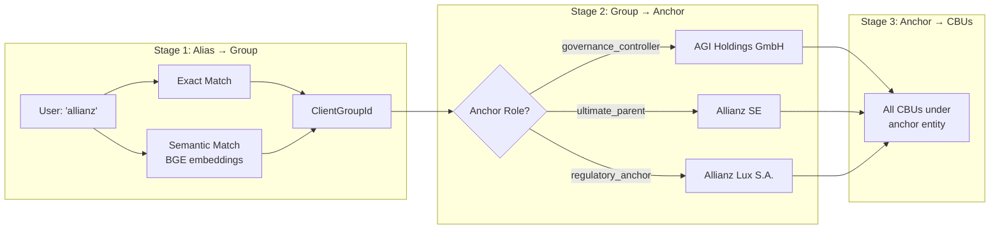

**Anchor Roles** determine which entity in the group is used as the scope root:

| Role | Use Case | Default Verbs |
|------|----------|---------------|
| `ultimate_parent` | UBO discovery, ownership tracing | `ubo.*` |
| `governance_controller` | Session scope, CBU loading | `session.*`, `cbu.*` |
| `book_controller` | Regional operations | — |
| `operating_controller` | Day-to-day ops | `contract.*` |
| `regulatory_anchor` | Compliance, KYC | `kyc.*` |

### 3.2 Group Structure Tables

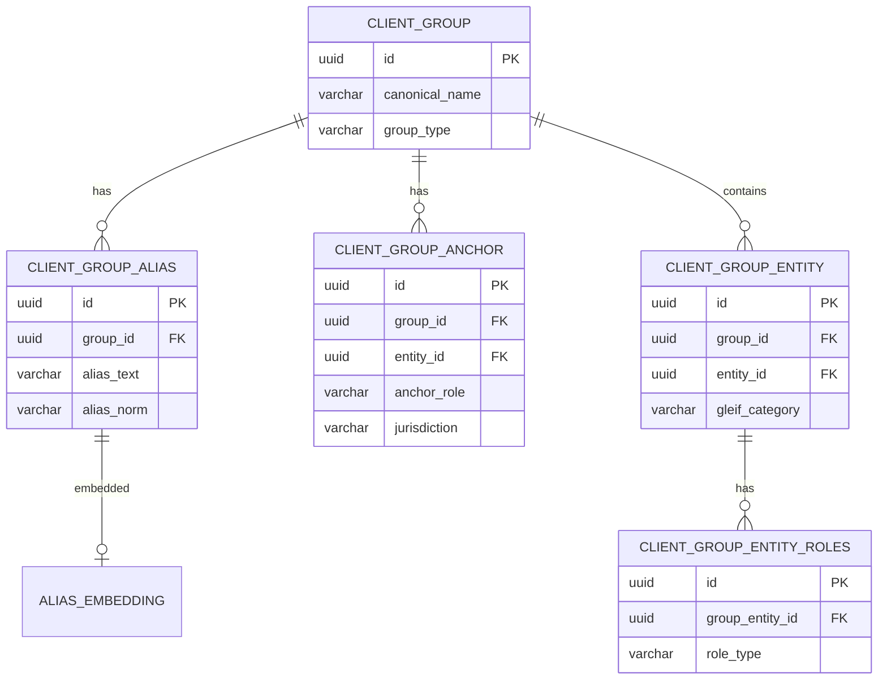

### 3.3 GLEIF Corporate Hierarchy Import

The `gleif.import-tree` verb traverses the GLEIF API to build the corporate ownership graph:

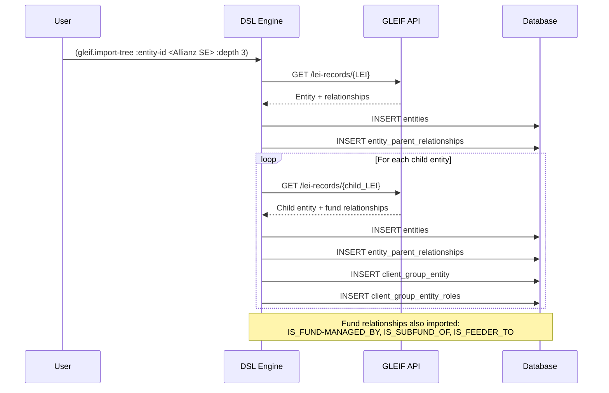

**GLEIF Relationship → DB Mapping:**

| GLEIF Relationship | DB `relationship_type` | DB `edge_type` |
|--------------------|----------------------|-----------------|
| `DIRECT_PARENT` | `DIRECT_PARENT` | `CONSOLIDATED_BY` |
| `ULTIMATE_PARENT` | `ULTIMATE_PARENT` | `ULTIMATELY_CONSOLIDATED_BY` |
| `IS_FUND-MANAGED_BY` | `FUND_MANAGER` | `MANAGED_BY` |
| `IS_SUBFUND_OF` | `UMBRELLA_FUND` | `SUBFUND_OF` |
| `IS_FEEDER_TO` | `MASTER_FUND` | `FEEDS_INTO` |

---

## 4. Ownership & Control Graph

### 4.1 Control Edge Types (16 types, 3 standards)

Every ownership/control relationship is stored as a `control_edge` with automatic cross-referencing to BODS, GLEIF, and UK PSC standards via a trigger.

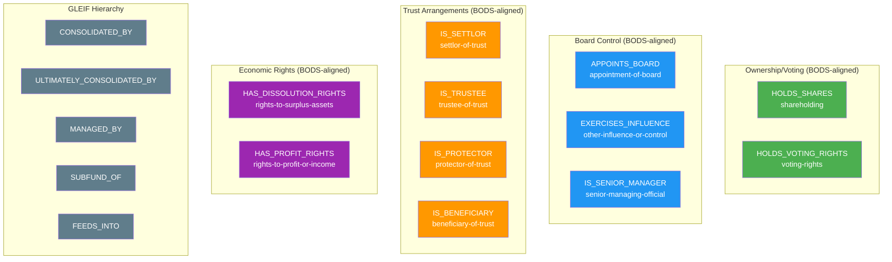

### 4.2 Auto-Trigger: Standards Cross-Referencing

When a `control_edge` is inserted, a PostgreSQL trigger automatically sets:

| Field | Source | Logic |
|-------|--------|-------|
| `bods_interest_type` | Edge type mapping | `HOLDS_SHARES` → `shareholding`, `APPOINTS_BOARD` → `appointment-of-board` |
| `gleif_relationship_type` | Edge type mapping | `CONSOLIDATED_BY` → `IS_DIRECTLY_CONSOLIDATED_BY` |
| `psc_category` | Edge type + percentage | `HOLDS_SHARES` at 35% → `ownership-of-shares-25-to-50` |

**UK PSC Thresholds (auto-computed):**

| Percentage Range | PSC Category |
|-----------------|--------------|
| >75% shares | `ownership-of-shares-75-to-100` |
| >50% shares | `ownership-of-shares-50-to-75` |
| >25% shares | `ownership-of-shares-25-to-50` |
| >50% board appointments | `appoints-majority-of-board` |

### 4.3 Rust Type: ControlEdgeType Enum

```rust
pub enum ControlEdgeType {
    // Ownership/Voting (BODS-aligned)
    HoldsShares,
    HoldsVotingRights,
    // Board control
    AppointsBoard,
    ExercisesInfluence,
    IsSeniorManager,
    // Trust arrangements
    IsSettlor, IsTrustee, IsProtector, IsBeneficiary,
    // Economic rights
    HasDissolutionRights, HasProfitRights,
    // GLEIF hierarchy
    ConsolidatedBy, UltimatelyConsolidatedBy,
    ManagedBy, SubfundOf, FeedsInto,
}
```

Each variant maps to BODS and GLEIF standard strings via `to_bods_interest()` and `to_gleif_relationship()` methods.

### 4.4 Control Edges Table

```sql
CREATE TABLE "ob-poc".control_edges (
    id              UUID PRIMARY KEY,
    from_entity_id  UUID NOT NULL,    -- Controller
    to_entity_id    UUID NOT NULL,    -- Controlled
    edge_type       TEXT NOT NULL,    -- One of 16 types
    percentage      DECIMAL(5,2),     -- Ownership/voting %
    is_direct       BOOLEAN,
    is_beneficial   BOOLEAN,
    is_legal        BOOLEAN,
    share_class_id  UUID,             -- Links to specific share class
    votes_per_share DECIMAL(10,4),
    -- Auto-set by trigger:
    bods_interest_type  TEXT,
    gleif_relationship_type TEXT,
    psc_category    TEXT,
    -- Provenance:
    source_document_id  UUID,
    source_register TEXT,             -- gleif, uk-psc, lux-rbe, sec-13d, manual
    effective_date  DATE,
    end_date        DATE,
    UNIQUE (from_entity_id, to_entity_id, edge_type) WHERE end_date IS NULL
);
```

---

## 5. Board Controller Derivation

### 5.1 Three-Rule Priority Engine

The system derives a **single deterministic governance controller** per CBU using three rules in priority order:

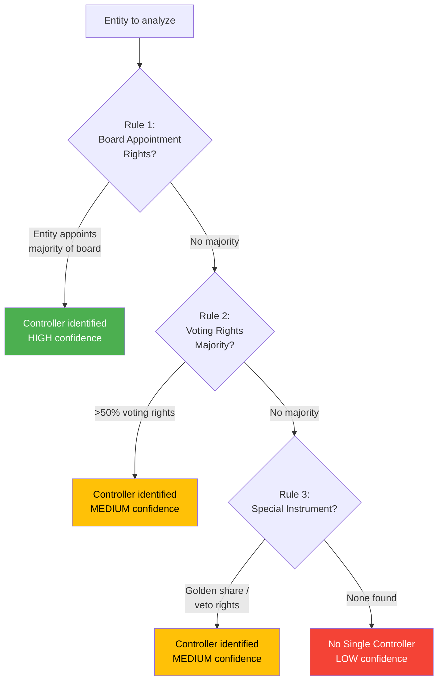

**Rust enum:**
```rust
pub enum BoardControlMethod {
    BoardAppointmentRights,   // Highest priority
    VotingRightsMajority,     // Second priority
    SpecialInstrument,        // Third priority (golden share, veto)
    Mixed,                    // Multiple methods, no clear winner
    NoSingleController,       // Cannot determine
}
```

**Confidence scoring:**

| Combination | Confidence |
|-------------|------------|
| Corroboration > 0.8 AND score > 0.7 | `High` |
| Corroboration > 0.5 AND score > 0.5 | `Medium` |
| Otherwise | `Low` |

### 5.2 Evidence Trail

Every board controller derivation is recorded in `cbu_board_controller` with full audit:

```sql
CREATE TABLE "ob-poc".cbu_board_controller (
    id                    UUID PRIMARY KEY,
    cbu_id                UUID UNIQUE,
    controller_entity_id  UUID,
    controller_name       TEXT,
    method                TEXT,       -- BoardControlMethod
    confidence            TEXT,       -- High/Medium/Low
    score                 DECIMAL(3,2),
    as_of                 DATE,
    explanation           JSONB,      -- Full derivation audit
    computed_at           TIMESTAMPTZ,
    computed_by           TEXT
);
```

Supporting evidence in `board_control_evidence`:

| Source Type | Description |
|-------------|-------------|
| `gleif_rr` | GLEIF reporting relationship |
| `bods_statement` | BODS ownership statement |
| `investor_register` | Holdings register |
| `governance_doc` | SHA, articles, board minutes |
| `special_instrument` | Golden share, veto right |
| `manual_entry` | Analyst override |

---

## 6. UBO Discovery Engine

### 6.1 Computation Architecture

UBO is **computed, not stored**. The ownership graph is traversed recursively, and UBO status is determined by jurisdiction-specific threshold rules.

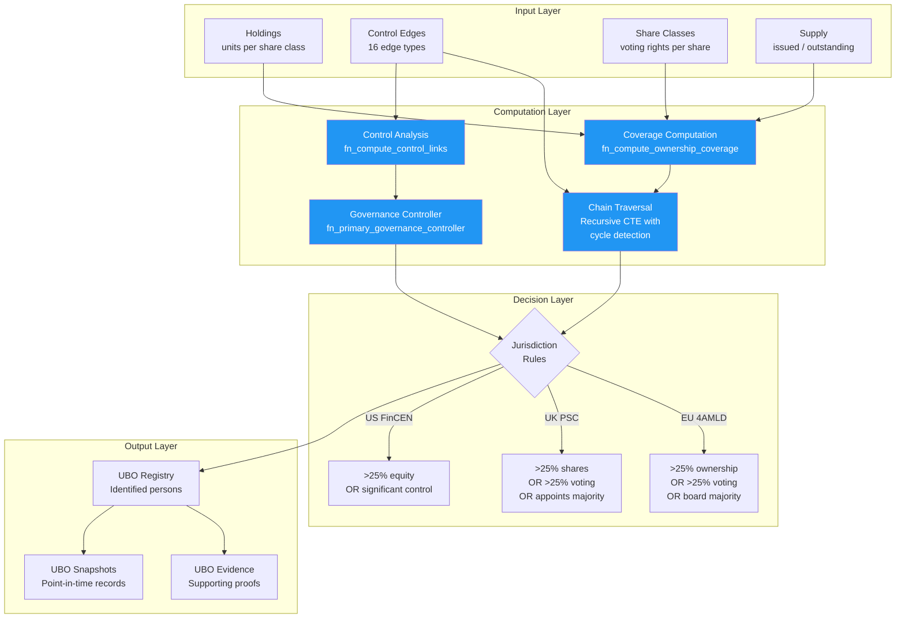

### 6.2 Ownership Chain Traversal

The recursive chain traversal follows ownership edges through the graph, multiplying percentages at each hop:

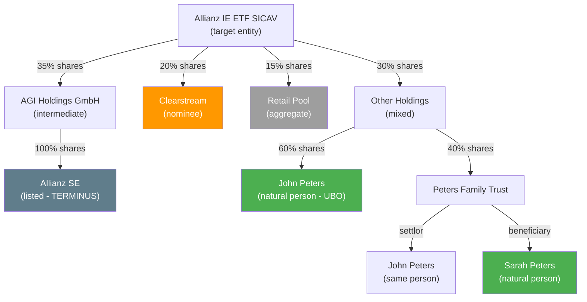

**Chain computation rules:**
- **Multiplication:** Indirect ownership = product of percentages through chain
  - John Peters via OTHER: 30% x 60% = **18%** direct + trust routes
- **Cycle detection:** Path array prevents revisiting entities
- **Max depth:** Default 6 hops (configurable per jurisdiction)
- **Terminal entities:** Stop traversal at LISTED_COMPANY, GOVERNMENT_ENTITY, REGULATED_FUND, WIDELY_HELD
- **Aggregation:** Multiple paths to same person are summed

### 6.3 Ownership Edge Types

| Type | Meaning | UBO Relevance |
|------|---------|---------------|
| `BENEFICIAL` | Full chain to natural person verified | Counts toward UBO threshold |
| `LEGAL_ONLY` | Nominee/custodian (beneficial owner unknown) | Triggers research |
| `AGGREGATE` | Public float, distributed retail | Accepted gap (below threshold each) |
| `UNACCOUNTED` | Gap in share register | Drives reconciliation |
| `CONTROL` | Non-ownership control (board, veto) | Can trigger UBO without shares |
| `BROKEN_CHAIN` | Chain stops at non-terminal entity | Research required |

### 6.4 Coverage Computation

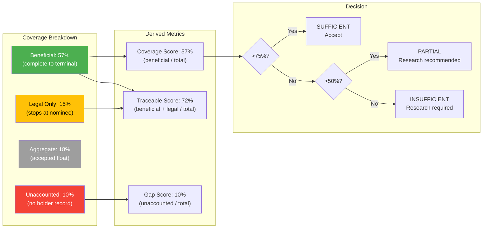

### 6.5 Terminal vs Non-Terminal Entities

| Category | Entity Types | Chain Behavior |
|----------|-------------|----------------|
| **Terminal** | `NATURAL_PERSON`, `REGULATED_ENTITY`, `GOVERNMENT_ENTITY`, `PUBLIC_FLOAT` | Chain stops — these ARE the UBOs or accepted endpoints |
| **Non-Terminal** | `LIMITED_COMPANY`, `PARTNERSHIP`, `TRUST`, `FOUNDATION`, `FUND`, `SPV`, `NOMINEE` | Look-through required — traverse further |

The `ubo.mark-terminus` verb explicitly marks an entity as a chain terminus (e.g., a listed company where further tracing is exempt).

### 6.6 Jurisdiction-Specific Thresholds

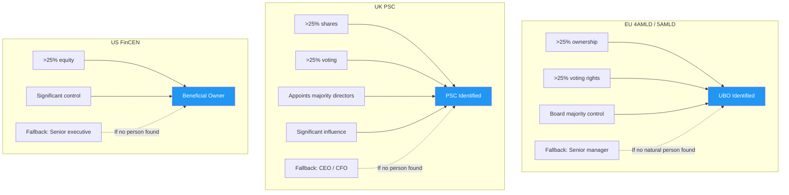

Configured per issuer in `kyc.issuer_control_config`:

```sql
CREATE TABLE kyc.issuer_control_config (
    config_id                UUID PRIMARY KEY,
    issuer_entity_id         UUID,
    jurisdiction             VARCHAR(10),
    control_basis            VARCHAR(20),  -- VOTES, ECONOMIC, UNITS
    voting_basis             VARCHAR(30),  -- ATTENDANCE_QUORUM, ISSUED_CAPITAL, OUTSTANDING_SHARES
    control_threshold_pct    NUMERIC(5,2), -- Typically 50%
    significant_influence_pct NUMERIC(5,2), -- Typically 25%
    disclosure_threshold_pct NUMERIC(5,2),
    effective_from           DATE,
    effective_to             DATE
);
```

---

## 7. UBO Registry & Evidence

### 7.1 UBO Registry

Once a natural person is identified as a UBO (ownership/voting above threshold, or control-based), they are recorded in the registry with full provenance.

```sql
CREATE TABLE "ob-poc".ubo_registry (
    ubo_id                  UUID PRIMARY KEY,
    cbu_id                  UUID,
    person_entity_id        UUID,
    person_name             TEXT,
    ubo_type                VARCHAR(30),  -- DIRECT_OWNER, INDIRECT_OWNER, CONTROLLER, BENEFICIAL_OWNER
    effective_ownership_pct  NUMERIC(8,4),
    voting_rights_pct       NUMERIC(8,4),
    control_basis           TEXT[],        -- Array of basis codes
    discovery_method        VARCHAR(50),
    discovery_date          DATE,
    status                  VARCHAR(20),   -- IDENTIFIED, VERIFIED, EXPIRED, UNDER_REVIEW
    confidence_score        NUMERIC(3,2),
    chain_paths             JSONB,         -- All paths from entity to person
    verified_at             TIMESTAMPTZ,
    verified_by             VARCHAR(100),
    expires_at              TIMESTAMPTZ
);
```

**UBO Types:**

| Type | Definition |
|------|-----------|
| `DIRECT_OWNER` | Directly holds shares above threshold |
| `INDIRECT_OWNER` | Holds through chain of entities |
| `CONTROLLER` | Board control / voting agreement / veto |
| `BENEFICIAL_OWNER` | Trust beneficiary / profit rights |
| `NATURAL_PERSON` | Chain traced to natural person |
| `PUBLIC_FLOAT` | Synthetic — distributed retail |
| `STATE_OWNED` | Government-owned entity |
| `WIDELY_HELD` | No single UBO identifiable |
| `UNKNOWN` | Chain broken, cannot determine |
| `EXEMPT` | Regulated entity exempt from look-through |

### 7.2 Evidence Model

Every UBO identification requires supporting evidence:

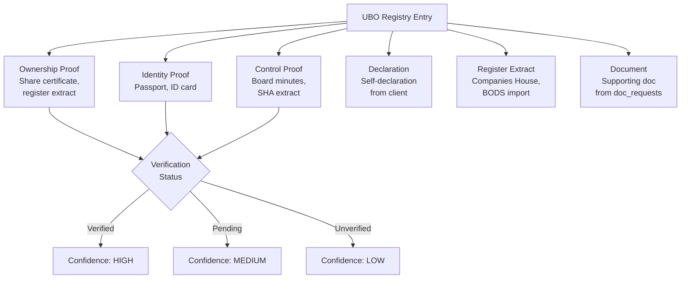

### 7.3 UBO Snapshots & Comparisons

Point-in-time UBO determinations are captured as snapshots for regulatory reporting and change detection:

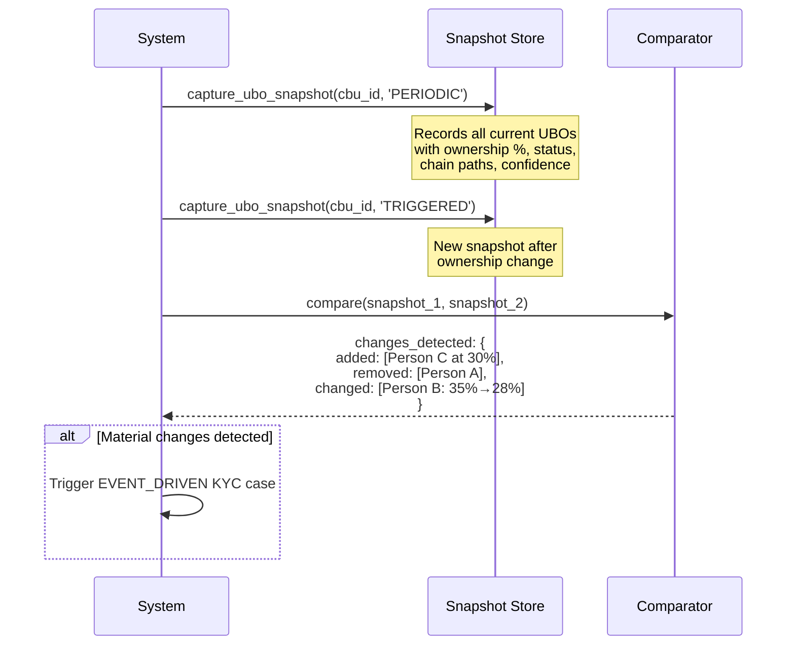

---

## 8. Capital Structure & Governance

### 8.1 Share Classes

Share classes are the **denominator** for all ownership calculations. Each class has distinct voting and economic rights:

| Share Type | Voting Per Unit | Economic Per Unit | Use Case |
|-----------|----------------|-------------------|----------|
| `ORDINARY` | 1.0 | 1.0 | Standard equity |
| `PREFERENCE_A` | 0.0 | 1.5 | Non-voting preferred |
| `DEFERRED` | 0.0 | 0.5 | Deferred dividend |
| `MANAGEMENT` | 10.0 | 1.0 | Super-voting (founder) |
| `CONVERTIBLE` | 0.0 | — | Converts to ordinary on trigger |
| `FUND_UNIT` | 1.0 | 1.0 | UCITS / AIF fund units |
| `LP_INTEREST` | varies | varies | Partnership capital |

### 8.2 Board Compositions & Appointment Rights

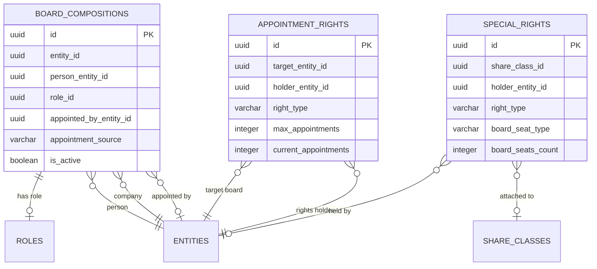

**Appointment Right Types:** `APPOINT_DIRECTOR`, `REMOVE_DIRECTOR`, `VETO_APPOINTMENT`, `NOMINATE_CHAIRMAN`, `OBSERVER_RIGHTS`

**Special Right Types:** `VETO`, `DRAG_ALONG`, `TAG_ALONG`, `PREEMPTION`, `GOLDEN_SHARE`, `ANTI_DILUTION`, `INFORMATION_RIGHTS`, `CONSENT_RIGHTS`

### 8.3 Trust Provisions

Trust structures require specialized control analysis:

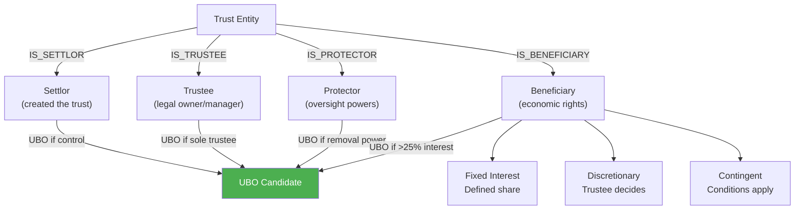

Stored in `kyc.trust_provisions` with 17 provision types including `INCOME_BENEFICIARY`, `CAPITAL_BENEFICIARY`, `DISCRETIONARY_BENEFICIARY`, `APPOINTOR_POWER`, `PROTECTOR_POWER`, `TRUSTEE_REMOVAL`.

### 8.4 Partnership Capital

Partnership structures track GP/LP interests separately from corporate shares:

```sql
CREATE TABLE kyc.partnership_capital (
    id                    UUID PRIMARY KEY,
    partnership_entity_id UUID,
    partner_entity_id     UUID,
    partner_type          VARCHAR(30),  -- GP, LP, MEMBER, FOUNDING_PARTNER, SPECIAL_LP
    capital_commitment    NUMERIC(20,2),
    capital_contributed   NUMERIC(20,2),
    capital_returned      NUMERIC(20,2),
    unfunded_commitment   NUMERIC(20,2) GENERATED,  -- commitment - contributed + returned
    profit_share_pct      NUMERIC(8,4),
    loss_share_pct        NUMERIC(8,4),
    carried_interest_pct  NUMERIC(8,4),
    management_rights     BOOLEAN,
    voting_pct            NUMERIC(8,4)
);
```

---

## 9. Screening & Red Flags

### 9.1 Screening Pipeline

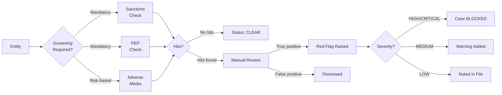

**Screening Types:**

| Type | Provider | Frequency |
|------|----------|-----------|
| Sanctions (OFAC, EU, UN) | Screening provider | On boarding + periodic |
| PEP status | Screening provider | On boarding + periodic |
| Adverse media | Screening provider | Risk-dependent |

**PEP Status** tracked in `ob-poc.person_pep_status`:
- `is_pep` boolean
- `pep_category` (HEAD_OF_STATE, MINISTER, JUDICIAL, MILITARY, etc.)
- `pep_jurisdiction`
- `office_held`, `office_start_date`, `office_end_date`

### 9.2 Red Flag Types

| Flag Type | Severity | Example |
|-----------|----------|---------|
| Sanctions hit | CRITICAL | Entity on OFAC SDN list |
| PEP identified | HIGH | Director is government minister |
| Adverse media | MEDIUM | Negative press coverage |
| Circular ownership | HIGH | Entity owns itself through chain |
| Nominee layering | HIGH | Multiple nominee layers |
| Opacity jurisdiction | MEDIUM | Registered in secrecy jurisdiction |
| Registry mismatch | MEDIUM | BODS ≠ company register |
| Ownership gaps | LOW | >5% unaccounted shares |

---

## 10. Adversarial Verification

### 10.1 Pattern Detection

The system proactively detects suspicious ownership patterns:

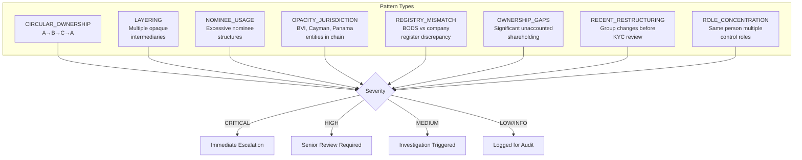

### 10.2 Challenge/Response Workflow

When a pattern is detected, the system raises a **verification challenge**:

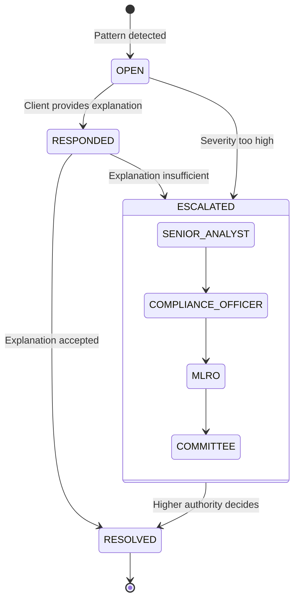

**Challenge Types:** `INCONSISTENCY`, `LOW_CONFIDENCE`, `MISSING_CORROBORATION`, `PATTERN_DETECTED`, `EVASION_SIGNAL`, `REGISTRY_MISMATCH`

**Resolution Types:** `ACCEPTED` (challenge dismissed), `REJECTED` (finding confirmed), `WAIVED` (management override), `ESCALATED` (referred up)

---

## 11. Tollgate System

### 11.1 Quality Gates

The tollgate system provides configurable pass/fail thresholds at key workflow gates:

```mermaid
graph LR
    subgraph "Gate 1: Discovery Complete"
        D1["ownership_minimum ≥ 95%"]
        D2["control_minimum = 100%"]
        D3["ubo_coverage = 100%"]
    end

    subgraph "Gate 2: Evidence Complete"
        E1["screening_clear = 100%"]
        E2["docs_verified ≥ 90%"]
        E3["identity_verified = 100%"]
    end

    subgraph "Gate 3: Review Complete"
        R1["risk_assessment complete"]
        R2["no blocking red flags"]
        R3["reviewer sign-off"]
    end

    D1 --> EVAL1{Pass?}
    D2 --> EVAL1
    D3 --> EVAL1
    EVAL1 -->|Yes| E1
    EVAL1 -->|No + blocking| BLOCK1[FAIL - blocked]
    EVAL1 -->|No + override| OVERRIDE1[CONDITIONAL<br/>with approval]

    E1 --> EVAL2{Pass?}
    E2 --> EVAL2
    E3 --> EVAL2
    EVAL2 -->|Yes| R1
    EVAL2 -->|No| BLOCK2[FAIL]

    R1 --> EVAL3{Pass?}
    R2 --> EVAL3
    R3 --> EVAL3
    EVAL3 -->|Yes| APPROVED[APPROVED]
    EVAL3 -->|No| BLOCK3[FAIL]

    style APPROVED fill:#4CAF50,color:white
    style BLOCK1 fill:#f44336,color:white
    style BLOCK2 fill:#f44336,color:white
    style BLOCK3 fill:#f44336,color:white
```

**Tollgate Override Authority Levels:**
`ANALYST` → `SENIOR_ANALYST` → `COMPLIANCE_OFFICER` → `DEPUTY_MLRO` → `MLRO` → `HEAD_OF_COMPLIANCE` → `EXECUTIVE` → `BOARD`

---

## 12. Research Workflow

### 12.1 Three-Phase Research Audit

When ownership gaps trigger research, the system tracks a full audit trail:

```mermaid
sequenceDiagram
    participant GAP as Gap Detector
    participant LLM as LLM Agent
    participant SRC as Source (GLEIF, Companies House)
    participant DB as Database
    participant AUDIT as Audit Trail

    GAP->>LLM: Ownership gap detected for Entity X
    LLM->>SRC: Search for Entity X
    SRC-->>LLM: Candidates found

    LLM->>AUDIT: Phase 1: research_decisions<br/>{candidates, confidence, reasoning}

    alt Confidence > auto_proceed_threshold
        LLM->>DB: Auto-import selected candidate
    else Ambiguous
        LLM->>LLM: Present candidates to user
        Note over LLM: User selects correct entity
    end

    LLM->>DB: Execute import verbs
    LLM->>AUDIT: Phase 2: research_actions<br/>{verb, args, entities_created}

    DB->>AUDIT: Phase 3: research_anomalies<br/>{post-import validation}
```

**Confidence Thresholds (configurable per source):**

| Threshold | Action |
|-----------|--------|
| `> auto_proceed` (default 0.85) | Automatically import |
| `> ambiguous` (default 0.60) | Present candidates to user |
| `< reject` (default 0.30) | No match found |

**Research Correction:** If a wrong entity was imported, `kyc.research_corrections` tracks the correction with rollback capability.

### 12.2 Outreach Requests

When data cannot be obtained from public registers, the system generates outreach requests:

| Request Type | Target | Purpose |
|-------------|--------|---------|
| `NOMINEE_DISCLOSURE` | Nominee/custodian | Reveal beneficial owners behind nominee |
| `UBO_DECLARATION` | Client | Self-declaration of UBOs |
| `SHARE_REGISTER` | Fund admin / registrar | Current share register extract |
| `DIRECTOR_LIST` | Company secretary | Current directors and officers |
| `TRUST_DEED` | Trustee | Trust deed provisions |

**Status:** `DRAFT` → `PENDING` → `SENT` → `REMINDED` → `RESPONDED` → `CLOSED` | `EXPIRED`

---

## 13. BODS Integration

### 13.1 Three-Table BODS Model

The system stores raw BODS 0.4 statements and links them to internal entities:

```mermaid
graph TB
    subgraph "BODS Statements"
        BES[bods_entity_statements<br/>Registered entities<br/>with LEI, company number]
        BPS[bods_person_statements<br/>Natural persons with<br/>name, DOB, nationality]
        BOS[bods_ownership_statements<br/>Ownership/control<br/>relationships]
    end

    subgraph "Internal Entities"
        ENT[entities]
        EBL[entity_bods_links<br/>Match method + confidence]
    end

    BES --> EBL
    EBL --> ENT
    BOS -->|subject| BES
    BOS -->|interested_party| BPS
    BOS -->|interested_party| BES

    subgraph "Reconciliation"
        OS[ownership_snapshots<br/>derived_from = 'BODS']
        OS2[ownership_snapshots<br/>derived_from = 'REGISTER']
        RECON[reconciliation_findings<br/>Mismatches between sources]
    end

    BOS --> OS
    OS --> RECON
    OS2 --> RECON
```

**Match Methods for entity_bods_links:**
- `LEI` — LEI exact match (highest confidence)
- `COMPANY_NUMBER` — Companies House / registry number match
- `NAME_MATCH` — Fuzzy name match (lowest confidence)

### 13.2 Ownership Snapshot Bridge

The `kyc.ownership_snapshots` table reconciles multiple ownership sources:

| Source | `derived_from` | Typical Confidence |
|--------|----------------|-------------------|
| Share register (kyc.holdings) | `REGISTER` | Highest — primary source |
| BODS public register | `BODS` | High — regulatory filing |
| GLEIF reporting relationships | `GLEIF` | Medium — may lag |
| Manual entry | `MANUAL` | Varies — depends on evidence |

**Reconciliation tolerance:** 100 basis points (configurable). Mismatches within tolerance = MATCH. Beyond tolerance = finding generated.

---

## 14. Verb Catalogue

### 14.1 UBO Domain (24 verbs)

| Verb | Behavior | Description |
|------|----------|-------------|
| `ubo.add-ownership` | crud/upsert | Add ownership edge (idempotent) |
| `ubo.update-ownership` | crud/update | Update ownership percentage |
| `ubo.end-ownership` | crud/update | Soft-delete (set effective_to) |
| `ubo.delete-ownership` | crud/delete | Hard delete |
| `ubo.add-control` | crud/upsert | Add control edge (board, voting, etc.) |
| `ubo.end-control` | crud/update | Soft-delete control |
| `ubo.delete-control` | crud/delete | Hard delete control |
| `ubo.add-trust-role` | crud/upsert | Add trust role (settlor, trustee, beneficiary, protector) |
| `ubo.end-trust-role` | crud/update | Soft-delete trust role |
| `ubo.delete-trust-role` | crud/delete | Hard delete trust role |
| `ubo.delete-relationship` | crud/delete | Generic relationship delete |
| `ubo.list-owners` | plugin | List owners of entity (temporal) |
| `ubo.list-owned` | crud/list | List entities owned by entity |
| `ubo.list-ubos` | crud/list | List UBO candidates above threshold |
| `ubo.list-by-subject` | crud/list | Reverse lookup — who owns this? |
| `ubo.calculate` | plugin | Compute UBO chains (recursive traversal) |
| `ubo.trace-chains` | plugin | Trace all chains to natural persons |
| `ubo.mark-deceased` | plugin | Mark person deceased, cascade effects |
| `ubo.convergence-supersede` | plugin | Atomic ownership transfer |
| `ubo.transfer-control` | plugin | Transfer control between entities |
| `ubo.waive-verification` | plugin | Waive verification with justification |
| `ubo.mark-terminus` | crud/upsert | Mark entity as chain terminus |

### 14.2 KYC Domain (12 verbs)

| Verb | Behavior | Description |
|------|----------|-------------|
| `kyc.create-case` | plugin | Create KYC case for entity |
| `kyc.update-status` | plugin | Advance case status |
| `kyc.assign-reviewer` | plugin | Assign analyst/reviewer |
| `kyc.submit-case` | plugin | Submit for review |
| `kyc.approve-case` | plugin | Approve case |
| `kyc.reject-case` | plugin | Reject case |
| `kyc.block-case` | plugin | Block case (missing info) |
| `kyc.unblock-case` | plugin | Unblock after info received |
| `kyc.escalate` | plugin | Escalate to senior authority |
| `kyc.add-workstream` | plugin | Add entity workstream |
| `kyc.close-workstream` | plugin | Complete workstream |
| `kyc.case-summary` | plugin | Get case with all related data |

### 14.3 Screening Domain (3 verbs)

| Verb | Behavior | Description |
|------|----------|-------------|
| `screening.run` | plugin | Run sanctions/PEP/adverse media check |
| `screening.review-hit` | plugin | Review screening hit (true/false positive) |
| `screening.bulk-refresh` | plugin | Refresh all screenings for entity set |

### 14.4 Control Domain (8 verbs)

| Verb | Behavior | Description |
|------|----------|-------------|
| `control.build-graph` | plugin | Build full control graph for CBU |
| `control.compute-board-controller` | plugin | Derive governance controller |
| `control.add-edge` | plugin | Add control edge with standards xref |
| `control.remove-edge` | plugin | End control edge |
| `control.list-edges` | plugin | List control edges for entity |
| `control.add-anchor` | plugin | Add control anchor to CBU |
| `control.remove-anchor` | plugin | Remove control anchor |
| `control.list-anchors` | plugin | List CBU control anchors |

### 14.5 Ownership Domain (6 verbs)

| Verb | Behavior | Description |
|------|----------|-------------|
| `ownership.compute-coverage` | plugin | Compute ownership coverage metrics |
| `ownership.reconcile` | plugin | Run multi-source reconciliation |
| `ownership.detect-cycles` | plugin | Detect circular ownership |
| `ownership.snapshot` | plugin | Capture point-in-time snapshot |
| `ownership.compare-snapshots` | plugin | Diff two snapshots |
| `ownership.add-special-right` | plugin | Add veto/drag-along/golden share |

### 14.6 GLEIF Domain (7 verbs)

| Verb | Behavior | Description |
|------|----------|-------------|
| `gleif.enrich` | plugin | Enrich single entity by LEI |
| `gleif.import-tree` | plugin | Import corporate hierarchy |
| `gleif.trace-ownership` | plugin | Follow parent chain to ultimate |
| `gleif.get-managed-funds` | plugin | Get funds managed by entity |
| `gleif.get-umbrella` | plugin | Get umbrella for sub-fund |
| `gleif.get-manager` | plugin | Get ManCo/AIFM for fund |
| `gleif.search` | plugin | Search GLEIF by name/LEI |

### 14.7 Document Domain (7 verbs)

| Verb | Behavior | Description |
|------|----------|-------------|
| `document.solicit` | plugin | Request document from entity |
| `document.solicit-set` | plugin | Request multiple documents |
| `document.verify` | plugin | QA approves document |
| `document.reject` | plugin | QA rejects with reason code |
| `document.upload` | plugin | Upload new version |
| `document.get` | plugin | Get document with status |
| `document.list` | plugin | List documents for entity |

---

## 15. Key SQL Functions

| Function | Schema | Purpose |
|----------|--------|---------|
| `fn_primary_governance_controller(issuer_id, as_of)` | kyc | Deterministic board controller (3-rule priority) |
| `fn_compute_control_links(issuer_id, as_of)` | kyc | Compute control links from holdings with as-of denominator |
| `fn_compute_economic_exposure(...)` | kyc | Bounded recursive look-through |
| `fn_economic_exposure_summary(...)` | kyc | Exposure summary above threshold |
| `fn_share_class_supply_at(class_id, as_of)` | kyc | Supply at point in time |
| `fn_diluted_supply_at(...)` | kyc | Fully diluted share count |
| `fn_derive_ownership_snapshots(issuer_id, as_of)` | kyc | Compute ownership snapshots |
| `fn_run_governance_bridges(as_of)` | kyc | Run all governance bridges |
| `fn_bridge_bods_to_holdings(as_of)` | kyc | BODS → holdings bridge |
| `fn_bridge_gleif_fund_manager_to_board_rights(as_of)` | kyc | GLEIF → board rights |
| `fn_bridge_manco_role_to_board_rights(as_of)` | kyc | ManCo role → board rights |
| `check_case_doc_completion(case_id)` | kyc | Document completion stats |
| `generate_doc_requests_from_threshold(case_id, ref)` | kyc | Auto-generate doc requests |
| `is_valid_case_transition(from, to)` | kyc | Case status validation |
| `is_valid_workstream_transition(from, to)` | kyc | Workstream status validation |
| `is_valid_doc_request_transition(from, to)` | kyc | Doc request status validation |
| `compute_ownership_chains(...)` | ob-poc | Compute ownership chains |
| `check_ubo_completeness(cbu_id, threshold)` | ob-poc | UBO coverage check |
| `capture_ubo_snapshot(cbu_id, ...)` | ob-poc | Create UBO snapshot |
| `can_prove_ubo(ubo_id)` | ob-poc | Check if UBO is fully evidenced |
| `ubo_chain_as_of(entity_id, as_of, threshold)` | ob-poc | Historical ownership chains |

---

## 16. Triggers

| Trigger | Table | Purpose |
|---------|-------|---------|
| `trg_control_edges_set_standards` | control_edges | Auto-set BODS/GLEIF/PSC types from edge_type + percentage |
| `trg_sync_holding_to_ubo` | kyc.holdings | Sync holdings to UBO relationships when crossing 25% |
| `trg_validate_investor_lifecycle` | kyc.investors | Validate lifecycle state transitions |
| `trg_log_investor_lifecycle` | kyc.investors | Audit log of lifecycle changes |
| `trg_ubo_status_transition` | ubo_registry | Validate UBO status transitions |
| `trg_ubo_edges_timestamp` | control_edges | Update timestamp on changes |
| `trg_workstream_blocked_days` | entity_workstreams | Compute blocked duration |

---

## 17. Views

### KYC Schema

| View | Purpose |
|------|---------|
| `v_capital_structure_extended` | Ownership/voting percentages from share registry |
| `v_case_summary` | Case overview with workstream counts |
| `v_current_role_profiles` | Active investor role profiles |
| `v_dilution_summary` | Dilution instruments summary |
| `v_economic_edges_direct` | Direct economic ownership edges |
| `v_fund_vehicle_summary` | Fund vehicle details |
| `v_pending_decisions` | Research decisions awaiting user input |
| `v_research_activity` | Research activity per entity |
| `v_share_class_summary` | Share class details with supply |
| `v_workstream_detail` | Workstream status detail |

### ob-poc Schema

| View | Purpose |
|------|---------|
| `cbu_ownership_graph` | CBU ownership graph for visualization |
| `ubo_convergence_status` | UBO verification completeness |
| `ubo_expired_proofs` | Evidence requiring refresh |
| `ubo_missing_proofs` | Missing evidence items |
| `v_cbu_kyc_summary` | CBU KYC status rollup |
| `v_ubo_candidates` | Potential UBOs above threshold |
| `v_ubo_evidence_summary` | Evidence coverage per UBO |
| `v_ubo_interests` | UBO interests aggregated |

---

## 18. Worked Example: Allianz Fund Structure

```mermaid
graph TD
    ASE["Allianz SE<br/>(DE, Listed - TERMINUS)<br/>LEI: 529900K9B0N5BT694847"]
    
    ASE -->|"100% shares"| AGI["AGI Holdings GmbH<br/>(DE, intermediate)"]
    
    AGI -->|"100% shares"| AGIL["AGI Luxembourg S.A.<br/>(LU, ManCo)"]
    
    AGIL -->|"MANAGED_BY"| FUND1["Allianz IE ETF SICAV<br/>(IE, UCITS fund)<br/>CBU: allianz-ie-etf"]
    AGIL -->|"MANAGED_BY"| FUND2["Allianz Lux Dynamic Fund<br/>(LU, UCITS fund)<br/>CBU: allianz-lux-dyn"]
    
    subgraph "Fund Investors (FUND1)"
        FUND1 -->|"35%"| AGI_H["AGI Holdings<br/>(intra-group)"]
        FUND1 -->|"20%"| NOM["Clearstream<br/>(nominee)"]
        FUND1 -->|"15%"| RETAIL["Retail Pool"]
        FUND1 -->|"18%"| JP["John Peters<br/>(natural person)<br/>UBO: 18%"]
        FUND1 -->|"12%"| OTHER["Other holders"]
    end
    
    subgraph "UBO Analysis"
        direction LR
        UBO1["ASE → TERMINUS<br/>(listed company)"]
        UBO2["NOM → RESEARCH<br/>(nominee disclosure<br/>pending)"]
        UBO3["JP → UBO<br/>(18% < 25%, not UBO<br/>but material holder)"]
        UBO4["Coverage: 100%<br/>Traceable: 85%<br/>Gap: 0%"]
    end

    style ASE fill:#607D8B,color:white
    style FUND1 fill:#2196F3,color:white
    style FUND2 fill:#2196F3,color:white
    style JP fill:#4CAF50,color:white
    style NOM fill:#FF9800,color:white
    style RETAIL fill:#9E9E9E,color:white
```

**KYC Case Workflow for this structure:**

1. `(kyc.create-case :entity-id <FUND1> :case-type "NEW_CLIENT")` — Open case
2. `(gleif.import-tree :entity-id <Allianz SE> :depth 3)` — Import hierarchy
3. `(ubo.trace-chains :cbu-id <allianz-ie-etf> :threshold 10.0)` — Trace all ownership
4. `(ubo.mark-terminus :entity-id <Allianz SE> :terminus-type LISTED_COMPANY :exchange "XETRA")` — Mark listed parent
5. `(screening.run :entity-id <FUND1>)` — Run sanctions/PEP
6. `(document.solicit-set :entity-ref <FUND1> :doc-types ["passport", "proof_of_address"])` — Request docs
7. `(ownership.reconcile :issuer-entity-id <FUND1>)` — Cross-check BODS vs register
8. `(kyc.submit-case)` → `(kyc.approve-case)` — Review and approve

---

## 19. Standards Cross-Reference

| Standard | Implementation |
|----------|---------------|
| **BODS 0.4** | `bods_interest_type` auto-set on control_edges; bods_*_statements tables for raw imports |
| **GLEIF RR** | `gleif_relationship_type` auto-set; entity_parent_relationships for hierarchy |
| **UK PSC** | `psc_category` auto-computed from edge_type + percentage thresholds |
| **4AMLD / 5AMLD** | Configurable thresholds in issuer_control_config; >25% ownership/voting/control |
| **FATCA** | `fatca_status` on kyc.investors; tax_jurisdiction tracking |
| **CRS** | `crs_status` on kyc.investors; tax_residencies on bods_person_statements |
| **MiFID II** | Investor classification (RETAIL, PROFESSIONAL, INSTITUTIONAL) |
| **UCITS / AIFMD** | Fund vehicle types; regulatory_classification on fund_vehicles |

---

## 20. Table Summary

| Schema | Table Count | Key Tables |
|--------|-------------|------------|
| `kyc` | 28 | cases, entity_workstreams, doc_requests, investors, share_classes, holdings, board_compositions, trust_provisions, partnership_capital, tollgate_thresholds |
| `ob-poc` | 15 | control_edges, ubo_registry, ubo_evidence, ubo_snapshots, bods_entity_statements, bods_person_statements, bods_ownership_statements, entity_bods_links, entity_ubos, screening_types, detected_patterns, verification_challenges |
| **Total** | **43 tables** | + 20 views, 21 functions, 7 triggers |

**Verb Catalogue:** 67 verbs across 7 domains (ubo, kyc, screening, control, ownership, gleif, document)
