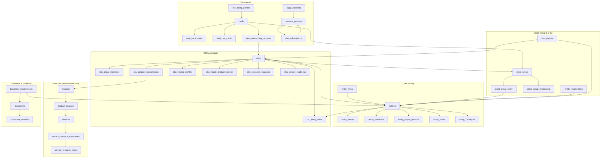
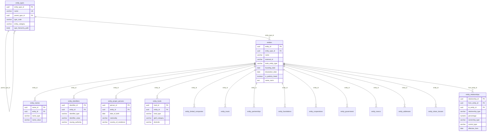
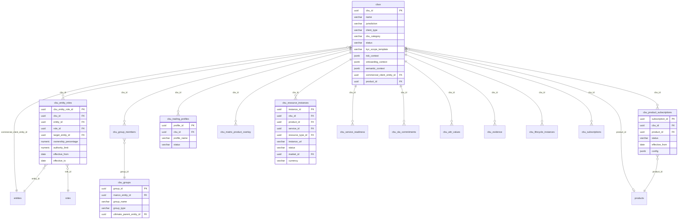
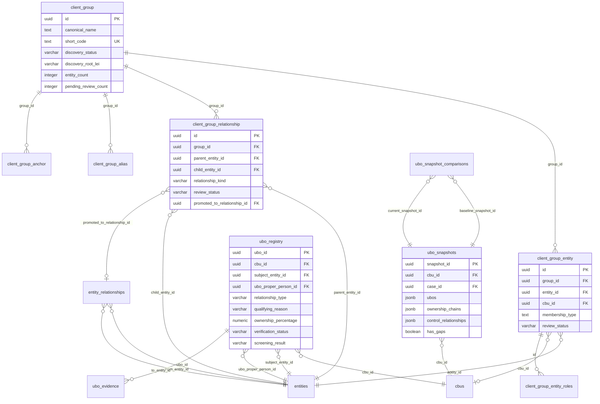
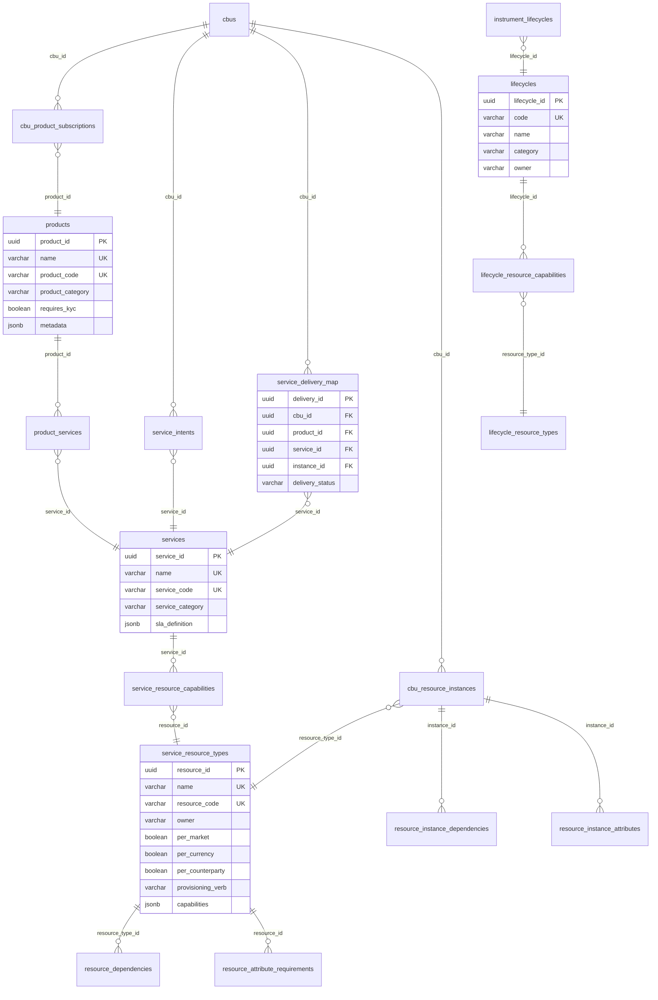
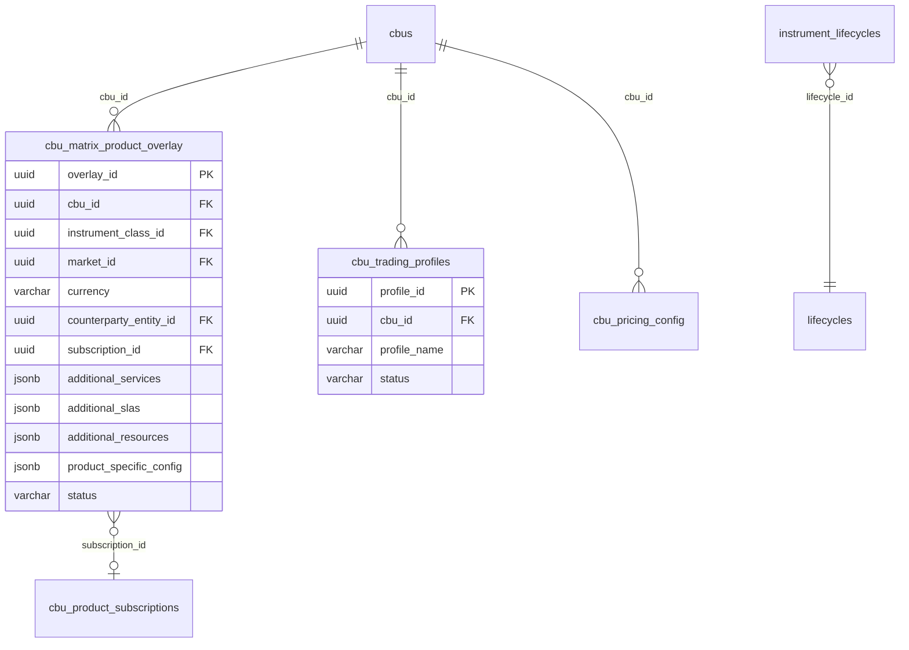
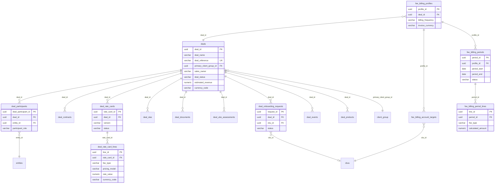
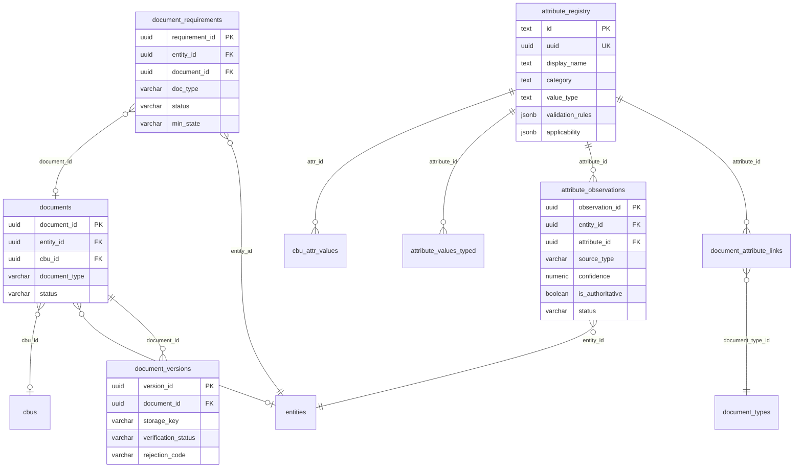
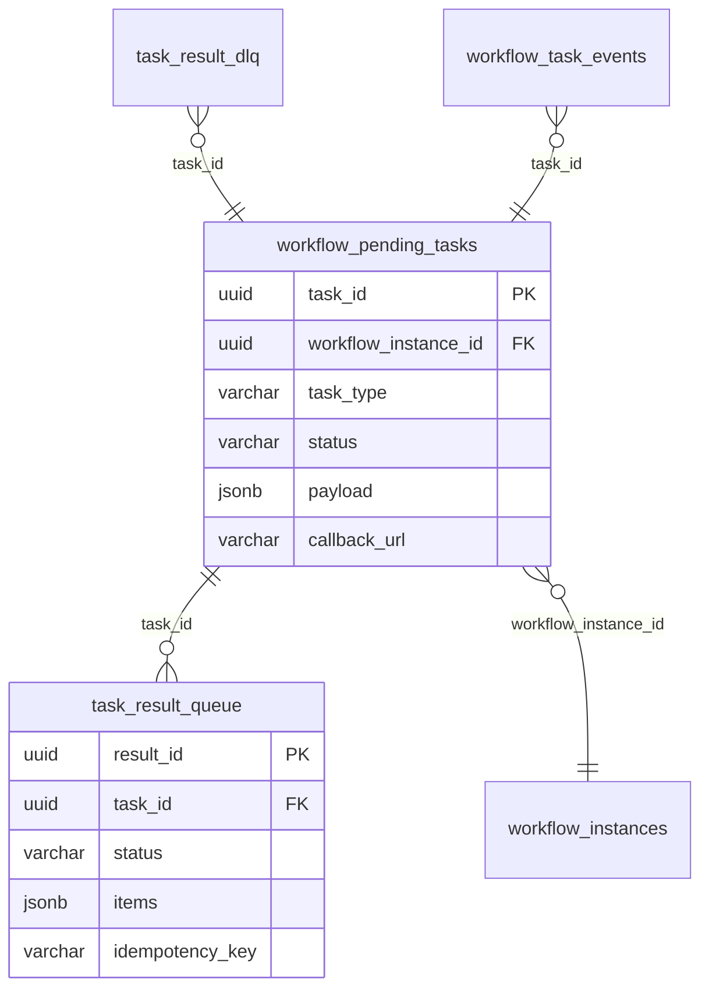

# OB-POC — Schema Entity Overview

> **Last reconciled:** 2026-02-11 — against 77 migrations, 57 DSL verb domains, CLAUDE.md
> **Scope:** `"ob-poc"` schema only (226 tables). External schemas (`custody`, `kyc`, `agent`, `teams`) referenced but not detailed.
> **Method:** SQL DDL cross-referenced with DSL verb YAML (`rust/config/verbs/*.yaml`) to validate domain groupings.

---

## Top-Level Domain Map



---

## Notation

- **Table names** are shown as in the DDL: `"ob-poc".table_name` (schema prefix omitted for readability).
- **PK / FK** are from `ALTER TABLE ... ADD CONSTRAINT ...` blocks.
- **Verb domain** shows which DSL verb YAML file operates on the table (e.g., `cbu.yaml` → 19 verbs).
- Tables with no verb domain are included only when essential to understanding the data structure.

---

## 1) Core Entity Model

**Verb domains:** `entity` (22 verbs), `identifier` (11), `fund` (20), `bods` (9), `regulatory` (5)

All other aggregates hang off a canonical `entities` table + typed taxonomy in `entity_types`.
Entity subtypes are modelled as separate satellite tables joined by `entity_id`.



**Subtype satellite tables** (one per legal form — joined by `entity_id`):

| Table | Legal Form | Key Columns |
|-------|-----------|-------------|
| `entity_proper_persons` | Natural persons | date_of_birth, nationality, country_of_residence |
| `entity_funds` | Funds / vehicles | fund_type, gleif_category, domicile |
| `entity_limited_companies` | Corporates | incorporation_country, share_capital |
| `entity_trusts` | Trusts | trust_type, governing_law |
| `entity_partnerships` | Partnerships | partnership_type |
| `entity_foundations` | Foundations | foundation_purpose |
| `entity_cooperatives` | Cooperatives | cooperative_type |
| `entity_government` | Government bodies | government_level |
| `entity_manco` | Management companies | manco_type, regulated_by |

**Supporting tables:**

| Table | Purpose |
|-------|---------|
| `entity_addresses` | Registered / operational addresses |
| `entity_share_classes` | Share class definitions per entity |
| `entity_parent_relationships` | Direct parent hierarchy (GLEIF-sourced) |
| `entity_lifecycle_events` | Lifecycle events (incorporation, dissolution) |
| `entity_bods_links` | Links to BODS statement IDs |
| `entity_concept_link` | Semantic concept associations (for entity linking) |
| `entity_feature` | Feature flags for ML/entity linking |

---

## 2) CBU Aggregate (Client Business Unit)

**Verb domains:** `cbu` (19 verbs), `cbu-role-v2` (10), `trading-profile` (47), `cash-sweep` (9), `investment-manager` (7), `pricing-config` (14)

CBU is the primary *case container* for onboarding + KYC scope. It carries light scalar fields plus several `jsonb` contexts. Most of the "CBU struct" is expressed via child tables.



**CBU child tables:**

| Table | Verb Domain | Purpose |
|-------|------------|---------|
| `cbu_entity_roles` | `cbu-role-v2` | Entity-to-CBU role assignments (depositary, IM, etc.) |
| `cbu_entity_roles_history` | — | Audit trail of role changes |
| `cbu_group_members` | `manco-group` | CBU membership in governance groups |
| `cbu_groups` | `manco-group` | Governance book groups (ManCo, apex parent) |
| `cbu_product_subscriptions` | `matrix-overlay` | Product subscriptions per CBU |
| `cbu_trading_profiles` | `trading-profile` | Trading mandate profiles (47 verbs) |
| `cbu_matrix_product_overlay` | `matrix-overlay` | Per-cell instrument/market/currency config |
| `cbu_resource_instances` | `service-resource` | Provisioned resource instances |
| `cbu_service_readiness` | — | Computed service readiness status |
| `cbu_sla_commitments` | `sla` | SLA commitments per CBU |
| `cbu_lifecycle_instances` | `lifecycle` | Active lifecycle instances |
| `cbu_subscriptions` | `contract` | Contract+product subscription (onboarding gate) |
| `cbu_attr_values` | — | Attribute dictionary values per CBU |
| `cbu_evidence` | `cbu` | Document/attestation evidence links |
| `cbu_pricing_config` | `pricing-config` | NAV pricing configuration |
| `cbu_change_log` | — | CBU change audit trail |
| `cbu_creation_log` | — | CBU creation audit trail |

---

## 3) Client Group + Ownership Graph + UBO

**Verb domains:** `client-group` (23 verbs), `ubo` (22), `ownership` (16), `control` (15), `manco-group` (16), `gleif` (16)

Two layers:
1. **Client Group discovery/curation** — candidate entities and proposed relationships (review workflow)
2. **Canonical entity relationships + UBO registry** — promoted graph and per-CBU/case UBO assertions



**Client Group supporting tables:**

| Table | Purpose |
|-------|---------|
| `client_group_alias` | Searchable aliases with embeddings (for "allianz" → Allianz GI resolution) |
| `client_group_alias_embedding` | Versioned embeddings per alias |
| `client_group_anchor` | Role-based anchors per jurisdiction (governance_controller, ultimate_parent) |
| `client_group_anchor_role` | Anchor role types |
| `client_group_entity_roles` | GLEIF roles (SUBSIDIARY, ULTIMATE_PARENT) from research phase |
| `client_group_entity_tag` | Entity classification tags |
| `client_group_relationship_sources` | Source provenance for relationships |

**UBO/Ownership supporting tables:**

| Table | Purpose |
|-------|---------|
| `ubo_evidence` | Document/attestation evidence for UBO assertions |
| `ubo_assertion_log` | Audit log of assertion results per CBU/case |
| `ubo_snapshot_comparisons` | Diff between two UBO snapshots (added/removed/changed) |
| `entity_ubos` | Legacy BODS-style UBO records per entity |
| `control_edges` | Control relationship edges (board, voting) |
| `entity_relationships_history` | Temporal history of relationship changes |

**External schema reference:** `kyc.cases` (case_id) — KYC cases link to UBO registry and snapshots.

---

## 4) Product / Service / Resource Model

**Verb domains:** `product` (2 verbs), `service` (3), `service-resource` (10), `service-pipeline` (14), `delivery` (3), `lifecycle` (16), `sla` (17)

This cluster models what a CBU subscribes to (Products), what those products compose (Services), and the resource catalog + provisioning instances required to deliver services.



**Delivery & provisioning tables:**

| Table | Purpose |
|-------|---------|
| `service_intents` | What service a CBU desires (intent → delivery) |
| `service_delivery_map` | Actual delivery tracking (status, timeline) |
| `service_availability` | Service availability windows |
| `provisioning_requests` | Resource provisioning request tracking |
| `provisioning_events` | Provisioning event audit trail |
| `resource_dependencies` | Type-level resource dependency graph |
| `resource_instance_dependencies` | Instance-level dependency edges |
| `resource_instance_attributes` | Attribute values on provisioned instances |
| `resource_attribute_requirements` | Required attributes per resource type |

**SLA tables:**

| Table | Purpose |
|-------|---------|
| `sla_templates` | SLA definition templates |
| `sla_measurements` | Measured SLA metrics |
| `sla_breaches` | Recorded SLA breaches |
| `sla_metric_types` | Metric type definitions |
| `cbu_sla_commitments` | SLA commitments per CBU |

---

## 5) Instrument Matrix & Trading Profile

**Verb domains:** `matrix-overlay` (14 verbs), `trading-profile` (47), `pricing-config` (14), `capital` (21)

The instrument matrix is a CBU-scoped overlay keyed by instrument class + market + currency + counterparty. Trading profiles define the mandate; pricing config controls NAV/valuation.



**External schema references:** `custody.instrument_classes` (class_id), `custody.markets` (market_id) — referenced by overlay FKs.

**Supporting tables:**

| Table | Purpose |
|-------|---------|
| `instrument_lifecycles` | Links instrument classes to lifecycle processes |
| `trading_profile_materializations` | Materialized trading profile snapshots |
| `cbu_pricing_config` | NAV pricing rules per CBU |
| `cbu_pricing_fallback_chains` | Pricing fallback chain ordering |
| `cbu_stale_price_policies` | Stale price handling policies |
| `cbu_nav_impact_thresholds` | NAV impact thresholds |
| `cbu_valuation_schedule` | Valuation schedule config |
| `fund_structure` | Fund hierarchy (umbrella → sub-funds) |
| `fund_investments` | Fund investment allocations |
| `fund_metadata` | Additional fund metadata |

---

## 6) Legal Contracts & Onboarding Gate

**Verb domains:** `contract` (14 verbs), `contract-pack` (2)

CBU onboarding requires a contract+product subscription. No contract = no onboarding. The `cbu_subscriptions` table is the **gate**.

```mermaid
erDiagram
    legal_contracts ||--o{ contract_products : "contract_id"
    contract_products ||--o{ cbu_subscriptions : "contract_id, product_code"
    cbu_subscriptions }o--|| cbus : "cbu_id"
    contract_products }o--o| rate_cards : "rate_card_id"

    legal_contracts {
        uuid contract_id PK
        varchar client_label
        varchar contract_reference
        date effective_date
        date termination_date
        varchar status
    }

    contract_products {
        uuid contract_id PK_FK
        varchar product_code PK
        uuid rate_card_id FK
    }

    cbu_subscriptions {
        uuid cbu_id PK_FK
        uuid contract_id PK_FK
        varchar product_code PK_FK
        varchar status
    }

    rate_cards {
        uuid rate_card_id PK
        varchar name
        varchar currency
    }
```

**Supporting tables:**

| Table | Purpose |
|-------|---------|
| `contract_pack` | Grouped contract packages |
| `contract_template` | Contract template definitions |

---

## 7) Deal Record & Fee Billing

**Verb domains:** `deal` (42 verbs), `billing` (17)

Deal Record is the commercial origination hub linking sales → contracting → onboarding → servicing → billing.



**Deal status state machine:** `PROSPECT → QUALIFYING → NEGOTIATING → CONTRACTED → ONBOARDING → ACTIVE → WINDING_DOWN → OFFBOARDED` (any → `CANCELLED`)

**Rate card status:** `DRAFT → PROPOSED → COUNTER_OFFERED ↔ REVISED → AGREED → SUPERSEDED`

**Pricing models:** `BPS` (basis points on AUM), `FLAT` (fixed fee), `TIERED` (volume-based), `PER_TRANSACTION`

---

## 8) Document & Evidence Model

**Verb domains:** `document` (13 verbs), `requirement` (10), `attribute` (11), `docs-bundle` (3)

Two document models coexist:
- **Legacy:** `document_catalog` + `document_types` — flat catalog with extraction status
- **V2 (049):** `documents` → `document_versions` — three-layer model (requirement → document → version)



**Requirement state machine:** `missing → requested → received → in_qa → verified` (also: `rejected → retry`, `waived`, `expired`)

**Rejection reason codes** (`rejection_reason_codes` table): Standardized codes for document QA — categories: quality, mismatch, validity, data, format, authenticity.

**Attribute dictionary tables:**

| Table | Purpose |
|-------|---------|
| `attribute_registry` | Central attribute definitions (type, validation, applicability) |
| `attribute_values_typed` | Typed attribute values per entity (denormalized columns) |
| `attribute_observations` | Observed values with source, confidence, supersession chain |
| `cbu_attr_values` | Attribute values per CBU (with evidence refs) |
| `document_attribute_links` | Policy-style proof links (document type → attribute) |
| `document_attribute_mappings` | Extraction-oriented field mappings |
| `observation_discrepancies` | Detected discrepancies between observation sources |

**Legacy document tables:**

| Table | Purpose |
|-------|---------|
| `document_catalog` | Flat document catalog (pre-V2) |
| `document_types` | Document type definitions with required attributes |
| `document_bundles` | Grouped document sets |
| `document_events` | Document lifecycle event log |

---

## 9) Workflow Task Queue

**Verb domains:** `runbook` (7 verbs) — most workflow tables are infrastructure for the BPMN/task engine

The task queue provides an async return path for long-running operations (document solicitation, human approvals).



| Table | Purpose |
|-------|---------|
| `workflow_pending_tasks` | Outbound task tracking (emitted by workflows) |
| `task_result_queue` | Inbound results (ephemeral, deleted after processing) |
| `task_result_dlq` | Dead letter queue for failed processing |
| `workflow_task_events` | Permanent audit trail |
| `workflow_instances` | Active workflow instances |
| `workflow_definitions` | Workflow definitions |
| `workflow_audit_log` | Workflow execution audit |
| `staged_runbook` | Staged REPL runbook container |
| `staged_command` | Individual staged DSL commands |
| `staged_command_entity` | Resolved entity footprint per command |
| `staged_command_candidate` | Picker candidates for ambiguous resolution |
| `rejection_reason_codes` | Reference data for document QA rejection reasons |

---

## 10) Screening & KYC Support Tables (in ob-poc)

**Verb domains:** `screening` (3 verbs), `kyc-agreement` (4)

The main KYC tables live in the `kyc` schema. These `ob-poc` tables support KYC integration.

| Table | Purpose |
|-------|---------|
| `kyc_service_agreements` | KYC service agreements between CBU and provider |
| `kyc_decisions` | KYC decision records |
| `screening_lists` | Screening list definitions (sanctions, PEP) |
| `screening_requirements` | Screening requirements per entity type |
| `screening_types` | Screening type taxonomy |
| `person_pep_status` | PEP status records per person entity |
| `verification_challenges` | Verification challenge questions |
| `verification_escalations` | Escalated verification cases |
| `risk_ratings` | Risk rating definitions |
| `risk_bands` | Risk band thresholds |
| `case_types` | Case type taxonomy (NEW_CLIENT, PERIODIC_REVIEW, etc.) |
| `case_evaluation_snapshots` | Point-in-time case evaluation captures |

**External schema:** `kyc.cases` is the primary KYC case table (referenced by `ubo_registry.case_id`).

---

## 11) BODS (Beneficial Ownership Data Standard)

**Verb domain:** `bods` (9 verbs)

BODS tables store structured beneficial ownership statements per the Open Ownership standard.

| Table | Purpose |
|-------|---------|
| `bods_entity_types` | BODS entity type taxonomy |
| `bods_interest_types` | BODS interest type taxonomy (ownership, control, trust) |
| `bods_entity_statements` | Entity statements (legal entities in ownership chains) |
| `bods_person_statements` | Person statements (natural persons in ownership chains) |
| `bods_ownership_statements` | Ownership/control statements linking persons to entities |

---

## 12) GLEIF Integration

**Verb domain:** `gleif` (16 verbs)

| Table | Purpose |
|-------|---------|
| `gleif_lei_records` | Cached LEI records from GLEIF API |
| `gleif_relationships` | Cached GLEIF relationship records (parent/child) |
| `gleif_sync_log` | GLEIF sync operation audit log |

---

## 13) Booking & Client Principal

**Verb domains:** `booking-location` (3 verbs), `booking-principal` (9), `client-principal-relationship` (4)

| Table | Purpose |
|-------|---------|
| `booking_location` | Booking location definitions |
| `booking_principal` | Booking principal entities |
| `client_principal_relationship` | Links clients to principals |

---

## 14) Reference Taxonomies

These tables are small but load-bearing — they drive interpretation, UI grouping, and rule selection.

| Table | Verb Domain | Purpose |
|-------|------------|---------|
| `roles` | `cbu-role-v2` | Role taxonomy (depositary, IM, director, etc.) |
| `role_types` | — | Role type classification |
| `role_categories` | — | Role category grouping |
| `role_applicable_entity_types` | — | Which entity types can hold which roles |
| `currencies` | — | Currency reference data |
| `master_jurisdictions` | `fund` | Jurisdiction definitions |
| `settlement_types` | — | Settlement type taxonomy |
| `ssi_types` | — | SSI type taxonomy |
| `view_modes` | — | View mode definitions |
| `edge_types` | — | Edge type taxonomy (for graph rendering) |
| `node_types` | — | Node type taxonomy (for graph rendering) |
| `regulators` | `regulatory` | Regulatory body definitions |
| `placeholder_kinds` | — | Placeholder entity kinds |
| `client_types` | — | Client type taxonomy |
| `dictionary` | — | General-purpose dictionary entries |
| `rule` | `rule` (3 verbs) | Business rule definitions |
| `ruleset` | `ruleset` (3 verbs) | Rule set groupings |
| `rule_field_dictionary` | — | Rule field definitions |

---

## Schema Statistics

| Metric | Count |
|--------|-------|
| Total `ob-poc` tables | 226 |
| Tables with DSL verb domains | ~85 |
| Tables in this document | ~150 (essential to data model) |
| Tables omitted (DSL engine, REPL, semantic search, layout cache) | ~76 |
| DSL verb domains | 57 |
| Total verb count | ~750+ |
| Migrations | 77 (001–077 + 072b) |

**Omitted infrastructure tables** (no verb domains, not essential to data model):
- DSL engine: `dsl_verbs`, `dsl_sessions`, `dsl_instances`, `dsl_snapshots`, `dsl_*` (14 tables)
- Semantic search: `verb_pattern_embeddings`, `verb_centroids`, `semantic_match_cache`, `detected_patterns`, `intent_feedback*`
- REPL: `repl_sessions_v2`, `repl_invocation_records`
- BPMN integration: `bpmn_correlations`, `bpmn_job_frames`, `bpmn_parked_tokens`, `bpmn_pending_dispatches`, `expansion_reports`
- Session/layout: `sessions`, `session_scopes`, `session_scope_history`, `session_bookmarks`, `layout_cache`, `layout_config`
- Audit: `sheet_execution_audit`, `cbu_board_controller`, `board_control_evidence`, `cbu_control_anchors`
