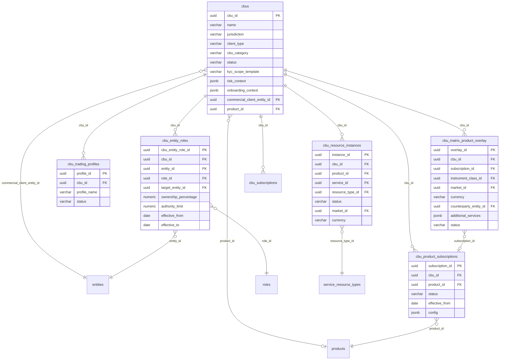

# OB-POC — Schema Entity Overview

> **Last reconciled:** 2026-02-11 — against 77 migrations, 57 DSL verb domains, CLAUDE.md
> **Scope:** `"ob-poc"` schema only (226 tables). External schemas (`custody`, `kyc`, `agent`, `teams`) referenced but not detailed.
> **Method:** SQL DDL cross-referenced with DSL verb YAML (`rust/config/verbs/*.yaml`) to validate domain groupings.

---

## Reading Order — The Commercial-to-Operational Flow

This document follows the real business flow from client acquisition through to operational servicing:

```
1. CLIENT GROUP          — Who is the client? (Allianz, BlackRock, Aviva)
       │
       ▼
2. DEALS & COMMERCIALS   — What are we selling? Products, negotiated rate cards
       │
       ▼
3. BOOKING PRINCIPALS    — Who books it, where? Legal entity + jurisdiction + rules
       │
       ▼
4. CONTRACTS & GATE      — Contracted products → CBU subscription (onboarding gate)
       │
       ▼
5. CBU ONBOARDING        — CBU sets subscribe to product sets
       │
       ▼
6. CBU INTERNALS         — Entities with roles, product overlays, trading profiles
```

---

## Top-Level Domain Map


---

## Notation

- **Table names** are shown as in the DDL: `"ob-poc".table_name` (schema prefix omitted for readability).
- **PK / FK** are from `ALTER TABLE ... ADD CONSTRAINT ...` blocks.
- **Verb domain** shows which DSL verb YAML file operates on the table (e.g., `cbu.yaml` → 19 verbs).
- Tables with no verb domain are included only when essential to understanding the data structure.

---

## 1) Client Group — The Apex

**Verb domains:** `client-group` (23 verbs), `gleif` (16), `ubo` (22), `ownership` (16), `control` (15), `manco-group` (16)

The client group is the apex entity. Everything flows from here — deals, entities, CBUs, UBO discovery. A client group (Allianz, BlackRock, Aviva) aggregates entities discovered via GLEIF research and curated through a review workflow.


**Anchor roles** — each group has anchors per jurisdiction for different use cases:

| Role | Use Case |
|------|----------|
| `ultimate_parent` | UBO discovery, ownership tracing |
| `governance_controller` | Session scope, CBU loading |
| `book_controller` | Regional operations |
| `operating_controller` | Day-to-day operations |
| `regulatory_anchor` | Compliance, KYC |

**Supporting tables:**

| Table | Purpose |
|-------|---------|
| `client_group_alias_embedding` | Versioned embeddings per alias (for "allianz" → Allianz GI resolution) |
| `client_group_anchor_role` | Anchor role types |
| `client_group_entity_roles` | GLEIF roles (SUBSIDIARY, ULTIMATE_PARENT) from research phase |
| `client_group_entity_tag` | Entity classification tags |
| `client_group_relationship_sources` | Source provenance for relationships |

---

## 2) Deals & Commercials — What Are We Selling?

**Verb domains:** `deal` (42 verbs), `billing` (17)

A client group has one or more **deals**. Each deal is the commercial origination hub — it carries participants, products, negotiated rate cards, SLAs, and links to contracts. The rate card negotiation is a state machine (`DRAFT → PROPOSED → COUNTER_OFFERED ↔ REVISED → AGREED → SUPERSEDED`).


**Deal status state machine:** `PROSPECT → QUALIFYING → NEGOTIATING → CONTRACTED → ONBOARDING → ACTIVE → WINDING_DOWN → OFFBOARDED` (any → `CANCELLED`)

**Pricing models:** `BPS` (basis points on AUM), `FLAT` (fixed fee), `TIERED` (volume-based), `PER_TRANSACTION`, `SPREAD`, `MINIMUM_FEE`

**Fee billing** — once a deal is active, billing profiles tie rate cards to CBUs:

| Table | Purpose |
|-------|---------|
| `fee_billing_profiles` | Billing config per deal+contract+rate_card+CBU+product |
| `fee_billing_account_targets` | Which CBU resource instances to bill (links to `cbu_resource_instances`) |
| `fee_billing_periods` | Monthly/quarterly billing cycles with status machine |
| `fee_billing_period_lines` | Calculated fee amounts per target per period |

**Billing period status:** `PENDING → CALCULATING → CALCULATED → REVIEWED → APPROVED → INVOICED → DISPUTED`

---

## 3) Booking Principals — Who Books It, Where?

**Verb domains:** `booking-principal` (9 verbs), `booking-location` (3), `client-principal-relationship` (4), `legal-entity` (3), `service-availability` (3), `rule` (3), `ruleset` (3), `contract-pack` (2)

The booking principal is the **policy anchor** — it defines which BNY legal entity, in which jurisdiction, can book which products for which clients. This is the middle layer between commercial (deals) and operational (CBU onboarding).


**Three-lane service availability** — each principal × service combination has three independent status lanes:

| Lane | Values | Purpose |
|------|--------|---------|
| Regulatory | `permitted` / `restricted` / `prohibited` | Can we legally do this here? |
| Commercial | `offered` / `conditional` / `not_offered` | Do we want to sell this here? |
| Operational | `supported` / `limited` / `not_supported` | Can we actually deliver this here? |

**Rule kinds** — rules evaluate client+principal+offering context:

| Kind | Effect |
|------|--------|
| `deny` | Block: client cannot be booked with this principal |
| `require_gate` | Gate: requires approval (credit committee, enhanced KYC) |
| `allow` | Explicit allow (overrides lower-priority denials) |
| `constrain_principal` | Narrow eligible principals |
| `select_contract` | Auto-select contract pack template |

**Ruleset boundaries** — rules scoped to `regulatory`, `commercial`, or `operational` domains. Temporal overlap prevention via trigger.

**Supporting tables:**

| Table | Purpose |
|-------|---------|
| `client_profile` | Immutable evaluation snapshot (segment, domicile, entity types, risk flags) |
| `client_classification` | Normalised regulatory classifications (MiFID II, Dodd-Frank, FATCA, CRS) |
| `eligibility_evaluation` | Immutable audit record of principal selection |
| `rule_field_dictionary` | Closed-world field registry for rule expression validation |
| `contract_pack` | Grouped contract package definitions |
| `contract_template` | Contract template definitions within a pack |

---

## 4) Contracts & Onboarding Gate

**Verb domains:** `contract` (14 verbs), `contract-pack` (2)

The legal contract is the **onboarding gate** — CBUs can only subscribe to products that are explicitly listed in an active contract. The composite FK on `cbu_subscriptions` enforces this: `(contract_id, product_code) → contract_products`.


**The gate in action:**
- `contract_products` defines what's contracted (product_code is VARCHAR — "CUSTODY", "FUND_ACCOUNTING", etc.)
- `cbu_subscriptions` has a composite FK to `contract_products(contract_id, product_code)` — you **cannot** subscribe a CBU to a product that isn't in the contract
- Status: `PENDING → ACTIVE → SUSPENDED → TERMINATED`

**Note on dual product references:**
- `contract_products.product_code` (VARCHAR PK) — string-based product codes ("CUSTODY", "FUND_ACCOUNTING"). Used by the contract/subscription gate.
- `deal_rate_cards.product_id` (UUID FK → `products.product_id`) — UUID-based product references. Used by the deal/commercial pipeline.
- Both resolve to the same `products` table (which has both `product_id` UUID PK and `product_code` VARCHAR UK), but through different keys. Contract verbs use codes; deal verbs use UUIDs.
- `legal_contracts.client_label` is a denormalized text field (not UUID FK to client_group).

---

## 5) CBU Aggregate — The Operational Unit

**Verb domains:** `cbu` (19 verbs), `cbu-role-v2` (10), `trading-profile` (47), `cash-sweep` (9), `investment-manager` (7), `pricing-config` (14), `matrix-overlay` (14)

The CBU (Client Business Unit) is the **operational container** for onboarding + KYC scope. CBUs sit under a client group, subscribe to contracted products, and contain entities with roles. Each CBU has a trading profile that materializes into a product overlay matrix via `cbu_matrix_product_overlay` (keyed by instrument class, market, currency, counterparty).



**Entity roles** — entities connect to the CBU container with typed roles:

| Role Category | Examples |
|--------------|----------|
| Governance | Depositary, ManCo, Board Director, Auditor |
| Investment | Investment Manager, Sub-Advisor, Prime Broker |
| Operations | Transfer Agent, Custodian, Fund Administrator |
| Ownership | Asset Owner, Beneficial Owner, Shareholder |

**CBU category** (fund type classification):

| Category | Examples |
|----------|---------|
| `FUND_MANDATE` | UCITS, AIF, hedge fund |
| `CORPORATE_GROUP` | Corporate treasury, SPV |
| `PENSION` | Pension fund, sovereign wealth |

**Instrument matrix** — the `cbu_matrix_product_overlay` is keyed by `(cbu_id, instrument_class_id, market_id, currency, counterparty_entity_id)`. It ties each trading cell to a product subscription with overlay config. The external `custody.cbu_instrument_universe` materializes the full trading universe.

**CBU child tables:**

| Table | Verb Domain | Purpose |
|-------|------------|---------|
| `cbu_entity_roles` | `cbu-role-v2` | Entity-to-CBU role assignments |
| `cbu_entity_roles_history` | — | Audit trail of role changes |
| `cbu_group_members` | `manco-group` | CBU membership in governance groups |
| `cbu_groups` | `manco-group` | Governance book groups (ManCo, apex parent) |
| `cbu_product_subscriptions` | `matrix-overlay` | Product subscriptions per CBU |
| `cbu_trading_profiles` | `trading-profile` | Trading mandate profiles |
| `cbu_matrix_product_overlay` | `matrix-overlay` | Per-cell instrument/market/currency config |
| `cbu_resource_instances` | `service-resource` | Provisioned resource instances |
| `cbu_service_readiness` | — | Computed service readiness status |
| `cbu_sla_commitments` | `sla` | SLA commitments per CBU |
| `cbu_lifecycle_instances` | `lifecycle` | Active lifecycle instances |
| `cbu_subscriptions` | `contract` | Contract+product subscription (onboarding gate) |
| `cbu_pricing_config` | `pricing-config` | NAV pricing configuration |
| `cbu_evidence` | `cbu` | Document/attestation evidence links |

---

## 6) Core Entity Model

**Verb domains:** `entity` (22 verbs), `identifier` (11), `fund` (20), `bods` (9), `regulatory` (5)

All aggregates hang off a canonical `entities` table with a typed taxonomy in `entity_types`. Entity subtypes are modelled as separate satellite tables joined by `entity_id`.


**Entity type hierarchy** (self-referencing via `parent_type_id`):

| Type Code | Parent | Examples |
|-----------|--------|---------|
| `NATURAL_PERSON` | ENTITY | Individual directors, UBOs |
| `LEGAL_ENTITY` | ENTITY | Corporates, funds |
| `LIMITED_COMPANY` | LEGAL_ENTITY | GLEIF-sourced entities |
| `FUND` | LEGAL_ENTITY | UCITS, AIF, hedge funds |
| `TRUST` | LEGAL_ENTITY | Trust vehicles |
| `PARTNERSHIP` | LEGAL_ENTITY | LP/GP structures |
| `MANCO` | LEGAL_ENTITY | Management companies |

**Subtype satellite tables** (one per legal form — joined by `entity_id`):

| Table | Legal Form | Key Columns |
|-------|-----------|-------------|
| `entity_proper_persons` | Natural persons | date_of_birth, nationality, country_of_residence |
| `entity_funds` | Funds / vehicles | fund_type, gleif_category, domicile, parent_fund_id, master_fund_id |
| `entity_limited_companies` | Corporates | incorporation_country, share_capital |
| `entity_trusts` | Trusts | trust_type, governing_law |
| `entity_partnerships` | Partnerships | partnership_type |
| `entity_foundations` | Foundations | foundation_purpose |
| `entity_cooperatives` | Cooperatives | cooperative_type |
| `entity_government` | Government bodies | government_level |
| `entity_manco` | Management companies | manco_type, regulated_by |

**Supporting tables:**

| Table | Purpose |
|-------|---------|
| `entity_addresses` | Registered / operational addresses |
| `entity_share_classes` | Share class definitions per entity |
| `entity_lifecycle_events` | Lifecycle events (incorporation, dissolution) |
| `entity_bods_links` | Links to BODS statement IDs |
| `entity_concept_link` | Semantic concept associations (for entity linking) |
| `entity_feature` | Feature flags for ML/entity linking |
| `entity_relationships` | Ownership/control edges (from_entity_id → to_entity_id) |

---

## 7) UBO & Ownership Graph

**Verb domains:** `ubo` (22 verbs), `ownership` (16), `control` (15)

Two layers: (1) candidate entities and proposed relationships in the client group (review workflow), and (2) promoted canonical relationships + per-CBU/case UBO assertions.


| Table | Purpose |
|-------|---------|
| `ubo_evidence` | Document/attestation evidence for UBO assertions |
| `ubo_assertion_log` | Audit log of assertion results per CBU/case |
| `ubo_snapshot_comparisons` | Diff between two UBO snapshots (added/removed/changed) |
| `entity_ubos` | Legacy BODS-style UBO records per entity |
| `control_edges` | Control relationship edges (board, voting) |
| `entity_relationships_history` | Temporal history of relationship changes |

---

## 8) Product / Service / Resource Model

**Verb domains:** `product` (2 verbs), `service` (3), `service-resource` (10), `service-pipeline` (14), `delivery` (3), `lifecycle` (16), `sla` (17)

Products compose services; services require resources. CBUs subscribe to products (via contracted product subscriptions), which creates service delivery obligations requiring provisioned resource instances.


**Delivery & provisioning tables:**

| Table | Purpose |
|-------|---------|
| `service_intents` | What service a CBU desires (intent → delivery) |
| `service_delivery_map` | Actual delivery tracking (status, timeline) |
| `service_availability` | Three-lane service availability per booking principal |
| `provisioning_requests` | Resource provisioning request tracking |
| `provisioning_events` | Provisioning event audit trail |
| `resource_dependencies` | Type-level resource dependency graph |
| `resource_instance_dependencies` | Instance-level dependency edges |
| `resource_instance_attributes` | Attribute values on provisioned instances |
| `resource_attribute_requirements` | Required attributes per resource type |

**SLA tables:**

| Table | Purpose |
|-------|---------|
| `sla_templates` | SLA definition templates |
| `sla_measurements` | Measured SLA metrics |
| `sla_breaches` | Recorded SLA breaches |
| `cbu_sla_commitments` | SLA commitments per CBU |

---

## 9) Document & Evidence Model

**Verb domains:** `document` (13 verbs), `requirement` (10), `attribute` (11), `docs-bundle` (3)

Two document models coexist:
- **Legacy:** `document_catalog` + `document_types` — flat catalog
- **V2 (049):** `documents` → `document_versions` — three-layer model (requirement → document → version)


**Requirement state machine:** `missing → requested → received → in_qa → verified` (also: `rejected → retry`, `waived`, `expired`)

**Attribute dictionary tables:**

| Table | Purpose |
|-------|---------|
| `attribute_registry` | Central attribute definitions (type, validation, applicability) |
| `attribute_values_typed` | Typed attribute values per entity |
| `attribute_observations` | Observed values with source, confidence, supersession chain |
| `cbu_attr_values` | Attribute values per CBU (with evidence refs) |
| `document_attribute_links` | Policy-style proof links (document type → attribute) |

---

## 10) Workflow Task Queue

**Verb domains:** `runbook` (7 verbs)

The task queue provides an async return path for long-running operations (document solicitation, human approvals).

| Table | Purpose |
|-------|---------|
| `workflow_pending_tasks` | Outbound task tracking (emitted by workflows) |
| `task_result_queue` | Inbound results (ephemeral, deleted after processing) |
| `task_result_dlq` | Dead letter queue for failed processing |
| `workflow_task_events` | Permanent audit trail |
| `workflow_instances` | Active workflow instances |
| `workflow_definitions` | Workflow definitions |
| `staged_runbook` | Staged REPL runbook container |
| `staged_command` | Individual staged DSL commands |
| `rejection_reason_codes` | Reference data for document QA rejection reasons |

---

## 11) Screening & KYC Support

**Verb domains:** `screening` (3 verbs), `kyc-agreement` (4)

The main KYC tables live in the `kyc` schema. These `ob-poc` tables support KYC integration.

| Table | Purpose |
|-------|---------|
| `screening_lists` | Screening list definitions (sanctions, PEP) |
| `screening_requirements` | Screening requirements per entity type |
| `person_pep_status` | PEP status records per person entity |
| `kyc_service_agreements` | KYC service agreements between CBU and provider |
| `case_types` | Case type taxonomy (NEW_CLIENT, PERIODIC_REVIEW, etc.) |
| `risk_ratings` | Risk rating definitions |

---

## 12) BODS + GLEIF

**Verb domains:** `bods` (9 verbs), `gleif` (16 verbs)

| Table | Purpose |
|-------|---------|
| `bods_entity_statements` | Entity statements per Open Ownership standard |
| `bods_person_statements` | Person statements in ownership chains |
| `bods_ownership_statements` | Ownership/control statements linking persons to entities |
| `gleif_lei_records` | Cached LEI records from GLEIF API |
| `gleif_relationships` | Cached GLEIF relationship records (parent/child) |
| `gleif_sync_log` | GLEIF sync operation audit log |

---

## 13) Reference Taxonomies

Small but load-bearing — drives interpretation, UI grouping, and rule selection.

| Table | Verb Domain | Purpose |
|-------|------------|---------|
| `roles` | `cbu-role-v2` | Role taxonomy (depositary, IM, director, etc.) |
| `role_types` | — | Role type classification |
| `role_categories` | — | Role category grouping |
| `role_applicable_entity_types` | — | Which entity types can hold which roles |
| `currencies` | — | Currency reference data |
| `master_jurisdictions` | `fund` | Jurisdiction definitions |
| `products` | `product` | Product catalog (CUSTODY, FUND_ACCOUNTING, etc.) |
| `services` | `service` | Service catalog (SAFEKEEPING, SETTLEMENT, etc.) |
| `regulators` | `regulatory` | Regulatory body definitions |
| `rule_field_dictionary` | — | Closed-world field registry for rule validation |
| `placeholder_kinds` | — | Placeholder entity kinds |
| `client_types` | — | Client type taxonomy |

---

## Schema Statistics

| Metric | Count |
|--------|-------|
| Total `ob-poc` tables | 226 |
| Tables with DSL verb domains | ~85 |
| Tables in this document | ~150 (essential to data model) |
| Tables omitted (DSL engine, REPL, semantic search, layout cache) | ~76 |
| DSL verb domains | 57 |
| Total verb count | ~750+ |
| Migrations | 77 (001–077 + 072b) |

**Omitted infrastructure tables** (no verb domains, not essential to data model):
- DSL engine: `dsl_verbs`, `dsl_sessions`, `dsl_instances`, `dsl_snapshots`, `dsl_*` (14 tables)
- Semantic search: `verb_pattern_embeddings`, `verb_centroids`, `semantic_match_cache`, `detected_patterns`, `intent_feedback*`
- REPL: `repl_sessions_v2`, `repl_invocation_records`
- BPMN integration: `bpmn_correlations`, `bpmn_job_frames`, `bpmn_parked_tokens`, `bpmn_pending_dispatches`, `expansion_reports`
- Session/layout: `sessions`, `session_scopes`, `session_scope_history`, `session_bookmarks`, `layout_cache`, `layout_config`
- Audit: `sheet_execution_audit`, `cbu_board_controller`, `board_control_evidence`, `cbu_control_anchors`
