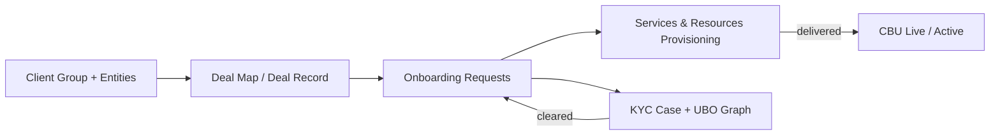
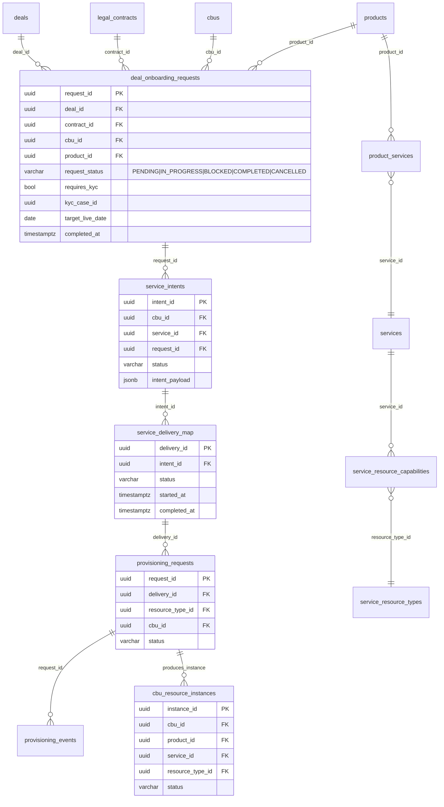
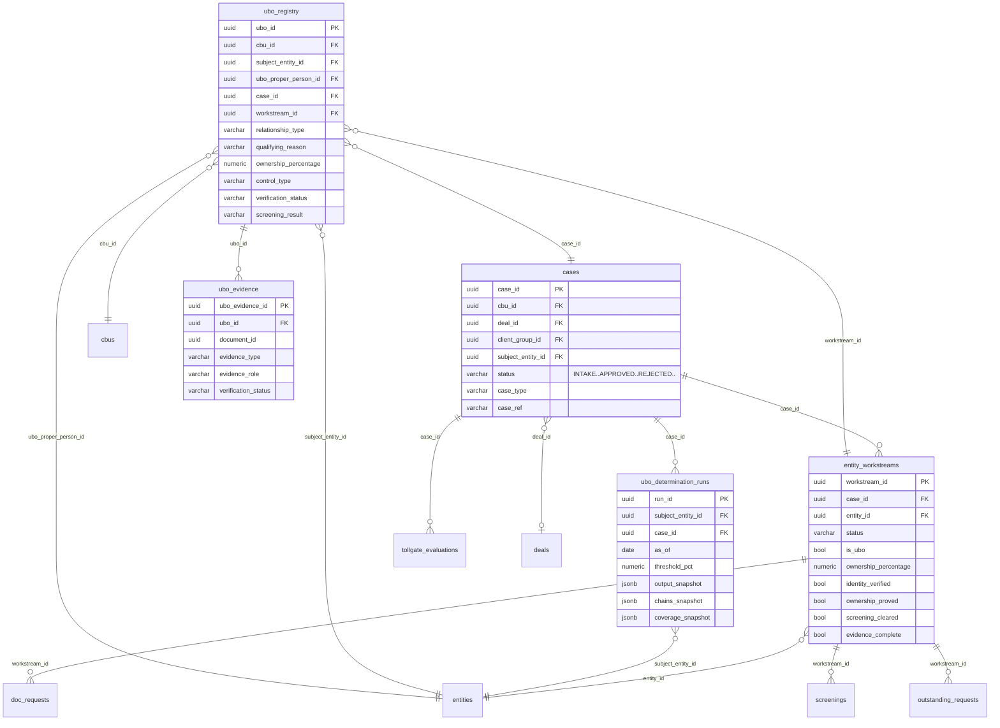

# OB-POC — Schema Entity Overview (Refocused)
> **Last reconciled:** 2026-03-06  
> **Focus:** 3 main taxonomies that drive the “commercial → onboarding → KYC/UBO” lifecycle:
> 1) **Deal Map (Deal Record)** — the commercial negotiation artefact  
> 2) **Onboarding Request** — the operational fulfilment wrapper (CBUs → services/resources)  
> 3) **KYC / UBO** — the due-diligence graph + evidence workflow, linked back to the deal

**Source of truth:** PostgreSQL schema `"ob-poc"` (DDL dump).  
**Notation:** schema prefix omitted in diagrams for readability (assume `"ob-poc".*`).  
**Why refocus:** this document is meant to be the *mental model* for the onboarding platform’s three “load-bearing” aggregates; everything else (SemReg, documents, runbooks, UI caches) is secondary for this overview.

---

## Reading order (one page mental model)



**Join points to remember:**
- `deals.deal_id` is the commercial hub.
- `deal_onboarding_requests` binds `(deal_id, contract_id, cbu_id, product_id)` into a fulfilment work package.
- `cases.case_id` (KYC) is linked to `deal_id` + `cbu_id`, and `deal_onboarding_requests.kyc_case_id` can pin the association explicitly.

---

# 1) Deal Map (Deal Record) — the commercial negotiation taxonomy

### What it represents
A **Deal** is an *artificial taxonomy* that bundles the commercial picture into one navigable record:

- **Who is negotiating?** (client-side entities participating in the deal)
- **What is being sold?** (commercial **products**)
- **How is it priced?** (**rate cards** per product, with tier/fee lines)
- **What is the legal gate?** (**legal contracts** + contracted product set)
- **Who consumes it operationally?** (**CBUs** subscribing to the contracted products)

The Deal Map is deliberately **commercial-first**. It doesn’t attempt to model the whole delivery system; it creates a deterministic “map” that the onboarding engine can execute against.

---

## Deal Map — canonical tables

### “Deal record” hub
- `deals` — the deal header + lifecycle status
- `deal_participants` — the negotiating / contracting / stakeholder entities
- `deal_rate_cards` + `deal_rate_card_lines` — negotiated pricing per product
- `deal_contracts` + `legal_contracts` — the legal wrapper(s)
- `contract_products` — the contracted product set (per contract)
- `cbu_subscriptions` — CBUs subscribing to contracted products (the “commercial-to-operational gate”)

### Mermaid ER (Deal Map)

```mermaid
erDiagram
  client_group ||--o{ deals : primary_client_group_id

  deals ||--o{ deal_participants : deal_id
  deal_participants }o--|| entities : entity_id

  deals ||--o{ deal_contracts : deal_id
  deal_contracts }o--|| legal_contracts : contract_id

  legal_contracts ||--o{ contract_products : contract_id
  contract_products }o--|| products : product_code

  deals ||--o{ deal_rate_cards : deal_id
  deal_rate_cards }o--|| legal_contracts : contract_id
  deal_rate_cards }o--|| products : product_id
  deal_rate_cards ||--o{ deal_rate_card_lines : rate_card_id

  contract_products ||--o{ cbu_subscriptions : contract_id+product_code
  cbu_subscriptions }o--|| cbus : cbu_id

  deals {
    uuid deal_id PK
    varchar deal_name
    varchar deal_reference
    uuid primary_client_group_id FK
    varchar deal_status "PROSPECT..ACTIVE..OFFBOARDED"
  }

  deal_participants {
    uuid deal_participant_id PK
    uuid deal_id FK
    uuid entity_id FK
    varchar participant_role
    bool is_primary
  }

  legal_contracts {
    uuid contract_id PK
    varchar client_label
    varchar contract_reference
    date effective_date
    varchar status "DRAFT|ACTIVE|TERMINATED|EXPIRED"
  }

  deal_rate_cards {
    uuid rate_card_id PK
    uuid deal_id FK
    uuid contract_id FK
    uuid product_id FK
    date effective_from
    date effective_to
    varchar status "DRAFT|PROPOSED|COUNTER_PROPOSED|AGREED|SUPERSEDED|CANCELLED"
    int negotiation_round
    uuid superseded_by
  }

  deal_rate_card_lines {
    uuid line_id PK
    uuid rate_card_id FK
    varchar fee_type
    varchar fee_subtype
    varchar pricing_model "BPS|FLAT|TIERED|PER_TRANSACTION|..."
    numeric rate_value
    numeric minimum_fee
    numeric maximum_fee
    jsonb tier_brackets
    varchar fee_basis
  }

  contract_products {
    uuid contract_id PK
    varchar product_code PK
    uuid rate_card_id FK
    date effective_date
    date termination_date
  }

  cbu_subscriptions {
    uuid cbu_id PK
    uuid contract_id PK
    varchar product_code PK
    timestamptz subscribed_at
    varchar status "PENDING|ACTIVE|SUSPENDED|TERMINATED"
  }
```

---

## Deal Map — key semantics (the bits that matter operationally)

### A. Deal lifecycle drives the user journey
`deals.deal_status` is a clean top-level state machine:
`PROSPECT → QUALIFYING → NEGOTIATING → CONTRACTED → ONBOARDING → ACTIVE → WINDING_DOWN → OFFBOARDED` (or `CANCELLED`).

This lifecycle is what your UI can treat as “where am I in the commercial funnel”.

### B. Rate cards are “pricing per contract+product” with supersession
A `deal_rate_cards` row binds:
- `deal_id` (the negotiation context),
- `contract_id` (the legal wrapper),
- `product_id` (commercial product),
- and a negotiated price set (`deal_rate_card_lines`).

Supersession is explicit (`superseded_by`) to support “new rate card replaces old rate card” without destroying history.

### C. Contract is the onboarding gate (contracted products → CBU subscription)
The legal gate is:
- `legal_contracts` + `contract_products` (the **contracted product set**), and
- `cbu_subscriptions` (the **CBU subscribes to contracted product_code**).

This is the **enforcement edge** between commercial agreement and operational delivery: a CBU can only subscribe to what’s in the contract.

### D. “Client-side contracting legal entity” is modelled via participants
In schema terms, the client-side contracting entities are represented as `deal_participants` → `entities`.  
Your business semantics live in `deal_participants.participant_role` (e.g. contracting party, sponsor, investment manager, etc.).

> Practical UI trick: in the “Deal Map” view, treat participants as a *typed legend* (contracting party, negotiator, delegate, etc.) rather than a flat list.

---

# 2) Onboarding Request — the fulfilment wrapper (Deal → CBU(s) → services/resources)

### What it represents
An **Onboarding Request** is the execution wrapper that takes the Deal Map and turns it into operational reality:

- it binds **Deal + Contract + CBU + Product**
- it carries delivery intent (target live date, status, notes)
- it links to KYC (optional but first-class)
- it drives provisioning into **services/resources** that implement the commercial product

---

## Onboarding Request — canonical tables
- `deal_onboarding_requests` — per (deal, contract, cbu, product) request row, status tracked
- `cbu_subscriptions` — the commercial “gate” subscription (contracted product_code)
- `service_intents` + `service_delivery_map` — operational intent vs actual delivery tracking
- `provisioning_requests` + `provisioning_events` — resource provisioning lifecycle
- `cbu_resource_instances` — provisioned operational resources attached to the CBU
- `products` → `product_services` → `services` → `service_resource_capabilities` → `service_resource_types` — the “product implements via services/resources” decomposition

---

## Mermaid ER (Onboarding Request → Provisioning)



---

## Onboarding Request — key semantics

### A. It is *the* bridge between commercial and operational planes
Think of `deal_onboarding_requests` as the **fulfilment envelope**:
- the Deal Map provides “what was sold and agreed”,
- onboarding request is “please make it real for these CBUs”.

### B. Status is deliberately operational
`deal_onboarding_requests.request_status` is not the deal status; it’s delivery status:
`PENDING → IN_PROGRESS → (BLOCKED) → COMPLETED` (or `CANCELLED`).

This is what drives:
- escalation,
- task queues,
- provisioning attempts,
- customer comms.

### C. Product → services/resources is the deterministic decomposition
You already have the clean decomposition graph:
`products → product_services → services → service_resource_capabilities → service_resource_types`

So the onboarding engine can:
1) resolve required services/resources from product,  
2) create `service_intents`,  
3) drive `service_delivery_map`,  
4) issue `provisioning_requests`,  
5) materialize `cbu_resource_instances`.

### D. KYC is a first-class dependency (not an afterthought)
Because `deal_onboarding_requests` carries:
- `requires_kyc`,
- `kyc_case_id`,
- `kyc_cleared_at`,

you can treat “KYC gating” as a native precondition for fulfilment, rather than bolting it onto provisioning.

---

# 3) KYC / UBO taxonomy — deal-linked due diligence, ownership & control

### What it represents
This taxonomy exists to answer (and prove) one thing:

> **Given the deal’s client-side entity set and the target CBUs, who ultimately owns/controls the relevant legal entities — and do we have sufficient evidence?**

It’s case-scoped and workflow-driven, but it reuses the canonical entity/relationship graph.

---

## KYC / UBO — canonical tables
**Case & work decomposition**
- `cases` — the KYC case (linked to `cbu_id`, optionally `deal_id` and `client_group_id`)
- `entity_workstreams` — one per relevant entity in the case scope (including discovered candidates)

**UBO computation + registry + evidence**
- `ubo_determination_runs` — computed snapshot outputs (JSONB) + coverage
- `ubo_registry` — case-scoped UBO assertions (links back to case/workstream)
- `ubo_evidence` — evidence items supporting UBO assertions

**Workflow support (typical)**
- `doc_requests` — document requests by workstream/entity
- `screenings` — sanctions/PEP/adverse media runs per workstream/entity
- `tollgate_evaluations` — “SKELETON_READY / EVIDENCE_COMPLETE / REVIEW_COMPLETE” style gates
- `outreach_plans` + `outreach_items` — client outreach plans for missing proofs

---

## Mermaid ER (KYC Case → Workstreams → UBO + Evidence)



---

## KYC / UBO — how “roles, ownership, controlling officers” fits in

You effectively have **three layers**:

### Layer 1 — canonical graph (source / registry)
- `entities` (companies, funds, persons)
- `entity_relationships` (ownership/control edges with provenance)
- `control_edges` (richer control semantics: voting rights, board appointment, PSC categories, etc.)
- `cbu_entity_roles` (operational roles inside a CBU: directors, IM, depositary, etc.)

### Layer 2 — case scope and workflow
- `cases` + `entity_workstreams` define **what is in scope** and **what is blocked**
- `doc_requests`, `screenings`, `outstanding_requests`, `outreach_*` drive the “human/external actor” loop

### Layer 3 — UBO outputs + evidence binding
- `ubo_determination_runs` gives computed candidate sets and coverage
- `ubo_registry` is the **asserted** UBO set (with status/supersession)
- `ubo_evidence` binds proof artefacts to each assertion

This split is exactly what you want: canonical graph can be imperfect and iterative; case outputs remain auditable and “as-of” a specific determination run.

---

# Cross-taxonomy join points (implementation cheatsheet)

| From | To | Why it matters |
|---|---|---|
| `deal_onboarding_requests.deal_id` | `deals.deal_id` | onboarding request belongs to a deal |
| `deal_onboarding_requests.contract_id` | `legal_contracts.contract_id` | request targets a specific legal gate |
| `deal_onboarding_requests.cbu_id` | `cbus.cbu_id` | operational unit being onboarded |
| `deal_onboarding_requests.product_id` | `products.product_id` | product sold (commercial SKU) |
| `deal_onboarding_requests.kyc_case_id` | `cases.case_id` | explicit pin from onboarding to KYC |
| `cases.deal_id` | `deals.deal_id` | case can be traced back to commercial context |
| `cbu_subscriptions.(contract_id, product_code)` | `contract_products.(contract_id, product_code)` | **the gate**: only contracted products can be subscribed |

---

# Clarifications that would tighten the model (optional)
None of these block the refactor, but if you answer them, we can make the “Deal Map” view even more deterministic:

1) **Participant roles** — what are the canonical `deal_participants.participant_role` values you want (BNY side vs client side vs delegates)?  
2) **BNY contracting party** — do you want it represented as a `deal_participant` (entity) or as a `booking_principal/legal_entity` reference on the deal/contract?  
3) **Onboarding request grouping** — today it’s per `(deal, contract, cbu, product)`; do you also want a parent “batch request” that groups many rows for a go-live programme?  
4) **Commercial vs operational subscriptions** — should the UI treat `cbu_subscriptions` (contract gate) as the authoritative “subscription”, with `cbu_product_subscriptions` as implementation detail?

---

## Appendix: where the rest of the platform fits
This refocused overview intentionally does not expand:
- Document & evidence library (beyond UBO evidence linkage),
- Semantic Registry (`sem_reg*`),
- Agent learning schema (`agent.*`),
- Runbooks/BPMN integration.
