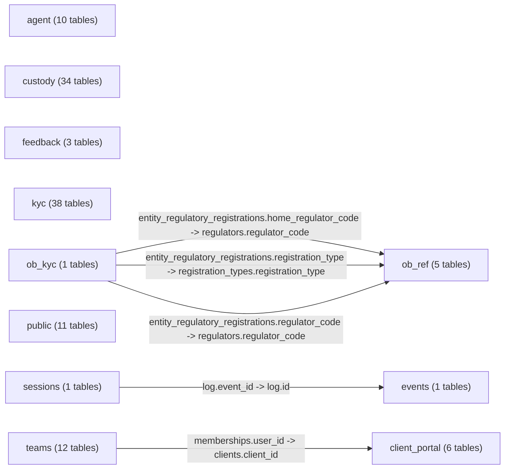

# OB-POC Database Schema — Text Overview

_Generated from `master-schema.sql` (PostgreSQL dump) on 2026-02-05._

This is a **text-first** structural overview: schemas, tables, primary keys, and foreign-key relationships.

## Inventory

| Schema | Tables | Hubs (highest FK degree) |
|---|---:|---|
| `agent` | 10 | `agent.learning_audit`, `agent.learning_candidates`, `agent.entity_aliases` |
| `client_portal` | 6 | `client_portal.clients`, `client_portal.escalations`, `client_portal.sessions` |
| `custody` | 34 | `custody.instrument_classes`, `custody.markets`, `custody.cbu_ssi` |
| `events` | 1 | `events.log` |
| `feedback` | 3 | `feedback.failures`, `feedback.audit_log`, `feedback.occurrences` |
| `kyc` | 38 | `kyc.share_classes`, `kyc.entity_workstreams`, `kyc.cases` |
| `ob_kyc` | 1 | `ob_kyc.entity_regulatory_registrations` |
| `ob_ref` | 5 | `ob_ref.regulators`, `ob_ref.registration_types`, `ob_ref.regulatory_tiers` |
| `public` | 11 | `public.rules`, `public.business_attributes`, `public.data_domains` |
| `sessions` | 1 | `sessions.log` |
| `teams` | 12 | `teams.teams`, `teams.access_review_campaigns`, `teams.access_review_items` |

## Cross-schema links (high level)



Cross-schema FK count: **5**

## Schema: `agent`

### Core ER slice (most connected tables)

```mermaid
erDiagram
    agent_learning_candidates ||--o{ agent_learning_audit : "candidate_id"
    agent_entity_aliases {
        bigint id PK
        text alias
        text canonical_name
        uuid entity_id
    }
    agent_esper_aliases {
        uuid id PK
        text phrase
        text command_key
        integer occurrence_count
    }
    agent_events {
        bigint id PK
        uuid session_id
        timestamp with time zone timestamp
        text event_type
    }
    agent_invocation_phrases {
        bigint id PK
        text phrase
        text verb
        numeric(3,2) confidence
    }
    agent_learning_audit {
        bigint id PK
        bigint candidate_id FK
        timestamp with time zone timestamp
        text action
        text learning_type
    }
    agent_learning_candidates {
        bigint id PK
        text fingerprint
        text learning_type
        text input_pattern
    }
    agent_lexicon_tokens {
        bigint id PK
        text token
        text token_type
        text token_subtype
    }
    agent_phrase_blocklist {
        bigint id PK
        text phrase
        text blocked_verb
        uuid user_id
    }
```

### Hub tables (who points to whom)

- **`agent.learning_candidates`**  PK: `id`  (in:1 / out:0)
  - referenced by: ← `agent.learning_audit` via `candidate_id`
- **`agent.learning_audit`**  PK: `id`  (in:0 / out:1)
  - references: → `agent.learning_candidates` via `candidate_id`
- **`agent.entity_aliases`**  PK: `id`  (in:0 / out:0)
- **`agent.esper_aliases`**  PK: `id`  (in:0 / out:0)
- **`agent.events`**  PK: `id`  (in:0 / out:0)
- **`agent.invocation_phrases`**  PK: `id`  (in:0 / out:0)

### Tables

`entity_aliases`, `esper_aliases`, `events`, `invocation_phrases`, `learning_audit`,
`learning_candidates`, `lexicon_tokens`, `phrase_blocklist`, `stopwords`, `user_learned_phrases`

## Schema: `client_portal`

### Core ER slice (most connected tables)

```mermaid
erDiagram
    client_portal_clients ||--o{ client_portal_commitments : "client_id"
    client_portal_clients ||--o{ client_portal_credentials : "client_id"
    client_portal_clients ||--o{ client_portal_escalations : "client_id"
    client_portal_sessions ||--o{ client_portal_escalations : "session_id"
    client_portal_clients ||--o{ client_portal_sessions : "client_id"
    client_portal_clients ||--o{ client_portal_submissions : "client_id"
    client_portal_clients {
        uuid client_id PK
        character varying(255) name
        character varying(255) email
        uuid[] accessible_cbus
    }
    client_portal_commitments {
        uuid commitment_id PK
        uuid client_id FK
        uuid request_id
        text commitment_text
        date expected_date
    }
    client_portal_credentials {
        uuid credential_id PK
        uuid client_id FK
        text credential_hash
        boolean is_active
        timestamp with time zone created_at
    }
    client_portal_escalations {
        uuid escalation_id PK
        uuid client_id FK
        uuid session_id FK
        uuid cbu_id
        text reason
        character varying(20) preferred_contact
    }
    client_portal_sessions {
        uuid session_id PK
        uuid client_id FK
        uuid active_cbu_id
        jsonb collection_state
        timestamp with time zone created_at
    }
    client_portal_submissions {
        uuid submission_id PK
        uuid client_id FK
        uuid request_id
        character varying(50) submission_type
        character varying(100) document_type
    }
```

### Hub tables (who points to whom)

- **`client_portal.clients`**  PK: `client_id`  (in:6 / out:0)
  - referenced by: ← `client_portal.commitments` via `client_id`; ← `client_portal.credentials` via `client_id`; ← `client_portal.escalations` via `client_id`; ← `client_portal.sessions` via `client_id`; ← `client_portal.submissions` via `client_id`; ← `teams.memberships` via `user_id`
- **`client_portal.sessions`**  PK: `session_id`  (in:1 / out:1)
  - references: → `client_portal.clients` via `client_id`
  - referenced by: ← `client_portal.escalations` via `session_id`
- **`client_portal.escalations`**  PK: `escalation_id`  (in:0 / out:2)
  - references: → `client_portal.clients` via `client_id`; → `client_portal.sessions` via `session_id`
- **`client_portal.commitments`**  PK: `commitment_id`  (in:0 / out:1)
  - references: → `client_portal.clients` via `client_id`
- **`client_portal.credentials`**  PK: `credential_id`  (in:0 / out:1)
  - references: → `client_portal.clients` via `client_id`
- **`client_portal.submissions`**  PK: `submission_id`  (in:0 / out:1)
  - references: → `client_portal.clients` via `client_id`

### Tables

`clients`, `commitments`, `credentials`, `escalations`, `sessions`, `submissions`

## Schema: `custody`

### Core ER slice (most connected tables)

```mermaid
erDiagram
    custody_markets ||--o{ custody_cbu_cross_border_config : "source_market_id"
    custody_markets ||--o{ custody_cbu_cross_border_config : "target_market_id"
    custody_instrument_classes ||--o{ custody_cbu_instrument_universe : "instrument_class_id"
    custody_markets ||--o{ custody_cbu_instrument_universe : "market_id"
    custody_instrument_classes ||--o{ custody_cbu_pricing_config : "instrument_class_id"
    custody_markets ||--o{ custody_cbu_pricing_config : "market_id"
    custody_instrument_classes ||--o{ custody_cbu_settlement_chains : "instrument_class_id"
    custody_markets ||--o{ custody_cbu_settlement_chains : "market_id"
    custody_instrument_classes ||--o{ custody_cbu_settlement_location_preferences : "instrument_class_id"
    custody_markets ||--o{ custody_cbu_settlement_location_preferences : "market_id"
    custody_markets ||--o{ custody_cbu_ssi : "market_id"
    custody_cbu_ssi ||--o{ custody_csa_agreements : "collateral_ssi_id"
    custody_instrument_classes ||--o{ custody_entity_ssi : "instrument_class_id"
    custody_markets ||--o{ custody_entity_ssi : "market_id"
    custody_security_types ||--o{ custody_entity_ssi : "security_type_id"
    custody_instrument_classes ||--o{ custody_instruction_paths : "instrument_class_id"
    custody_markets ||--o{ custody_instruction_paths : "market_id"
    custody_instrument_classes ||--o{ custody_instrument_classes : "parent_class_id"
    custody_instrument_classes ||--o{ custody_isda_product_coverage : "instrument_class_id"
    custody_isda_product_taxonomy ||--o{ custody_isda_product_coverage : "isda_taxonomy_id"
    custody_instrument_classes ||--o{ custody_isda_product_taxonomy : "class_id"
    custody_instrument_classes ||--o{ custody_security_types : "class_id"
    custody_instrument_classes ||--o{ custody_ssi_booking_rules : "instrument_class_id"
    custody_markets ||--o{ custody_ssi_booking_rules : "market_id"
    custody_security_types ||--o{ custody_ssi_booking_rules : "security_type_id"
    custody_cbu_ssi ||--o{ custody_ssi_booking_rules : "ssi_id"
    custody_instrument_classes ||--o{ custody_tax_treaty_rates : "instrument_class_id"
    custody_tax_jurisdictions ||--o{ custody_tax_treaty_rates : "investor_jurisdiction_id"
    custody_tax_jurisdictions ||--o{ custody_tax_treaty_rates : "source_jurisdiction_id"
    custody_ca_event_types {
        uuid event_type_id PK
        text event_code
        text event_name
        text category
    }
    custody_cbu_cross_border_config {
        uuid config_id PK
        uuid source_market_id FK
        uuid target_market_id FK
        uuid bridge_location_id FK
        uuid cbu_id
        character varying(20) settlement_method
        character varying(3) preferred_currency
    }
    custody_cbu_instrument_universe {
        uuid universe_id PK
        uuid instrument_class_id FK
        uuid market_id FK
        uuid cbu_id
        character varying(3)[] currencies
        character varying(10)[] settlement_types
    }
    custody_cbu_pricing_config {
        uuid config_id PK
        uuid instrument_class_id FK
        uuid market_id FK
        uuid cbu_id
        uuid profile_id
        character varying(3) currency
    }
    custody_cbu_settlement_chains {
        uuid chain_id PK
        uuid market_id FK
        uuid instrument_class_id FK
        uuid cbu_id
        character varying(100) chain_name
        character varying(3) currency
    }
    custody_cbu_settlement_location_preferences {
        uuid preference_id PK
        uuid market_id FK
        uuid instrument_class_id FK
        uuid preferred_location_id FK
        uuid cbu_id
        integer priority
        text reason
    }
    custody_cbu_ssi {
        uuid ssi_id PK
        uuid market_id FK
        uuid cbu_id
        character varying(100) ssi_name
        character varying(20) ssi_type
    }
    custody_csa_agreements {
        uuid csa_id PK
        uuid isda_id FK
        uuid collateral_ssi_id FK
        character varying(20) csa_type
        numeric(18,2) threshold_amount
        character varying(3) threshold_currency
    }
    custody_entity_ssi {
        uuid entity_ssi_id PK
        uuid instrument_class_id FK
        uuid security_type_id FK
        uuid market_id FK
        uuid entity_id
        character varying(3) currency
        character varying(11) counterparty_bic
    }
    custody_instruction_paths {
        uuid path_id PK
        uuid instrument_class_id FK
        uuid market_id FK
        uuid instruction_type_id FK
        character varying(3) currency
        uuid resource_id
        integer routing_priority
    }
    custody_instrument_classes {
        uuid class_id PK
        uuid parent_class_id FK
        character varying(20) code
        character varying(100) name
        character varying(10) default_settlement_cycle
    }
    custody_isda_product_coverage {
        uuid coverage_id PK
        uuid isda_id FK
        uuid instrument_class_id FK
        uuid isda_taxonomy_id FK
        boolean is_active
        timestamp with time zone created_at
    }
    custody_isda_product_taxonomy {
        uuid taxonomy_id PK
        uuid class_id FK
        character varying(30) asset_class
        character varying(50) base_product
        character varying(50) sub_product
    }
    custody_markets {
        uuid market_id PK
        character varying(4) mic
        character varying(255) name
        character varying(2) country_code
    }
    custody_security_types {
        uuid security_type_id PK
        uuid class_id FK
        character varying(4) code
        character varying(100) name
        character varying(6) cfi_pattern
    }
    custody_ssi_booking_rules {
        uuid rule_id PK
        uuid ssi_id FK
        uuid instrument_class_id FK
        uuid security_type_id FK
        uuid market_id FK
        uuid cbu_id
        character varying(100) rule_name
        integer priority
    }
    custody_tax_jurisdictions {
        uuid jurisdiction_id PK
        character varying(10) jurisdiction_code
        character varying(200) jurisdiction_name
        character varying(2) country_code
    }
    custody_tax_treaty_rates {
        uuid treaty_id PK
        uuid source_jurisdiction_id FK
        uuid investor_jurisdiction_id FK
        uuid instrument_class_id FK
        character varying(20) income_type
        numeric(5,3) standard_rate
        numeric(5,3) treaty_rate
    }
```

### Hub tables (who points to whom)

- **`custody.instrument_classes`**  PK: `class_id`  (in:14 / out:1)
  - references: → `custody.instrument_classes` via `parent_class_id`
  - referenced by: ← `custody.cbu_ca_preferences` via `instrument_class_id`; ← `custody.cbu_instrument_universe` via `instrument_class_id`; ← `custody.cbu_pricing_config` via `instrument_class_id`; ← `custody.cbu_settlement_chains` via `instrument_class_id`; ← `custody.cbu_settlement_location_preferences` via `instrument_class_id`; ← `custody.cfi_codes` via `class_id`; ← `custody.entity_ssi` via `instrument_class_id`; ← `custody.instruction_paths` via `instrument_class_id`; ← `custody.instrument_classes` via `parent_class_id`; ← `custody.isda_product_coverage` via `instrument_class_id`; …(+4)
- **`custody.markets`**  PK: `market_id`  (in:12 / out:0)
  - referenced by: ← `custody.cbu_ca_instruction_windows` via `market_id`; ← `custody.cbu_cross_border_config` via `source_market_id`; ← `custody.cbu_cross_border_config` via `target_market_id`; ← `custody.cbu_instrument_universe` via `market_id`; ← `custody.cbu_pricing_config` via `market_id`; ← `custody.cbu_settlement_chains` via `market_id`; ← `custody.cbu_settlement_location_preferences` via `market_id`; ← `custody.cbu_ssi` via `market_id`; ← `custody.entity_ssi` via `market_id`; ← `custody.instruction_paths` via `market_id`; …(+2)
- **`custody.cbu_ssi`**  PK: `ssi_id`  (in:5 / out:1)
  - references: → `custody.markets` via `market_id`
  - referenced by: ← `custody.cbu_ca_ssi_mappings` via `ssi_id`; ← `custody.cbu_ssi_agent_override` via `ssi_id`; ← `custody.csa_agreements` via `collateral_ssi_id`; ← `custody.settlement_chain_hops` via `ssi_id`; ← `custody.ssi_booking_rules` via `ssi_id`
- **`custody.tax_jurisdictions`**  PK: `jurisdiction_id`  (in:5 / out:0)
  - referenced by: ← `custody.cbu_tax_reclaim_config` via `source_jurisdiction_id`; ← `custody.cbu_tax_reporting` via `reporting_jurisdiction_id`; ← `custody.cbu_tax_status` via `tax_jurisdiction_id`; ← `custody.tax_treaty_rates` via `investor_jurisdiction_id`; ← `custody.tax_treaty_rates` via `source_jurisdiction_id`
- **`custody.security_types`**  PK: `security_type_id`  (in:3 / out:1)
  - references: → `custody.instrument_classes` via `class_id`
  - referenced by: ← `custody.cfi_codes` via `security_type_id`; ← `custody.entity_ssi` via `security_type_id`; ← `custody.ssi_booking_rules` via `security_type_id`
- **`custody.ssi_booking_rules`**  PK: `rule_id`  (in:0 / out:4)
  - references: → `custody.cbu_ssi` via `ssi_id`; → `custody.instrument_classes` via `instrument_class_id`; → `custody.markets` via `market_id`; → `custody.security_types` via `security_type_id`

### Tables

`ca_event_types`, `cbu_ca_instruction_windows`, `cbu_ca_preferences`, `cbu_ca_ssi_mappings`,
`cbu_cash_sweep_config`, `cbu_cross_border_config`, `cbu_im_assignments`, `cbu_instrument_universe`,
`cbu_pricing_config`, `cbu_settlement_chains`, `cbu_settlement_location_preferences`, `cbu_ssi`,
`cbu_ssi_agent_override`, `cbu_tax_reclaim_config`, `cbu_tax_reporting`, `cbu_tax_status`,
`cfi_codes`, `csa_agreements`, `entity_settlement_identity`, `entity_ssi`, `instruction_paths`,
`instruction_types`, `instrument_classes`, `isda_agreements`, `isda_product_coverage`,
`isda_product_taxonomy`, `markets`, `security_types`, `settlement_chain_hops`,
`settlement_locations`, `ssi_booking_rules`, `subcustodian_network`, `tax_jurisdictions`,
`tax_treaty_rates`

## Schema: `events`

### Core ER slice (most connected tables)

```mermaid
erDiagram
    events_log {
        bigint id PK
        timestamp with time zone timestamp
        uuid session_id
        text event_type
    }
```

### Hub tables (who points to whom)

- **`events.log`**  PK: `id`  (in:1 / out:0)
  - referenced by: ← `sessions.log` via `event_id`

### Tables

`log`

## Schema: `feedback`

### Core ER slice (most connected tables)

```mermaid
erDiagram
    feedback_failures ||--o{ feedback_audit_log : "failure_id"
    feedback_failures ||--o{ feedback_occurrences : "failure_id"
    feedback_audit_log {
        uuid id PK
        uuid failure_id FK
        feedback.audit_action action
        feedback.actor_type actor_type
        text actor_id
    }
    feedback_failures {
        uuid id PK
        text fingerprint
        smallint fingerprint_version
        feedback.error_type error_type
    }
    feedback_occurrences {
        uuid id PK
        uuid failure_id FK
        uuid event_id
        timestamp with time zone event_timestamp
        uuid session_id
    }
```

### Hub tables (who points to whom)

- **`feedback.failures`**  PK: `id`  (in:2 / out:0)
  - referenced by: ← `feedback.audit_log` via `failure_id`; ← `feedback.occurrences` via `failure_id`
- **`feedback.audit_log`**  PK: `id`  (in:0 / out:1)
  - references: → `feedback.failures` via `failure_id`
- **`feedback.occurrences`**  PK: `id`  (in:0 / out:1)
  - references: → `feedback.failures` via `failure_id`

### Tables

`audit_log`, `failures`, `occurrences`

## Schema: `kyc`

### Core ER slice (most connected tables)

```mermaid
erDiagram
    kyc_cases ||--o{ kyc_approval_requests : "case_id"
    kyc_entity_workstreams ||--o{ kyc_approval_requests : "workstream_id"
    kyc_cases ||--o{ kyc_case_events : "case_id"
    kyc_entity_workstreams ||--o{ kyc_case_events : "workstream_id"
    kyc_dilution_instruments ||--o{ kyc_dilution_exercise_events : "instrument_id"
    kyc_holdings ||--o{ kyc_dilution_exercise_events : "resulting_holding_id"
    kyc_share_classes ||--o{ kyc_dilution_instruments : "converts_to_share_class_id"
    kyc_entity_workstreams ||--o{ kyc_doc_requests : "workstream_id"
    kyc_outstanding_requests ||--o{ kyc_entity_workstreams : "blocker_request_id"
    kyc_cases ||--o{ kyc_entity_workstreams : "case_id"
    kyc_entity_workstreams ||--o{ kyc_entity_workstreams : "discovery_source_workstream_id"
    kyc_investors ||--o{ kyc_holdings : "investor_id"
    kyc_share_classes ||--o{ kyc_holdings : "share_class_id"
    kyc_cases ||--o{ kyc_outstanding_requests : "case_id"
    kyc_entity_workstreams ||--o{ kyc_outstanding_requests : "workstream_id"
    kyc_share_classes ||--o{ kyc_ownership_snapshots : "share_class_id"
    kyc_ownership_snapshots ||--o{ kyc_ownership_snapshots : "superseded_by"
    kyc_cases ||--o{ kyc_red_flags : "case_id"
    kyc_entity_workstreams ||--o{ kyc_red_flags : "workstream_id"
    kyc_research_decisions ||--o{ kyc_research_actions : "decision_id"
    kyc_research_actions ||--o{ kyc_research_corrections : "new_action_id"
    kyc_research_actions ||--o{ kyc_research_corrections : "original_action_id"
    kyc_research_decisions ||--o{ kyc_research_corrections : "original_decision_id"
    kyc_cases ||--o{ kyc_rule_executions : "case_id"
    kyc_entity_workstreams ||--o{ kyc_rule_executions : "workstream_id"
    kyc_red_flags ||--o{ kyc_screenings : "red_flag_id"
    kyc_entity_workstreams ||--o{ kyc_screenings : "workstream_id"
    kyc_share_classes ||--o{ kyc_share_classes : "converts_to_share_class_id"
    kyc_approval_requests {
        uuid approval_id PK
        uuid case_id FK
        uuid workstream_id FK
        character varying(50) request_type
        character varying(255) requested_by
        timestamp with time zone requested_at
    }
    kyc_case_events {
        uuid event_id PK
        uuid case_id FK
        uuid workstream_id FK
        character varying(50) event_type
        jsonb event_data
        uuid actor_id
    }
    kyc_cases {
        uuid case_id PK
        uuid cbu_id
        character varying(30) status
        character varying(30) escalation_level
    }
    kyc_dilution_exercise_events {
        uuid exercise_id PK
        uuid instrument_id FK
        uuid resulting_holding_id FK
        numeric(20,6) units_exercised
        date exercise_date
        numeric(20,6) exercise_price_paid
    }
    kyc_dilution_instruments {
        uuid instrument_id PK
        uuid converts_to_share_class_id FK
        uuid issuer_entity_id
        character varying(30) instrument_type
        uuid holder_entity_id
    }
    kyc_doc_requests {
        uuid request_id PK
        uuid workstream_id FK
        character varying(50) doc_type
        character varying(20) status
        timestamp with time zone required_at
    }
    kyc_entity_workstreams {
        uuid workstream_id PK
        uuid case_id FK
        uuid discovery_source_workstream_id FK
        uuid blocker_request_id FK
        uuid entity_id
        character varying(30) status
        character varying(100) discovery_reason
    }
    kyc_holdings {
        uuid id PK
        uuid share_class_id FK
        uuid investor_id FK
        uuid investor_entity_id
        numeric(20,6) units
        numeric(20,2) cost_basis
    }
    kyc_investors {
        uuid investor_id PK
        uuid entity_id
        character varying(50) investor_type
        character varying(50) investor_category
    }
    kyc_outstanding_requests {
        uuid request_id PK
        uuid workstream_id FK
        uuid case_id FK
        character varying(50) subject_type
        uuid subject_id
        uuid cbu_id
    }
    kyc_ownership_snapshots {
        uuid snapshot_id PK
        uuid share_class_id FK
        uuid superseded_by FK
        uuid issuer_entity_id
        uuid owner_entity_id
        date as_of_date
    }
    kyc_red_flags {
        uuid red_flag_id PK
        uuid case_id FK
        uuid workstream_id FK
        character varying(50) flag_type
        character varying(20) severity
        character varying(20) status
    }
    kyc_research_actions {
        uuid action_id PK
        uuid decision_id FK
        uuid target_entity_id
        character varying(50) action_type
        character varying(30) source_provider
    }
    kyc_research_corrections {
        uuid correction_id PK
        uuid original_decision_id FK
        uuid original_action_id FK
        uuid new_action_id FK
        character varying(20) correction_type
        character varying(100) wrong_key
        character varying(20) wrong_key_type
    }
    kyc_research_decisions {
        uuid decision_id PK
        uuid trigger_id
        uuid target_entity_id
        text search_query
    }
    kyc_rule_executions {
        uuid execution_id PK
        uuid case_id FK
        uuid workstream_id FK
        character varying(100) rule_name
        character varying(50) trigger_event
        boolean condition_matched
    }
    kyc_screenings {
        uuid screening_id PK
        uuid workstream_id FK
        uuid red_flag_id FK
        character varying(30) screening_type
        character varying(50) provider
        character varying(20) status
    }
    kyc_share_classes {
        uuid id PK
        uuid converts_to_share_class_id FK
        uuid compartment_id FK
        uuid cbu_id
        character varying(255) name
        character varying(12) isin
    }
```

### Hub tables (who points to whom)

- **`kyc.share_classes`**  PK: `id`  (in:10 / out:2)
  - references: → `kyc.fund_compartments` via `compartment_id`; → `kyc.share_classes` via `converts_to_share_class_id`
  - referenced by: ← `kyc.dilution_instruments` via `converts_to_share_class_id`; ← `kyc.holding_control_links` via `share_class_id`; ← `kyc.holdings` via `share_class_id`; ← `kyc.investor_role_profiles` via `share_class_id`; ← `kyc.issuance_events` via `share_class_id`; ← `kyc.ownership_snapshots` via `share_class_id`; ← `kyc.share_class_identifiers` via `share_class_id`; ← `kyc.share_class_supply` via `share_class_id`; ← `kyc.share_classes` via `converts_to_share_class_id`; ← `kyc.special_rights` via `share_class_id`
- **`kyc.entity_workstreams`**  PK: `workstream_id`  (in:8 / out:3)
  - references: → `kyc.cases` via `case_id`; → `kyc.entity_workstreams` via `discovery_source_workstream_id`; → `kyc.outstanding_requests` via `blocker_request_id`
  - referenced by: ← `kyc.approval_requests` via `workstream_id`; ← `kyc.case_events` via `workstream_id`; ← `kyc.doc_requests` via `workstream_id`; ← `kyc.entity_workstreams` via `discovery_source_workstream_id`; ← `kyc.outstanding_requests` via `workstream_id`; ← `kyc.red_flags` via `workstream_id`; ← `kyc.rule_executions` via `workstream_id`; ← `kyc.screenings` via `workstream_id`
- **`kyc.cases`**  PK: `case_id`  (in:6 / out:0)
  - referenced by: ← `kyc.approval_requests` via `case_id`; ← `kyc.case_events` via `case_id`; ← `kyc.entity_workstreams` via `case_id`; ← `kyc.outstanding_requests` via `case_id`; ← `kyc.red_flags` via `case_id`; ← `kyc.rule_executions` via `case_id`
- **`kyc.research_actions`**  PK: `action_id`  (in:3 / out:1)
  - references: → `kyc.research_decisions` via `decision_id`
  - referenced by: ← `kyc.research_anomalies` via `action_id`; ← `kyc.research_corrections` via `new_action_id`; ← `kyc.research_corrections` via `original_action_id`
- **`kyc.holdings`**  PK: `id`  (in:2 / out:2)
  - references: → `kyc.investors` via `investor_id`; → `kyc.share_classes` via `share_class_id`
  - referenced by: ← `kyc.dilution_exercise_events` via `resulting_holding_id`; ← `kyc.movements` via `holding_id`
- **`kyc.outstanding_requests`**  PK: `request_id`  (in:1 / out:2)
  - references: → `kyc.cases` via `case_id`; → `kyc.entity_workstreams` via `workstream_id`
  - referenced by: ← `kyc.entity_workstreams` via `blocker_request_id`

### Tables

`approval_requests`, `bods_right_type_mapping`, `case_events`, `cases`, `dilution_exercise_events`,
`dilution_instruments`, `doc_request_acceptable_types`, `doc_requests`, `entity_workstreams`,
`fund_compartments`, `fund_vehicles`, `holding_control_links`, `holdings`,
`instrument_identifier_schemes`, `investor_lifecycle_history`, `investor_lifecycle_transitions`,
`investor_role_profiles`, `investors`, `issuance_events`, `issuer_control_config`, `movements`,
`outreach_requests`, `outstanding_requests`, `ownership_reconciliation_findings`,
`ownership_reconciliation_runs`, `ownership_snapshots`, `red_flags`, `research_actions`,
`research_anomalies`, `research_confidence_config`, `research_corrections`, `research_decisions`,
`rule_executions`, `screenings`, `share_class_identifiers`, `share_class_supply`, `share_classes`,
`special_rights`

## Schema: `ob_kyc`

### Core ER slice (most connected tables)

```mermaid
erDiagram
    ob_kyc_entity_regulatory_registrations {
        uuid registration_id PK
        character varying(50) regulator_code FK
        character varying(50) registration_type FK
        character varying(50) home_regulator_code FK
        uuid entity_id
        character varying(100) registration_number
        text activity_scope
    }
```

### Hub tables (who points to whom)

- **`ob_kyc.entity_regulatory_registrations`**  PK: `registration_id`  (in:0 / out:3)
  - references: → `ob_ref.registration_types` via `registration_type`; → `ob_ref.regulators` via `home_regulator_code`; → `ob_ref.regulators` via `regulator_code`

### Tables

`entity_regulatory_registrations`

## Schema: `ob_ref`

### Core ER slice (most connected tables)

```mermaid
erDiagram
    ob_ref_regulatory_tiers ||--o{ ob_ref_regulators : "regulatory_tier"
    ob_ref_registration_types {
        character varying(50) registration_type PK
        character varying(255) description
        boolean is_primary
        boolean allows_reliance
    }
    ob_ref_regulators {
        character varying(50) regulator_code PK
        character varying(50) regulatory_tier FK
        character varying(255) regulator_name
        character varying(2) jurisdiction
        character varying(50) regulator_type
    }
    ob_ref_regulatory_tiers {
        character varying(50) tier_code PK
        character varying(255) description
        boolean allows_simplified_dd
        boolean requires_enhanced_screening
    }
    ob_ref_request_types {
        character varying(50) request_type PK
        character varying(100) request_subtype PK
        character varying(255) description
        integer default_due_days
        integer default_grace_days
    }
    ob_ref_role_types {
        uuid role_type_id PK
        character varying(50) code
        character varying(255) name
        text description
    }
```

### Hub tables (who points to whom)

- **`ob_ref.regulators`**  PK: `regulator_code`  (in:2 / out:1)
  - references: → `ob_ref.regulatory_tiers` via `regulatory_tier`
  - referenced by: ← `ob_kyc.entity_regulatory_registrations` via `home_regulator_code`; ← `ob_kyc.entity_regulatory_registrations` via `regulator_code`
- **`ob_ref.registration_types`**  PK: `registration_type`  (in:1 / out:0)
  - referenced by: ← `ob_kyc.entity_regulatory_registrations` via `registration_type`
- **`ob_ref.regulatory_tiers`**  PK: `tier_code`  (in:1 / out:0)
  - referenced by: ← `ob_ref.regulators` via `regulatory_tier`
- **`ob_ref.request_types`**  PK: `request_type, request_subtype`  (in:0 / out:0)
- **`ob_ref.role_types`**  PK: `role_type_id`  (in:0 / out:0)

### Tables

`registration_types`, `regulators`, `regulatory_tiers`, `request_types`, `role_types`

## Schema: `public`

### Core ER slice (most connected tables)

```mermaid
erDiagram
    public_data_domains ||--o{ public_business_attributes : "domain_id"
    public_attribute_sources ||--o{ public_business_attributes : "source_id"
    public_data_domains ||--o{ public_derived_attributes : "domain_id"
    public_business_attributes ||--o{ public_rule_dependencies : "attribute_id"
    public_rules ||--o{ public_rule_dependencies : "rule_id"
    public_rules ||--o{ public_rule_executions : "rule_id"
    public_rules ||--o{ public_rule_versions : "rule_id"
    public_rule_categories ||--o{ public_rules : "category_id"
    public_derived_attributes ||--o{ public_rules : "target_attribute_id"
    public_attribute_sources {
        integer id PK
        character varying(50) source_key
        character varying(100) name
        text description
    }
    public_business_attributes {
        integer id PK
        integer domain_id FK
        integer source_id FK
        character varying(100) entity_name
        character varying(100) attribute_name
        character varying(200) GENERATED ALWAYS AS ((((entity_name)::text || '.'::text) || (attribute_name)::text)) STORED full_path
    }
    public_data_domains {
        integer id PK
        character varying(100) domain_name
        jsonb values
        text description
    }
    public_derived_attributes {
        integer id PK
        integer domain_id FK
        character varying(100) entity_name
        character varying(100) attribute_name
        character varying(200) GENERATED ALWAYS AS ((((entity_name)::text || '.'::text) || (attribute_name)::text)) STORED full_path
    }
    public_rule_categories {
        integer id PK
        character varying(50) category_key
        character varying(100) name
        text description
    }
    public_rule_dependencies {
        integer id PK
        integer rule_id FK
        integer attribute_id FK
        character varying(20) dependency_type
    }
    public_rule_executions {
        uuid id PK
        integer rule_id FK
        timestamp without time zone execution_time
        jsonb input_data
        jsonb output_value
    }
    public_rule_versions {
        integer id PK
        integer rule_id FK
        integer version
        text rule_definition
        text change_description
    }
    public_rules {
        integer id PK
        integer category_id FK
        integer target_attribute_id FK
        character varying(50) rule_id
        character varying(200) rule_name
        text description
    }
```

### Hub tables (who points to whom)

- **`public.rules`**  PK: `id`  (in:3 / out:2)
  - references: → `public.derived_attributes` via `target_attribute_id`; → `public.rule_categories` via `category_id`
  - referenced by: ← `public.rule_dependencies` via `rule_id`; ← `public.rule_executions` via `rule_id`; ← `public.rule_versions` via `rule_id`
- **`public.business_attributes`**  PK: `id`  (in:1 / out:2)
  - references: → `public.attribute_sources` via `source_id`; → `public.data_domains` via `domain_id`
  - referenced by: ← `public.rule_dependencies` via `attribute_id`
- **`public.data_domains`**  PK: `id`  (in:2 / out:0)
  - referenced by: ← `public.business_attributes` via `domain_id`; ← `public.derived_attributes` via `domain_id`
- **`public.derived_attributes`**  PK: `id`  (in:1 / out:1)
  - references: → `public.data_domains` via `domain_id`
  - referenced by: ← `public.rules` via `target_attribute_id`
- **`public.rule_dependencies`**  PK: `id`  (in:0 / out:2)
  - references: → `public.business_attributes` via `attribute_id`; → `public.rules` via `rule_id`
- **`public.attribute_sources`**  PK: `id`  (in:1 / out:0)
  - referenced by: ← `public.business_attributes` via `source_id`

### Tables

`_sqlx_migrations`, `attribute_sources`, `business_attributes`, `credentials_vault`, `data_domains`,
`derived_attributes`, `rule_categories`, `rule_dependencies`, `rule_executions`, `rule_versions`,
`rules`

## Schema: `sessions`

### Core ER slice (most connected tables)

```mermaid
erDiagram
    sessions_log {
        bigint id PK
        bigint event_id FK
        uuid session_id
        timestamp with time zone timestamp
        text entry_type
    }
```

### Hub tables (who points to whom)

- **`sessions.log`**  PK: `id`  (in:0 / out:1)
  - references: → `events.log` via `event_id`

### Tables

`log`

## Schema: `teams`

### Core ER slice (most connected tables)

```mermaid
erDiagram
    teams_access_review_campaigns ||--o{ teams_access_attestations : "campaign_id"
    teams_access_review_campaigns ||--o{ teams_access_review_items : "campaign_id"
    teams_memberships ||--o{ teams_access_review_items : "membership_id"
    teams_access_review_campaigns ||--o{ teams_access_review_log : "campaign_id"
    teams_access_review_items ||--o{ teams_access_review_log : "item_id"
    teams_teams ||--o{ teams_membership_audit_log : "team_id"
    teams_teams ||--o{ teams_memberships : "team_id"
    teams_teams ||--o{ teams_team_cbu_access : "team_id"
    teams_teams ||--o{ teams_team_service_entitlements : "team_id"
    teams_access_attestations {
        uuid attestation_id PK
        uuid campaign_id FK
        uuid attester_user_id
        character varying(255) attester_name
        character varying(255) attester_email
    }
    teams_access_review_campaigns {
        uuid campaign_id PK
        character varying(255) name
        character varying(50) review_type
        character varying(50) scope_type
    }
    teams_access_review_items {
        uuid item_id PK
        uuid campaign_id FK
        uuid membership_id FK
        uuid user_id
        uuid team_id
        character varying(100) role_key
    }
    teams_access_review_log {
        uuid log_id PK
        uuid campaign_id FK
        uuid item_id FK
        character varying(50) action
        jsonb action_detail
        uuid actor_user_id
    }
    teams_membership_audit_log {
        uuid log_id PK
        uuid team_id FK
        uuid user_id
        character varying(50) action
        text reason
    }
    teams_memberships {
        uuid membership_id PK
        uuid team_id FK
        uuid user_id FK
        character varying(100) role_key
        character varying(50) GENERATED ALWAYS AS (split_part((role_key)::text, '.'::text, 1)) STORED team_type
        character varying(50) GENERATED ALWAYS AS (split_part(split_part((role_key)::text, '.'::text, 2), ':'::text, 1)) STORED function_name
    }
    teams_team_cbu_access {
        uuid access_id PK
        uuid team_id FK
        uuid cbu_id
        jsonb access_restrictions
        timestamp with time zone granted_at
    }
    teams_team_service_entitlements {
        uuid entitlement_id PK
        uuid team_id FK
        character varying(100) service_code
        jsonb config
        timestamp with time zone granted_at
    }
    teams_teams {
        uuid team_id PK
        character varying(255) name
        character varying(50) team_type
        uuid delegating_entity_id
    }
```

### Hub tables (who points to whom)

- **`teams.teams`**  PK: `team_id`  (in:4 / out:0)
  - referenced by: ← `teams.membership_audit_log` via `team_id`; ← `teams.memberships` via `team_id`; ← `teams.team_cbu_access` via `team_id`; ← `teams.team_service_entitlements` via `team_id`
- **`teams.access_review_campaigns`**  PK: `campaign_id`  (in:3 / out:0)
  - referenced by: ← `teams.access_attestations` via `campaign_id`; ← `teams.access_review_items` via `campaign_id`; ← `teams.access_review_log` via `campaign_id`
- **`teams.access_review_items`**  PK: `item_id`  (in:1 / out:2)
  - references: → `teams.access_review_campaigns` via `campaign_id`; → `teams.memberships` via `membership_id`
  - referenced by: ← `teams.access_review_log` via `item_id`
- **`teams.memberships`**  PK: `membership_id`  (in:1 / out:2)
  - references: → `client_portal.clients` via `user_id`; → `teams.teams` via `team_id`
  - referenced by: ← `teams.access_review_items` via `membership_id`
- **`teams.access_review_log`**  PK: `log_id`  (in:0 / out:2)
  - references: → `teams.access_review_campaigns` via `campaign_id`; → `teams.access_review_items` via `item_id`
- **`teams.access_attestations`**  PK: `attestation_id`  (in:0 / out:1)
  - references: → `teams.access_review_campaigns` via `campaign_id`

### Tables

`access_attestations`, `access_domains`, `access_review_campaigns`, `access_review_items`,
`access_review_log`, `function_domains`, `membership_audit_log`, `membership_history`,
`memberships`, `team_cbu_access`, `team_service_entitlements`, `teams`

## Regenerating this view from a live database

If you have the DB running, these `psql` snippets are useful:

```sql
-- List tables by schema
SELECT table_schema, COUNT(*) AS tables
FROM information_schema.tables
WHERE table_type='BASE TABLE'
GROUP BY 1 ORDER BY 2 DESC;

-- List FK edges
SELECT
  tc.table_schema AS from_schema, tc.table_name AS from_table, kcu.column_name AS from_col,
  ccu.table_schema AS to_schema, ccu.table_name AS to_table, ccu.column_name AS to_col,
  tc.constraint_name
FROM information_schema.table_constraints tc
JOIN information_schema.key_column_usage kcu
  ON tc.constraint_name = kcu.constraint_name AND tc.table_schema = kcu.table_schema
JOIN information_schema.constraint_column_usage ccu
  ON ccu.constraint_name = tc.constraint_name AND ccu.table_schema = tc.table_schema
WHERE tc.constraint_type = 'FOREIGN KEY'
ORDER BY from_schema, from_table;
```
