# Products, Services & Resources — Peer Review Paper

> **Date:** 2026-02-11
> **Scope:** Three-layer product taxonomy, SRDEF resource definitions, attribute dictionary, service pipeline (Intent → Discovery → Rollup → Population → Provisioning → Readiness), booking principals with three-lane availability, rule evaluation engine, document integration, and outstanding request lifecycle.
> **Audience:** Domain architects, implementation engineers, QA reviewers

---

## Table of Contents

1. [Executive Summary](#1-executive-summary)
2. [Three-Layer Product Taxonomy](#2-three-layer-product-taxonomy)
3. [Products](#3-products)
4. [Services](#4-services)
5. [Product-Service Junction](#5-product-service-junction)
6. [Service Resource Definitions (SRDEF)](#6-service-resource-definitions-srdef)
7. [Resource Dependencies](#7-resource-dependencies)
8. [Attribute Registry (Dictionary)](#8-attribute-registry-dictionary)
9. [Resource Attribute Requirements](#9-resource-attribute-requirements)
10. [Service Intents](#10-service-intents)
11. [Service Pipeline — Six Stages](#11-service-pipeline--six-stages)
12. [CBU Unified Attribute Requirements (Rollup)](#12-cbu-unified-attribute-requirements-rollup)
13. [CBU Attribute Values & Evidence](#13-cbu-attribute-values--evidence)
14. [Provisioning Ledger](#14-provisioning-ledger)
15. [CBU Resource Instances](#15-cbu-resource-instances)
16. [Service Readiness Engine](#16-service-readiness-engine)
17. [Booking Principals](#17-booking-principals)
18. [Three-Lane Service Availability](#18-three-lane-service-availability)
19. [Rule Evaluation Engine](#19-rule-evaluation-engine)
20. [Booking Principal Evaluation Pipeline](#20-booking-principal-evaluation-pipeline)
21. [Document Integration](#21-document-integration)
22. [Outstanding Request Lifecycle](#22-outstanding-request-lifecycle)
23. [Verb Inventory](#23-verb-inventory)
24. [Rust Implementation](#24-rust-implementation)
25. [Database Views](#25-database-views)
26. [Cross-Domain Integration Points](#26-cross-domain-integration-points)
27. [Index & Constraint Summary](#27-index--constraint-summary)
28. [Key Files Reference](#28-key-files-reference)

---

## 1. Executive Summary

The Products, Services & Resources subsystem answers a deceptively simple question: **"What does a CBU need to be 'good to transact'?"**

The answer spans six stages:

```
What did the client buy?     → Products
What capabilities compose it? → Services
What infrastructure is needed? → SRDEFs (Service Resource Definitions)
What data feeds each resource? → Attribute Dictionary
Who can deliver it, and where? → Booking Principals + Three-Lane Availability
Is everything actually ready?  → Readiness Engine
```

This is not a simple product catalog. It is a **declarative service delivery pipeline** where:
- Products are commercial bundles sold to clients
- Services are composable capabilities that fulfill products
- SRDEFs are typed, parameterized resource definitions with dependency graphs
- The Attribute Registry provides a closed-world dictionary of every data field
- Provisioning is append-only with full audit trail
- Readiness is a computed "green light" status with explainable blocking reasons
- Booking Principals determine **who can contract what, for whom, where** through a rule-driven, boundary-aware evaluation pipeline

The document integration closes the loop: documents provide evidence for attribute values, attribute values feed resource provisioning, and provisioning readiness gates the service.

---

## 2. Three-Layer Product Taxonomy

```mermaid
graph TB
    subgraph "Layer 1 — Products (What clients buy)"
        P_CUSTODY[CUSTODY]
        P_TA[TRANSFER_AGENCY]
        P_FA[FUND_ACCOUNTING]
        P_FX[MARKETS_FX]
        P_MO[MIDDLE_OFFICE]
        P_COLL[COLLATERAL_MGMT]
        P_ALTS[ALTS]
    end

    subgraph "Layer 2 — Services (Capabilities that compose products)"
        S_SAFE[SAFEKEEPING]
        S_CASH[CASH_MGMT]
        S_SETTLE[SETTLEMENT]
        S_CORP[CORP_ACTIONS]
        S_REPORT[REPORTING]
        S_REG[REG_REPORTING]
        S_NAV[NAV_CALC]
        S_INVACC[INVESTOR_ACCT]
    end

    subgraph "Layer 3 — SRDEFs (Infrastructure needed to deliver)"
        R_ACCT["SRDEF::CUSTODY::Account::custody_securities"]
        R_CASH["SRDEF::CUSTODY::Account::cash_settlement"]
        R_SWIFT["SRDEF::SWIFT::Connection::swift_messaging"]
        R_IAM["SRDEF::IAM::Role::platform_access"]
        R_SSI["SRDEF::CUSTODY::SSI::standing_ssi"]
    end

    P_CUSTODY --> S_SAFE
    P_CUSTODY --> S_CASH
    P_CUSTODY --> S_SETTLE
    P_CUSTODY --> S_CORP
    P_CUSTODY --> S_REPORT
    P_FA --> S_NAV
    P_FA --> S_REPORT
    P_FA --> S_REG
    P_TA --> S_INVACC
    P_TA --> S_REPORT

    S_SAFE --> R_ACCT
    S_CASH --> R_CASH
    S_SETTLE --> R_SWIFT
    S_SETTLE --> R_SSI
    S_SAFE --> R_IAM
```

**Key insight:** Products are the commercial wrapper. Services are the reusable building blocks. SRDEFs are the concrete infrastructure. A single SRDEF (like `platform_access`) may be shared across many services.

---

## 3. Products

### Schema

```sql
CREATE TABLE "ob-poc".products (
    product_id              uuid PRIMARY KEY DEFAULT uuidv7(),
    name                    varchar(255) NOT NULL,
    description             text,
    product_code            varchar(50),
    product_category        varchar(100),
    product_family          text,
    regulatory_framework    varchar(100),
    min_asset_requirement   numeric(20,2),
    is_active               boolean DEFAULT true,
    metadata                jsonb,
    kyc_risk_rating         varchar(20),
    kyc_context             varchar(50),
    requires_kyc            boolean DEFAULT true,
    effective_from          timestamptz DEFAULT now(),
    effective_to            timestamptz,
    created_at              timestamptz DEFAULT now(),
    updated_at              timestamptz DEFAULT now()
);
```

### Product Families

| Product Code | Family | KYC Required | Description |
|---|---|---|---|
| `CUSTODY` | custody_services | Yes | Securities safekeeping and settlement |
| `TRANSFER_AGENCY` | fund_services | Yes | Investor accounting and transfer |
| `FUND_ACCOUNTING` | fund_services | Yes | NAV calculation and fund reporting |
| `MARKETS_FX` | markets | Yes | FX execution and hedging |
| `MIDDLE_OFFICE` | middle_office | Yes | Trade lifecycle management |
| `COLLATERAL_MGMT` | collateral | Yes | Margin and collateral optimization |
| `ALTS` | alternatives | Yes | Alternative investment servicing |

### Rust Type

```rust
// rust/src/database/product_service.rs
#[derive(Debug, Clone, Serialize, Deserialize, FromRow)]
pub struct ProductRow {
    pub product_id: Uuid,
    pub name: String,
    pub description: Option<String>,
    pub product_code: Option<String>,
    pub product_category: Option<String>,
    pub regulatory_framework: Option<String>,
    pub min_asset_requirement: Option<Decimal>,
    pub is_active: Option<bool>,
    pub metadata: Option<JsonValue>,
    pub product_family: Option<String>,
    pub effective_from: Option<DateTime<Utc>>,
    pub effective_to: Option<DateTime<Utc>>,
    pub created_at: Option<DateTime<Utc>>,
    pub updated_at: Option<DateTime<Utc>>,
}
```

### ProductService API

| Method | Signature | Description |
|---|---|---|
| `create_product` | `(&self, fields: &NewProductFields) → Result<Uuid>` | Insert new product |
| `get_product_by_id` | `(&self, product_id: Uuid) → Result<Option<ProductRow>>` | Lookup by PK |
| `get_product_by_name` | `(&self, name: &str) → Result<Option<ProductRow>>` | Lookup by name |
| `list_products` | `(&self, limit, offset) → Result<Vec<ProductRow>>` | Paginated list |
| `update_product` | `(&self, product_id, name, description) → Result<bool>` | Partial update |
| `delete_product` | `(&self, product_id: Uuid) → Result<bool>` | Hard delete |

---

## 4. Services

### Schema

```sql
CREATE TABLE "ob-poc".services (
    service_id          uuid PRIMARY KEY DEFAULT uuidv7(),
    name                varchar(255) NOT NULL,
    description         text,
    service_code        varchar(50),
    service_category    varchar(100),
    sla_definition      jsonb,
    is_active           boolean DEFAULT true,
    lifecycle_tags      text[] DEFAULT '{}',
    created_at          timestamptz DEFAULT now(),
    updated_at          timestamptz DEFAULT now()
);
```

### Lifecycle Tags

Tags classify services into operational categories:

| Tag Combination | Example Services |
|---|---|
| `['core', 'regulatory']` | SAFEKEEPING, REG_REPORTING |
| `['reporting', 'regulatory']` | REPORTING |
| `['investor_services']` | INVESTOR_ACCT |
| `['corporate_actions']` | CORP_ACTIONS |
| `['core', 'valuation']` | NAV_CALC |

### Rust Type

```rust
// rust/src/database/service_service.rs
#[derive(Debug, Clone, Serialize, Deserialize, FromRow)]
pub struct ServiceRow {
    pub service_id: Uuid,
    pub name: String,
    pub description: Option<String>,
    pub service_code: Option<String>,
    pub service_category: Option<String>,
    pub sla_definition: Option<JsonValue>,
    pub is_active: Option<bool>,
    pub lifecycle_tags: Option<Vec<String>>,
    pub created_at: Option<DateTime<Utc>>,
    pub updated_at: Option<DateTime<Utc>>,
}
```

### ServiceService API

| Method | Signature | Description |
|---|---|---|
| `create_service` | `(&self, fields: &NewServiceFields) → Result<Uuid>` | Insert new service |
| `get_service_by_id` | `(&self, service_id: Uuid) → Result<Option<ServiceRow>>` | Lookup by PK |
| `get_service_by_name` | `(&self, name: &str) → Result<Option<ServiceRow>>` | Lookup by name |
| `list_services` | `(&self, limit, offset) → Result<Vec<ServiceRow>>` | Paginated list |
| `link_product` | `(&self, service_id, product_id) → Result<()>` | Junction insert (idempotent) |

---

## 5. Product-Service Junction

```sql
CREATE TABLE "ob-poc".product_services (
    product_id      uuid NOT NULL REFERENCES products(product_id),
    service_id      uuid NOT NULL REFERENCES services(service_id),
    is_mandatory    boolean DEFAULT false,
    is_default      boolean DEFAULT false,
    display_order   integer,
    configuration   jsonb,
    PRIMARY KEY (product_id, service_id)
);
```

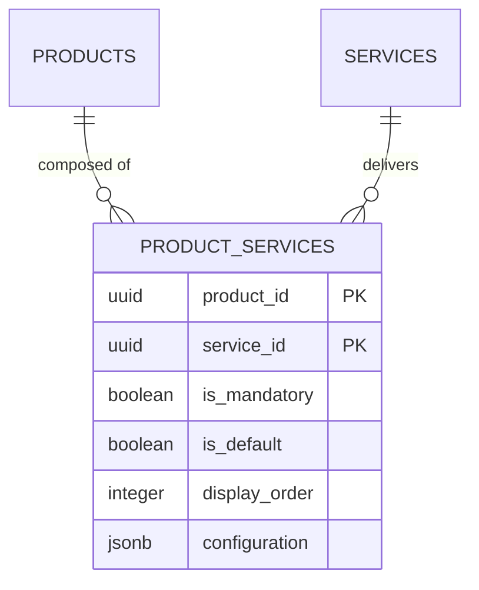

**`is_mandatory`** determines whether the CBU must have this service active before the product is considered "ready". Optional services can be added later.

**`is_default`** means the service is auto-included when the product is subscribed — the CBU doesn't need to explicitly request it.

---

## 6. Service Resource Definitions (SRDEF)

SRDEFs are the **typed, parameterized resource definitions** that describe what infrastructure is needed to deliver a service.

### Schema

```sql
CREATE TABLE "ob-poc".service_resource_types (
    resource_id             uuid PRIMARY KEY DEFAULT uuidv7(),
    name                    varchar(255) NOT NULL,
    description             text,
    resource_code           varchar(50),
    resource_type           varchar(100),

    -- SRDEF Identity (GENERATED COLUMN)
    srdef_id                text GENERATED ALWAYS AS (
        'SRDEF::' || COALESCE(owner, 'UNKNOWN') || '::' ||
        COALESCE(resource_type, 'Resource') || '::' ||
        COALESCE(resource_code, resource_id::text)
    ) STORED,

    -- Ownership
    owner                   varchar(255) NOT NULL,
    dictionary_group        varchar(100),

    -- Technical Details
    vendor                  varchar(255),
    version                 varchar(50),
    api_endpoint            text,
    api_version             varchar(20),
    authentication_method   varchar(50),
    authentication_config   jsonb,

    -- Capabilities
    capabilities            jsonb,
    capacity_limits         jsonb,
    maintenance_windows     jsonb,

    -- Provisioning
    provisioning_strategy   text DEFAULT 'create'
        CHECK (provisioning_strategy IN ('create', 'request', 'discover')),
    provisioning_verb       varchar(100),
    provisioning_args       jsonb,
    resource_purpose        text,

    -- Dependencies
    depends_on              jsonb,

    -- Parameterization
    per_market              boolean DEFAULT false,
    per_currency            boolean DEFAULT false,
    per_counterparty        boolean DEFAULT false,

    -- Location
    location_type           varchar(50),

    -- Status
    is_active               boolean DEFAULT true,
    created_at              timestamptz DEFAULT now(),
    updated_at              timestamptz DEFAULT now()
);
```

### SRDEF Identity Format

The `srdef_id` is a **generated column** that constructs a deterministic, human-readable identity:

```
SRDEF::<OWNER>::<ResourceType>::<Code>
```

| SRDEF ID | Owner | Type | Purpose |
|---|---|---|---|
| `SRDEF::CUSTODY::Account::custody_securities` | CUSTODY | Account | Securities safekeeping account |
| `SRDEF::CUSTODY::Account::cash_settlement` | CUSTODY | Account | Cash settlement account |
| `SRDEF::SWIFT::Connection::swift_messaging` | SWIFT | Connection | SWIFT messaging gateway |
| `SRDEF::IAM::Role::platform_access` | IAM | Role | Platform user access role |
| `SRDEF::CUSTODY::SSI::standing_ssi` | CUSTODY | SSI | Standing settlement instructions |

### Provisioning Strategies

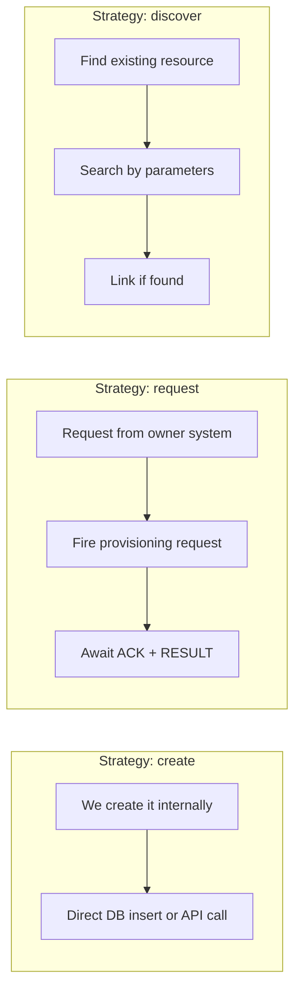

| Strategy | When Used | Example |
|---|---|---|
| `create` | We own the system, can create directly | Custody account, IAM role |
| `request` | External system owns it, we submit a ticket | SWIFT connection, external gateway |
| `discover` | Resource already exists, just link it | Pre-existing accounts after migration |

### Parameterization Flags

Parameterization creates **N instances** of a single SRDEF for a CBU:

| Flag | Effect | Example |
|---|---|---|
| `per_market = true` | One instance per exchange | Settlement account per XNAS, XNYS, XLON |
| `per_currency = true` | One instance per currency | Cash account per USD, EUR, GBP |
| `per_counterparty = true` | One instance per counterparty | ISDA per Goldman, Morgan Stanley |

A SRDEF with `per_market = true` AND `per_currency = true` creates M x N instances (one per market-currency pair).

---

## 7. Resource Dependencies

```sql
CREATE TABLE "ob-poc".resource_dependencies (
    dependency_id           uuid PRIMARY KEY DEFAULT uuidv7(),
    resource_type_id        uuid NOT NULL REFERENCES service_resource_types(resource_id),
    depends_on_type_id      uuid NOT NULL REFERENCES service_resource_types(resource_id),
    dependency_type         varchar(20) DEFAULT 'required'
        CHECK (dependency_type IN ('required', 'optional', 'conditional')),
    inject_arg              varchar(100) NOT NULL,
    condition_expression    text,
    priority                integer DEFAULT 100,
    is_active               boolean DEFAULT true,
    created_at              timestamptz DEFAULT now(),
    CHECK (resource_type_id <> depends_on_type_id)
);
```

### Dependency Graph

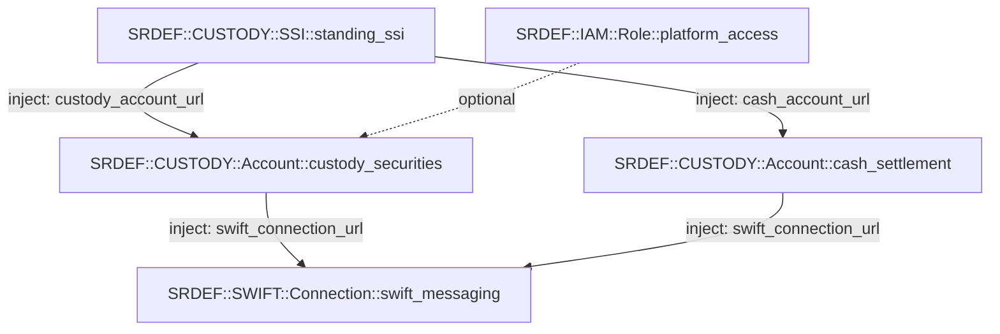

**`inject_arg`** specifies which provisioning argument receives the dependency's URL. When provisioning `custody_securities`, the system automatically resolves `cash_settlement`'s URL and injects it into the `cash_account_url` argument.

The **ProvisioningOrchestrator** uses topological sort on this graph to determine provisioning order — dependencies are always provisioned before their dependents.

---

## 8. Attribute Registry (Dictionary)

The Attribute Registry is a **closed-world dictionary** of every data field that can be required, sourced, validated, and reconciled across the platform.

### Schema

```sql
CREATE TABLE "ob-poc".attribute_registry (
    id                                  text PRIMARY KEY,
    uuid                                uuid NOT NULL,
    display_name                        text NOT NULL,
    category                            text NOT NULL,
    value_type                          text NOT NULL,

    -- Validation
    validation_rules                    jsonb DEFAULT '{}',
    constraints                         jsonb DEFAULT '{}',
    reconciliation_rules                jsonb DEFAULT '{}',
    acceptable_variation_threshold      numeric(3,2),
    requires_authoritative_source       boolean DEFAULT false,

    -- Applicability (CSG rules)
    applicability                       jsonb DEFAULT '{}',

    -- Metadata
    domain                              varchar(100),
    group_id                            varchar(100),
    is_required                         boolean DEFAULT false,
    default_value                       text,
    metadata                            jsonb DEFAULT '{}',

    -- Embeddings (semantic search)
    embedding                           vector(1536),
    embedding_model                     varchar(100),
    embedding_updated_at                timestamptz,

    -- Audit
    created_at                          timestamptz DEFAULT now(),
    updated_at                          timestamptz DEFAULT now(),

    CHECK (category IN (
        'identity', 'financial', 'compliance', 'document', 'risk',
        'contact', 'address', 'tax', 'employment', 'product',
        'entity', 'ubo', 'isda', 'resource', 'cbu', 'trust',
        'fund', 'partnership'
    )),
    CHECK (value_type IN (
        'string', 'integer', 'number', 'boolean', 'date',
        'datetime', 'email', 'phone', 'address', 'currency',
        'percentage', 'tax_id', 'json'
    ))
);
```

### Attribute ID Convention

All attribute IDs follow the pattern `attr.{category}.{name}`:

```
attr.identity.first_name
attr.identity.last_name
attr.identity.date_of_birth
attr.tax.tax_id
attr.compliance.aml_risk_tier
attr.resource.market_scope
attr.resource.settlement_currency
```

### 18 Categories

| Category | Example Attributes |
|---|---|
| `identity` | first_name, last_name, date_of_birth, nationality |
| `financial` | aum, revenue, fiscal_year_end |
| `compliance` | aml_risk_tier, pep_status, sanctions_status |
| `document` | passport_number, tax_form_type |
| `risk` | credit_rating, country_risk_score |
| `contact` | email, phone, fax |
| `address` | street, city, postal_code, country |
| `tax` | tax_id, tax_jurisdiction, fatca_status |
| `employment` | employer, job_title |
| `product` | product_code, product_family |
| `entity` | legal_name, incorporation_date, lei |
| `ubo` | ownership_pct, control_type |
| `isda` | governing_law, csa_type |
| `resource` | market_scope, settlement_currency |
| `cbu` | cbu_type, jurisdiction |
| `trust` | trust_type, settlor_id |
| `fund` | fund_type, domicile, nav_frequency |
| `partnership` | partnership_type, gp_entity_id |

### 13 Value Types

| Type | Validation | Example |
|---|---|---|
| `string` | Max length, regex | "Allianz SE" |
| `integer` | Min/max | 42 |
| `number` | Min/max, precision | 15.75 |
| `boolean` | true/false | true |
| `date` | ISO 8601 | "2024-01-15" |
| `datetime` | ISO 8601 | "2024-01-15T10:30:00Z" |
| `email` | RFC 5322 | "john@example.com" |
| `phone` | E.164 | "+44207123456" |
| `address` | Structured JSON | {"street": "...", "city": "..."} |
| `currency` | ISO 4217 | "USD" |
| `percentage` | 0-100 | 15.5 |
| `tax_id` | Country-specific | "GB123456789" |
| `json` | Valid JSON | {"custom": "data"} |

---

## 9. Resource Attribute Requirements

This table links SRDEFs to the attributes they need, with **source policies** and **evidence policies**.

### Schema

```sql
CREATE TABLE "ob-poc".resource_attribute_requirements (
    requirement_id          uuid PRIMARY KEY DEFAULT uuidv7(),
    resource_id             uuid NOT NULL REFERENCES service_resource_types(resource_id),
    attribute_id            uuid NOT NULL REFERENCES attribute_registry(uuid),
    resource_field_name     varchar(255),
    requirement_type        text DEFAULT 'required'
        CHECK (requirement_type IN ('required', 'optional', 'conditional')),
    condition_expression    text,

    -- Sourcing Policy (ordered priority)
    source_policy           jsonb DEFAULT '["derived", "entity", "cbu", "document", "manual"]',

    -- Validation
    constraints             jsonb DEFAULT '{}',
    validation_override     jsonb,
    default_value           text,

    -- Evidence
    evidence_policy         jsonb DEFAULT '{}',

    -- Transform
    transformation_rule     jsonb,

    -- Display
    is_mandatory            boolean DEFAULT true,
    display_order           integer DEFAULT 0
);
```

### Source Policy Priority

The `source_policy` array defines the **ordered priority** for sourcing an attribute value:

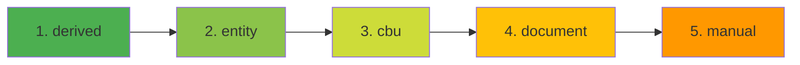

| Source | Description | Reliability |
|---|---|---|
| `derived` | Computed from other attributes | Highest — deterministic |
| `entity` | From entity master data | High — curated |
| `cbu` | From CBU configuration | High — operational |
| `document` | From uploaded/verified documents | Medium — requires QA |
| `manual` | User-entered values | Lowest — requires audit |

### Evidence Policy

The `evidence_policy` JSONB defines what evidence is required to trust an attribute value:

```json
{
    "requires_document": true,
    "min_confidence": 0.9,
    "acceptable_document_types": ["passport", "utility_bill"],
    "max_age_days": 90
}
```

This links directly to the **Document Integration** — when `requires_document: true`, the attribute cannot be satisfied without a verified document version.

---

## 10. Service Intents

Service Intents declare **what a CBU wants** — which products and services, with what configuration.

### Schema

```sql
CREATE TABLE "ob-poc".service_intents (
    intent_id       uuid PRIMARY KEY DEFAULT gen_random_uuid(),
    cbu_id          uuid NOT NULL REFERENCES cbus(cbu_id) ON DELETE CASCADE,
    product_id      uuid NOT NULL REFERENCES products(product_id),
    service_id      uuid NOT NULL REFERENCES services(service_id),
    options         jsonb NOT NULL DEFAULT '{}',
    status          text NOT NULL DEFAULT 'active'
        CHECK (status IN ('active', 'suspended', 'cancelled')),
    created_at      timestamptz NOT NULL DEFAULT NOW(),
    updated_at      timestamptz NOT NULL DEFAULT NOW(),
    created_by      text,
    UNIQUE(cbu_id, product_id, service_id)
);
```

### Options Structure (per service type)

**Custody / Settlement:**
```json
{
    "markets": ["XNAS", "XNYS", "XLON"],
    "currencies": ["USD", "GBP", "EUR"],
    "ssi_mode": "standing",
    "counterparties": ["uuid1", "uuid2"]
}
```

**Trading:**
```json
{
    "instrument_classes": ["equity", "fixed_income"],
    "execution_venues": ["XNAS", "XNYS"],
    "order_types": ["market", "limit"]
}
```

**Reporting:**
```json
{
    "report_types": ["position", "transaction", "valuation"],
    "frequency": "daily",
    "format": "pdf"
}
```

The `options` JSONB drives the **parameterization expansion** in the Discovery Engine — if `markets: ["XNAS", "XNYS"]` and the SRDEF has `per_market = true`, the engine discovers 2 SRDEF instances.

---

## 11. Service Pipeline — Six Stages

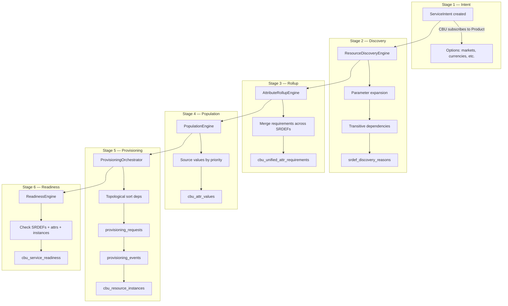

### Stage-by-Stage Detail

| Stage | Engine | Input | Output | Table |
|---|---|---|---|---|
| 1. Intent | — | CBU subscription | Service configuration | `service_intents` |
| 2. Discovery | `ResourceDiscoveryEngine` | Intents + SRDEF catalog | Required SRDEFs with parameters | `srdef_discovery_reasons` |
| 3. Rollup | `AttributeRollupEngine` | Discovered SRDEFs + attribute_registry | De-duplicated requirements | `cbu_unified_attr_requirements` |
| 4. Population | `PopulationEngine` | Requirements + source policy | Sourced values with evidence | `cbu_attr_values` |
| 5. Provisioning | `ProvisioningOrchestrator` | Populated attrs + dep graph | Resource instances | `provisioning_requests`, `cbu_resource_instances` |
| 6. Readiness | `ReadinessEngine` | Everything above | Good-to-transact status | `cbu_service_readiness` |

---

## 12. CBU Unified Attribute Requirements (Rollup)

### Schema

```sql
CREATE TABLE "ob-poc".cbu_unified_attr_requirements (
    cbu_id                  uuid NOT NULL REFERENCES cbus(cbu_id) ON DELETE CASCADE,
    attr_id                 uuid NOT NULL REFERENCES attribute_registry(uuid) ON DELETE CASCADE,
    requirement_strength    text NOT NULL DEFAULT 'required'
        CHECK (requirement_strength IN ('required', 'optional', 'conditional')),
    merged_constraints      jsonb NOT NULL DEFAULT '{}',
    preferred_source        text
        CHECK (preferred_source IN ('derived', 'entity', 'cbu', 'document', 'manual', 'external')),
    required_by_srdefs      jsonb NOT NULL DEFAULT '[]',
    conflict                jsonb,
    created_at              timestamptz NOT NULL DEFAULT NOW(),
    updated_at              timestamptz NOT NULL DEFAULT NOW(),
    PRIMARY KEY (cbu_id, attr_id)
);
```

### Rollup Rules

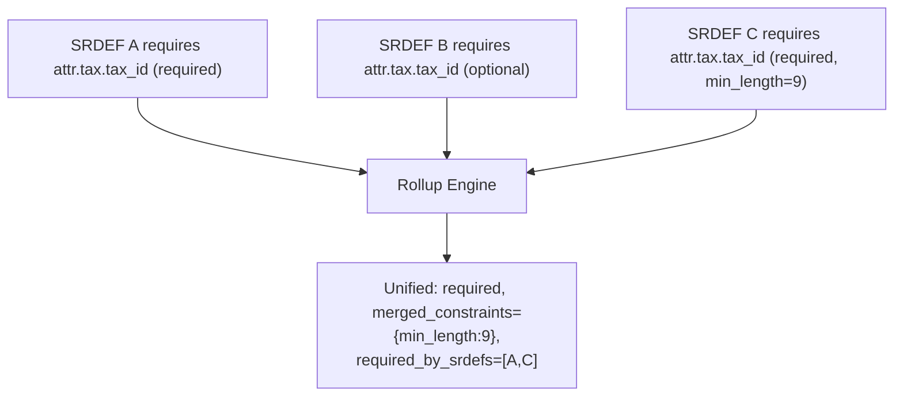

- **Strength:** `required` dominates `optional` — if ANY SRDEF requires it, it's required
- **Constraints:** Merged (most restrictive wins)
- **Conflicts:** If two SRDEFs demand incompatible constraints, `conflict` is populated with details
- **Explainability:** `required_by_srdefs` traces back to which SRDEFs drove the requirement

This table is **derived** and can be rebuilt at any time from the SRDEF catalog + discovery reasons.

---

## 13. CBU Attribute Values & Evidence

### Schema

```sql
CREATE TABLE "ob-poc".cbu_attr_values (
    cbu_id          uuid NOT NULL REFERENCES cbus(cbu_id) ON DELETE CASCADE,
    attr_id         uuid NOT NULL REFERENCES attribute_registry(uuid) ON DELETE CASCADE,
    value           jsonb NOT NULL,
    source          text NOT NULL
        CHECK (source IN ('derived', 'entity', 'cbu', 'document', 'manual', 'external')),
    evidence_refs   jsonb NOT NULL DEFAULT '[]',
    explain_refs    jsonb NOT NULL DEFAULT '[]',
    as_of           timestamptz NOT NULL DEFAULT NOW(),
    created_at      timestamptz NOT NULL DEFAULT NOW(),
    updated_at      timestamptz NOT NULL DEFAULT NOW(),
    PRIMARY KEY (cbu_id, attr_id)
);
```

### Evidence Refs (Document Integration)

The `evidence_refs` array links attribute values to their supporting evidence:

```json
[
    {"type": "document", "id": "uuid-of-verified-passport"},
    {"type": "entity_field", "path": "entities.tax_id"},
    {"type": "external_api", "source": "GLEIF", "timestamp": "2024-01-10T14:30:00Z"}
]
```

This is the **primary document integration point** — when `evidence_policy.requires_document = true` on the attribute requirement, the Population Engine checks for a matching `evidence_refs` entry of type `"document"` pointing to a verified document version.

### Explain Refs

The `explain_refs` array traces how the value was derived:

```json
[
    {"step": "entity_lookup", "table": "entities", "field": "tax_id"},
    {"step": "validation", "rule": "gb_tax_id_format", "result": "pass"}
]
```

---

## 14. Provisioning Ledger

The provisioning system uses an **append-only ledger** pattern with two tables: requests (mutable status) and events (strictly immutable).

### Provisioning Requests

```sql
CREATE TABLE "ob-poc".provisioning_requests (
    request_id              uuid PRIMARY KEY DEFAULT gen_random_uuid(),
    cbu_id                  uuid NOT NULL REFERENCES cbus(cbu_id),
    srdef_id                text NOT NULL,
    instance_id             uuid REFERENCES cbu_resource_instances(instance_id),
    requested_by            text NOT NULL DEFAULT 'system'
        CHECK (requested_by IN ('agent', 'user', 'system')),
    requested_at            timestamptz NOT NULL DEFAULT NOW(),
    request_payload         jsonb NOT NULL,
    status                  text NOT NULL DEFAULT 'queued'
        CHECK (status IN ('queued', 'sent', 'ack', 'completed', 'failed', 'cancelled')),
    status_changed_at       timestamptz,
    owner_system            text NOT NULL,
    owner_ticket_id         text,
    parameters              jsonb DEFAULT '{}'
);
```

### Provisioning Events (Strictly Append-Only)

```sql
CREATE TABLE "ob-poc".provisioning_events (
    event_id        uuid PRIMARY KEY DEFAULT gen_random_uuid(),
    request_id      uuid NOT NULL REFERENCES provisioning_requests(request_id),
    occurred_at     timestamptz NOT NULL DEFAULT NOW(),
    direction       text NOT NULL CHECK (direction IN ('OUT', 'IN')),
    kind            text NOT NULL
        CHECK (kind IN ('REQUEST_SENT', 'ACK', 'RESULT', 'ERROR', 'STATUS', 'RETRY')),
    payload         jsonb NOT NULL,
    content_hash    text,
    UNIQUE (content_hash) WHERE content_hash IS NOT NULL
);

-- STRICT append-only enforcement
CREATE TRIGGER trg_provisioning_events_immutable
    BEFORE UPDATE OR DELETE ON provisioning_events
    FOR EACH ROW EXECUTE FUNCTION prevent_modify_append_only();
```

### Request Lifecycle

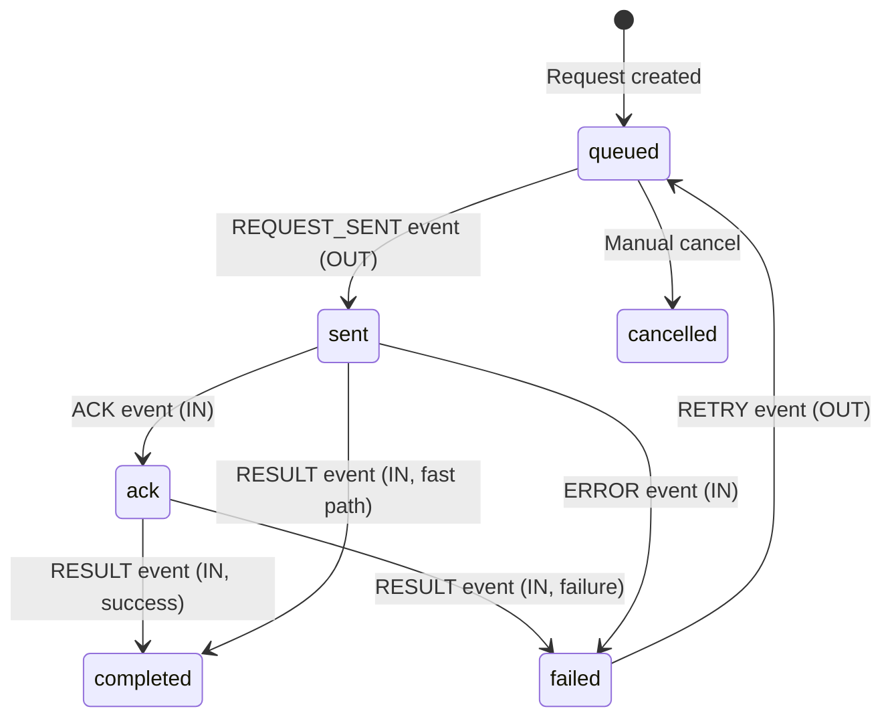

### Event Direction

| Direction | Meaning | Example |
|---|---|---|
| `OUT` | We sent something to the owner system | REQUEST_SENT, RETRY |
| `IN` | Owner system responded | ACK, RESULT, ERROR |

### Deduplication

The `content_hash` column with a partial unique index prevents duplicate events from being recorded. This enables safe at-least-once delivery.

---

## 15. CBU Resource Instances

### Schema

```sql
CREATE TABLE "ob-poc".cbu_resource_instances (
    instance_id             uuid PRIMARY KEY DEFAULT uuidv7(),
    cbu_id                  uuid NOT NULL REFERENCES cbus(cbu_id),
    product_id              uuid REFERENCES products(product_id),
    service_id              uuid REFERENCES services(service_id),
    resource_type_id        uuid REFERENCES service_resource_types(resource_id),
    instance_url            varchar(1024) NOT NULL,
    instance_identifier     varchar(255),
    instance_name           varchar(255),
    instance_config         jsonb DEFAULT '{}',
    status                  varchar(50) NOT NULL DEFAULT 'PENDING'
        CHECK (status IN ('PENDING', 'PROVISIONING', 'ACTIVE', 'SUSPENDED', 'DECOMMISSIONED')),
    requested_at            timestamptz DEFAULT now(),
    provisioned_at          timestamptz,
    activated_at            timestamptz,
    decommissioned_at       timestamptz,
    market_id               uuid,
    currency                varchar(3),
    counterparty_entity_id  uuid,
    provider_code           varchar(50),
    provider_config         jsonb,
    resource_url            text,
    owner_ticket_id         text,
    last_request_id         uuid REFERENCES provisioning_requests(request_id),
    last_event_at           timestamptz,
    srdef_id                text,
    created_at              timestamptz DEFAULT now(),
    updated_at              timestamptz DEFAULT now()
);
```

### Instance Status Lifecycle

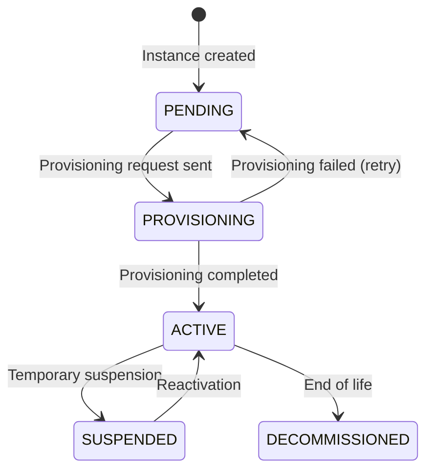

### Resource Instance Attributes

Each instance can hold typed attribute values:

```sql
CREATE TABLE "ob-poc".resource_instance_attributes (
    value_id        uuid PRIMARY KEY DEFAULT uuidv7(),
    instance_id     uuid NOT NULL REFERENCES cbu_resource_instances(instance_id),
    attribute_id    uuid NOT NULL REFERENCES attribute_registry(uuid),
    value_text      varchar,
    value_number    numeric,
    value_boolean   boolean,
    value_date      date,
    value_timestamp timestamptz,
    value_json      jsonb,
    state           varchar(50) DEFAULT 'proposed'
        CHECK (state IN ('proposed', 'confirmed', 'derived', 'system')),
    source          jsonb,
    observed_at     timestamptz DEFAULT now()
);
```

The typed columns (`value_text`, `value_number`, etc.) align with the `value_type` from `attribute_registry`, enabling type-safe queries.

---

## 16. Service Readiness Engine

### Schema

```sql
CREATE TABLE "ob-poc".cbu_service_readiness (
    cbu_id                  uuid NOT NULL REFERENCES cbus(cbu_id) ON DELETE CASCADE,
    product_id              uuid NOT NULL REFERENCES products(product_id),
    service_id              uuid NOT NULL REFERENCES services(service_id),
    status                  text NOT NULL DEFAULT 'blocked'
        CHECK (status IN ('ready', 'blocked', 'partial')),
    blocking_reasons        jsonb NOT NULL DEFAULT '[]',
    required_srdefs         jsonb NOT NULL DEFAULT '[]',
    active_srids            jsonb NOT NULL DEFAULT '[]',
    as_of                   timestamptz NOT NULL DEFAULT NOW(),
    last_recomputed_at      timestamptz NOT NULL DEFAULT NOW(),
    recomputation_trigger   text,
    is_stale                boolean DEFAULT FALSE,
    PRIMARY KEY (cbu_id, product_id, service_id)
);
```

### Readiness Status

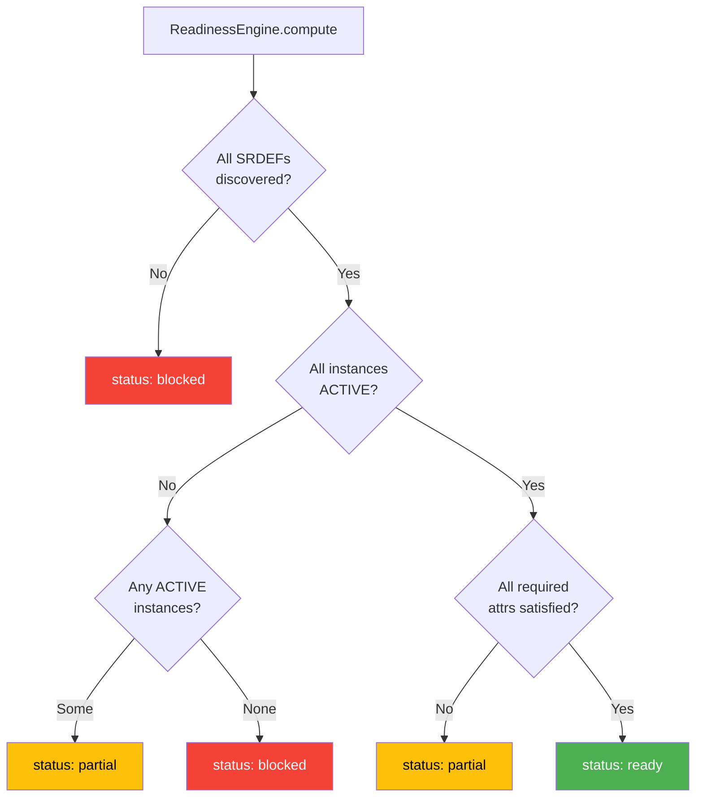

### Blocking Reason Taxonomy

| Type | Meaning | Example |
|---|---|---|
| `missing_srdef` | Required SRDEF not yet discovered | Custody account not configured |
| `pending_provisioning` | Provisioning request in flight | SWIFT connection awaiting ACK |
| `failed_provisioning` | Provisioning request failed | Duplicate SSI detected |
| `missing_attrs` | Required attributes not populated | Missing market_scope, settlement_currency |
| `attr_conflict` | Conflicting attribute requirements | Two SRDEFs disagree on value |
| `dependency_not_ready` | Upstream SRDEF dependency not ACTIVE | Cash account pending (blocks custody account) |

### Blocking Reasons JSON Structure

```json
[
    {
        "type": "missing_srdef",
        "srdef_id": "SRDEF::CUSTODY::Account::custody_securities",
        "details": {},
        "explain": "Custody securities account not yet discovered"
    },
    {
        "type": "pending_provisioning",
        "srdef_id": "SRDEF::SWIFT::Connection::swift_messaging",
        "details": {
            "request_id": "uuid-...",
            "status": "sent",
            "owner_system": "SWIFT",
            "requested_at": "2024-01-10T..."
        },
        "explain": "SWIFT connection request pending"
    },
    {
        "type": "missing_attrs",
        "srdef_id": "SRDEF::IAM::Role::platform_access",
        "details": {
            "missing_attr_ids": ["uuid1", "uuid2"],
            "missing_attr_names": ["market_scope", "settlement_currency"]
        },
        "explain": "Missing required attributes: market_scope, settlement_currency"
    }
]
```

---

## 17. Booking Principals

A **Booking Principal** is the contracting + booking authority envelope: a BNY legal entity + optional booking location. This is the **first-class policy anchor** for "who can contract what, for whom, where."

### Legal Entity

```sql
CREATE TABLE "ob-poc".legal_entity (
    legal_entity_id         uuid PRIMARY KEY DEFAULT uuidv7(),
    lei                     text UNIQUE,
    name                    text NOT NULL,
    incorporation_jurisdiction  text NOT NULL,
    status                  text NOT NULL DEFAULT 'active'
        CHECK (status IN ('active', 'inactive')),
    entity_id               uuid REFERENCES entities(entity_id),
    metadata                jsonb DEFAULT '{}',
    created_at              timestamptz DEFAULT now(),
    updated_at              timestamptz DEFAULT now()
);
```

### Booking Location

```sql
CREATE TABLE "ob-poc".booking_location (
    booking_location_id     uuid PRIMARY KEY DEFAULT uuidv7(),
    country_code            text NOT NULL,
    region_code             text,
    regulatory_regime_tags  text[] DEFAULT '{}',
    jurisdiction_code       varchar(10) REFERENCES master_jurisdictions(jurisdiction_code),
    metadata                jsonb DEFAULT '{}',
    created_at              timestamptz DEFAULT now(),
    updated_at              timestamptz DEFAULT now()
);
```

### Booking Principal

```sql
CREATE TABLE "ob-poc".booking_principal (
    booking_principal_id    uuid PRIMARY KEY DEFAULT uuidv7(),
    legal_entity_id         uuid NOT NULL REFERENCES legal_entity(legal_entity_id),
    booking_location_id     uuid REFERENCES booking_location(booking_location_id),
    principal_code          text NOT NULL UNIQUE,
    book_code               text,
    status                  text NOT NULL DEFAULT 'active'
        CHECK (status IN ('active', 'inactive')),
    effective_from          timestamptz NOT NULL DEFAULT now(),
    effective_to            timestamptz,
    metadata                jsonb DEFAULT '{}',
    created_at              timestamptz DEFAULT now(),
    updated_at              timestamptz DEFAULT now()
);
```

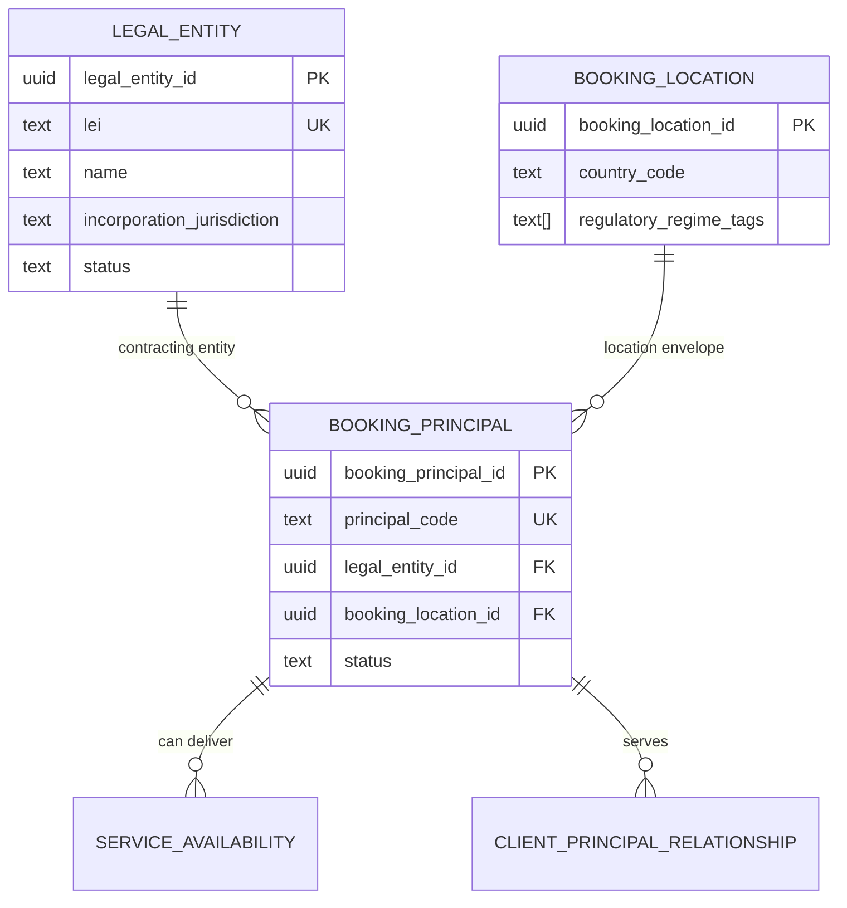

**Example principals:** `BNYM-LU` (BNY Mellon SA/NV, Luxembourg), `BNYM-GB` (BNY Mellon, London), `BNYM-IE` (BNY Mellon, Dublin).

---

## 18. Three-Lane Service Availability

### Schema

```sql
CREATE TABLE "ob-poc".service_availability (
    service_availability_id uuid PRIMARY KEY DEFAULT uuidv7(),
    booking_principal_id    uuid NOT NULL REFERENCES booking_principal(booking_principal_id),
    service_id              uuid NOT NULL REFERENCES services(service_id),

    -- Lane 1: Regulatory Perimeter
    regulatory_status       text NOT NULL DEFAULT 'permitted'
        CHECK (regulatory_status IN ('permitted', 'restricted', 'prohibited')),
    regulatory_constraints  jsonb DEFAULT '{}',

    -- Lane 2: Commercial Posture
    commercial_status       text NOT NULL DEFAULT 'offered'
        CHECK (commercial_status IN ('offered', 'conditional', 'not_offered')),
    commercial_constraints  jsonb DEFAULT '{}',

    -- Lane 3: Operational Capability
    operational_status      text NOT NULL DEFAULT 'supported'
        CHECK (operational_status IN ('supported', 'limited', 'not_supported')),
    delivery_model          text
        CHECK (delivery_model IN ('direct', 'sub_custodian', 'partner', 'internal_network')),
    operational_constraints jsonb DEFAULT '{}',

    -- Temporal
    effective_from          timestamptz NOT NULL DEFAULT now(),
    effective_to            timestamptz,

    metadata                jsonb DEFAULT '{}',
    created_at              timestamptz DEFAULT now(),
    updated_at              timestamptz DEFAULT now(),

    -- Temporal exclusion: no overlap per principal x service
    EXCLUDE USING gist (
        booking_principal_id WITH =,
        service_id WITH =,
        tstzrange(effective_from, effective_to) WITH &&
    )
);
```

### Three Independent Lanes

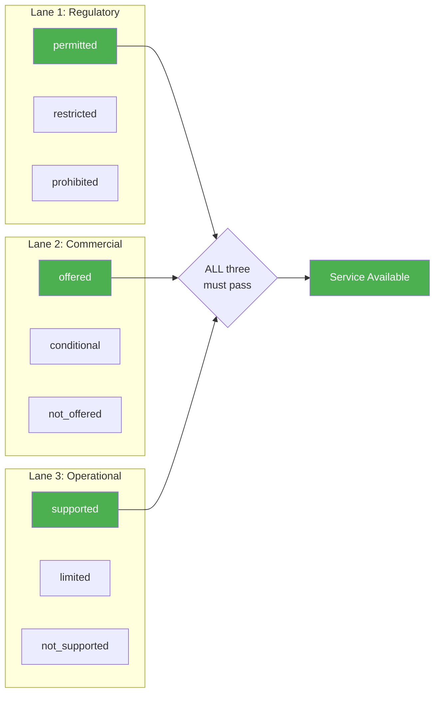

| Lane | Question | Values | Override |
|---|---|---|---|
| **Regulatory** | Can we legally do this? | permitted / restricted / prohibited | Never — hard deny |
| **Commercial** | Do we offer this? | offered / conditional / not_offered | Negotiable |
| **Operational** | Can we deliver this? | supported / limited / not_supported | Build-out possible |

**All three must pass** for a service to be available on a principal. Regulatory prohibition is a hard stop — no override.

### Delivery Models

| Model | Description |
|---|---|
| `direct` | BNY delivers directly |
| `sub_custodian` | Delivered via sub-custodian network |
| `partner` | Delivered via partner arrangement |
| `internal_network` | Delivered via BNY internal entity network |

### Temporal Exclusion

The GiST exclusion constraint prevents overlapping availability periods for the same principal x service combination. To update availability, close the current record (set `effective_to`) and insert a new one.

---

## 19. Rule Evaluation Engine

### Rule Structure

```sql
CREATE TABLE "ob-poc".ruleset (
    ruleset_id              uuid PRIMARY KEY DEFAULT uuidv7(),
    owner_type              text NOT NULL CHECK (owner_type IN ('principal', 'offering', 'global')),
    owner_id                uuid,
    name                    text NOT NULL,
    ruleset_boundary        text NOT NULL
        CHECK (ruleset_boundary IN ('regulatory', 'commercial', 'operational')),
    version                 int NOT NULL DEFAULT 1,
    effective_from          timestamptz NOT NULL DEFAULT now(),
    effective_to            timestamptz,
    status                  text NOT NULL DEFAULT 'draft'
        CHECK (status IN ('draft', 'active', 'retired')),
    metadata                jsonb DEFAULT '{}',
    created_at              timestamptz DEFAULT now(),
    updated_at              timestamptz DEFAULT now()
);

CREATE TABLE "ob-poc".rule (
    rule_id                 uuid PRIMARY KEY DEFAULT uuidv7(),
    ruleset_id              uuid NOT NULL REFERENCES ruleset(ruleset_id),
    name                    text NOT NULL,
    kind                    text NOT NULL
        CHECK (kind IN ('deny', 'require_gate', 'allow', 'constrain_principal', 'select_contract')),
    when_expr               jsonb NOT NULL,
    then_effect             jsonb NOT NULL,
    explain                 text,
    priority                int NOT NULL DEFAULT 100,
    metadata                jsonb DEFAULT '{}',
    created_at              timestamptz DEFAULT now(),
    updated_at              timestamptz DEFAULT now()
);
```

### Condition Tree (Rust)

```rust
// rust/src/domain_ops/rule_evaluator.rs
pub enum Condition {
    All(Vec<Condition>),          // AND
    Any(Vec<Condition>),          // OR
    Not(Box<Condition>),          // NOT
    Field {
        key: String,              // e.g., "client.domicile_country"
        op: Operator,
        value: serde_json::Value,
    },
}

pub enum Operator {
    Eq, Neq, In, NotIn, Contains, Exists, Gt, Gte, Lt, Lte
}
```

### Rule Kinds

| Kind | Effect | Example |
|---|---|---|
| `deny` | Block this principal | "Prohibited for US persons under MiFID" |
| `require_gate` | Human approval required | "High-risk client requires senior approval" |
| `allow` | Positive assertion | "Permitted for EU-domiciled UCITS" |
| `constrain_principal` | Add constraints | "Requires sub-custodian for Asian markets" |
| `select_contract` | Choose contract pack | "Use standard ISDA for OTC" |

### Closed-World Field Dictionary

The rule evaluator maintains a **closed-world field dictionary** to prevent typos in rule conditions:

```sql
CREATE TABLE "ob-poc".rule_field_dictionary (
    field_key               text PRIMARY KEY,
    field_type              text NOT NULL
        CHECK (field_type IN ('string', 'string_array', 'boolean', 'number', 'date')),
    description             text,
    source_table            text,
    added_in_version        int NOT NULL DEFAULT 1,
    created_at              timestamptz DEFAULT now()
);
```

**40+ seeded fields** across categories: `client.*`, `offering.*`, `principal.*`, `service.*`, `relationship.*`, `deal.*`.

### Boundary-Aware Merging

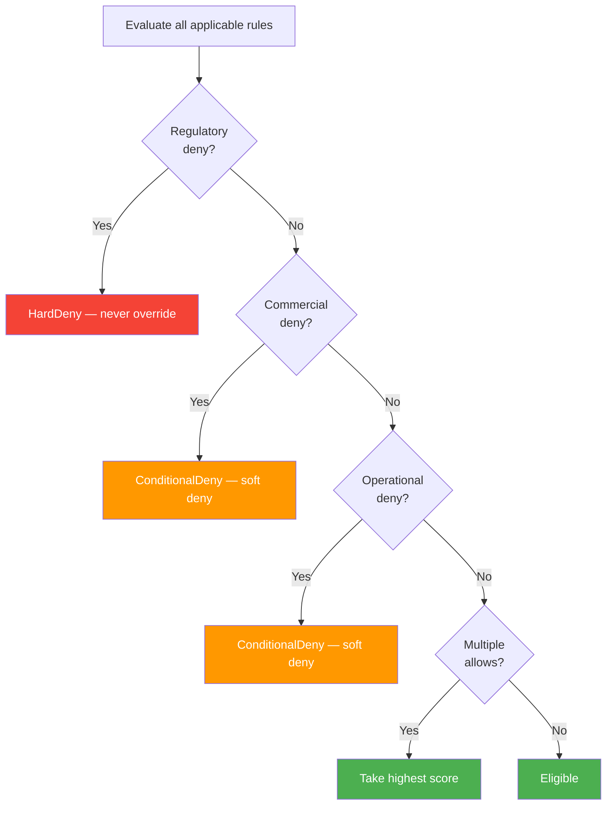

**Key invariant:** Regulatory boundary always wins. A regulatory deny can never be overridden by commercial or operational rules.

---

## 20. Booking Principal Evaluation Pipeline

The `BookingPrincipalEvaluateOp` implements a **9-step evaluation pipeline**:

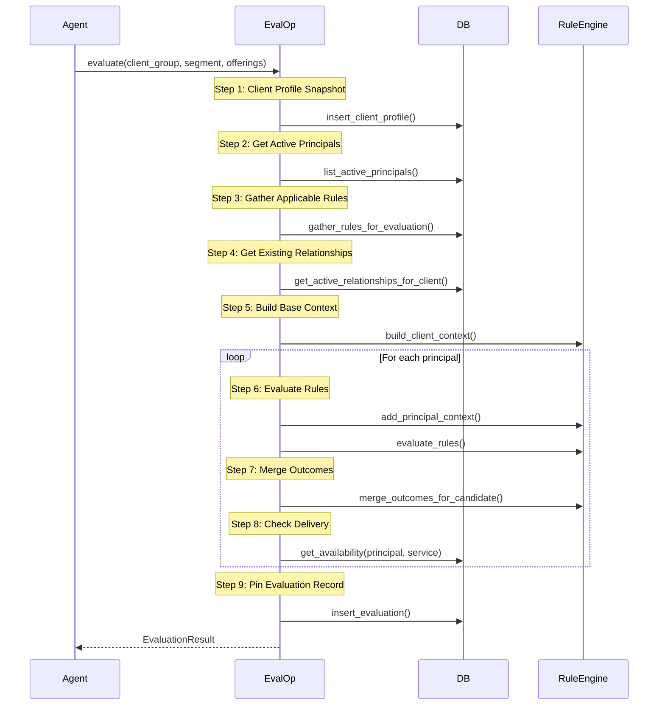

### Scoring

```rust
let base_score = match &merged.status {
    CandidateStatus::Eligible              => 1.0,
    CandidateStatus::EligibleWithGates{..} => 0.8,
    CandidateStatus::ConditionalDeny{..}   => 0.3,
    CandidateStatus::HardDeny{..}          => 0.0,
};
let relationship_boost = if has_existing_relationship { 0.1 } else { 0.0 };
let final_score = base_score + relationship_boost;
```

Existing relationships get a +0.1 boost — clients already serviced by a principal are preferred for additional offerings (cross-sell).

### EvaluationResult Type

```rust
pub struct EvaluationResult {
    pub evaluation_id: Uuid,
    pub candidates: Vec<EvaluatedCandidate>,
    pub gates: Vec<EvaluationGate>,
    pub contract_packs: Vec<EvaluationContractPack>,
    pub delivery_plan: Vec<DeliveryPlanEntry>,
    pub explain: Vec<ExplainEntry>,
    pub policy_snapshot: serde_json::Value,
}

pub struct EvaluatedCandidate {
    pub principal_id: Uuid,
    pub principal_code: String,
    pub legal_entity_name: String,
    pub score: f64,
    pub status: CandidateStatus,
    pub existing_relationship: bool,
    pub existing_offerings: Vec<String>,
    pub reasons: Vec<String>,
}
```

---

## 21. Document Integration

Documents integrate with the Products/Services/Resources pipeline at three points:

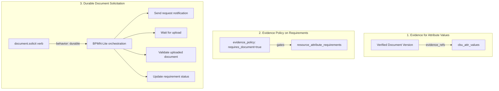

### Document Verb: Durable Behavior

The `document.solicit` and `document.solicit-set` verbs use `behavior: durable` — they are orchestrated through BPMN-Lite:

```yaml
# rust/config/verbs/document.yaml
solicit:
    description: Solicit a single document from an entity
    behavior: durable
    durable:
        runtime: bpmn-lite
        process_key: kyc-document-request
        correlation_field: workflow-instance-id
        task_bindings:
            send_request_notification: notification.send-document-request
            validate_uploaded_document: document.verify
            update_requirement_status: requirement.create
        timeout: P14D
```

This means document solicitation **parks the REPL runbook** and resumes on external signals (document uploaded, timer expired).

### Three-Layer Document Model

| Layer | Table | Purpose |
|---|---|---|
| A: Requirement | `document_requirements` | What we NEED (exists before upload) |
| B: Document | `documents` | Logical identity (stable reference) |
| C: Version | `document_versions` | Each submission (immutable, verification status) |

### Document Rejection Codes

| Category | Codes |
|---|---|
| Quality | UNREADABLE, CUTOFF, GLARE, LOW_RESOLUTION |
| Mismatch | WRONG_DOC_TYPE, WRONG_PERSON, SAMPLE_DOC |
| Validity | EXPIRED, NOT_YET_VALID, UNDATED |
| Data | DOB_MISMATCH, NAME_MISMATCH, ADDRESS_MISMATCH |
| Format | UNSUPPORTED_FORMAT, PASSWORD_PROTECTED, CORRUPTED |
| Authenticity | SUSPECTED_ALTERATION, INCONSISTENT_FONTS |

### Document Workflow Configuration

The BPMN routing is configured in `rust/config/workflows.yaml`:

```yaml
workflows:
    - verb_fqn: document.solicit
      route: orchestrated
      process_key: kyc-document-request
      correlation_field: workflow-instance-id
      task_bindings:
          - task_type: send_request_notification
            verb_fqn: notification.send-document-request
            timeout_ms: 30000
            max_retries: 3
          - task_type: validate_uploaded_document
            verb_fqn: document.verify
            timeout_ms: 60000
            max_retries: 3
          - task_type: update_requirement_status
            verb_fqn: requirement.create
            timeout_ms: 30000
            max_retries: 3
```

---

## 22. Outstanding Request Lifecycle

The outstanding request system is a **fire-and-forget request tracker** with auto-fulfillment on document upload.

### Request Types (from `ob_ref.request_types`)

Each request type has configurable defaults:

| Config | Purpose | Default |
|---|---|---|
| `default_due_days` | Days until due | 7 |
| `default_grace_days` | Grace period after due | 3 |
| `blocks_by_default` | Blocks workstream progress | true |
| `max_reminders` | Maximum reminders before escalation | 3 |

### Request Status Machine

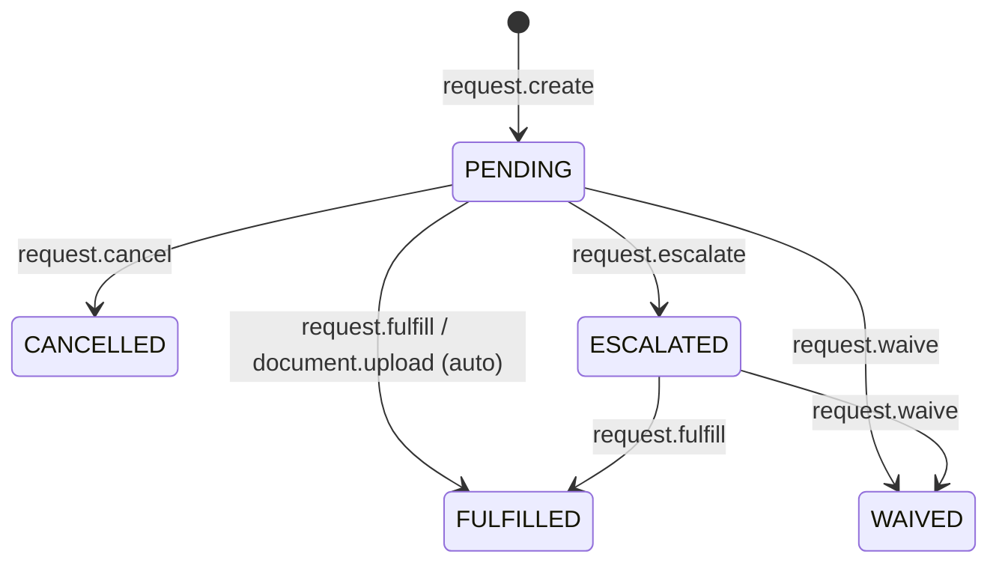

### Auto-Fulfillment

When a document is uploaded via `document.upload`, the system automatically searches for matching pending requests:

```rust
// In DocumentUploadOp::execute()
let fulfilled_request = sqlx::query!(
    r#"UPDATE kyc.outstanding_requests
       SET status = 'FULFILLED', fulfilled_at = NOW(),
           fulfillment_type = 'DOCUMENT_UPLOAD',
           fulfillment_reference_id = $3
       WHERE request_id = (
           SELECT request_id FROM kyc.outstanding_requests
           WHERE request_type = 'DOCUMENT'
             AND request_subtype = $2
             AND status = 'PENDING'
             AND (workstream_id = $1 OR entity_id = $4 OR case_id = $5)
           ORDER BY requested_at ASC LIMIT 1
           FOR UPDATE SKIP LOCKED
       ) RETURNING ..."#,
    ...
).fetch_optional(pool).await?;
```

**Key guarantees:**
- `FOR UPDATE SKIP LOCKED` prevents concurrent fulfillment of the same request
- Oldest matching request is fulfilled first (`ORDER BY requested_at ASC`)
- Auto-unblocks the workstream if this was the last blocking request

### Workstream Blocking/Unblocking

```rust
async fn try_unblock_workstream(workstream_id: Uuid, pool: &PgPool) -> Result<bool> {
    let remaining_blockers = sqlx::query_scalar!(
        r#"SELECT COUNT(*) FROM kyc.outstanding_requests
           WHERE workstream_id = $1 AND status = 'PENDING' AND blocks_subject = TRUE"#,
        workstream_id
    ).fetch_one(pool).await?;

    if remaining_blockers == 0 {
        // Unblock: BLOCKED → COLLECT
        sqlx::query!(
            r#"UPDATE kyc.entity_workstreams
               SET status = 'COLLECT', blocker_type = NULL, blocker_request_id = NULL
               WHERE workstream_id = $1 AND status = 'BLOCKED'"#,
            workstream_id
        ).execute(pool).await?;
    }
}
```

### BPMN Signal Integration

Request operations send best-effort BPMN signals for workflow correlation:

| Request Event | Signal Name | Payload |
|---|---|---|
| Cancel | `request_cancelled` | request_id, reason |
| Extend | `request_extended` | request_id, new_due_date, reason |
| Remind | `request_reminded` | request_id, channel, reminder_count |
| Escalate | `request_escalated` | request_id, escalate_to, reason |

---

## 23. Verb Inventory

### Product & Service Verbs

| Verb | Behavior | Description |
|---|---|---|
| `product.read` | crud | Get product by ID |
| `product.list` | crud | List all products |
| `service.read` | crud | Get service by ID |
| `service.list` | crud | List all services |
| `service.list-by-product` | crud | Services for a product |

### Service Intent Verbs

| Verb | Behavior | Description |
|---|---|---|
| `service-intent.create` | plugin | Create service intent with options |
| `service-intent.list` | plugin | List active intents for CBU |
| `service-intent.supersede` | plugin | Replace intent with new options |

### Pipeline Verbs

| Verb | Behavior | Description |
|---|---|---|
| `discovery.run` | plugin | Run ResourceDiscoveryEngine for CBU |
| `discovery.explain` | plugin | Explain why SRDEFs were discovered |
| `attributes.rollup` | plugin | Run AttributeRollupEngine |
| `attributes.populate` | plugin | Run PopulationEngine |
| `attributes.gaps` | plugin | Find unpopulated required attributes |
| `attributes.set` | plugin | Manually set attribute value |
| `provisioning.run` | plugin | Run ProvisioningOrchestrator |
| `provisioning.status` | plugin | Check provisioning request status |
| `readiness.compute` | plugin | Run ReadinessEngine |
| `readiness.explain` | plugin | Explain blocking reasons |
| `pipeline.full` | plugin | Run all 6 stages end-to-end |

### Service Resource Verbs

| Verb | Behavior | Description |
|---|---|---|
| `service-resource.provision` | plugin | Provision a single SRDEF instance |
| `service-resource.set-attr` | plugin | Set attribute on resource instance |
| `service-resource.activate` | plugin | Activate provisioned instance |
| `service-resource.suspend` | plugin | Suspend active instance |
| `service-resource.decommission` | plugin | Decommission instance |
| `service-resource.validate-attrs` | plugin | Validate all required attributes |

### Booking Principal Verbs

| Verb | Behavior | Description |
|---|---|---|
| `legal-entity.create` | plugin | Create BNY legal entity |
| `legal-entity.update` | plugin | Update legal entity |
| `legal-entity.list` | plugin | List active legal entities |
| `booking-location.create` | plugin | Create booking location |
| `booking-location.update` | plugin | Update booking location |
| `booking-location.list` | plugin | List booking locations |
| `booking-principal.create` | plugin | Create principal (LE + location) |
| `booking-principal.update` | plugin | Update principal |
| `booking-principal.retire` | plugin | Retire principal (with impact check) |
| `booking-principal.evaluate` | plugin | Full 9-step evaluation pipeline |
| `booking-principal.select` | plugin | Select principal from evaluation |
| `booking-principal.explain` | plugin | Explain evaluation result |

### Service Availability Verbs

| Verb | Behavior | Description |
|---|---|---|
| `service-availability.set` | plugin | Set three-lane status |
| `service-availability.list` | plugin | List all availability records |
| `service-availability.list-by-principal` | plugin | Availability for one principal |

### Rule Verbs

| Verb | Behavior | Description |
|---|---|---|
| `ruleset.create` | plugin | Create ruleset (draft) |
| `ruleset.publish` | plugin | Activate ruleset |
| `ruleset.retire` | plugin | Deactivate ruleset |
| `rule.add` | plugin | Add rule to ruleset |
| `rule.update` | plugin | Update rule condition/effect |
| `rule.disable` | plugin | Soft-delete a rule |
| `rule-field.register` | plugin | Register field in dictionary |
| `rule-field.list` | plugin | List all registered fields |

### Relationship Verbs

| Verb | Behavior | Description |
|---|---|---|
| `client-principal-relationship.record` | plugin | Create relationship |
| `client-principal-relationship.terminate` | plugin | Terminate relationship |
| `client-principal-relationship.list` | plugin | List relationships |
| `client-principal-relationship.cross-sell-check` | plugin | Find cross-sell opportunities |

### Document Verbs (Durable)

| Verb | Behavior | Description |
|---|---|---|
| `document.solicit` | durable | Solicit single document (BPMN-orchestrated) |
| `document.solicit-set` | durable | Solicit multiple documents (BPMN-orchestrated) |
| `document.create` | crud | Create document record |
| `document.upload-version` | plugin | Upload new version (triggers auto-fulfill) |
| `document.verify` | plugin | QA approve version |
| `document.reject` | plugin | QA reject with reason code |
| `document.start-qa` | crud | Move to QA queue |
| `document.get` | crud | Get document with status |
| `document.for-entity` | crud | List documents for entity |
| `document.missing-for-entity` | plugin | List missing document requirements |

### Outstanding Request Verbs

| Verb | Behavior | Description |
|---|---|---|
| `request.create` | plugin | Create outstanding request |
| `request.fulfill` | plugin | Fulfill request |
| `request.cancel` | plugin | Cancel request |
| `request.extend` | plugin | Extend due date |
| `request.remind` | plugin | Send reminder (rate-limited) |
| `request.escalate` | plugin | Escalate overdue request |
| `request.waive` | plugin | Waive requirement |
| `request.overdue` | plugin | List overdue requests |
| `document.request` | plugin | Create DOCUMENT-type request |
| `document.upload` | plugin | Upload + auto-fulfill |
| `document.waive-request` | plugin | Waive document request |

---

## 24. Rust Implementation

### Database Services

| Service | File | Methods |
|---|---|---|
| `ProductService` | `rust/src/database/product_service.rs` | 6 methods (CRUD + search) |
| `ServiceService` | `rust/src/database/service_service.rs` | 7 methods (CRUD + link) |
| `BookingPrincipalRepository` | `rust/src/database/booking_principal_repository.rs` | 20+ methods |

### Pipeline Engines

| Engine | Purpose | Key Method |
|---|---|---|
| `ResourceDiscoveryEngine` | Derive required SRDEFs from intents | `discover_for_cbu()` |
| `AttributeRollupEngine` | Merge attribute requirements | `rollup_for_cbu()` |
| `PopulationEngine` | Source attribute values | `populate_for_cbu()` |
| `ProvisioningOrchestrator` | Topological provisioning | `provision_for_cbu()` |
| `ReadinessEngine` | Compute good-to-transact status | `compute_readiness()` |

### Domain Ops (CustomOperations)

| File | Operations | Count |
|---|---|---|
| `booking_principal_ops.rs` | Legal entity, location, principal, evaluation, relationship, availability, ruleset, rule | ~25 ops |
| `request_ops.rs` | Outstanding requests, document requests, auto-fulfillment | ~11 ops |
| `rule_evaluator.rs` | Pure Rust rule evaluation engine | Functions |

### Rule Evaluator (Pure Rust, No DB)

```rust
// rust/src/domain_ops/rule_evaluator.rs

pub fn build_client_context(
    segment: &str, domicile: &str, entity_types: &[String],
    aml_risk: Option<&str>, classifications: &[String],
) -> EvalContext;

pub fn add_principal_context(
    ctx: &mut EvalContext, code: &str, country: &str,
    region: Option<&str>, regime_tags: &[String],
);

pub fn evaluate_rules(
    ruleset: &RulesetRow, rules: &[RuleRow], ctx: &EvalContext,
) -> Vec<RuleOutcome>;

pub fn merge_outcomes_for_candidate(
    principal_id: Uuid, outcomes: &[RuleOutcome],
) -> MergedOutcome;
```

---

## 25. Database Views

### v_service_intents_active

Joins service_intents with CBU, product, and service names for active intents only.

### v_service_readiness_dashboard

Joins cbu_service_readiness with CBU, product, and service names. Includes blocking_count, required_srdef_count, active_instance_count.

### v_cbu_readiness_summary

Aggregates readiness per CBU: total_services, ready_count, partial_count, blocked_count, pct_ready. Ordered by pct_ready ascending (worst first).

### v_cbu_service_gaps

Identifies missing resources per CBU: joins product_services → services → service_resource_capabilities → service_resource_types, then LEFT ANTI JOIN against cbu_resource_instances to find gaps.

---

## 26. Cross-Domain Integration Points

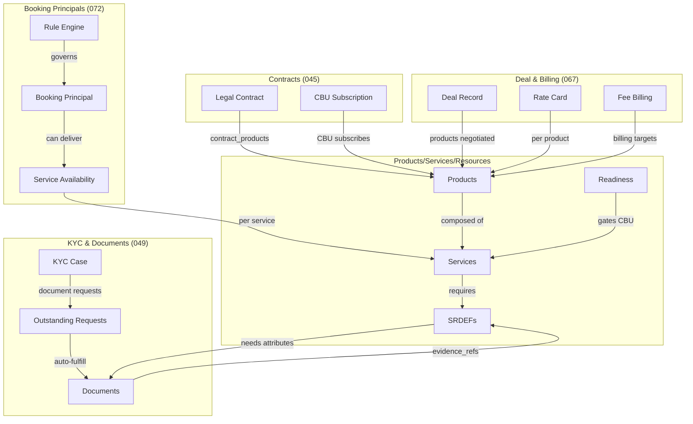

### Integration Summary

| From | To | Mechanism |
|---|---|---|
| Deal → Products | `deal_contracts.product_code` | Rate cards reference products |
| Contract → Products | `contract_products.product_code` | Contract covers specific products |
| CBU → Products | `cbu_product_subscriptions` | CBU subscribes to products |
| Products → Services | `product_services` junction | Product composed of services |
| Services → SRDEFs | `service_resource_capabilities` | Service needs resources |
| SRDEFs → Attributes | `resource_attribute_requirements` | Resources need data |
| Attributes → Documents | `evidence_refs` in `cbu_attr_values` | Documents provide evidence |
| Booking Principals → Services | `service_availability` | Who can deliver what |
| Rules → Booking Principals | `ruleset` + `rule` | Policy engine |
| KYC → Documents | Outstanding requests | Workflow triggers solicitation |
| Documents → Requests | Auto-fulfillment | Upload closes matching request |
| BPMN → Documents | `behavior: durable` | Long-running document collection |

---

## 27. Index & Constraint Summary

### Primary Keys

| Table | PK |
|---|---|
| `products` | `product_id` |
| `services` | `service_id` |
| `product_services` | `(product_id, service_id)` |
| `service_resource_types` | `resource_id` |
| `resource_dependencies` | `dependency_id` |
| `attribute_registry` | `id` (text: `attr.{category}.{name}`) |
| `resource_attribute_requirements` | `requirement_id` |
| `service_intents` | `intent_id` |
| `cbu_unified_attr_requirements` | `(cbu_id, attr_id)` |
| `cbu_attr_values` | `(cbu_id, attr_id)` |
| `provisioning_requests` | `request_id` |
| `provisioning_events` | `event_id` |
| `cbu_resource_instances` | `instance_id` |
| `resource_instance_attributes` | `value_id` |
| `cbu_service_readiness` | `(cbu_id, product_id, service_id)` |
| `legal_entity` | `legal_entity_id` |
| `booking_location` | `booking_location_id` |
| `booking_principal` | `booking_principal_id` |
| `service_availability` | `service_availability_id` |
| `ruleset` | `ruleset_id` |
| `rule` | `rule_id` |
| `rule_field_dictionary` | `field_key` |

### Unique Constraints

| Table | Unique On |
|---|---|
| `legal_entity` | `lei` |
| `booking_principal` | `principal_code` |
| `service_intents` | `(cbu_id, product_id, service_id)` |
| `srdef_discovery_reasons` | `(cbu_id, srdef_id, parameters) WHERE superseded_at IS NULL` |
| `provisioning_events` | `content_hash WHERE content_hash IS NOT NULL` |

### GiST Exclusion

| Table | Exclusion |
|---|---|
| `service_availability` | No overlap per `(booking_principal_id, service_id, tstzrange)` |

### Check Constraints

| Table | Column | Valid Values |
|---|---|---|
| `service_resource_types` | `provisioning_strategy` | create, request, discover |
| `service_intents` | `status` | active, suspended, cancelled |
| `provisioning_requests` | `status` | queued, sent, ack, completed, failed, cancelled |
| `provisioning_events` | `direction` | OUT, IN |
| `cbu_resource_instances` | `status` | PENDING, PROVISIONING, ACTIVE, SUSPENDED, DECOMMISSIONED |
| `cbu_service_readiness` | `status` | ready, blocked, partial |
| `service_availability` | `regulatory_status` | permitted, restricted, prohibited |
| `service_availability` | `commercial_status` | offered, conditional, not_offered |
| `service_availability` | `operational_status` | supported, limited, not_supported |
| `ruleset` | `owner_type` | principal, offering, global |
| `ruleset` | `ruleset_boundary` | regulatory, commercial, operational |
| `rule` | `kind` | deny, require_gate, allow, constrain_principal, select_contract |

### Immutability Triggers

| Table | Trigger | Effect |
|---|---|---|
| `provisioning_events` | `trg_provisioning_events_immutable` | Prevents UPDATE and DELETE |

---

## 28. Key Files Reference

### Database / Schema

| File | Purpose |
|---|---|
| `migrations/070_service_resource_pipeline.sql` | Products, services, SRDEFs, intents, readiness |
| `migrations/071_attribute_registry.sql` | Attribute dictionary, requirements, values |
| `migrations/072_booking_principals.sql` | Legal entities, locations, principals, availability, rules |
| `migrations/072b_booking_principals_seed.sql` | Seed data for booking principals |

### Rust — Database Services

| File | Purpose |
|---|---|
| `rust/src/database/product_service.rs` | `ProductService` — CRUD for products |
| `rust/src/database/service_service.rs` | `ServiceService` — CRUD for services |
| `rust/src/database/booking_principal_repository.rs` | `BookingPrincipalRepository` — 20+ methods |

### Rust — Domain Operations

| File | Purpose |
|---|---|
| `rust/src/domain_ops/booking_principal_ops.rs` | 25+ CustomOperations for principals, rules, availability |
| `rust/src/domain_ops/request_ops.rs` | 11 CustomOperations for requests and document lifecycle |
| `rust/src/domain_ops/rule_evaluator.rs` | Pure Rust rule evaluation engine |

### Rust — API Types

| File | Purpose |
|---|---|
| `rust/src/api/booking_principal_types.rs` | EvaluationResult, EvaluatedCandidate, CandidateStatus |

### Verb YAML

| File | Purpose |
|---|---|
| `rust/config/verbs/service-availability.yaml` | Three-lane availability verbs |
| `rust/config/verbs/booking-principal.yaml` | Principal lifecycle + evaluation |
| `rust/config/verbs/booking-location.yaml` | Location management |
| `rust/config/verbs/legal-entity.yaml` | Legal entity management |
| `rust/config/verbs/rule.yaml` | Rule management |
| `rust/config/verbs/ruleset.yaml` | Ruleset lifecycle |
| `rust/config/verbs/contract-pack.yaml` | Contract pack management |
| `rust/config/verbs/client-principal-relationship.yaml` | Relationship management |
| `rust/config/verbs/document.yaml` | Document solicitation, verification, QA |

### Configuration

| File | Purpose |
|---|---|
| `rust/config/workflows.yaml` | BPMN routing for durable verbs |

---

*End of Products, Services & Resources peer review paper.*
