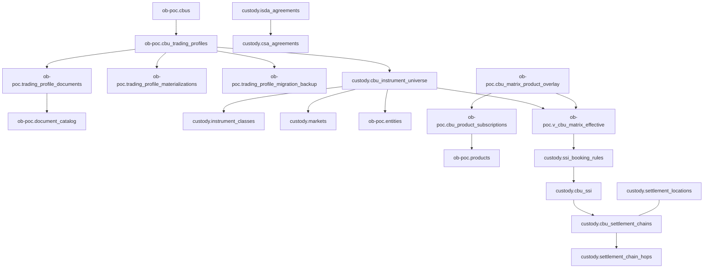

# Trading Matrix Database Architecture

**Document Version:** 1.1  
**Last Updated:** 2026-02-05  
**Audience:** Engineering Team  

---

## Executive Summary

The Trading Matrix defines **WHAT a CBU can trade** - the permissioned universe of instruments, markets, currencies, and counterparties. It's the foundation for:
- Trade validation (can this CBU trade EQUITY on XLON in GBP?)
- Settlement routing (which SSI to use for DVP in EUR?)
- OTC counterparty management (which ISDAs/CSAs are in place?)
- Product configuration (what services are enabled per instrument/market?)

**Key Concept:** The trading matrix is a **3-dimensional permission cube**:
```
Instrument Class × Market × Currency = Trading Permission
```

For OTC derivatives, there's a 4th dimension: **Counterparty**.

---

## Architecture Overview

### Schema Organization

| Schema | Purpose | Key Tables |
|--------|---------|------------|
| `custody` | Reference data, trading universe materialization, settlement infrastructure | `instrument_classes`, `markets`, `security_types`, `cbu_instrument_universe`, `cbu_ssi`, `ssi_booking_rules` |
| `ob-poc` | CBU-specific configuration & overlays (plus profile telemetry) | `cbu_trading_profiles`, `cbu_matrix_product_overlay`, `trading_profile_materializations` |

| Schema | Purpose | Key Tables |
|--------|---------|------------|
| `custody` | Reference data & settlement | `instrument_classes`, `markets`, `cbu_ssi`, `ssi_booking_rules` |
| `ob-poc` | CBU-specific configuration | `cbu_trading_profiles`, `cbu_instrument_universe`, `cbu_matrix_product_overlay` |

### Core Tables

```
┌─────────────────────────────────────────────────────────────────────────────┐
│                        TRADING MATRIX DATA MODEL                             │
│                                                                              │
│  Reference Data (custody)          CBU-Specific (ob-poc / custody)          │
│  ──────────────────────            ───────────────────────────────          │
│  instrument_classes ◄───────────── cbu_instrument_universe                  │
│  markets ◄──────────────────────── cbu_instrument_universe                  │
│  settlement_locations              cbu_trading_profiles                     │
│                                    cbu_matrix_product_overlay               │
│                                                                              │
│  Settlement (custody)              OTC (custody)                            │
│  ────────────────────              ────────────                             │
│  cbu_ssi                           isda_agreements                          │
│  ssi_booking_rules                 csa_agreements                           │
│  cbu_settlement_chains             isda_product_coverage                    │
│  settlement_chain_hops                                                       │
└─────────────────────────────────────────────────────────────────────────────┘
```

---

## 1. Reference Data Tables

### 1.1 Instrument Classes (`custody.instrument_classes`)

The master list of tradeable instrument types. Hierarchical with parent/child relationships.

```
┌─────────────────────────────────────────────────────────────────────────────┐
│                       custody.instrument_classes                             │
├─────────────────────────────────────────────────────────────────────────────┤
│ class_id (PK)              UUID        Unique identifier                    │
│ code                       VARCHAR     EQUITY, FIXED_INCOME, OTC_IRS, etc.  │
│ name                       VARCHAR     Human-readable name                   │
│ default_settlement_cycle   VARCHAR     T+0, T+1, T+2, VARIES                │
│ swift_message_family       VARCHAR     MT5xx family for settlement          │
│ requires_isda              BOOLEAN     True for OTC derivatives             │
│ requires_collateral        BOOLEAN     Needs CSA for margin                 │
│ cfi_category               CHAR(1)     CFI classification (E, D, C, etc.)   │
│ cfi_group                  CHAR(1)     CFI group code                       │
│ smpg_group                 VARCHAR     SMPG classification                  │
│ isda_asset_class           VARCHAR     ISDA taxonomy mapping                │
│ parent_class_id            UUID → instrument_classes (hierarchy)            │
│ is_active                  BOOLEAN     Active flag                          │
│ created_at / updated_at    TIMESTAMPTZ Audit timestamps                     │
└─────────────────────────────────────────────────────────────────────────────┘
```

### 1.2 Instrument Class Taxonomy (67 active classes)

| Category | Codes | Settlement | ISDA Required |
|----------|-------|------------|---------------|
| **Equity** | `EQUITY`, `EQUITY_COMMON`, `EQUITY_PREFERRED`, `EQUITY_ETF`, `EQUITY_ADR`, `EQUITY_GDR` | T+1 to T+2 | No |
| **Fixed Income** | `FIXED_INCOME`, `GOVT_BOND`, `CORP_BOND`, `MUNI_BOND`, `COVERED_BOND`, `ABS`, `MBS` | T+1 to T+2 | No |
| **Money Market** | `MONEY_MARKET`, `MMF`, `CD`, `COMMERCIAL_PAPER`, `T_BILL`, `REPO` | T+0 | No |
| **Listed Derivatives** | `EQUITY_FUTURE`, `BOND_FUTURE`, `INDEX_FUTURE`, `EQUITY_OPTION`, `INDEX_OPTION` | T+1 | No |
| **OTC Interest Rates** | `OTC_IRS`, `IRS`, `FRA`, `CAP_FLOOR`, `SWAPTION` | T+0 to T+2 | **Yes** |
| **OTC FX** | `OTC_FX`, `FX_FORWARD`, `FX_SWAP`, `FX_OPTION`, `FX_NDF` | T+2 | **Yes** |
| **OTC Credit** | `OTC_CDS`, `CDS`, `TRS` | T+0 to T+2 | **Yes** |
| **OTC Equity** | `OTC_EQD`, `EQUITY_SWAP`, `VARIANCE_SWAP` | T+2 | **Yes** |
| **Funds** | `CIS`, `MUTUAL_FUND`, `HEDGE_FUND`, `PRIVATE_EQUITY`, `REAL_ESTATE_FUND` | T+2 to T+30 | No |

### 1.3 Markets (`custody.markets`)

The master list of trading venues with settlement infrastructure details.

```
┌─────────────────────────────────────────────────────────────────────────────┐
│                           custody.markets                                    │
├─────────────────────────────────────────────────────────────────────────────┤
│ market_id (PK)             UUID        Unique identifier                    │
│ mic                        VARCHAR     ISO 10383 Market Identifier Code     │
│ name                       VARCHAR     Full market name                     │
│ country_code               VARCHAR     ISO 3166-1 alpha-2                   │
│ operating_mic              VARCHAR     Operating MIC (for segments)         │
│ primary_currency           VARCHAR     Main trading currency                │
│ supported_currencies       ARRAY       All currencies supported             │
│ csd_bic                    VARCHAR     Central Securities Depository BIC    │
│ timezone                   VARCHAR     Market timezone (IANA)               │
│ cut_off_time               TIME        Daily settlement cut-off             │
│ is_active                  BOOLEAN     Active flag                          │
│ created_at / updated_at    TIMESTAMPTZ Audit timestamps                     │
└─────────────────────────────────────────────────────────────────────────────┘
```

### 1.4 Key Markets (50+ active)

| Region | MIC Codes | Primary Currencies |
|--------|-----------|-------------------|
| **North America** | `XNYS`, `XNAS`, `ARCX`, `BATS`, `IEXG`, `XTSE` | USD, CAD |
| **Europe** | `XLON`, `XETR`, `XPAR`, `XAMS`, `XBRU`, `XMAD`, `XMIL` | GBP, EUR, CHF |
| **Asia Pacific** | `XHKG`, `XTKS`, `XASX`, `XKRX`, `XSES`, `XBOM` | HKD, JPY, AUD, KRW, SGD, INR |
| **Emerging** | `BVMF`, `XJSE`, `XMEX`, `XIDX` | BRL, ZAR, MXN, IDR |

---

## 2. CBU Trading Configuration

### 2.1 Trading Profiles (`ob-poc.cbu_trading_profiles`)

The master configuration document for what a CBU can trade. Stored as versioned JSONB.

```
┌─────────────────────────────────────────────────────────────────────────────┐
│                      ob-poc.cbu_trading_profiles                             │
├─────────────────────────────────────────────────────────────────────────────┤
│ profile_id (PK)            UUID        Unique profile identifier            │
│ cbu_id                     UUID → cbus                                      │
│ version                    INTEGER     Version number (increments)          │
│ status                     VARCHAR     DRAFT | VALIDATED | PENDING_REVIEW | │
│                                       ACTIVE | SUPERSEDED | ARCHIVED        │
│ document                   JSONB       Trading matrix definition (source)   │
│ document_hash              TEXT        SHA-256 (change detection)           │
│ notes                      TEXT        Optional operator notes              │
│ created_by / created_at    VARCHAR / TIMESTAMPTZ                            │
│ submitted_by / submitted_at VARCHAR / TIMESTAMPTZ                           │
│ validated_by / validated_at VARCHAR / TIMESTAMPTZ                           │
│ activated_by / activated_at VARCHAR / TIMESTAMPTZ                           │
│ rejected_by / rejected_at  VARCHAR / TIMESTAMPTZ                            │
│ rejection_reason           TEXT        Rejection rationale (if any)         │
│ superseded_at              TIMESTAMPTZ When replaced by new version         │
│ superseded_by_version      INTEGER     The replacing version                │
│ source_document_id         UUID → ob-poc.document_catalog                   │
│ materialization_status     VARCHAR     Summary flag (not strictly enforced) │
│ materialized_at            TIMESTAMPTZ Latest materialization time          │
│ materialization_hash       TEXT        Hash of materialized state           │
│ sla_profile_id             UUID        SLA configuration pointer            │
└─────────────────────────────────────────────────────────────────────────────┘
```

**Schema-enforced invariants**
- Status is constrained by `cbu_trading_profiles_status_check`.
- Exactly one **ACTIVE** profile per `cbu_id` (partial unique index).
- At most one “working version” per `cbu_id` where status in `{DRAFT, VALIDATED, PENDING_REVIEW}`.


### 2.2 Profile Status Lifecycle

The profile workflow is intentionally small and schema-enforced:

```
DRAFT ──► VALIDATED ──► PENDING_REVIEW ──► ACTIVE ──► SUPERSEDED
  │           │               │              │
  │           │               │              └─► New version activated
  │           │               │
  │           │               └─► (Reviewed / approved gate)
  │           │
  │           └─► (Structural / rules validation pass)
  │
  └─► (Work in progress)

(REJECTION is recorded via rejected_* fields and typically returns the profile to DRAFT)
ACTIVE ──► ARCHIVED  (optional end-state)
```

**Status values allowed by DB constraint:** `DRAFT | VALIDATED | PENDING_REVIEW | ACTIVE | SUPERSEDED | ARCHIVED`


### 2.3 Trading Profile Document Schema (JSONB)

The `document` field contains the full trading matrix definition:

```json
{
  "profile_version": "2.0",
  "effective_date": "2024-01-15",
  
  "instruments": [
    {
      "class": "EQUITY",
      "markets": ["XLON", "XNYS", "XPAR", "XETR"],
      "currencies": ["GBP", "USD", "EUR"],
      "settlement_types": ["DVP", "FOP"],
      "restrictions": {
        "exclude_markets": [],
        "exclude_currencies": [],
        "max_position_size": null
      }
    },
    {
      "class": "FIXED_INCOME",
      "sub_classes": ["GOVT_BOND", "CORP_BOND", "COVERED_BOND"],
      "markets": ["XLON", "XFRA"],
      "currencies": ["GBP", "EUR", "USD"],
      "settlement_types": ["DVP"],
      "min_rating": "BBB-"
    },
    {
      "class": "OTC_IRS",
      "counterparties": [
        {
          "name": "Goldman Sachs International",
          "entity_id": "uuid-...",
          "isda_ref": "GSI-2024-001"
        },
        {
          "name": "JP Morgan Chase Bank",
          "entity_id": "uuid-...",
          "isda_ref": "JPM-2024-001"
        }
      ],
      "currencies": ["USD", "EUR", "GBP"],
      "governing_law": "ISDA_NY",
      "max_tenor_years": 30,
      "notional_limits": {
        "single_trade": 100000000,
        "aggregate": 500000000
      }
    },
    {
      "class": "FX_SPOT",
      "currencies": ["USD", "EUR", "GBP", "JPY", "CHF"],
      "settlement_types": ["GROSS", "NET"]
    }
  ],
  
  "default_settlement": {
    "EQUITY": {
      "cycle": "T+2",
      "method": "DVP",
      "partial_settlement": true
    },
    "FIXED_INCOME": {
      "cycle": "T+2", 
      "method": "DVP",
      "partial_settlement": false
    },
    "OTC_IRS": {
      "cycle": "T+0",
      "method": "NET",
      "collateral_required": true
    }
  },
  
  "global_restrictions": {
    "blocked_countries": ["KP", "IR", "SY"],
    "sanctions_screening": true,
    "esg_exclusions": ["coal_mining", "weapons"]
  }
}
```


#### 2.3.1 Profile ingestion & materialization telemetry

These tables make the “profile → materialized universe” pipeline observable and auditable (without overloading the profile row itself).

**`ob-poc.trading_profile_documents`** — links a profile to one or more source documents in the document catalog.

- Purpose: track which documents were used to populate/justify parts of a profile (and extraction progress).
- Key columns:
  - `profile_id` → `ob-poc.cbu_trading_profiles(profile_id)` (ON DELETE CASCADE)
  - `doc_id` → `ob-poc.document_catalog(doc_id)`
  - `profile_section` (schema-checked): `universe | investment_managers | isda_agreements | settlement_config | booking_rules | standing_instructions | pricing_matrix | valuation_config | constraints | cash_sweep_config | sla_commitments`
  - `extraction_status` (schema-checked): `PENDING | IN_PROGRESS | COMPLETE | FAILED | PARTIAL`
  - timestamps + `extraction_notes`

**`ob-poc.trading_profile_materializations`** — one row per materialization run.

- Purpose: deterministic “what changed?” telemetry for profile activation / re-materialization.
- Key columns:
  - `sections_materialized text[]`
  - `records_created/updated/deleted jsonb` (counts by table/section)
  - `errors jsonb`, `duration_ms`
  - FK `profile_id` → `ob-poc.cbu_trading_profiles(profile_id)` (ON DELETE CASCADE)

**`ob-poc.trading_profile_migration_backup`** — migration safety net.

- Purpose: retain the original JSONB profile document before transformations/migrations.
- Columns: `profile_id`, `original_document jsonb`, `migrated_at`
- Note: the schema currently does **not** enforce a foreign key to `cbu_trading_profiles` for `profile_id` (recommended hardening).


### 2.4 Instrument Universe (`custody.cbu_instrument_universe`)

The **materialized** trading permissions. When a trading profile is activated, it's expanded into this table for efficient querying.

```
┌─────────────────────────────────────────────────────────────────────────────┐
│                     custody.cbu_instrument_universe                          │
├─────────────────────────────────────────────────────────────────────────────┤
│ universe_id (PK)           UUID        Unique entry identifier              │
│ cbu_id                     UUID → ob-poc.cbus                               │
│ instrument_class_id        UUID → instrument_classes                        │
│ market_id                  UUID → markets (NULL for OTC)                    │
│ currencies                 ARRAY       Permitted currencies                 │
│ settlement_types           ARRAY       DVP, FOP, etc.                       │
│ counterparty_entity_id     UUID → entities (for OTC)                        │
│ counterparty_key           UUID        Derived key for uniqueness           │
│ is_held                    BOOLEAN     Can hold positions                   │
│ is_traded                  BOOLEAN     Can execute trades                   │
│ is_active                  BOOLEAN     Active flag                          │
│ effective_date             DATE        When permission starts               │
│ created_at                 TIMESTAMPTZ                                      │
└─────────────────────────────────────────────────────────────────────────────┘
```

**Settlement type dictionary:** `ob-poc.settlement_types` provides an operator-friendly code/name list (e.g., `DVP`, `FOP`). The universe stores `settlement_types` as a `VARCHAR[]` for fast filtering; the dictionary is used for validation/UI.


**Schema-enforced uniqueness:** `UNIQUE (cbu_id, instrument_class_id, market_id, counterparty_key)`

- `counterparty_key` is a derived UUID used to keep the natural key stable (including the “no-counterparty” case) and avoid duplicate wildcard rows.


### 2.5 Matrix Expansion Example

**Profile Definition:**
```json
{
  "class": "EQUITY",
  "markets": ["XLON", "XNYS"],
  "currencies": ["GBP", "USD", "EUR"]
}
```

**Materialized Universe Entries:**
| cbu_id | instrument_class | market | currencies | is_traded |
|--------|------------------|--------|------------|-----------|
| abc123 | EQUITY | XLON | [GBP, USD, EUR] | true |
| abc123 | EQUITY | XNYS | [GBP, USD, EUR] | true |

---

## 3. Settlement Infrastructure

### 3.0 Settlement Locations (`custody.settlement_locations`)

Reference data for where settlement occurs (CSD/ICSD/custodian locations), used by cross-border config and settlement preferences.

Key columns:
- `location_code` (UNIQUE) — stable identifier
- `location_type` (schema-checked): `CSD | ICSD | CUSTODIAN`
- `country_code`, `bic`
- `operating_hours jsonb`, `settlement_cycles jsonb`
- `is_active`, `created_at`, `updated_at`

Indexes:
- `idx_settlement_locations_code (location_code)`
- `idx_settlement_locations_type (location_type)`


### 3.1 Standing Settlement Instructions (`custody.cbu_ssi`)

SSIs define WHERE to settle - the accounts and intermediaries for each market/currency combination.

```
┌─────────────────────────────────────────────────────────────────────────────┐
│                           custody.cbu_ssi                                    │
├─────────────────────────────────────────────────────────────────────────────┤
│ ssi_id (PK)                UUID        Unique SSI identifier                │
│ cbu_id                     UUID → ob-poc.cbus                               │
│ ssi_name                   VARCHAR     Human-readable name                  │
│ ssi_type                   VARCHAR     SECURITIES | CASH | COLLATERAL       │
│ market_id                  UUID → markets                                   │
│                                                                              │
│ Safekeeping (Securities):                                                   │
│ safekeeping_account        VARCHAR     Account number at custodian          │
│ safekeeping_bic            VARCHAR     Custodian BIC                        │
│ safekeeping_account_name   VARCHAR     Account name                         │
│                                                                              │
│ Cash:                                                                        │
│ cash_account               VARCHAR     Cash account number                  │
│ cash_account_bic           VARCHAR     Cash correspondent BIC               │
│ cash_currency              VARCHAR     Currency of cash account             │
│                                                                              │
│ Collateral:                                                                  │
│ collateral_account         VARCHAR     Margin account number                │
│ collateral_account_bic     VARCHAR     Collateral agent BIC                 │
│                                                                              │
│ Settlement Chain:                                                            │
│ pset_bic                   VARCHAR     Place of Settlement BIC              │
│ receiving_agent_bic        VARCHAR     Receiving agent BIC                  │
│ delivering_agent_bic       VARCHAR     Delivering agent BIC                 │
│                                                                              │
│ Status & Dates:                                                              │
│ status                     VARCHAR     ACTIVE | PENDING | EXPIRED           │
│ effective_date             DATE        When SSI becomes valid               │
│ expiry_date                DATE        When SSI expires (null = no expiry)  │
│ source                     VARCHAR     Manual, SWIFT, OMGEO, etc.           │
│ source_reference           VARCHAR     External reference                   │
│ created_at / updated_at    TIMESTAMPTZ                                      │
│ created_by                 VARCHAR                                          │
└─────────────────────────────────────────────────────────────────────────────┘
```

### 3.2 SSI Types

SSI “types” are treated as a small, operator-friendly dictionary.

**Dictionary table:** `ob-poc.ssi_types`

| Column | Type | Notes |
|---|---|---|
| `code` (PK) | VARCHAR(50) | Stable identifier (e.g., `SECURITIES`, `CASH`, `COLLATERAL`) |
| `name` | VARCHAR(100) | Display name |
| `description` | TEXT | Optional |
| `is_active` | BOOLEAN | Default true |
| `display_order` | INTEGER | Default 0 |

Typical codes (convention):

| Code | Purpose | Key fields in `custody.cbu_ssi` |
|------|---------|----------------------------------|
| `SECURITIES` | Hold securities positions | `safekeeping_account`, `safekeeping_bic`, `pset_bic` |
| `CASH` | Cash settlement | `cash_account`, `cash_account_bic`, `cash_currency` |
| `COLLATERAL` | OTC margin/collateral | `collateral_account`, `collateral_account_bic` |

> Note: `custody.cbu_ssi.ssi_type` is currently a `VARCHAR(20)` and is not yet FK-enforced to `ob-poc.ssi_types(code)` (recommended hardening).


### 3.3 SSI Booking Rules (`custody.ssi_booking_rules`)

Rules that determine WHICH SSI to use for a given trade. Priority-ordered, most specific wins.

```
┌─────────────────────────────────────────────────────────────────────────────┐
│                       custody.ssi_booking_rules                              │
├─────────────────────────────────────────────────────────────────────────────┤
│ rule_id (PK)               UUID        Unique rule identifier               │
│ cbu_id                     UUID → ob-poc.cbus                               │
│ ssi_id                     UUID → cbu_ssi (the target SSI)                  │
│ rule_name                  VARCHAR     Human-readable name                  │
│ priority                   INTEGER     Lower = higher priority              │
│                                                                              │
│ Matching Criteria (all optional, NULL = wildcard):                          │
│ instrument_class_id        UUID → instrument_classes                        │
│ security_type_id           UUID → security_types                            │
│ market_id                  UUID → markets                                   │
│ currency                   VARCHAR     Settlement currency                  │
│ settlement_type            VARCHAR     DVP | FOP | FREE                     │
│ counterparty_entity_id     UUID → entities (for OTC)                        │
│ isda_asset_class           VARCHAR     ISDA taxonomy match                  │
│ isda_base_product          VARCHAR     ISDA product match                   │
│                                                                              │
│ specificity_score          INTEGER     Computed: more criteria = higher     │
│ is_active                  BOOLEAN     Active flag                          │
│ effective_date             DATE        Rule start date                      │
│ expiry_date                DATE        Rule end date                        │
│ created_at / updated_at    TIMESTAMPTZ                                      │
└─────────────────────────────────────────────────────────────────────────────┘
```

### 3.4 Rule Matching Algorithm

When routing a trade to an SSI, the system:

1. **Filter** rules where all non-NULL criteria match the trade
2. **Sort** by `priority` ASC, then `specificity_score` DESC
3. **Select** the first matching rule's SSI

**Example Rules (priority order):**

| Priority | Rule Name | Criteria | SSI |
|----------|-----------|----------|-----|
| 10 | Goldman OTC IRS | counterparty=Goldman, class=OTC_IRS | SSI-GSI-COLL |
| 20 | XLON GBP DVP | market=XLON, currency=GBP, settlement=DVP | SSI-XLON-GBP |
| 30 | XLON Catchall | market=XLON | SSI-XLON-DEFAULT |
| 100 | Default | (none) | SSI-DEFAULT |

### 3.5 Settlement Chains (`custody.cbu_settlement_chains`)

For complex multi-hop settlements, chains define the intermediary path.

```
┌─────────────────────────────────────────────────────────────────────────────┐
│                      custody.cbu_settlement_chains                           │
├─────────────────────────────────────────────────────────────────────────────┤
│ chain_id (PK)              UUID                                             │
│ cbu_id                     UUID → ob-poc.cbus                               │
│ chain_name                 VARCHAR     e.g., "XLON via Euroclear"           │
│ market_id                  UUID → markets                                   │
│ instrument_class_id        UUID → instrument_classes                        │
│ currency                   VARCHAR                                          │
│ settlement_type            VARCHAR     DVP | FOP                            │
│ is_default                 BOOLEAN     Default chain for this combination   │
│ is_active                  BOOLEAN                                          │
│ effective_date             DATE                                             │
│ notes                      TEXT                                             │
│ created_at / updated_at    TIMESTAMPTZ                                      │
└─────────────────────────────────────────────────────────────────────────────┘
```

### 3.6 Settlement Chain Hops (`custody.settlement_chain_hops`)

Individual steps in a settlement chain.

```
┌─────────────────────────────────────────────────────────────────────────────┐
│                     custody.settlement_chain_hops                            │
├─────────────────────────────────────────────────────────────────────────────┤
│ hop_id (PK)                UUID                                             │
│ chain_id                   UUID → cbu_settlement_chains                     │
│ hop_sequence               INTEGER     Order in chain (1, 2, 3...)          │
│ role                       VARCHAR     CUSTODIAN | SUB_CUSTODIAN | CSD | AGENT │
│ intermediary_entity_id     UUID → entities                                  │
│ intermediary_bic           VARCHAR     SWIFT BIC                            │
│ intermediary_name          VARCHAR     Name for display                     │
│ account_number             VARCHAR     Account at this intermediary         │
│ ssi_id                     UUID → cbu_ssi (SSI at this hop)                 │
│ instructions               TEXT        Special instructions                 │
│ created_at / updated_at    TIMESTAMPTZ                                      │
└─────────────────────────────────────────────────────────────────────────────┘
```

### 3.7 Settlement Chain Example

**Chain:** "XLON Equities via Euroclear"

| Hop | Role | Intermediary | BIC | Account |
|-----|------|--------------|-----|---------|
| 1 | CUSTODIAN | State Street Global Custody | SBOSUS3N | 123456 |
| 2 | SUB_CUSTODIAN | State Street UK | SBOSUS3NLND | 789012 |
| 3 | CSD | Euroclear UK & International | CABORB2L | CREST-001 |

---

## 4. OTC Derivatives Infrastructure

### 4.1 ISDA Agreements (`custody.isda_agreements`)

Master agreements for OTC derivative trading.

```
┌─────────────────────────────────────────────────────────────────────────────┐
│                        custody.isda_agreements                               │
├─────────────────────────────────────────────────────────────────────────────┤
│ isda_id (PK)               UUID        Unique ISDA identifier               │
│ cbu_id                     UUID → ob-poc.cbus                               │
│ counterparty_entity_id     UUID → ob-poc.entities                           │
│ agreement_date             DATE        Date agreement signed                │
│ governing_law              VARCHAR     NY | ENGLISH | GERMAN | FRENCH       │
│ is_active                  BOOLEAN     Active flag                          │
│ effective_date             DATE        When agreement becomes effective     │
│ termination_date           DATE        Termination date (if any)            │
│ created_at / updated_at    TIMESTAMPTZ                                      │
└─────────────────────────────────────────────────────────────────────────────┘
```

### 4.2 CSA Agreements (`custody.csa_agreements`)

Credit Support Annexes for collateral/margin.

```
┌─────────────────────────────────────────────────────────────────────────────┐
│                         custody.csa_agreements                               │
├─────────────────────────────────────────────────────────────────────────────┤
│ csa_id (PK)                UUID                                             │
│ isda_id                    UUID → isda_agreements (parent ISDA)             │
│ csa_type                   VARCHAR     VM | IM | BILATERAL                  │
│ threshold_amount           NUMERIC     Unsecured exposure threshold         │
│ threshold_currency         VARCHAR     Currency for threshold               │
│ minimum_transfer_amount    NUMERIC     MTA for margin calls                 │
│ rounding_amount            NUMERIC     Rounding for transfers               │
│ collateral_ssi_id          UUID → cbu_ssi (where to post collateral)        │
│ is_active                  BOOLEAN                                          │
│ effective_date             DATE                                             │
│ created_at / updated_at    TIMESTAMPTZ                                      │
└─────────────────────────────────────────────────────────────────────────────┘
```

### 4.3 ISDA Product Coverage (`custody.isda_product_coverage`)

Which instrument classes are covered under each ISDA.

```
┌─────────────────────────────────────────────────────────────────────────────┐
│                      custody.isda_product_coverage                           │
├─────────────────────────────────────────────────────────────────────────────┤
│ coverage_id (PK)           UUID                                             │
│ isda_id                    UUID → isda_agreements                           │
│ instrument_class_id        UUID → instrument_classes                        │
│ isda_taxonomy_id           UUID → isda_product_taxonomy                     │
│ is_active                  BOOLEAN                                          │
│ created_at                 TIMESTAMPTZ                                      │
└─────────────────────────────────────────────────────────────────────────────┘
```

### 4.4 OTC Trading Validation Flow

```
Trade Request: CBU wants to trade OTC_IRS with Goldman Sachs in USD
                                │
                                ▼
┌─────────────────────────────────────────────────────────────────────────────┐
│ Step 1: Check cbu_instrument_universe                                        │
│ ✓ CBU has OTC_IRS with counterparty_entity_id = Goldman                     │
│ ✓ USD is in currencies array                                                 │
└─────────────────────────────────────────────────────────────────────────────┘
                                │
                                ▼
┌─────────────────────────────────────────────────────────────────────────────┐
│ Step 2: Check isda_agreements                                                │
│ ✓ Active ISDA exists for CBU + Goldman                                      │
│ ✓ Governing law matches (NY)                                                │
└─────────────────────────────────────────────────────────────────────────────┘
                                │
                                ▼
┌─────────────────────────────────────────────────────────────────────────────┐
│ Step 3: Check isda_product_coverage                                          │
│ ✓ OTC_IRS (instrument_class_id) is covered under this ISDA                  │
└─────────────────────────────────────────────────────────────────────────────┘
                                │
                                ▼
┌─────────────────────────────────────────────────────────────────────────────┐
│ Step 4: Check csa_agreements (if collateral required)                        │
│ ✓ CSA exists with thresholds                                                │
│ ✓ Collateral SSI is valid                                                   │
└─────────────────────────────────────────────────────────────────────────────┘
                                │
                                ▼
                         TRADE PERMITTED ✓
```

---

## 5. Product Overlay System

### 5.1 Matrix Product Overlay (`ob-poc.cbu_matrix_product_overlay`)

Links trading matrix entries to specific products with additional configuration.

```
┌─────────────────────────────────────────────────────────────────────────────┐
│                   ob-poc.cbu_matrix_product_overlay                          │
├─────────────────────────────────────────────────────────────────────────────┤
│ overlay_id (PK)            UUID                                             │
│ cbu_id                     UUID → cbus                                      │
│ subscription_id            UUID → cbu_product_subscriptions                 │
│ instrument_class_id        UUID → instrument_classes (NULL = all)           │
│ market_id                  UUID → markets (NULL = all)                      │
│ currency                   VARCHAR     (NULL = all)                         │
│ counterparty_entity_id     UUID → entities (NULL = all)                     │
│ status                     VARCHAR     ACTIVE | PENDING | DISABLED          │
│ additional_services        JSONB       Extra services for this combination  │
│ additional_slas            JSONB       SLA overrides                        │
│ additional_resources       JSONB       Resource requirements                │
│ product_specific_config    JSONB       Product-specific settings            │
│ created_at / updated_at    TIMESTAMPTZ                                      │
└─────────────────────────────────────────────────────────────────────────────┘
```

### 5.2 Overlay Matching Logic

Overlays are **optional refinements** on top of the base universe and may scope to any subset of dimensions.

| Overlay fields | Matches |
|---|---|
| `instrument_class_id = EQUITY`, `market_id = NULL` | All EQUITY regardless of market |
| `instrument_class_id = NULL`, `market_id = XLON` | All instruments on XLON |
| `instrument_class_id = OTC_IRS`, `counterparty = Goldman` | IRS with Goldman only |

**Uniqueness / determinism**

The schema enforces that you cannot create duplicate wildcard overlays via:

- `UNIQUE NULLS NOT DISTINCT (cbu_id, subscription_id, instrument_class_id, market_id, currency, counterparty_entity_id)`

This is the key reason wildcarding stays deterministic even with `NULL` meaning “all”.

**Currency note**

`cbu_matrix_product_overlay` includes `currency (VARCHAR(3))`, but the current `v_cbu_matrix_effective` join applies wildcarding over:
- instrument class
- market
- counterparty

…and does **not** currently apply currency matching (because the base universe stores `currencies` as an array). If you need currency-scoped overlays, either:
- apply currency filtering in the application layer when expanding `currencies[]`, or
- extend the view to join against a `UNNEST(mb.currencies)` lane.


## 6. Key Views

### 6.1 Effective Matrix View (`ob-poc.v_cbu_matrix_effective`)

The unified projection combining the **base universe** (`custody.cbu_instrument_universe`) with **active product overlays** (`ob-poc.cbu_matrix_product_overlay` joined via `cbu_product_subscriptions`).

**Output shape (current schema):**
- `universe_id`, `cbu_id`, `cbu_name`
- `instrument_class_id`, `instrument_class`, `instrument_class_name`
- `market_id`, `market`, `market_name`
- `currencies` (array)
- `counterparty_entity_id`, `counterparty_name`
- `is_held`, `is_traded`
- `product_overlays` (JSONB array of overlay objects)
- `overlay_count` (integer)

```sql
-- Excerpted from schema_export.sql (structure + aggregation)
WITH matrix_base AS (
  SELECT
    u.universe_id,
    u.cbu_id, c.name AS cbu_name,
    u.instrument_class_id, ic.code AS instrument_class, ic.name AS instrument_class_name,
    u.market_id, m.mic AS market, m.name AS market_name,
    u.currencies,
    u.counterparty_entity_id, e.name AS counterparty_name,
    u.is_held, u.is_traded, u.is_active
  FROM custody.cbu_instrument_universe u
  JOIN ob-poc.cbus c ON c.cbu_id = u.cbu_id
  JOIN custody.instrument_classes ic ON ic.class_id = u.instrument_class_id
  LEFT JOIN custody.markets m ON m.market_id = u.market_id
  LEFT JOIN ob-poc.entities e ON e.entity_id = u.counterparty_entity_id
  WHERE u.is_active = true
),
product_overlays AS (
  SELECT
    o.cbu_id, o.instrument_class_id, o.market_id, o.currency, o.counterparty_entity_id,
    p.product_code, p.name AS product_name,
    o.additional_services, o.additional_slas, o.additional_resources,
    o.product_specific_config
  FROM ob-poc.cbu_matrix_product_overlay o
  JOIN ob-poc.cbu_product_subscriptions ps ON ps.subscription_id = o.subscription_id
  JOIN ob-poc.products p ON p.product_id = ps.product_id
  WHERE o.status = 'ACTIVE' AND ps.status = 'ACTIVE'
)
SELECT
  mb.*,
  COALESCE(
    jsonb_agg(
      jsonb_build_object(
        'product_code', po.product_code,
        'product_name', po.product_name,
        'additional_services', po.additional_services,
        'additional_slas', po.additional_slas,
        'additional_resources', po.additional_resources,
        'config', po.product_specific_config
      )
    ) FILTER (WHERE po.product_code IS NOT NULL),
    '[]'::jsonb
  ) AS product_overlays,
  count(po.product_code) AS overlay_count
FROM matrix_base mb
LEFT JOIN product_overlays po
  ON po.cbu_id = mb.cbu_id
 AND (po.instrument_class_id IS NULL OR po.instrument_class_id = mb.instrument_class_id)
 AND (po.market_id IS NULL OR po.market_id = mb.market_id)
 AND (po.counterparty_entity_id IS NULL OR po.counterparty_entity_id = mb.counterparty_entity_id)
GROUP BY
  mb.universe_id, mb.cbu_id, mb.cbu_name,
  mb.instrument_class_id, mb.instrument_class, mb.instrument_class_name,
  mb.market_id, mb.market, mb.market_name,
  mb.currencies, mb.counterparty_entity_id, mb.counterparty_name,
  mb.is_held, mb.is_traded;
```

**Note:** currency matching is not currently applied in this view (see §5.2).


## 7. Complete Data Flow

### 7.1 Trading Profile Lifecycle

```
1. PROFILE CREATION (DRAFT)
   └── User creates/edits trading profile JSON (universe + settlement config, etc.)

2. VALIDATION (VALIDATED)
   └── Structural validation pass (schema/rules, referential checks, basic constraints)

3. REVIEW GATE (PENDING_REVIEW)
   └── Submitted for operational / compliance review (submitted_* timestamps captured)

4. ACTIVATION (ACTIVE)
   └── Profile becomes effective for the CBU (enforced: one ACTIVE per cbu_id)

5. MATERIALIZATION
   └── Profile document expanded into custody.cbu_instrument_universe
   └── One row per (instrument_class, market, counterparty_key) combination
   └── Each run recorded in ob-poc.trading_profile_materializations

6. SSI / SETTLEMENT LINKAGE
   └── SSI booking rules evaluated for trades against the universe entries
   └── Settlement chains & hops can be resolved for routing

7. PRODUCT OVERLAY
   └── Product-specific overlays applied (services/SLAs/resources/config)
   └── Resolved via ob-poc.v_cbu_matrix_effective

8. SUPERSEDE / ARCHIVE (SUPERSEDED / ARCHIVED)
   └── New version activated → previous becomes SUPERSEDED
   └── Optional ARCHIVED end-state for retired profiles

(REJECTION is recorded via rejected_* fields; status typically returns to DRAFT)
```


### 7.2 Trade Validation Flow

```
Incoming Trade
      │
      ▼
┌─────────────────┐     ┌─────────────────┐     ┌─────────────────┐
│ Universe Check  │────►│ ISDA Check      │────►│ SSI Resolution  │
│                 │     │ (if OTC)        │     │                 │
│ Is instrument/  │     │                 │     │ Which SSI to    │
│ market/currency │     │ Has valid ISDA? │     │ use for this    │
│ permitted?      │     │ Product covered?│     │ trade?          │
└─────────────────┘     └─────────────────┘     └─────────────────┘
      │                       │                       │
      ▼                       ▼                       ▼
   REJECT              REJECT                  ROUTE TO SSI
   (not permitted)     (no ISDA)               (settlement)
```

---

## 8. Entity Relationship Diagram

```
                                                    ┌──────────────────────┐
                                                    │   instrument_classes │
                                                    │──────────────────────│
                                                    │ class_id (PK)        │
                                                    │ code                 │
                                                    │ requires_isda        │
                                                    └──────────┬───────────┘
                                                               │
                                                               │ N:1
                                                               ▼
┌─────────────┐         ┌─────────────────────────┐         ┌───────────────────────┐
│    cbus     │         │ cbu_trading_profiles    │         │ cbu_instrument_universe│
│─────────────│◄────────│─────────────────────────│         │───────────────────────│
│ cbu_id (PK) │   1:N   │ cbu_id                  │         │ cbu_id                │
│ name        │         │ document (JSONB)        │◄───────►│ instrument_class_id   │
└──────┬──────┘         │ status                  │ expands │ market_id             │
       │                └─────────────────────────┘    to   │ currencies            │
       │                                                    │ counterparty_entity_id│
       │ 1:N                                                └───────────┬───────────┘
       │                                                                │
       ├────────────────────────────────────────────────────────────────┤
       │                                                                │
       ▼                                                                ▼
┌─────────────────┐                                          ┌──────────────────┐
│    cbu_ssi      │◄─────────────────────────────────────────│ ssi_booking_rules│
│─────────────────│                     N:1                  │──────────────────│
│ ssi_id (PK)     │                                          │ ssi_id           │
│ cbu_id          │                                          │ instrument_class │
│ safekeeping_*   │                                          │ market_id        │
│ cash_*          │                                          │ currency         │
│ market_id       │                                          │ priority         │
└─────────────────┘                                          └──────────────────┘
       │
       │ 1:N (for OTC)
       ▼
┌─────────────────┐         ┌─────────────────┐         ┌─────────────────┐
│ isda_agreements │◄────────│  csa_agreements │         │isda_product_cov.│
│─────────────────│   1:N   │─────────────────│         │─────────────────│
│ isda_id (PK)    │         │ isda_id         │         │ isda_id         │
│ cbu_id          │         │ threshold_amount│         │ instrument_class│
│ counterparty_id │         │ collateral_ssi  │         └─────────────────┘
│ governing_law   │         └─────────────────┘
└─────────────────┘


                                 ┌───────────────────┐
                                 │      markets      │
                                 │───────────────────│
                                 │ market_id (PK)    │
                                 │ mic               │
                                 │ country_code      │
                                 │ primary_currency  │
                                 │ csd_bic           │
                                 └───────────────────┘
```

**Mermaid (maintainable overview)**




---

## 9. Key Queries

### 9.1 Get Full Trading Matrix for a CBU

```sql
SELECT * FROM "ob-poc".v_cbu_matrix_effective
WHERE cbu_id = $1 AND is_traded = true
ORDER BY instrument_class, market;
```

### 9.2 Check if Trade is Permitted

```sql
SELECT EXISTS (
    SELECT 1 FROM custody.cbu_instrument_universe u
    WHERE u.cbu_id = $1
    AND u.instrument_class_id = $2
    AND (u.market_id = $3 OR u.market_id IS NULL)
    AND $4 = ANY(u.currencies)
    AND u.is_active = true
    AND u.is_traded = true
) AS is_permitted;
```

### 9.3 Get SSI for a Trade

```sql
SELECT s.* FROM custody.ssi_booking_rules r
JOIN custody.cbu_ssi s ON s.ssi_id = r.ssi_id
WHERE r.cbu_id = $1
AND r.is_active = true
AND (r.instrument_class_id = $2 OR r.instrument_class_id IS NULL)
AND (r.market_id = $3 OR r.market_id IS NULL)
AND (r.currency = $4 OR r.currency IS NULL)
ORDER BY r.priority ASC, r.specificity_score DESC
LIMIT 1;
```

### 9.4 Get ISDA Coverage for Counterparty

```sql
SELECT ia.*, 
       array_agg(ic.code) AS covered_products
FROM custody.isda_agreements ia
JOIN custody.isda_product_coverage ipc ON ipc.isda_id = ia.isda_id
JOIN custody.instrument_classes ic ON ic.class_id = ipc.instrument_class_id
WHERE ia.cbu_id = $1
AND ia.counterparty_entity_id = $2
AND ia.is_active = true
AND ipc.is_active = true
GROUP BY ia.isda_id;
```

### 9.5 Get Settlement Chain

```sql
SELECT sc.chain_name,
       sch.hop_sequence,
       sch.role,
       sch.intermediary_name,
       sch.intermediary_bic,
       sch.account_number
FROM custody.cbu_settlement_chains sc
JOIN custody.settlement_chain_hops sch ON sch.chain_id = sc.chain_id
WHERE sc.cbu_id = $1
AND sc.market_id = $2
AND sc.is_active = true
ORDER BY sch.hop_sequence;
```

---

## 10. Summary

### Key Design Principles

1. **Separation of Concerns**
   - Reference data (instruments, markets) in `custody` schema
   - CBU-specific config in `ob-poc` schema
   - Settlement infrastructure separate from trading permissions

2. **Materialization Pattern**
   - JSONB document → Expanded relational tables
   - Enables efficient querying and indexing
   - Document provides audit trail and version history

3. **Priority-Based Rule Matching**
   - Most specific rule wins
   - Wildcard (NULL) matches any value
   - Clear precedence hierarchy

4. **OTC Special Handling**
   - ISDA/CSA required for derivatives
   - Counterparty dimension adds complexity
   - Collateral SSI separate from trading SSI

### Table Counts

| Category | Tables | Purpose |
|----------|--------|---------|
| Reference Data (custody) | 5 | `instrument_classes`, `markets`, `security_types`, `cfi_codes`, `settlement_locations` |
| Dictionaries (ob-poc) | 2 | `ssi_types`, `settlement_types` |
| Trading Profiles (ob-poc) | 4 | `cbu_trading_profiles`, `trading_profile_documents`, `trading_profile_materializations`, `trading_profile_migration_backup` |
| Universe Materialization (custody) | 1 | `cbu_instrument_universe` |
| Product Overlay (ob-poc) | 1 | `cbu_matrix_product_overlay` (resolved via subscriptions + products) |
| Settlement Core (custody) | 4 | `cbu_ssi`, `ssi_booking_rules`, `cbu_settlement_chains`, `settlement_chain_hops` |
| OTC (custody) | 4 | `isda_agreements`, `csa_agreements`, `isda_product_coverage`, `isda_product_taxonomy` |


### Critical Indexes

| Table / Constraint | Index / Key | Purpose |
|---|---|---|
| `custody.cbu_instrument_universe` | `UNIQUE (cbu_id, instrument_class_id, market_id, counterparty_key)` | Deterministic permission rows + fast trade validation |
| `ob-poc.cbu_trading_profiles` | `UNIQUE (cbu_id) WHERE status='ACTIVE'` | Exactly one active profile per CBU |
| `ob-poc.cbu_trading_profiles` | `UNIQUE (cbu_id) WHERE status IN (DRAFT, VALIDATED, PENDING_REVIEW)` | Exactly one working version per CBU |
| `ob-poc.cbu_matrix_product_overlay` | `UNIQUE NULLS NOT DISTINCT (cbu_id, subscription_id, instrument_class_id, market_id, currency, counterparty_entity_id)` | Deterministic wildcard overlays |
| `custody.ssi_booking_rules` | `idx_booking_rules_lookup (cbu_id, is_active, priority, instrument_class_id, security_type_id, market_id, currency)` | Efficient rule candidate search |
| `custody.cbu_ssi` | `UNIQUE (cbu_id, ssi_name)` | Stable SSI naming per CBU |


---

### Hardening Opportunities (optional)

A few schema→doc alignment items that are now visible in `schema_export.sql`:

- **Currency-scoped overlays:** `cbu_matrix_product_overlay.currency` is stored, but `v_cbu_matrix_effective` does not currently match on currency because the universe stores `currencies[]`. If you need currency overlays, extend the view (via `UNNEST`) or apply currency matching in the application layer.
- **FK for migration backup:** `ob-poc.trading_profile_migration_backup.profile_id` is not FK-enforced to `ob-poc.cbu_trading_profiles(profile_id)` yet.
- **Dictionary enforcement:** `custody.cbu_ssi.ssi_type` and `ssi_booking_rules.settlement_type` are not yet FK-enforced to `ob-poc.ssi_types` / `ob-poc.settlement_types` (good candidates for hardening once codes stabilize).
- **Overlay match performance:** current overlay indexes are single-column; if overlay volume grows, consider a composite index aligned to the join predicate in `v_cbu_matrix_effective` (cbu_id + class + market + counterparty).


 Instrument Class Hierarchy

```
ROOT
├── EQUITY
│   ├── EQUITY_COMMON
│   ├── EQUITY_PREFERRED
│   ├── EQUITY_ADR
│   ├── EQUITY_GDR
│   ├── EQUITY_ETF
│   ├── EQUITY_REIT
│   ├── EQUITY_RIGHTS
│   └── EQUITY_WARRANTS
├── FIXED_INCOME
│   ├── GOVT_BOND
│   ├── CORP_BOND
│   ├── MUNI_BOND
│   ├── COVERED_BOND
│   ├── ABS
│   ├── MBS
│   ├── CDO
│   └── CLO
├── MONEY_MARKET
│   ├── MMF
│   ├── CD
│   ├── COMMERCIAL_PAPER
│   ├── T_BILL
│   └── REPO
├── LISTED_DERIVATIVE
│   ├── EQUITY_FUTURE
│   ├── BOND_FUTURE
│   ├── INDEX_FUTURE
│   ├── EQUITY_OPTION
│   └── INDEX_OPTION
├── OTC_DERIVATIVE
│   ├── OTC_IRS (IRS, FRA, CAP_FLOOR, SWAPTION)
│   ├── OTC_FX (FX_FORWARD, FX_SWAP, FX_OPTION, FX_NDF)
│   ├── OTC_CDS (CDS, TRS)
│   └── OTC_EQD (EQUITY_SWAP, VARIANCE_SWAP)
└── CIS (Collective Investment Schemes)
    ├── MUTUAL_FUND
    ├── ETF
    ├── HEDGE_FUND
    ├── PRIVATE_EQUITY
    └── REAL_ESTATE_FUND
```

---

## Appendix B: Settlement Cycle Reference

| Instrument Class | Default Cycle | Notes |
|------------------|---------------|-------|
| EQUITY | T+2 | Most markets (US moving to T+1) |
| GOVT_BOND | T+1 | Varies by market |
| CORP_BOND | T+2 | |
| MONEY_MARKET | T+0 | Same-day settlement |
| OTC_IRS | T+0 | Trade date |
| OTC_FX | T+2 | Standard FX |
| FX_SPOT | T+2 | Two business days |
| LISTED_DERIVATIVE | T+1 | Exchange-cleared |
| MUTUAL_FUND | T+2 to T+30 | Fund-specific |
| HEDGE_FUND | T+30+ | Monthly/quarterly |

---

## Appendix C: SWIFT Message Types

| Instrument Type | Message Family | Common Messages |
|-----------------|----------------|-----------------|
| Securities | MT5xx | MT540 (Receive Free), MT541 (Receive DVP), MT542 (Deliver Free), MT543 (Deliver DVP) |
| Cash | MT2xx | MT202 (Bank Transfer), MT210 (Notice to Receive) |
| FX | MT3xx | MT300 (FX Confirm), MT320 (FX Option) |
| Derivatives | MT3xx | MT360 (IRS Confirm), MT361 (Cross Currency Swap) |
