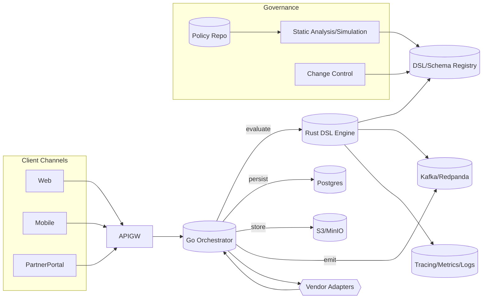

# Onboarding & KYC DSL: Deterministic, Agent‑Ready Platform

## Executive Summary

- A domain-specific language (DSL) for onboarding and KYC turns policy, data, documents, and operations into versioned configuration. It replaces scattered code and UI logic with deterministic, auditable, repeatable decisions that are safe for agentic execution.
- Result: faster policy change lead times, lower risk, unified data/document handling, zero drift between channels, and predictable throughput/latency at materially lower run cost.

## Why a DSL for Onboarding & KYC

- Policy-as-Configuration: Express eligibility, risk, document requirements, sanctions checks, and escalation as declarative rules and state—no scattered imperative code.
- Deterministic Outcomes: Pure, side-effect-free evaluation with explicit inputs yields identical outputs every time; ideal for compliance, replays, and agentic execution.
- Change Velocity: Product and compliance author and promote changes via controlled versioning and approvals; no redeploy cycles for rules.
- Risk Reduction: Centralizes logic; removes business logic from UIs and services; enforces idempotency at the platform boundary.

## Core Principles

- Configuration Over Code: Rules, data mappings, document schemas, and workflows are DSL-managed assets, versioned and promoted like data.
- Determinism & Idempotency:
  - All decisions are pure functions over inputs; outcomes are replayable.
  - Idempotency keys at every side-effecting boundary (KYC vendor calls, document ingestion, account creation).
- Auditability & Repeatability:
  - Every decision has an evaluation trace with input snapshot, rule version, and outcome.
  - Golden-run replays prove equivalence post-change; diff traces highlight impact.
- Composability: Build policies from reusable modules (e.g., sanctions, address normalization, liveness, PoA, PoI).
- Separation of Concerns: DSL defines policy, state, and data contracts; runtime orchestrates and persists; UI renders; agents execute permissible steps only.

## Agentic Integration

- Agents Operate Within Guardrails: Agents don’t decide policy; they execute tasks authorized by the DSL (collect doc X, call provider Y, reconcile discrepancy Z) with pre/post-conditions and validation.
- Deterministic Plans: The DSL compiles to a deterministic execution plan; agents fill human-in-the-loop gaps but cannot deviate from policy.
- Safe Autonomy: Static analysis detects ambiguous steps; simulations run with production-like inputs; evaluation traces provide human-over-the-loop oversight.

## Data & Document Integration (vs. Workflow Alone)

- DSL Encodes Data Semantics: Typed entities (applicant, UBO, business, device, geolocation), field lineage, mandatory/optional fields, and mapping to storage are first-class.
- Documents Are Contracts: Document classes (PoA, PoI, UBO declaration) specify required fields, extraction expectations, acceptance criteria, and anti-fraud checks; evaluation ties acceptance to rule versions.
- Beyond BPMN: Workflow tools orchestrate steps but treat data/documents as opaque. The DSL binds policy to data schemas and document contracts, ensuring every step is data-valid and policy-relevant.
- Single Source of Truth: Decision engine + object storage + metadata DB provide end-to-end traceability; re-ingestion or rescoring uses the same DSL version for strict comparability.

## UI Strategy: Zero Business Logic at the Edge

- UI-as-View: Screens are dynamically generated from form schemas emitted by the DSL (field definitions, constraints, conditional visibility).
- Channel Agnostic: Web, mobile, partner portals render from the same config; no channel-specific logic drift.
- Centralized Validation: Client performs soft validation; server enforces canonical DSL-driven validation; no double-maintenance of rules.
- A/B and Risk Experiments: Rollouts and experiments are versioned and targeted through the DSL; UI reflects policy variants without redeploy.

## Controls, Audit & Compliance

- Versioned Everything: Rules, schemas, provider configs, and scoring models have semantic versions; evaluation logs include version + checksum.
- Approval Workflow: Four-eyes change control for policy; promotion gates with automated regression replays and impact reports.
- Full Traceability: Step-by-step decision graph, including external calls, payload hashes, and idempotency keys. Instant audit packs for regulators.

## Tech Stack Choices

- Runtime & Engine
  - Rust for the Decision Engine:
    - Memory safety without GC; predictable latency for real-time decisions.
    - Strong type system for DSL compilation; zero-cost abstractions; compact static binaries.
    - Excellent performance/cost profile; ideal for SIMD parsing, crypto, and intensive validation.
  - Go for Orchestration and Services:
    - Simple concurrency with goroutines; great for IO-bound integrations (vendors, storage, messaging).
    - Rapid development, easy ops, small containers, strong ecosystem for HTTP/gRPC, observability.
- Why Not Heavy JVM (Spring/Hibernate/ORM-heavy stacks):
  - High baseline memory/CPU overhead; GC-driven latency jitter; reflection/ORM abstraction leaks complicate determinism and idempotency.
  - Framework complexity increases ownership cost and slows the policy change cycle.
  - If JVM is required, isolate as integration microservices behind gRPC with strict contracts.
- Storage & Messaging
  - Postgres for canonical state (schema-first, typed, row-level security).
  - Object storage (S3/GCS/MinIO) for documents with content-addressed hashing.
  - Event log (Kafka/Redpanda/NATS JetStream) for decision events and replay tooling.
- Interfaces
  - gRPC/JSON APIs with explicit versioning; schema registry for DSL artifacts.
  - OPA/Rego or Rust-native policy checks for infra-level authorization where needed.

## Agentic Coding Enablement

- DSL as the Safe Surface: Agents propose changes to policy modules using constrained schemas (YAML/TOML/JSON) and get auto-validated via static analysis and test suites.
- Golden Tests & Property-Based Testing: Curated corpora of decisions become guardrails; agents run impact analysis before proposing promotion.
- Productivity & Ownership: Small, fast Rust/Go codebases; minimal framework tax; low cold starts; fewer moving parts to own.
- Cost Benefits: Better p99 latency leads to higher throughput per core; reduced infra footprint; fewer vendor retries via idempotency; deterministic caching opportunities.

## Operational Model

- Build Pipeline: Author policy → static checks → simulate on historical samples → peer review → staged rollout with kill-switch → monitor decision diffs.
- Idempotent Side Effects: Every external effect keyed and reconciled; safe retries; exactly-once behavior achieved via at-least-once + idempotency.
- Observability: Traces include rule step timings; SLOs on decision latency, vendor call success, drift vs. expected outcomes.

## KPIs & Expected Outcomes

- 70–90% reduction in time-to-change for KYC policy updates.
- 30–60% reduction in manual review hours via deterministic routing and clear escalations.
- Material infra cost savings from Rust/Go runtime efficiency and retry avoidance.
- Audit prep time reduced from weeks to hours via instant decision trace packs.
- Lower defect rate in UI due to zero business logic duplication; channel consistency.

## Migration & Adoption Path

- Start Where It Hurts: Express highest-change, highest-friction policies first (e.g., PoA/PoI rules, sanctions variants).
- Dual-Run and Replay: Shadow the current system; compare outcomes; quantify differences with explainability.
- UI Incrementalization: Move forms to generated schemas; retire legacy validations stepwise.
- Vendor Abstraction: Wrap existing providers behind idempotent, typed adapters; keep the DSL provider-agnostic.
- Train Agents on the DSL: Introduce supervised agentic changes with strict gates; grow scope as confidence rises.

## Risks & Mitigations

- Risk of Mis-specified Rules: Strong typing, static analysis, golden test suites, and staged rollouts mitigate.
- Organizational Change: Clear RACI for policy authorship vs. runtime ownership; training and documentation.
- Vendor Variability: Strict contracts, retries with backoff, idempotency, and chaos testing.

## What You Get

- Deterministic, auditable onboarding and KYC decisions that are easy to change safely.
- Full alignment of policy, data, and documents—beyond workflow-only orchestration.
- Agent-ready operations without ceding control: autonomy within explicit guardrails.
- A lean Rust/Go stack that maximizes performance, predictability, and total cost efficiency.

## Next Steps

- Workshop to map current policies to DSL modules and target KPIs.
- Spike: implement a high-change policy (e.g., PoI) end-to-end with shadow replays.
- Rollout plan with governance model, golden datasets, and UI schema generation pilot.

---

## DSL Schema Outline (Illustrative)

> The DSL is declarative, deterministic, and statically analyzable. It treats policy, data schemas, and document contracts as first-class. Below is an illustrative YAML outline.

```yaml
version: 1
meta:
  dsl_version: "0.4"
  module: "onboarding_kyc"
  description: "Retail + SME onboarding policy"

entities:
  applicant:
    fields:
      - name: legal_name
        type: string
        required: true
      - name: dob
        type: date
        required: true
      - name: nationality
        type: string
        enum: [US, GB, EU, CA, AU, OTHER]
      - name: device_fingerprint
        type: string
        pii: true
  business:
    fields:
      - name: legal_name
        type: string
        required: true
      - name: registration_country
        type: string
        required: true
      - name: industry
        type: string
        enum: [FINTECH, SAAS, RETAIL, SERVICES, OTHER]

# Document contracts specifying extraction and acceptance criteria
documents:
  proof_of_identity:
    variants: [passport, national_id, driver_license]
    extraction:
      required_fields: [full_name, dob, expiry_date, document_number]
    acceptance:
      rules:
        - if: "doc.expiry_date > now()"
          then: accept
        - else: reject
  proof_of_address:
    variants: [utility_bill, bank_statement]
    extraction:
      required_fields: [full_name, address_line1, issue_date]
    acceptance:
      rules:
        - if: "age(issue_date) <= 90d"
          then: accept

# Vendor-neutral policy; providers configured separately
providers:
  sanctions_screening:
    adapters:
      - name: acme_watchlist
        type: http
        endpoint: ${ACME_URL}
        auth: service_token
        idempotency_key: "${applicant_id}:${provider}:${payload_hash}"
  id_verification:
    adapters:
      - name: idv_pro
        type: http
        endpoint: ${IDV_URL}
        auth: oauth2

# Scores and decisions are pure functions over inputs
scores:
  risk_score:
    inputs: [applicant, business, device]
    rules:
      - when: "nationality in [US, GB, EU]"
        add: 10
      - when: "industry == 'FINTECH'"
        add: 20
      - when: "sanctions.hit == true"
        set: 100
    bucket:
      - range: [0, 29]
        label: LOW
      - range: [30, 69]
        label: MEDIUM
      - range: [70, 100]
        label: HIGH

# Deterministic workflow synthesized from state machine definition
workflow:
  states: [INIT, COLLECT_POI, COLLECT_POA, SCREEN, REVIEW, APPROVE, REJECT]
  start: INIT
  transitions:
    - from: INIT
      to: COLLECT_POI
      when: true
      action: request_documents
    - from: COLLECT_POI
      to: COLLECT_POA
      when: "documents.proof_of_identity.accepted == true"
    - from: COLLECT_POA
      to: SCREEN
      when: "documents.proof_of_address.accepted == true"
    - from: SCREEN
      to: REVIEW
      when: "risk_score.bucket in ['MEDIUM','HIGH']"
    - from: SCREEN
      to: APPROVE
      when: "risk_score.bucket == 'LOW' && sanctions.hit == false"
    - from: REVIEW
      to: APPROVE
      when: "analyst.decision == 'approve'"
    - from: REVIEW
      to: REJECT
      when: "analyst.decision == 'reject'"

# Side effects are declared with idempotency and pre/post-conditions
actions:
  request_documents:
    pre: ["state == INIT"]
    effect:
      type: emit
      topic: onboarding.documents.requested
      payload: { required: [proof_of_identity, proof_of_address] }
    idempotency_key: "${application_id}:req_docs:v1"

# Compliance rules are pure and reference versioned artifacts
policy:
  sanctions:
    run: providers.sanctions_screening
    on_success: set("sanctions.hit", response.hit)
    on_failure: set("sanctions.hit", false)
  decision:
    approve_when:
      - "risk_score.bucket == 'LOW' && sanctions.hit == false"
    reject_when:
      - "sanctions.hit == true"
    else: "REVIEW"

# Evaluation trace configuration
trace:
  snapshot_inputs: true
  include_rule_versions: true
  redact_fields: [device_fingerprint]
```

### Schema Design Notes

- Determinism: All `rules`, `approve_when`, and `reject_when` are pure predicates over the input snapshot and versioned artifacts.
- Idempotency: All `actions` declare an `idempotency_key`. External provider adapters include payload hashing.
- Auditability: `trace` settings guarantee reproducible decisions with version pinning and redaction for PII.
- Extensibility: New providers and policy modules can be added without engine changes.

---

## Reference Architecture

> High-level components and data flow for a Rust/Go implementation.



### ASCII View

```
[Web|Mobile|Partner] -> [API Gateway] -> [Go Orchestrator] -> [Rust Decision Engine]
                                            | persist -> [Postgres]
                                            | store   -> [S3/MinIO]
                                            | emit    -> [Kafka/Redpanda]
                                  -> [Providers: Sanctions, IDV, AML]

[Policy Repo] -> [Static Analysis & Replay CI] -> [DSL/Schema Registry] -> [Decision Engine]
[Approvals] --------------------------------------------------------------^
[Observability: Traces, Metrics, Logs] <---- Orchestrator & Engine events
```

### Operational Guarantees

- Deterministic evaluation at the engine layer with version-pinned artifacts.
- Exactly-once external effects via at-least-once delivery + idempotency keys.
- Full decision traceability with input snapshots and rule versions.

---

## Appendix: Example Evaluation Trace (Compact)

```json
{
  "application_id": "app_123",
  "dsl_version": "0.4",
  "policy_version": "onboarding_kyc@1.12.3",
  "input_hash": "sha256:ae41...",
  "steps": [
    {"rule": "documents.proof_of_identity.acceptance", "result": "accepted"},
    {"rule": "scores.risk_score", "value": 28, "bucket": "LOW"},
    {"rule": "policy.sanctions", "provider": "acme_watchlist", "hit": false, "idempotency_key": "app_123:acme_watchlist:9f7..."},
    {"rule": "workflow.transition.SCREEN->APPROVE", "when": true}
  ],
  "decision": "APPROVE",
  "redactions": ["device_fingerprint"]
}
```

---

## One-Page Summary for Leadership

- Deterministic, auditable decisions; zero business logic in UI.
- Full data/document integration; beyond workflow-only orchestration.
- Agent-ready guardrails for safe autonomy and rapid iteration.
- Rust (engine) + Go (orchestration) for predictable latency and lower TCO.
- Versioned configuration with change control, replays, and instant audit packs.

```
Change Policy in Hours, Not Sprints — with Determinism, Auditability, and Cost Efficiency.
```

